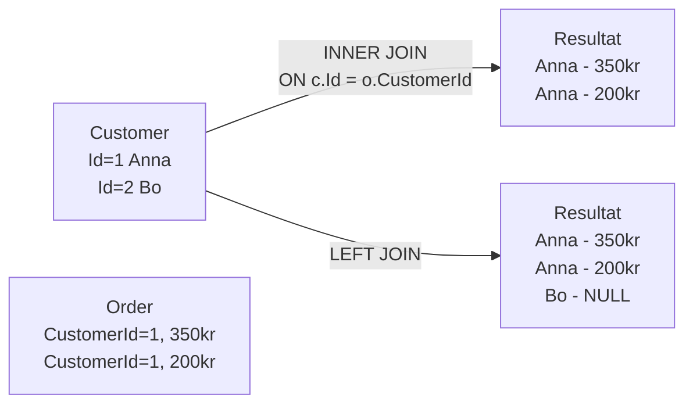
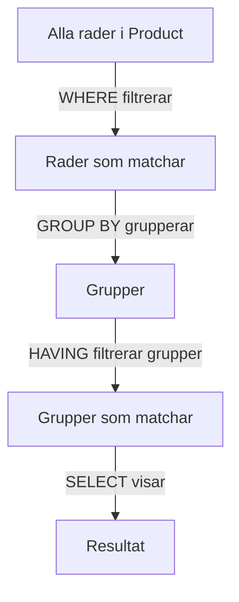

# 02 SQL Hardcore — Programmeringstermer

## SELECT · Hämta data

Hämtar data från en eller flera tabeller. Det absolut vanligaste SQL-kommandot — du skriver det tusen gånger under din karriär.

Tänk på det som att söka i Spotify: du anger vad du vill ha (artist, genre, låt) och får tillbaka en lista. SELECT är din sökfunktion mot databasen.

```sql
-- Hämta alla kunder från Göteborg, sorterade på namn
SELECT Name, Email FROM Customer
WHERE City = 'Göteborg'
ORDER BY Name ASC;
```

SELECT på egna är inte farligt — det ändrar ingenting. Övningsdatabasen överlever alla dina SELECT-experiment.

---

## INSERT · Lägg till data

Lägger till en ny rad i en tabell. Grundregeln: du anger vilka kolumner du fyller i, och i vilken ordning.

Tänk på det som att fylla i ett nytt kundkort i affären: du fyller i fälten (namn, adress, e-post) och lämnar in kortet.

```sql
INSERT INTO Product (Name, Price, Stock)
VALUES ('Espresso', 29.00, 100);
```

Vanligaste misstaget: glömma att ange kolumnnamnen och sedan ge värden i fel ordning. Databasen klagar inte alltid — den sätter bara fel värde i fel kolumn.

---

## UPDATE · Ändra data

Ändrar befintliga rader i en tabell. Extremt viktig regel: **använd alltid WHERE** — annars uppdateras ALLA rader.

Tänk på det som att rätta ett fel i kontaktregistret: du hittar rätt rad med WHERE och ändrar värdet.

```sql
-- MED WHERE — bra
UPDATE Product SET Price = 35.00 WHERE Id = 1;

-- UTAN WHERE — katastrof, alla produkter kostar nu 35 kr
UPDATE Product SET Price = 35.00;
```

> 🖼️ **Bild:** Meme — "When you forget WHERE in UPDATE" med en bild på en katastrof

---

## DELETE · Ta bort data

Tar bort rader från en tabell. Samma varning som UPDATE: **använd alltid WHERE**.

Tänk på det som att riva ut en sida ur ett register: du vill riva ut rätt sida, inte hela pärmen.

```sql
-- MED WHERE — tar bort en specifik produkt
DELETE FROM Product WHERE Id = 1;

-- UTAN WHERE — tabellen är tom, data borta för alltid
DELETE FROM Product;
```

DELETE raderar data permanent. Utan backup finns det ingen ångra-knapp.

---

## WHERE · Filtrera rader

Begränsar vilka rader som påverkas av SELECT, UPDATE och DELETE. Utan WHERE: alla rader. Med WHERE: bara de som matchar villkoret.

Tänk på det som ett kaffefilter: allt passerar igenom, men bara det som stämmer med villkoret rinner igenom.

```sql
-- Kombinera villkor med AND och OR
SELECT * FROM Product
WHERE Price > 50 AND Stock > 0;

-- Datumfilter
SELECT * FROM Order WHERE OrderDate >= '2024-01-01';
```

---

## JOIN · Koppla tabeller

Kombinerar data från två eller fler tabeller baserat på matchande värden. Det är hur du läser ihop data som är uppdelad i flera tabeller.

Tänk på det som att slå ihop ett kontaktregister med ett bokningsregister: du vill se kund + bokning i en enda lista utan att duplicera all data.

```sql
-- INNER JOIN: bara rader som matchar i BÅDA tabellerna
SELECT c.Name, o.OrderDate, o.Total
FROM Customer c
INNER JOIN Order o ON c.Id = o.CustomerId;

-- LEFT JOIN: alla kunder, även de utan order (NULL för orderfälten)
SELECT c.Name, o.OrderDate
FROM Customer c
LEFT JOIN Order o ON c.Id = o.CustomerId;
```



---

## ORDER BY · Sortera resultat

Sorterar resultatet av en SELECT. ASC = stigande (A–Ö, lägsta först), DESC = fallande (Ö–A, högsta först).

Tänk på det som att sortera ett kortspel: du väljer ordningen efter eget behov.

```sql
-- Billigast till dyrast, sen alfabetiskt på namn
SELECT Name, Price FROM Product
ORDER BY Price ASC, Name ASC;

-- Nyast order först
SELECT * FROM Order ORDER BY OrderDate DESC;
```

---

## GROUP BY · Gruppera och summera

Grupperar rader efter ett gemensamt värde och låter dig använda aggregeringsfunktioner (COUNT, SUM, AVG) per grupp.

Tänk på det som att stapla kvitton i högar efter butik: du vill veta total per butik, inte totalsumman av allt.

```sql
-- Hur många produkter finns per kategori?
SELECT CategoryId, COUNT(*) AS AntalProdukter
FROM Product
GROUP BY CategoryId;

-- Total omsättning per kund
SELECT CustomerId, SUM(Total) AS Totalomsattning
FROM Order
GROUP BY CustomerId;
```

---

## LIKE · Mönstersökning

Söker efter rader där ett textfält matchar ett mönster. `%` betyder "valfria tecken", `_` betyder "exakt ett tecken".

Tänk på det som sökfunktionen i din telefons kontakter: du skriver "An" och hittar Anna, Anders, Annelie.

```sql
-- Alla namn som börjar på "Anna"
SELECT * FROM Customer WHERE Name LIKE 'Anna%';

-- Alla e-poster som slutar på gmail.com
SELECT * FROM Customer WHERE Email LIKE '%@gmail.com';

-- Exakt fyra tecken i postorten
SELECT * FROM City WHERE PostCode LIKE '____';
```

LIKE är långsam på stora tabeller. För seriös fulltextsökning: använd Full-Text Search eller ett sökmotorindex.

---

## Aggregeringsfunktion · Aggregeringsfunktion

Funktion som beräknar ett enda värde från flera rader. Fem viktiga: COUNT, SUM, AVG, MIN, MAX.

Tänk på det som kalkylatorns summafunktion: du skickar in en hel kolumn och får tillbaka ett enda svar.

```sql
SELECT
    COUNT(*)         AS AntalProdukter,
    SUM(Price)       AS TotalVarde,
    AVG(Price)       AS Genomsnittspris,
    MIN(Price)       AS Billigast,
    MAX(Price)       AS Dyrast
FROM Product
WHERE Stock > 0;
```

`COUNT(*)` räknar alla rader. `COUNT(Email)` räknar bara rader där Email inte är NULL. Det är en viktig skillnad.

---

## Alias · Tillfälligt namn

Ger en kolumn eller tabell ett tillfälligt namn i resultatmängden. Gör långa tabellnamn kortare och kolumnnamn mer läsliga.

Tänk på det som ett smeknamn i chatten: "CustomerFirstName" blir "Name" i rapporten.

```sql
-- Kolumner med alias
SELECT Name AS Produktnamn, Price AS Pris
FROM Product AS p
WHERE p.Stock > 0;

-- Alias i aggregering
SELECT CategoryId, COUNT(*) AS Antal
FROM Product
GROUP BY CategoryId;
```

> 🖼️ **Bild:** En SQL-fråga med långa tabellnamn utan alias jämfört med samma fråga med alias — tydlig läsbarhetsskillnad

---

## HAVING · Filtrera grupperade rader

Filtrerar resultat EFTER GROUP BY. WHERE filtrerar enskilda rader, HAVING filtrerar grupper.

Tänk på det som en andra sållning: WHERE tar bort enskilda äpplen som inte duger, HAVING tar bort hela korgar som inte nått minimivikten.

```sql
-- Visa bara kategorier med fler än 5 produkter
SELECT CategoryId, COUNT(*) AS Antal
FROM Product
GROUP BY CategoryId
HAVING COUNT(*) > 5;
```


