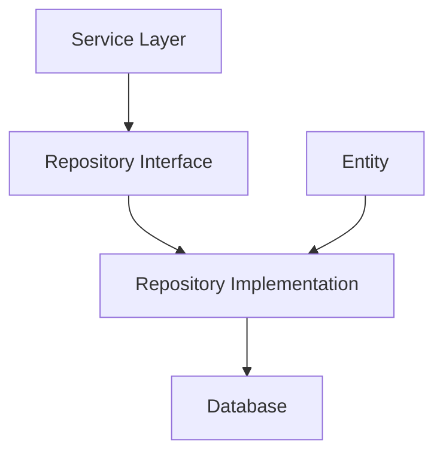

---

title: 1. Avancerad Databashantering med Repository Pattern i C#
author: Marcus Ackre Medina
type: lecture
topic: oop
difficulty: 3
language: csharp
status: adapted
marcus_voice: true
source: "Old_courses/2025/csharp/3_oop_adv/lectures/06_advanced_db_frameworks/1_advanced_database_management_with_repository_pattern_in_c.md"
description: "Hur kan vi skapa en flexibel och underhållbar databasarkitektur som effektivt hanterar olika typer av data samtidigt som vi följer SOLID-principerna?"
tags: ["advanced", "avancerad", "csharp", "database", "databashantering", "management", "oop", "pattern", "repository", "ssh"]
week_fit: []
---

# 1. Avancerad Databashantering med Repository Pattern i C#

🔴


## Huvudfråga

Hur kan vi skapa en flexibel och underhållbar databasarkitektur som effektivt hanterar olika typer av data samtidigt som vi följer SOLID-principerna?

## Varför Repository Pattern?

Repository Pattern separerar dataåtkomstlogiken från affärslogiken och erbjuder:

- Enklare testning genom abstraktion
- Konsekvent gränssnitt för dataåtkomst
- Förbättrad kodstruktur och underhållbarhet
- Möjlighet till cachning och prestandaoptimering

## 1. Repository Pattern: Grundstruktur

### 1.1 Databasarkitektur

<div class="mermaid" style="zoom: 2;">

<div class="mermaid" style="zoom: 1.4;">



</div>

</div>

### 1.2 Generic Repository Interface

```csharp
public interface IRepository<TEntity, TKey> where TEntity : class
{
    Task<TEntity?> GetByIdAsync(TKey id);
    Task<IEnumerable<TEntity>> GetAllAsync();
    Task<TEntity> AddAsync(TEntity entity);
    Task UpdateAsync(TEntity entity);
    Task DeleteAsync(TEntity entity);
    Task<bool> ExistsAsync(TKey id);
    Task<IEnumerable<TEntity>> FindAsync(ISpecification<TEntity> specification);
}
```

**15-minutersregeln:** Fastnar du i mer än 15 minuter — fråga klassen, sen AI, sen mig. I den ordningen.

Repository Pattern är ett designmönster som skapar ett abstraktionslager mellan databasen och affärslogiken. Det ger oss ett konsekvent sätt att hantera data oavsett datakälla. Genom att separera dataåtkomst från affärslogik blir koden mer testbar och lättare att underhålla.

### 1.3 Komplett BaseRepository Implementation

```csharp
public abstract class BaseRepository<TEntity, TKey> : IRepository<TEntity, TKey>
    where TEntity : class
{
    protected readonly IDbConnectionFactory _connectionFactory;
    protected readonly string _tableName;

    protected BaseRepository(IDbConnectionFactory connectionFactory)
    {
        _connectionFactory = connectionFactory;
        _tableName = typeof(TEntity).Name;
    }

    public virtual async Task<TEntity?> GetByIdAsync(TKey id)
    {
        using var connection = await _connectionFactory.CreateConnectionAsync();
        var sql = $"SELECT * FROM {_tableName} WHERE Id = @Id";

        return await connection.QueryFirstOrDefaultAsync<TEntity>(
            sql,
            new { Id = id }
        );
    }

    protected abstract Task<TEntity> MapToEntity(dynamic record);
}
```

Koden demonstrerar en generisk basrepositoryklass i C# som använder Dapper för effektiv databasåtkomst. Några viktiga punkter:

1. Använder C#s asynkrona programmering med async/await
2. Implementerar dependency injection för databaskoppling
3. Använder Dapper för effektiv objektmappning
4. Tillhandahåller nullable reference types för säker nullhantering

## 2. Specification Pattern

### 2.1 Grundkoncept

```csharp
public interface ISpecification<T>
{
    string ToSqlQuery();
    object GetParameters();

    ISpecification<T> And(ISpecification<T> other);
    ISpecification<T> Or(ISpecification<T> other);
}
```

### 2.2 Implementation av Composit Specifications

```csharp
public class AndSpecification<T> : ISpecification<T>
{
    private readonly ISpecification<T> _left;
    private readonly ISpecification<T> _right;

    public AndSpecification(ISpecification<T> left, ISpecification<T> right)
    {
        _left = left;
        _right = right;
    }

    public string ToSqlQuery() =>
        $"({_left.ToSqlQuery()}) AND ({_right.ToSqlQuery()})";

    public object GetParameters() =>
        new DynamicParameters()
            .AddParameters(_left.GetParameters())
            .AddParameters(_right.GetParameters());
}
```

## 3. Praktisk Implementation

### 3.1 Entity Example

```csharp
public class User
{
    public long Id { get; set; }
    public string Email { get; set; } = string.Empty;
    public string Name { get; set; } = string.Empty;
}
```

### 3.2 Konkret Repository Implementation

```csharp
public class UserRepository : BaseRepository<User, long>
{
    public UserRepository(IDbConnectionFactory connectionFactory)
        : base(connectionFactory)
    {
    }

    protected override async Task<User> MapToEntity(dynamic record)
    {
        return new User
        {
            Id = record.Id,
            Email = record.Email,
            Name = record.Name
        };
    }
}
```

## Sammanfattning

- Repository Pattern ger en strukturerad approach för databashantering
- Specification Pattern möjliggör flexibel filtrering
- Asynkron programmering förbättrar prestanda
- Dependency Injection underlättar testning

**Reflektionsfråga:** Hur påverkar valet mellan olika designmönster systemets långsiktiga underhållbarhet?

## Övningsuppgifter

### Uppgift 1: Implementera Generic Repository med ADO.NET

Skapa en komplett implementation av ett `ProductRepository` som:

- Använder ADO.NET för databasåtkomst
- Implementerar CRUD-operationer med parametriserade queries
- Hanterar transaktioner korrekt med TransactionScope

### Uppgift 2: Specification Pattern Implementation

Utveckla specifications för att demonstrera:

- Komplexa sökkriterier med AND/OR-operationer
- Expression trees för dynamisk query-byggning
- Optimerade SQL-frågor med joins och indexering

### Uppgift 3: Entity Framework Core Integration

Implementera:

- Entity-konfiguration med Fluent API
- Repository-lager med Entity Framework Core
- Hantering av relationer och navigation properties
- Optimering av Include/ThenInclude för effektiv datahämtning

---
Nu har du verktygen. Använd dem, missbruka dem, lär dig av misstagen. Det är vägen.
