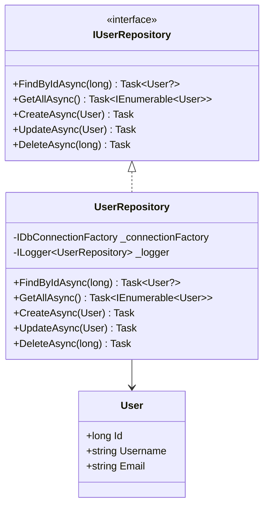

# 1. Designmönster för Databashantering i C#

🟢


**Huvudfråga:** Hur kan vi bygga robusta och underhållbara databasapplikationer i C# genom att tillämpa designmönster?

**Lärandemål:**

- Förstå och implementera Repository-mönstret
- Hantera databasanslutningar effektivt med Connection Pool
- Skapa skalbar och testbar kod för databashantering

## 1. Repository Pattern

### 1.1 Vad är Repository Pattern och varför behövs det?

Repository-mönstret är C#s motsvarighet till DAO och skapar en abstraktionsnivå mellan applikationen och databasen. Detta ger flera fördelar:

- Isolerar databaslogik från affärslogik
- Förenklar byte av databasteknologi
- Möjliggör enklare testning genom dependency injection
- Skapar tydlig kodstruktur

### 1.2 Grundläggande implementation

Först definierar vi vår datamodell:

```csharp
public class User
{
    public long Id { get; set; }
    public string Username { get; set; }
    public string Email { get; set; }
}
```

Sedan skapar vi Repository-gränssnittet:

```csharp
public interface IUserRepository
{
    Task<User?> FindByIdAsync(long id);
    Task<IEnumerable<User>> GetAllAsync();
    Task CreateAsync(User user);
    Task UpdateAsync(User user);
    Task DeleteAsync(long id);
}
```

**15-minutersregeln:** Fastnar du i mer än 15 minuter — fråga klassen, sen AI, sen mig. I den ordningen.

Implementation med felhantering och resursfrigöring:

```csharp
public class UserRepository : IUserRepository
{
    private readonly IDbConnectionFactory _connectionFactory;
    private readonly ILogger<UserRepository> _logger;

    public UserRepository(IDbConnectionFactory connectionFactory, 
                         ILogger<UserRepository> logger)
    {
        _connectionFactory = connectionFactory;
        _logger = logger;
    }

    public async Task<User?> FindByIdAsync(long id)
    {
        const string sql = "SELECT * FROM Users WHERE Id = @Id";

        try
        {
            using var connection = await _connectionFactory.CreateConnectionAsync();
            return await connection.QueryFirstOrDefaultAsync<User>(sql, new { Id = id });
        }
        catch (Exception ex)
        {
            _logger.LogError(ex, "Error finding user with ID: {Id}", id);
            throw new DatabaseException($"Error finding user with ID: {id}", ex);
        }
    }

    // Övriga metodimplementationer...
}
```

<div class="mermaid" style="zoom: 1.4;">



</div>

## 2. Connection Factory med Dependency Injection

### 2.1 Varför Connection Factory?

Connection Factory med DI löser flera problem:

- Minskar overhead vid databasanslutningar
- Hanterar resurser effektivt genom pooling
- Förbättrar testbarhet genom dependency injection
- Förenklar konfigurationshantering

### 2.2 Implementation med Microsoft.Data.SqlClient

```csharp
public interface IDbConnectionFactory
{
    Task<IDbConnection> CreateConnectionAsync();
}

public class SqlConnectionFactory : IDbConnectionFactory
{
    private readonly string _connectionString;
    private readonly ILogger<SqlConnectionFactory> _logger;

    public SqlConnectionFactory(IConfiguration configuration, 
                              ILogger<SqlConnectionFactory> logger)
    {
        _connectionString = configuration.GetConnectionString("DefaultConnection") 
            ?? throw new InvalidOperationException("Connection string 'DefaultConnection' not found.");
        _logger = logger;
    }

    public async Task<IDbConnection> CreateConnectionAsync()
    {
        try
        {
            var connection = new SqlConnection(_connectionString);
            await connection.OpenAsync();
            return connection;
        }
        catch (Exception ex)
        {
            _logger.LogError(ex, "Failed to create database connection");
            throw new DatabaseException("Failed to create database connection", ex);
        }
    }
}
```

## Loggning med Microsoft.Extensions.Logging

Vi använder det inbyggda loggningsramverket i .NET:

```xml
<PackageReference Include="Microsoft.Extensions.Logging" Version="7.0.0" />
```

Konfigurera loggning i Program.cs:

```csharp
var builder = WebApplication.CreateBuilder(args);

builder.Services.AddLogging(configure => 
{
    configure.AddConsole();
    configure.AddDebug();
    configure.AddEventLog();
});
```

Microsoft.Extensions.Logging är det standardiserade loggningsramverket för .NET som erbjuder:

1. Strukturerad loggning med olika loggnivåer
2. Enkel integration med olika loggdestinationer
3. Dependency injection-vänlig design
4. Prestandaoptimerad implementation
5. Omfattande konfigurationsmöjligheter

## Sammanfattning

- Repository Pattern ger oss en strukturerad approach för databasinteraktion
- Dependency Injection förenklar testning och underhåll
- Strukturerad loggning är kritiskt för felsökning

**Reflektionsfråga:** Hur skulle du utöka dessa mönster för att hantera microservices i .NET?

## Övningsuppgifter

### Övning 1: Product Management System

Implementera ett komplett Repository-system för products med:

- Fullständig CRUD-funktionalitet med async/await
- Entity Framework Core integration
- Omfattande enhetstester med xUnit
- Strukturerad loggning

### Övning 2: Transaktionshantering

Skapa en OrderService som:

- Använder TransactionScope för atomära operationer
- Implementerar Unit of Work-mönstret
- Hanterar concurrent access
- Implementerar retry-logik med Polly

### Övning 3: Monitoring och Logging

Implementera:

- Application Insights integration
- HealthChecks
- Strukturerad loggning med Serilog
- Metrics med EventCounters

Bedömningskriterier:

- Kodkvalitet och struktur
- Asynkron implementation
- Dokumentation och tester
- Prestanda och skalbarhet

---
Nu har du verktygen. Använd dem, missbruka dem, lär dig av misstagen. Det är vägen.
