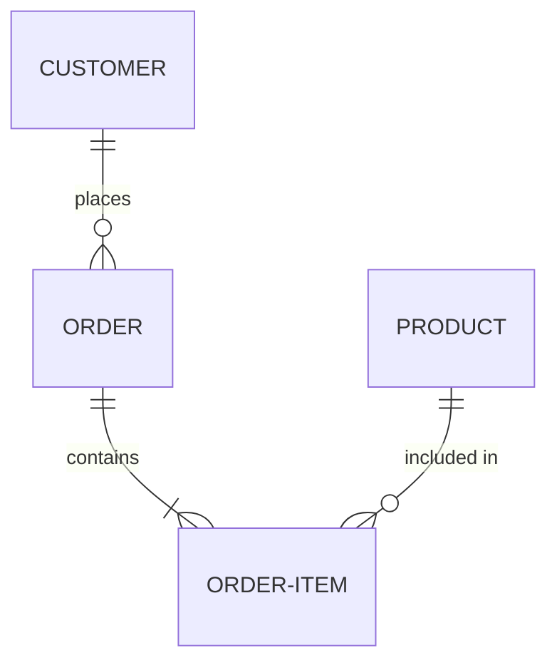

# UML för databasdesign

🔴


UML (Unified Modeling Language) är ett visuellt språk för att modellera system. För databasdesign använder vi främst ER-diagram (Entity-Relationship) och klassdiagram för att planera struktur innan vi skriver SQL. Visuell planering hjälper oss att förstå relationer, hitta problem tidigt och kommunicera designen till andra.

## Innehållsförteckning

- [Introduktion](#introduktion)
- [Varför använda UML](#varför-använda-uml)
- [ER-diagram (Entity-Relationship)](#er-diagram-entity-relationship)
- [Klassdiagram för databaser](#klassdiagram-för-databaser)
- [Notation och symboler](#notation-och-symboler)
- [Praktiskt exempel: Bokningssy

stem](#praktiskt-exempel-bokningssystem)

- [Verktyg för UML](#verktyg-för-uml)
- [Från UML till SQL](#från-uml-till-sql)
- [Best practices](#best-practices)
- [Slutsats](#slutsats)
- [TL;DR](#tldr)

## Introduktion

Föreställ dig att bygga ett hus - du skulle aldrig börja såga trä utan ritningar först. På samma sätt bör vi aldrig skriva SQL utan att först visualisera databasstrukturen. UML ger oss "ritningarna" för våra databaser.

En bild säger mer än tusen rader SQL-kod, och ett bra diagram hjälper hela teamet att förstå designen på några minuter istället för timmar.

## Varför använda UML

### Kommunikation

Ett diagram kan förstås av:

- Utvecklare (tekniska detaljer)
- Produktägare (affärslogik)
- Designers (dataflöden)
- Management (översikt)

**Exempel:**
En projektledare utan SQL-kunskap kan se att "En kund kan ha många beställningar" i ett diagram, men skulle ha svårt att läsa foreign key constraints i SQL.

### Hittar problem tidigt

Visuell design avslöjar:

- Cirkulära beroenden
- Onödiga tabeller
- Saknade relationer
- Felaktiga kardinaliteter

**Real-world exempel:**
En e-handel planerade ursprungligen att lagra kundadresser direkt i Orders-tabellen. ER-diagrammet visade att många beställningar hade samma adress → de skapade en separat Addresses-tabell och sparade 80% lagringsutrymme.

### Dokumentation

Diagram är levande dokumentation:

- Snabbare att uppdatera än textdokumentation
- Visar alltid aktuell struktur
- Lättare för nya teammedlemmar att förstå

## ER-diagram (Entity-Relationship)

ER-diagram är den vanligaste metoden för att modellera databaser. De visar entiteter (tabeller), attribut (kolumner) och relationer.

### Grundläggande komponenter

#### 1. Entitet (Entity)

En "sak" som systemet behöver hålla reda på.

```
┌─────────────┐
│   Customer  │  ← Rektangel = Entitet
└─────────────┘
```

**Namnkonvention:**

- Singular form: "Customer" inte "Customers"
- PascalCase: "OrderItem" inte "orderitem"
- Substantiv: "Product" inte "Sell"

#### 2. Attribut (Attributes)

Egenskaper hos entiteten.

```
┌─────────────────┐
│    Customer     │
├─────────────────┤
│ CustomerId (PK) │  ← Primary Key (understruken)
│ Name            │
│ Email           │
│ PhoneNumber     │
└─────────────────┘
```

**Typer av attribut:**

- **Primary Key (PK)** - Unikt identifierare (understruken)
- **Foreign Key (FK)** - Referens till annan tabell
- **Vanligt attribut** - Vanlig data
- **Derived** - Beräknad från andra attribut (visas med / före)

```
┌─────────────────┐
│     Order       │
├─────────────────┤
│ OrderId (PK)    │
│ OrderDate       │
│ TotalAmount     │
│ /OrderAge       │  ← Derived: Beräknas från OrderDate
└─────────────────┘
```

#### 3. Relationer (Relationships)

Kopplingar mellan entiteter.

```
┌──────────┐         ┌──────────┐
│ Customer │────<─── │  Order   │
└──────────┘ places  └──────────┘
```

**Verb i relationer:**

- "Customer _places_ Order"
- "Order _contains_ OrderItem"
- "Book _written by_ Author"

### Kardinalitet (Cardinality)

Kardinalitet beskriver "hur många" i relationen.

#### En-till-en (1:1)

```
┌──────────┐          ┌─────────────┐
│   User   │───1:1─── │   Profile   │
└──────────┘   has    └─────────────┘

"Varje användare har exakt en profil"
```

**SQL-implementation:**

```sql
CREATE TABLE Users (
    UserId INTEGER PRIMARY KEY
);

CREATE TABLE Profiles (
    ProfileId INTEGER PRIMARY KEY,
    UserId INTEGER UNIQUE NOT NULL,  -- UNIQUE gör det 1:1
    FOREIGN KEY (UserId) REFERENCES Users(UserId)
);
```

#### En-till-många (1:N)

```
┌──────────┐          ┌──────────┐
│ Customer │───1:N─── │  Order   │
└──────────┘  places  └──────────┘

"En kund kan ha många beställningar,
 men varje beställning tillhör en kund"
```

**Notation:**

- `1` sida: En kund
- `N` sida: Många beställningar
- Alternativ: `───<` eller `───*`

**SQL-implementation:**

```sql
CREATE TABLE Customers (
    CustomerId INTEGER PRIMARY KEY
);

CREATE TABLE Orders (
    OrderId INTEGER PRIMARY KEY,
    CustomerId INTEGER NOT NULL,  -- FK utan UNIQUE gör det 1:N
    FOREIGN KEY (CustomerId) REFERENCES Customers(CustomerId)
);
```

#### Många-till-många (M:N)

```
┌──────────┐          ┌──────────┐
│ Student  │───M:N─── │  Course  │
└──────────┘ enrolls  └──────────┘

"En student kan ta många kurser,
 en kurs kan ha många studenter"
```

**SQL-implementation (kräver kopplingstabell):**

```sql
CREATE TABLE Students (
    StudentId INTEGER PRIMARY KEY
);

CREATE TABLE Courses (
    CourseId INTEGER PRIMARY KEY
);

-- Kopplingstabell (Junction Table)
CREATE TABLE Enrollments (
    StudentId INTEGER,
    CourseId INTEGER,
    EnrollmentDate TEXT,
    Grade TEXT,
    PRIMARY KEY (StudentId, CourseId),
    FOREIGN KEY (StudentId) REFERENCES Students(StudentId),
    FOREIGN KEY (CourseId) REFERENCES Courses(CourseId)
);
```

### Avancerad notation

#### Optionalitet

Visar om relation är obligatorisk eller frivillig.

```
┌──────────┐          ┌──────────┐
│ Customer │───1:0..N │  Order   │
└──────────┘          └──────────┘

"En kund kan ha 0 eller fler beställningar"
      ↓
0..N betyder "noll eller många"
1..N betyder "en eller många" (minst en)
```

**Notation:**

- `0..1` - Noll eller en (optional)
- `1..1` eller `1` - Exakt en (required)
- `0..N` eller `*` - Noll eller många
- `1..N` - En eller många

#### Specialisering (Inheritance)

För när entiteter delar egenskaper men har unika attribut.

```
        ┌──────────┐
        │  Person  │  ← Supertyp
        ├──────────┤
        │ PersonId │
        │ Name     │
        │ Email    │
        └────△─────┘
             │
      ┌──────┴───────┐
      │              │
┌─────▽────┐  ┌─────▽────┐
│ Employee │  │ Customer │  ← Subtyper
├──────────┤  ├──────────┤
│ Salary   │  │ Points   │
│ HireDate │  │ Tier     │
└──────────┘  └──────────┘
```

**SQL-implementation (flera strategier):**

**Strategi 1: En tabell (Single Table Inheritance)**

```sql
CREATE TABLE Persons (
    PersonId INTEGER PRIMARY KEY,
    Name TEXT NOT NULL,
    Email TEXT,
    PersonType TEXT,  -- 'Employee' eller 'Customer'

    -- Employee-specifika
    Salary REAL,
    HireDate TEXT,

    -- Customer-specifika
    Points INTEGER,
    Tier TEXT,

    CHECK (PersonType IN ('Employee', 'Customer'))
);
```

**Strategi 2: Tabell per subtyp**

```sql
CREATE TABLE Persons (
    PersonId INTEGER PRIMARY KEY,
    Name TEXT NOT NULL,
    Email TEXT
);

CREATE TABLE Employees (
    EmployeeId INTEGER PRIMARY KEY,
    Salary REAL,
    HireDate TEXT,
    FOREIGN KEY (EmployeeId) REFERENCES Persons(PersonId)
);

CREATE TABLE Customers (
    CustomerId INTEGER PRIMARY KEY,
    Points INTEGER DEFAULT 0,
    Tier TEXT,
    FOREIGN KEY (CustomerId) REFERENCES Persons(PersonId)
);
```

## Klassdiagram för databaser

Klassdiagram är vanligare i objektorienterad programmering, men kan också användas för databaser.

### Grundläggande struktur

```
┌──────────────────────────┐
│      ClassName           │  ← Klass namn
├──────────────────────────┤
│ - attribute1 : Type      │  ← Attribut (privata)
│ + attribute2 : Type      │  ← Publika attribut
├──────────────────────────┤
│ + method1() : ReturnType │  ← Metoder (sällan för DB)
└──────────────────────────┘
```

**För databaser:**

```
┌──────────────────────────┐
│       Customer           │
├──────────────────────────┤
│ PK: CustomerId : int     │
│     Name : string        │
│     Email : string       │
│     CreatedAt : datetime │
└──────────────────────────┘
```

### Relationer i klassdiagram

#### Associering (Association)

```
┌──────────┐         1..* ┌──────────┐
│ Customer │──────────────│  Order   │
└──────────┘ places       └──────────┘
```

#### Aggregation (har-del-av)

Svag ägarrelation (delen kan existera utan helheten).

```
┌──────────┐         ◇──* ┌──────────┐
│ Company  │──────────────│ Employee │
└──────────┘              └──────────┘

"Företag har anställda, men anställda kan existera utan företaget"
```

#### Composition (hel-del-av)

Stark ägarrelation (delen kan INTE existera utan helheten).

```
┌──────────┐         ◆──* ┌──────────┐
│  Order   │──────────────│OrderItem │
└──────────┘              └──────────┘

"OrderItems kan inte existera utan Order"
```

**SQL-implementation:**

```sql
CREATE TABLE Orders (
    OrderId INTEGER PRIMARY KEY
);

CREATE TABLE OrderItems (
    OrderItemId INTEGER PRIMARY KEY,
    OrderId INTEGER NOT NULL,
    FOREIGN KEY (OrderId) REFERENCES Orders(OrderId)
        ON DELETE CASCADE  -- Om Order raderas, radera alla OrderItems
);
```

## Notation och symboler

### Sammanfattningstabell

| Symbol            | Betydelse      | Exempel                          |
| ----------------- | -------------- | -------------------------------- |
| Rektangel         | Entitet/Klass  | `┌────┐`<br>`│User│`<br>`└────┘` |
| Understruken text | Primary Key    | `CustomerId`                     |
| Linje             | Relation       | `───`                            |
| `1`               | Exakt en       | `1:N`                            |
| `*` eller `N`     | Många          | `1:*`                            |
| `0..1`            | Noll eller en  | `0..1:N`                         |
| `1..*`            | En eller fler  | `1..*`                           |
| `◇`               | Aggregation    | Svag ägarrelation                |
| `◆`               | Composition    | Stark ägarrelation               |
| `△`               | Generalisering | Arv/Specialisering               |

### Crow's Foot notation

Populär notation för kardinalitet:

```
Exakt en:        ──│
Noll eller en:   ──○│
Många:           ──<
En eller många:  ──<│
Noll eller många:──○<
```

**Exempel:**

```
Customer ──<│──○< Order
│           │  │
│           │  └─ Noll eller många (0..*)
│           └──── Exakt en (1)
└──── En kund har många orders, varje order har en kund
```

## Praktiskt exempel: Bokningssystem

Vi bygger ett hotellbokningssystem.

### ER-diagram

```
┌──────────────┐              ┌──────────────┐
│   Customer   │              │    Room      │
├──────────────┤              ├──────────────┤
│ CustomerId PK│              │ RoomId PK    │
│ Name         │              │ RoomNumber   │
│ Email        │              │ RoomType     │
│ PhoneNumber  │              │ PricePerNight│
└──────┬───────┘              └──────┬───────┘
       │                             │
       │ 1                           │ 1
       │                             │
       │      ┌──────────────┐       │
       └─────>│   Booking    │<──────┘
         makes├──────────────┤  has
              │ BookingId PK │
              │ CustomerId FK│
              │ RoomId FK    │
              │ CheckInDate  │
              │ CheckOutDate │
              │ TotalPrice   │
              │ Status       │
              └──────┬───────┘
                     │ 1
                     │
                     │
                     │ *
              ┌──────▽───────┐
              │   Payment    │
              ├──────────────┤
              │ PaymentId PK │
              │ BookingId FK │
              │ Amount       │
              │ PaymentDate  │
              │ Method       │
              └──────────────┘
```

### Kardinaliteter i exemplet

```
Customer 1──────N Booking  (En kund, många bokningar)
Room 1──────N Booking      (Ett rum, många bokningar över tid)
Booking 1──────N Payment   (En bokning, potentiellt flera betalningar)
```

### Med Crow's Foot notation

```
Customer ──<│──○< Booking ──<│──○< Payment
             │        │──○< Room
             │
             └─ En kund måste finnas för en bokning
                En kund kan ha noll eller flera bokningar
```

## Verktyg för UML

### Online verktyg (gratis)

1. **dbdiagram.io**
   - URL: https://dbdiagram.io/home
   - ✓ **Specialiserad för databaser**
   - ✓ Kod-baserad (som SQL) = versionskontroll-vänlig
   - ✓ Export till SQL, PDF, PNG
   - ✓ Kollaborativ
   - ✓ Import från SQL

**Exempel dbdiagram.io syntax:**

```
Table customers {
  customer_id integer [primary key]
  name varchar [not null]
  email varchar [unique, not null]
  created_at timestamp [default: `now()`]
}

Table orders {
  order_id integer [primary key]
  customer_id integer [ref: > customers.customer_id]
  order_date date [not null]
  status varchar [default: 'pending']
}

Table order_items {
  order_id integer [ref: > orders.order_id]
  product_id integer
  quantity integer [not null]
  price decimal(10,2) [not null]

  indexes {
    (order_id, product_id) [pk]
  }
}
```

2. **yUML**
   - URL: https://yuml.me/
   - ✓ Extremt enkelt - skapa diagram från URL!
   - ✓ Ingen registrering behövs
   - ✓ Snabbt för enkla diagram
   - ✓ Kan embedda direkt i markdown

**Exempel yUML syntax:**

```
// Skapa diagram direkt från URL:
https://yuml.me/diagram/scruffy/class/

[Customer|CustomerId;Name;Email]
[Order|OrderId;OrderDate;CustomerId]
[OrderItem|OrderItemId;OrderId;ProductId;Quantity]
[Customer]1-*>[Order]
[Order]1-*>[OrderItem]
```

3. **draw.io (diagrams.net)**

   - URL: https://app.diagrams.net/
   - ✓ Gratis, ingen registrering
   - ✓ Sparar i Google Drive/OneDrive/lokalt
   - ✓ Export till PNG, SVG, PDF, XML
   - ✓ Mycket templates och shapes

4. **Lucidchart**

   - URL: https://www.lucidchart.com/
   - ✓ Professionell och snygg
   - ✓ Kollaborativ realtid
   - ✓ Bra templates
   - ✗ Begränsat gratis (60 objekt)

5. **TutorialsPoint UML Editor**
   - URL: https://www.tutorialspoint.com/uml/index.htm
   - ✓ Gratis online editor
   - ✓ Många UML-diagram typer
   - ✓ Bra tutorials inkluderade

### Desktop verktyg

1. **MySQL Workbench**

   - ✓ Gratis
   - ✓ Genererar SQL automatiskt
   - ✗ Endast för MySQL

2. **DB Browser for SQLite**

   - ✓ Gratis, open source
   - ✓ Visar befintlig databas grafiskt
   - ✗ Begränsad diagram-funktion

3. **Visual Paradigm**
   - ✓ Professionellt
   - ✓ Alla UML-diagram
   - ✗ Dyrt (finns community edition)

### AI-baserade verktyg

1. **ChatGPT/Claude**

   - Beskriv systemet → får förslag på struktur
   - Kan generera både diagram-kod och SQL

2. **Mermaid.js** (kod → diagram)



## Från UML till SQL

### Steg-för-steg översättning

#### 1. Entiteter → Tabeller

```
UML:
┌──────────┐
│ Customer │
└──────────┘

SQL:
CREATE TABLE Customers ( ... );
```

#### 2. Attribut → Kolumner

```
UML:
┌──────────────┐
│   Customer   │
├──────────────┤
│ CustomerId PK│
│ Name         │
│ Email        │
└──────────────┘

SQL:
CREATE TABLE Customers (
    CustomerId INTEGER PRIMARY KEY AUTOINCREMENT,
    Name TEXT NOT NULL,
    Email TEXT UNIQUE NOT NULL
);
```

#### 3. Relationer → Foreign Keys

**1:N relation:**

```
UML:
Customer 1────N Order

SQL:
CREATE TABLE Orders (
    OrderId INTEGER PRIMARY KEY,
    CustomerId INTEGER NOT NULL,
    FOREIGN KEY (CustomerId) REFERENCES Customers(CustomerId)
);
```

**M:N relation:**

```
UML:
Student M────N Course

SQL:
-- Kopplingstabell!
CREATE TABLE Enrollments (
    StudentId INTEGER,
    CourseId INTEGER,
    PRIMARY KEY (StudentId, CourseId),
    FOREIGN KEY (StudentId) REFERENCES Students(StudentId),
    FOREIGN KEY (CourseId) REFERENCES Courses(CourseId)
);
```

### Fullständigt exempel: Bokningssystem

**UML → SQL:**

```sql
-- Customers tabell
CREATE TABLE Customers (
    CustomerId INTEGER PRIMARY KEY AUTOINCREMENT,
    Name TEXT NOT NULL,
    Email TEXT UNIQUE NOT NULL,
    PhoneNumber TEXT,
    CreatedAt TEXT DEFAULT (datetime('now'))
);

-- Rooms tabell
CREATE TABLE Rooms (
    RoomId INTEGER PRIMARY KEY AUTOINCREMENT,
    RoomNumber TEXT UNIQUE NOT NULL,
    RoomType TEXT NOT NULL,
    PricePerNight REAL NOT NULL,
    MaxOccupancy INTEGER,

    CHECK (RoomType IN ('Single', 'Double', 'Suite')),
    CHECK (PricePerNight > 0),
    CHECK (MaxOccupancy > 0)
);

-- Bookings tabell (förbinder Customer och Room)
CREATE TABLE Bookings (
    BookingId INTEGER PRIMARY KEY AUTOINCREMENT,
    CustomerId INTEGER NOT NULL,
    RoomId INTEGER NOT NULL,
    CheckInDate TEXT NOT NULL,
    CheckOutDate TEXT NOT NULL,
    TotalPrice REAL NOT NULL,
    Status TEXT DEFAULT 'Pending',

    FOREIGN KEY (CustomerId) REFERENCES Customers(CustomerId),
    FOREIGN KEY (RoomId) REFERENCES Rooms(RoomId),

    CHECK (CheckOutDate > CheckInDate),
    CHECK (TotalPrice >= 0),
    CHECK (Status IN ('Pending', 'Confirmed', 'Cancelled', 'Completed'))
);

-- Payments tabell
CREATE TABLE Payments (
    PaymentId INTEGER PRIMARY KEY AUTOINCREMENT,
    BookingId INTEGER NOT NULL,
    Amount REAL NOT NULL,
    PaymentDate TEXT DEFAULT (datetime('now')),
    Method TEXT NOT NULL,

    FOREIGN KEY (BookingId) REFERENCES Bookings(BookingId),

    CHECK (Amount > 0),
    CHECK (Method IN ('Card', 'Cash', 'Swish', 'Invoice'))
);

-- Index för prestanda
CREATE INDEX idx_bookings_customer ON Bookings(CustomerId);
CREATE INDEX idx_bookings_room ON Bookings(RoomId);
CREATE INDEX idx_bookings_dates ON Bookings(CheckInDate, CheckOutDate);
CREATE INDEX idx_payments_booking ON Payments(BookingId);
```

## Best practices

### 1. Rita innan du kodar

```
Fel ordning ❌:
Skriv SQL → Inse designfel → Omskriv → Repeat

Rätt ordning ✅:
Rita UML → Diskutera → Revidera diagram → Skriv SQL EN gång
```

### 2. Använd tydliga namn

```
DÅLIGT ❌:
┌────┐     ┌────┐
│ C  │────│ O  │
└────┘     └────┘

BRA ✅:
┌──────────┐     ┌──────────┐
│ Customer │────│  Order   │
└──────────┘     └──────────┘
```

### 3. Dokumentera kardinalitet tydligt

```
Otydligt ❌:
Customer ──── Order

Tydligt ✅:
Customer 1────N Order
eller
Customer ──<│──○< Order  (Crow's Foot)
```

### 4. Gruppera relaterade entiteter

```
┌─────────────────────────┐
│   Order Management      │
│  ┌──────────┐           │
│  │  Order   │           │
│  └──────────┘           │
│  ┌──────────┐           │
│  │OrderItem │           │
│  └──────────┘           │
└─────────────────────────┘
```

### 5. Visa viktiga constraints

```
┌──────────────┐
│   Product    │
├──────────────┤
│ ProductId PK │
│ SKU UNIQUE   │  ← Visa UNIQUE
│ Price > 0    │  ← Visa CHECK constraints
│ Stock >= 0   │
└──────────────┘
```

### 6. Versionshantera diagram

```
/docs
  /diagrams
    v1.0_initial_design.drawio
    v1.1_added_payments.drawio
    v2.0_refactored.drawio
```

### 7. Håll diagram uppdaterade

```
När databas ändras:
1. Uppdatera SQL
2. Uppdatera UML-diagram
3. Commit båda tillsammans

Bra commit-meddelande:
"Add Payment table and update ER diagram"
```

## Slutsats

UML och ER-diagram är ovärderliga verktyg för databasdesign. De hjälper oss att:

- **Planera** struktur innan kodning
- **Kommunicera** design till teamet
- **Dokumentera** systemet
- **Hitta problem** tidigt

**Från diagram till databas:**

1. Rita ER-diagram
2. Identifiera entiteter → Tabeller
3. Definiera attribut → Kolumner
4. Mappa relationer → Foreign Keys
5. Lägg till constraints
6. Generera SQL

**Kom ihåg:** En timme med penna och papper sparar en vecka av omkodning!

**Rekommenderade verktyg:**

- **Nybörjare:** draw.io (enkelt, gratis)
- **Databas-fokus:** dbdiagram.io (genererar SQL)
- **Professionellt:** Lucidchart eller Visual Paradigm

## TL;DR

**UML för databaser = Ritningar för kod**

**ER-diagram komponenter:**

- Rektangel = Entitet (tabell)
- Text i rektangel = Attribut (kolumner)
- Understruken = Primary Key
- Linje mellan = Relation

**Kardinalitet:**

- `1:1` = En-till-en
- `1:N` = En-till-många
- `M:N` = Många-till-många (behöver kopplingstabell)

**Steg:**

1. Rita ER-diagram först
2. Definiera alla entiteter och attribut
3. Mappa relationer med kardinalitet
4. Översätt till SQL

**Verktyg:**

- draw.io - Gratis, användarvänligt
- dbdiagram.io - Genererar SQL automatiskt
- Mermaid.js - Kod-baserade diagram

**Best practice:**
✅ Rita innan du kodar
✅ Använd tydliga namn
✅ Visa kardinalitet
✅ Versionshantera diagram
✅ Uppdatera vid ändringar

En bild > 1000 rader SQL! 🎨

---

# UML / ER-diagram för databaser — hur och varför

ER-diagram (Entity-Relationship) eller klassdiagram (UML) hjälper dig att visualisera datamodellen innan implementation.

Vad ritas

- Entiteter → tabeller
- Attribut → kolumner
- Relationer → foreign keys (1:1, 1:N, M:N via junction)
- Kardinalitet (1, 0.._, 1.._)

Steg för att skapa diagram

1. Identifiera entiteter från krav (substantiv).
2. Lista attribut per entitet.
3. Bestäm primärnyckel per entitet.
4. Placera relationer och ange kardinalitet.
5. Rensa: normalisera 1NF→3NF.

Verktyg

- draw.io / diagrams.net — snabbt och gratis
- DBeaver — reverse‑engineer från existerande DB
- Visual Paradigm, Lucidchart — mer avancerat

Pedagogiskt tips

- Börja med handritade skisser i grupp innan ni ritar digitalt.
- Visa hur en ändring i diagrammet påverkar SQL-schemat (ALTER TABLE).
- Koppla diagrammet till konkreta queries (ex. JOIN som motsvarar relationen).

Kort exempel: från klass till tabell

- Klass: Customer { CustomerId, FirstName, LastName, Email }
- ER: Customer (1) — (N) Order

Mappning till SQL (exempel):

```sql
CREATE TABLE Customers (
    CustomerId INTEGER PRIMARY KEY,
    FirstName TEXT NOT NULL,
    LastName TEXT NOT NULL,
    Email TEXT UNIQUE
);

CREATE TABLE Orders (
    OrderId INTEGER PRIMARY KEY,
    CustomerId INTEGER NOT NULL,
    OrderDate TEXT NOT NULL,
    TotalAmount NUMERIC NOT NULL,
    FOREIGN KEY (CustomerId) REFERENCES Customers(CustomerId)
);
```

Tips för undervisning

- Rita först entiteter och relationer för hand.
- Ange kardinalitet (1, 0.._, 1.._).
- Konvertera diagrammet stegvis till DDL och kör i SQLite/DB Browser.

---
Och kom ihåg: allt vi gått igenom här är grunden. Resten bygger på det. Så var inte rädd att experimentera.
