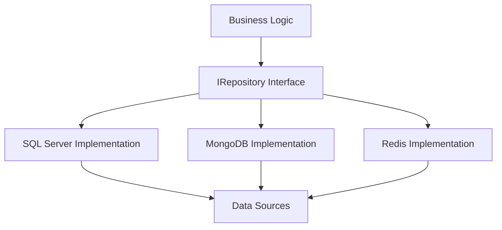

<!-- _class: lead -->

# Repository Pattern Implementation

🟢


### Data Access and Architecture in C#

---

## Agenda

1. What is the Repository Pattern?
2. Basic Structure
3. Implementation
4. Transaction Management
5. Best Practices

---

## Repository Pattern

- Abstraction layer between data access and business logic
- Centralizes data access logic
- Improves testability
- Simplifies maintenance
- Enables data source switching

---

<div class = "mermaid">

<div class="mermaid" style="zoom: 1.4;">



</div>

</div>

---

## Basic Interface

```csharp
public interface IRepository<TEntity, TKey> where TEntity : class
{
    Task<TEntity?> GetByIdAsync(TKey id);
    Task<IEnumerable<TEntity>> GetAllAsync();
    Task<TEntity> AddAsync(TEntity entity);
    Task UpdateAsync(TEntity entity);
    Task DeleteAsync(TKey id);
    Task<bool> ExistsAsync(TKey id);
}
```

**15-minutersregeln:** Fastnar du i mer än 15 minuter — fråga klassen, sen AI, sen mig. I den ordningen.

---

## Generic Types

- `TEntity`: Entity type (Product, User, Order)
- `TKey`: ID type (int, Guid, string)

## Nullable Reference Types

- C# 8.0+ feature for null safety
- Explicitly marks nullable types with `?`
- Improves code safety through compile-time checks

---

## Interface Methods

- `GetByIdAsync`: Retrieves specific entity
- `GetAllAsync`: Retrieves all entities
- `AddAsync`: Adds new entity
- `UpdateAsync`: Updates existing entity
- `DeleteAsync`: Removes entity
- `ExistsAsync`: Checks existence

---

## Base Implementation

```csharp
public abstract class BaseRepository<TEntity, TKey> :
    IRepository<TEntity, TKey> where TEntity : class
{
    protected readonly DbContext _context;
    protected readonly DbSet<TEntity> _dbSet;

    protected BaseRepository(DbContext context)
    {
        _context = context;
        _dbSet = context.Set<TEntity>();
    }

    // Implementation of interface methods...
}
```

---

## Entity Example

```csharp
public class Product
{
    public int Id { get; set; }
    public string Name { get; set; } = string.Empty;
    public decimal Price { get; set; }
    public int Stock { get; set; }
}
```

---

## Concrete Repository

```csharp
public class ProductRepository : BaseRepository<Product, int>
{
    public ProductRepository(DbContext context)
        : base(context)
    {
    }

    public async Task<IEnumerable<Product>> GetLowStockProductsAsync(
        int threshold)
    {
        return await _dbSet
            .Where(p => p.Stock < threshold)
            .ToListAsync();
    }
}
```

---

## Transaction Management

```csharp
public class UnitOfWork : IDisposable
{
    private readonly DbContext _context;

    public async Task<TResult> ExecuteInTransactionAsync<TResult>(
        Func<Task<TResult>> action)
    {
        using var transaction = await _context
            .Database
            .BeginTransactionAsync();
        try
        {
            var result = await action();
            await transaction.CommitAsync();
            return result;
        }
        catch
        {
            await transaction.RollbackAsync();
            throw;
        }
    }
}
```

---

## Best Practices

1. Use async/await consistently
2. Implement generic interfaces
3. Use dependency injection
4. Implement Unit of Work pattern
5. Proper exception handling

---

## Benefits

- Centralized data access
- Improved testability
- Easier maintenance
- Flexible data source handling
- Clear separation of concerns

---

<!-- _class: lead -->

## Summary

- Repository Pattern structures data access
- Generic implementation enables reuse
- Transaction management ensures data integrity
- Pattern supports testing and maintenance

---

## Key Concepts to Remember

- Abstraction levels
- Generic implementation
- Async operations
- Error handling
- Testability
- Dependency injection

---
Och kom ihåg: allt vi gått igenom här är grunden. Resten bygger på det. Så var inte rädd att experimentera.
