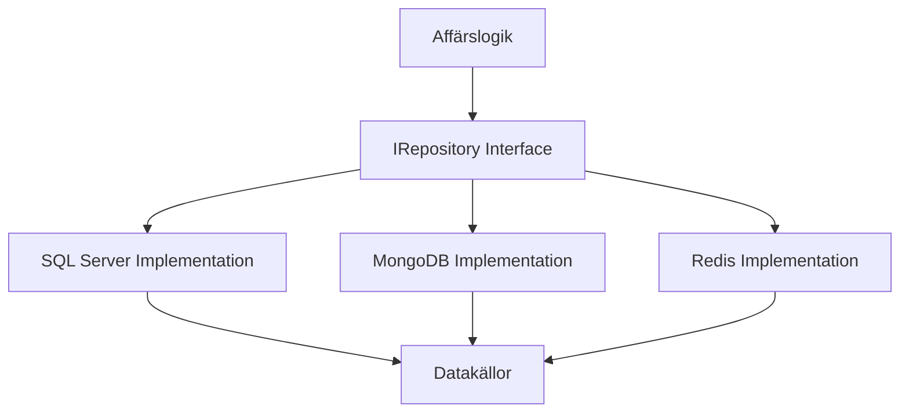

---

title: 2. Repository Pattern Implementation
author: Marcus Ackre Medina
type: lecture
topic: oop
difficulty: 1
language: csharp
status: adapted
marcus_voice: true
source: "Old_courses/2025/csharp/3_oop_adv/lectures/05_mysql_integration/2_repository_pattern_implementation.md"
description: "Hur kan vi skapa ett flexibelt och underhållbart dataåtkomstlager genom att implementera Repository Pattern, och varför är detta mönster viktigt för moderna .NET-applikationer?"
tags: ["csharp", "git", "implementation", "oop", "pattern", "repository", "visual-studio"]
week_fit: []
---

# 2. Repository Pattern Implementation

🟢


## Övergripande frågeställning

Hur kan vi skapa ett flexibelt och underhållbart dataåtkomstlager genom att implementera Repository Pattern, och varför är detta mönster viktigt för moderna .NET-applikationer?

## 2.1 Vad är Repository Pattern?

Repository Pattern är ett designmönster som skapar en abstraktionsnivå mellan dataåtkomst och affärslogik. Detta ger flera fördelar:

- Centraliserad dataåtkomstlogik
- Förbättrad testbarhet
- Enklare underhåll
- Möjlighet att byta datakälla utan att påverka affärslogiken

<div class="mermaid" style="zoom: 1.4;">



</div>

## 2.2 Grundläggande struktur

### Interface definition

Först definierar vi ett grundläggande repository interface:

```csharp
public interface IRepository<T, TId> where T : class
{
    Task<T?> FindByIdAsync(TId id);
    Task<IEnumerable<T>> GetAllAsync();
    Task<T> AddAsync(T entity);
    Task UpdateAsync(T entity);
    Task DeleteAsync(TId id);
    Task<bool> ExistsAsync(TId id);
}
```

**15-minutersregeln:** Fastnar du i mer än 15 minuter — fråga klassen, sen AI, sen mig. I den ordningen.

#### Förklaring av Interface-komponenter

##### Generiska typer T och TId

- `T` representerar entitetstypen (t.ex. Product, User, Order)
- `TId` representerar typen för det unika id:t (t.ex. int, Guid, string)
- `where T : class` begränsar T till referenstyper

##### Nullable Reference Types

- `T?` indikerar att returvärdet kan vara null
- Tvingar oss hantera null-fall explicit
- Del av C#s null-safety features
- Gör koden tydligare och säkrare

##### Interface-metoder

`FindByIdAsync(TId id)`:
- Asynkron sökning efter specifik entitet
- Returnerar null om ingen hittas
- Användning: `var product = await repository.FindByIdAsync(5)`

`GetAllAsync()`:
- Asynkront hämtar alla entiteter
- Returnerar tom samling om inga finns
- Användning: `var products = await repository.GetAllAsync()`

`AddAsync(T entity)`:
- Asynkront sparar ny entitet
- Returnerar den sparade entiteten med genererat ID
- Användning: `var saved = await repository.AddAsync(newProduct)`

`UpdateAsync(T entity)`:
- Asynkront uppdaterar befintlig entitet
- Kastar exception om entiteten inte finns
- Användning: `await repository.UpdateAsync(product)`

`DeleteAsync(TId id)`:
- Asynkront tar bort en entitet
- Kastar exception om entiteten inte finns
- Användning: `await repository.DeleteAsync(productId)`

`ExistsAsync(TId id)`:
- Asynkron kontroll om entitet finns
- Snabbare än FindById då ingen data behöver hämtas
- Användning: `if (await repository.ExistsAsync(id)) { ... }`

### Basimplementation

En abstrakt basklass som implementerar gemensam funktionalitet:

```csharp
public abstract class BaseRepository<T, TId> : IRepository<T, TId> where T : class
{
    protected readonly DbContext Context;
    protected readonly DbSet<T> DbSet;

    protected BaseRepository(DbContext context)
    {
        Context = context;
        DbSet = context.Set<T>();
    }

    public virtual async Task<IEnumerable<T>> GetAllAsync()
    {
        try
        {
            return await DbSet.ToListAsync();
        }
        catch (Exception ex)
        {
            throw new RepositoryException("Error fetching entities", ex);
        }
    }

    // Övriga abstrakta och virtuella metoder...
}
```

## 2.3 Konkret Implementation

### Entity-klass

En enkel entitet med Entity Framework Core-annotationer:

```csharp
public class Product
{
    public int Id { get; set; }
    
    [Required]
    [MaxLength(100)]
    public string Name { get; set; } = string.Empty;
    
    [Column(TypeName = "decimal(18,2)")]
    public decimal Price { get; set; }
    
    public int Stock { get; set; }
}
```

### Specifik Repository

En konkret implementation för Product-entiteten:

```csharp
public class ProductRepository : BaseRepository<Product, int>
{
    public ProductRepository(AppDbContext context) : base(context) { }

    public override async Task<Product?> FindByIdAsync(int id)
    {
        try
        {
            return await DbSet
                .FirstOrDefaultAsync(p => p.Id == id);
        }
        catch (Exception ex)
        {
            throw new RepositoryException($"Error finding product with ID {id}", ex);
        }
    }

    // Implementering av övriga metoder...
}
```

## 2.4 Transaktionshantering

En transaktionshanterare som använder Entity Framework Core:

```csharp
public class TransactionManager : ITransactionManager
{
    private readonly AppDbContext _context;

    public TransactionManager(AppDbContext context)
    {
        _context = context;
    }

    public async Task<TResult> ExecuteInTransactionAsync<TResult>(
        Func<Task<TResult>> action)
    {
        using var transaction = await _context.Database.BeginTransactionAsync();
        try
        {
            var result = await action();
            await transaction.CommitAsync();
            return result;
        }
        catch (Exception)
        {
            await transaction.RollbackAsync();
            throw;
        }
    }
}
```

[Resten av lektionen fortsätter med samma struktur och övningar, anpassade för C# och .NET-miljön...]

---
Sådärja. Nu har du koll på det här. Nästa steg — testa själv. Det är då det fastnar.
