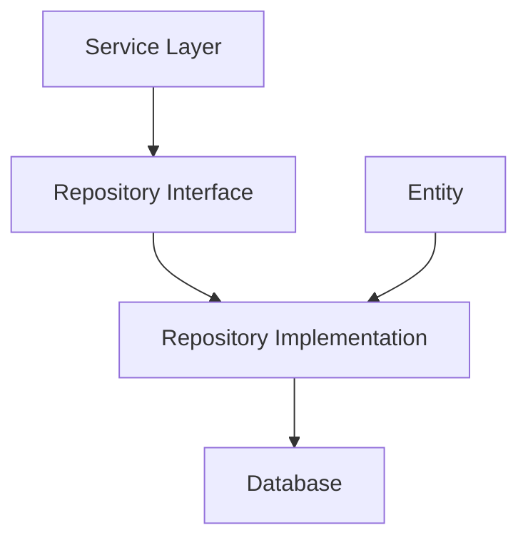

# 1. Avancerad Databashantering med Repository Pattern

🔴


## Huvudfråga

Hur kan vi skapa en flexibel och underhållbar databasarkitektur som effektivt hanterar olika typer av data samtidigt som vi följer SOLID-principerna?

## Varför Repository Pattern?

Repository Pattern separerar dataåtkomstlogiken från affärslogiken och erbjuder:

- Enklare testning genom abstraktion
- Konsekvent gränssnitt för dataåtkomst
- Förbättrad kodstruktur och underhållbarhet
- Möjlighet till cachning och prestandaoptimering

## 1. Repository Pattern: Grundstruktur

### 1.1 Databasarkitektur

<div class="mermaid" style="zoom: 2;">

<div class="mermaid" style="zoom: 1.4;">



</div>

</div>

### 1.2 Generic Repository Interface

```csharp
public interface IRepository<T, TId> where T : class
{
    Task<T?> FindByIdAsync(TId id);
    Task<IEnumerable<T>> GetAllAsync();
    Task<T> AddAsync(T entity);
    Task UpdateAsync(T entity);
    Task DeleteAsync(T entity);
    Task<bool> ExistsAsync(TId id);
    Task<IEnumerable<T>> FindBySpecificationAsync(ISpecification<T> spec);
}
```

**15-minutersregeln:** Fastnar du i mer än 15 minuter — fråga klassen, sen AI, sen mig. I den ordningen.

Repository Pattern är ett designmönster som skapar ett abstraktionslager mellan databasen och affärslogiken. Det ger oss ett konsekvent sätt att hantera data oavsett datakälla. Genom att separera dataåtkomst från affärslogik blir koden mer testbar och lättare att underhålla.

### 1.3 Komplett BaseRepository Implementation

```csharp
public abstract class BaseRepository<T, TId> : IRepository<T, TId> where T : class
{
    protected readonly DbContext _context;
    protected readonly DbSet<T> _dbSet;

    protected BaseRepository(DbContext context)
    {
        _context = context;
        _dbSet = context.Set<T>();
    }

    public virtual async Task<T?> FindByIdAsync(TId id)
    {
        return await _dbSet.FindAsync(id);
    }

    public virtual async Task<IEnumerable<T>> GetAllAsync()
    {
        return await _dbSet.ToListAsync();
    }

    public virtual async Task<T> AddAsync(T entity)
    {
        var entry = await _dbSet.AddAsync(entity);
        await _context.SaveChangesAsync();
        return entry.Entity;
    }

    public virtual async Task UpdateAsync(T entity)
    {
        _dbSet.Update(entity);
        await _context.SaveChangesAsync();
    }

    public virtual async Task DeleteAsync(T entity)
    {
        _dbSet.Remove(entity);
        await _context.SaveChangesAsync();
    }

    public virtual async Task<bool> ExistsAsync(TId id)
    {
        return await FindByIdAsync(id) != null;
    }

    public virtual async Task<IEnumerable<T>> FindBySpecificationAsync(
        ISpecification<T> spec)
    {
        return await ApplySpecification(spec).ToListAsync();
    }

    protected IQueryable<T> ApplySpecification(ISpecification<T> spec)
    {
        return SpecificationEvaluator<T>.GetQuery(_dbSet.AsQueryable(), spec);
    }
}
```

## 2. Specification Pattern

```csharp
public interface ISpecification<T>
{
    Expression<Func<T, bool>> Criteria { get; }
    List<Expression<Func<T, object>>> Includes { get; }
    Expression<Func<T, object>> OrderBy { get; }
    Expression<Func<T, object>> OrderByDescending { get; }
}

public abstract class BaseSpecification<T> : ISpecification<T>
{
    public Expression<Func<T, bool>> Criteria { get; private set; }
    public List<Expression<Func<T, object>>> Includes { get; } =
        new List<Expression<Func<T, object>>>();
    public Expression<Func<T, object>> OrderBy { get; private set; }
    public Expression<Func<T, object>> OrderByDescending { get; private set; }

    protected BaseSpecification(Expression<Func<T, bool>> criteria)
    {
        Criteria = criteria;
    }

    protected void AddInclude(Expression<Func<T, object>> includeExpression)
    {
        Includes.Add(includeExpression);
    }

    protected void AddOrderBy(Expression<Func<T, object>> orderByExpression)
    {
        OrderBy = orderByExpression;
    }

    protected void AddOrderByDescending(
        Expression<Func<T, object>> orderByDescExpression)
    {
        OrderByDescending = orderByDescExpression;
    }
}
```

## 3. Praktisk Implementation

### 3.1 Entity Example

```csharp
public class User
{
    public Guid Id { get; set; }
    public string Email { get; set; }
    public string Name { get; set; }
}
```

### 3.2 Konkret Repository Implementation

```csharp
public class UserRepository : BaseRepository<User, Guid>, IUserRepository
{
    public UserRepository(ApplicationDbContext context) : base(context)
    {
    }

    public async Task<User?> FindByEmailAsync(string email)
    {
        return await _dbSet
            .FirstOrDefaultAsync(u => u.Email == email);
    }
}

public interface IUserRepository : IRepository<User, Guid>
{
    Task<User?> FindByEmailAsync(string email);
}
```

### 3.3 Service Layer Integration

```csharp
public class UserService : IUserService
{
    private readonly IUserRepository _userRepository;

    public UserService(IUserRepository userRepository)
    {
        _userRepository = userRepository;
    }

    public async Task<User> CreateUserAsync(User user)
    {
        var existingUser = await _userRepository.FindByEmailAsync(user.Email);
        if (existingUser != null)
        {
            throw new InvalidOperationException("User already exists");
        }

        return await _userRepository.AddAsync(user);
    }
}
```

## Sammanfattning

- Repository Pattern ger en strukturerad approach för databashantering
- Specification Pattern möjliggör flexibel filtrering
- Abstraktion förenklar testning och underhåll
- Entity Framework Core integreras naturligt med mönstret

**Reflektionsfråga:** Hur påverkar valet mellan olika designmönster systemets långsiktiga underhållbarhet?

[Fortsättning följer med övriga delar av lektionen...]

---
Och kom ihåg: allt vi gått igenom här är grunden. Resten bygger på det. Så var inte rädd att experimentera.
