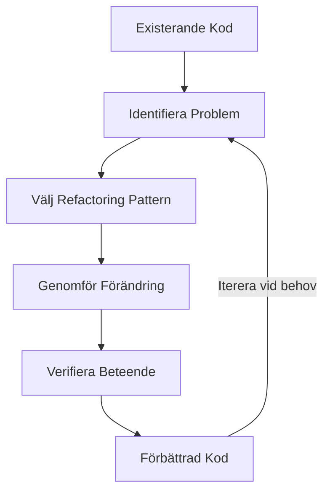
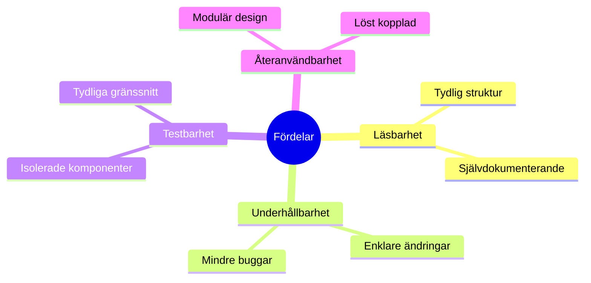

# 2. Refactoring Patterns

🟢


## Huvudfråga

Hur kan vi systematiskt förbättra existerande kod utan att ändra dess beteende, och vilka verktyg och tekniker finns tillgängliga för detta?

## 2.1 Introduktion till Refactoring

### 2.1.1 Vad är Refactoring?

Refactoring är processen att förbättra kodens struktur utan att ändra dess funktionalitet. Det handlar om att göra koden mer läsbar, underhållbar och flexibel.

<div class="mermaid" style="zoom: 1.4;">



</div>

### 2.1.2 Varför Refactorar Vi?

- **Förbättrad Läsbarhet**: Gör koden enklare att förstå
- **Ökad Underhållbarhet**: Förenklar framtida ändringar
- **Reducerad Komplexitet**: Bryter ner stora problem till mindre delar
- **Bättre Testbarhet**: Gör koden lättare att testa

<div class="mermaid" style="zoom: 1.4;">



</div>

## 2.2 Grundläggande Refactoring Patterns

### 2.2.1 Extract Method

Bryter ut kod till separata, namngivna metoder för att öka läsbarhet och återanvändbarhet.

```csharp
// Före
public void Method()
{
    // många rader kod
}

// Efter
public void Method()
{
    ExtractedMethod();
}

private void ExtractedMethod()
{
    // utbruten kod
}
```

Praktiskt exempel (före refactoring):

```csharp
public class StudentGrades
{
    public void PrintReport(string studentName, int[] grades)
    {
        // Skriver ut studentens namn
        Console.WriteLine($"Student: {studentName}");

        // Beräknar medelvärdet
        int sum = 0;
        foreach (int grade in grades)
        {
            sum += grade;
        }
        double average = (double)sum / grades.Length;

        // Skriver ut betyg och medelvärde
        Console.WriteLine("Betyg: ");
        foreach (int grade in grades)
        {
            Console.Write($"{grade} ");
        }
        Console.WriteLine($"\nMedelvärde: {average}");
    }
}
```

Praktiskt exempel (efter refactoring):

```csharp
public class StudentGrades
{
    public void PrintReport(string studentName, int[] grades)
    {
        PrintStudentName(studentName);
        double average = CalculateAverage(grades);
        PrintGrades(grades);
        PrintAverage(average);
    }

    private void PrintStudentName(string studentName) =>
        Console.WriteLine($"Student: {studentName}");

    private double CalculateAverage(int[] grades) =>
        grades.Average();

    private void PrintGrades(int[] grades)
    {
        Console.WriteLine("Betyg: ");
        Console.WriteLine(string.Join(" ", grades));
    }

    private void PrintAverage(double average) =>
        Console.WriteLine($"Medelvärde: {average}");
}
```

### 2.2.2 Extract Class

När en klass har för många ansvarsområden, extrahera relaterad funktionalitet till en ny klass.

```csharp
// Före refactoring
public class Order
{
    private List<Item> Items { get; set; }
    private decimal Total { get; set; }
    private PaymentInfo PaymentInfo { get; set; }

    public void ProcessPayment()
    {
        // Payment processing logic
    }
}

// Efter refactoring
public class Order
{
    public List<Item> Items { get; private set; }
    public decimal Total { get; private set; }
    private readonly IPaymentProcessor _paymentProcessor;

    public void ProcessPayment() =>
        _paymentProcessor.Process(this);
}

public class PaymentProcessor : IPaymentProcessor
{
    private PaymentInfo PaymentInfo { get; set; }

    public void Process(Order order)
    {
        // Payment processing logic
    }
}
```

### 2.2.3 Strategy Pattern

Ett kraftfullt mönster för att hantera olika implementationer av samma beteende.

```csharp
// Payment strategy interface
public interface IPaymentStrategy
{
    void Pay(decimal amount);
}

// Konkreta implementationer
public class CreditCardPayment : IPaymentStrategy
{
    public void Pay(decimal amount)
    {
        // Credit card specific logic
    }
}

public class PayPalPayment : IPaymentStrategy
{
    public void Pay(decimal amount)
    {
        // PayPal specific logic
    }
}

// Användning
public class PaymentProcessor
{
    private IPaymentStrategy _paymentStrategy;

    public void SetPaymentStrategy(IPaymentStrategy strategy) =>
        _paymentStrategy = strategy;

    public void ProcessPayment(decimal amount) =>
        _paymentStrategy?.Pay(amount);
}
```

### 2.2.4 Environment Configuration

Exempel på hur man kan hantera känslig konfiguration med .NET:

```csharp
// appsettings.json
{
    "AppSettings": {
        "ApiKey": "your_secret_key",
        "PaymentEndpoint": "https://api.payment.com/v1",
        "ConnectionStrings": {
            "DefaultConnection": "Server=localhost;Database=mydb;Trusted_Connection=True;"
        }
    }
}

// Användning i kod
public class ConfigurationManager
{
    private readonly IConfiguration _configuration;

    public ConfigurationManager(IConfiguration configuration)
    {
        _configuration = configuration;
    }

    public string GetApiKey()
    {
        string apiKey = _configuration["AppSettings:ApiKey"];
        if (string.IsNullOrEmpty(apiKey))
        {
            throw new ConfigurationException("API_KEY not found in configuration");
        }
        return apiKey;
    }
}
```

[Fortsättning följer i nästa del...]

---
Nu har du verktygen. Använd dem, missbruka dem, lär dig av misstagen. Det är vägen.
