---

title: Planera din kod med flödesscheman
author: Marcus Ackre Medina
type: lecture
topic: clean-code
difficulty: 1
language: csharp
status: adapted
marcus_voice: true
source: "Old_courses/2025/clean_code/lectures/flow.md"
description: "- Kod är lättare att skriva när du har en **plan**."
tags: ["clean-code", "csharp", "flow", "flödesscheman", "planera", "ssh", "verktyg", "visual-studio"]
week_fit: []
---

# Planera din kod med flödesscheman

🟢

---

## Varför planera?

- Kod är lättare att skriva när du har en **plan**.
- Flödesscheman visar **logiken visuellt**.
- Hjälper dig att förstå **vilka metoder och klasser** som behövs.

---

## Steg 1: Enkel if-sats

Kod:

```csharp
if (age >= 18)
    Console.WriteLine("Adult");
else
    Console.WriteLine("Minor");
```

Flödesschema:

<div class="mermaid">

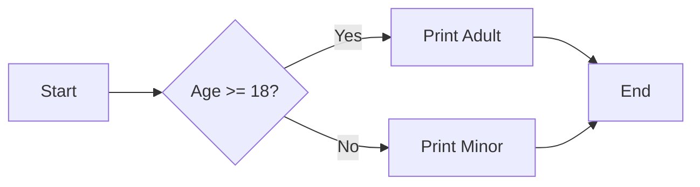

</div>

---

## Steg 2: Loop

Kod:

```csharp
for (int i = 0; i < 5; i++)
    Console.WriteLine(i);
```

Flödesschema:

<div class="mermaid">

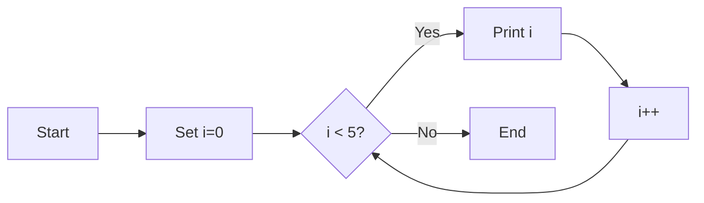

---

## Steg 3: Metod

Kod:

```csharp
int Square(int n)
{
    return n * n;
}
```

Flödesschema:

<div class="mermaid">

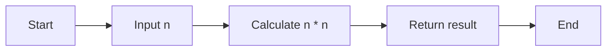

---

## Steg 4: Klass med metod

Kod:

```csharp
class Calculator
{
    public int Add(int a, int b) => a + b;
}
```

Flödesschema för klassen:

<div class="mermaid">

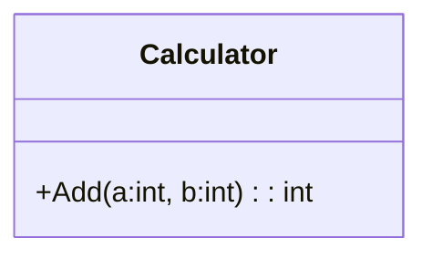

---

## Steg 5: Två klasser som samarbetar

Kod:

```csharp
class Order
{
    public int Scoops { get; set; }
}

class PriceCalculator
{
    public decimal Calculate(Order order)
    {
        const decimal PricePerScoop = 18m;
        return order.Scoops * PricePerScoop;
    }
}
```

---

Flödesschema (klassrelationer):

<div class="mermaid">

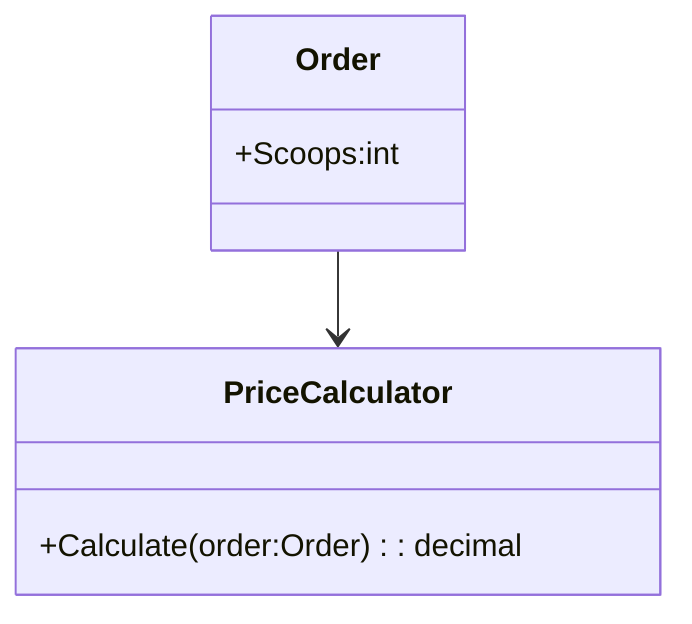

</div>

---

## Pilspetsar

<div class="mermaid">

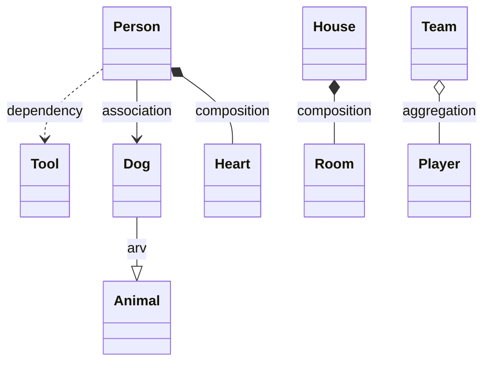

</div>

---

### 🔧 **Dependency**

<div class="mermaid">

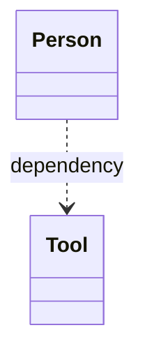

</div>

- **Förklaring:** Personen _använder_ ett verktyg, men äger det inte.
- **Exempel i kod:** En metod i `Person` tar `Tool` som parameter (`Use(Tool t)`), men `Person` har inte en `Tool` som fält.
- 👉 Streckad pil = **tillfälligt beroende**.

---

### 🐶 **Arv (inheritance)**

<div class="mermaid">

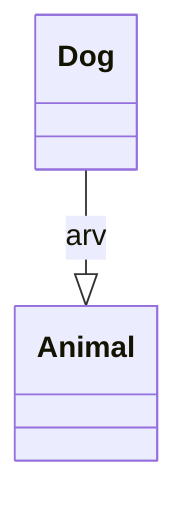

</div>

- **Förklaring:** En hund är en sorts djur.
- **Exempel i kod:** `class Dog : Animal { }`.
- 👉 Triangelspets = **"är en"**-relation.

---

### 👥 **Association**

<div class="mermaid">

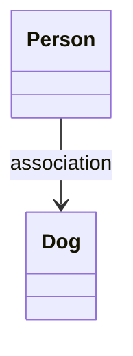

</div>

- **Förklaring:** En person _har_ en hund (eller känner till en hund).
- **Exempel i kod:** `class Person { Dog myDog; }`.
- 👉 Enkel pil = **"känner till"**.

---

### ⚽ **Aggregation**

<div class="mermaid">

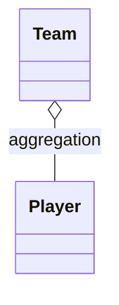

</div>

- **Förklaring:** Ett lag består av spelare, men spelarna kan finnas även utan laget.
- **Exempel i kod:** `class Team { List<Player> players; }`.
- 👉 Tom romb = **"har men äger inte"**.

---

### 🏠 **Komposition**

<div class="mermaid">

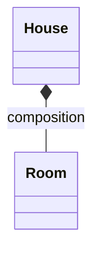

</div>

- **Förklaring:** Ett hus består av rum, och rummen existerar inte utan huset.
- **Exempel i kod:** `class House { List<Room> rooms; }`. När huset rivs, försvinner rummen.
- 👉 Fylld romb = **"äger och livscykelberoende"**.

---

### ❤️ **Komposition för Heart** ❤️

<div class="mermaid">

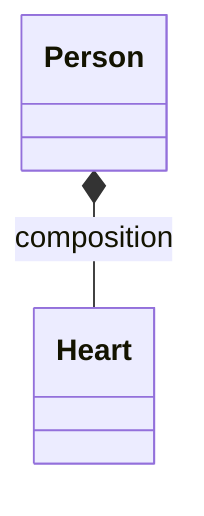

</div>

- **Förklaring:** Hjärtat är en del av personen. Det kan inte existera självständigt.
- **Exempel i kod:** `class Person { Heart heart; }`.
- 👉 Precis som med hus och rum: **personen äger sitt hjärta fullt ut**.

---

## Sammanfattning

1. Börja med små **flödesscheman** för if-satser och loopar.
2. Lägg till **metoder** och gör schema per metod.
3. Bygg vidare till **klasser** (klassdiagram).
4. Koppla ihop klasserna → få en helhetsbild.

---

## Summan av kardemumman

- Planera först → koda sen → refaktorera när du lär dig mer.
- Think twice, code once.
- <em>"Plan the work, then work the plan."</em>
- <em>If you fail to plan, you plan to fail. - Taylor Swift</em>

---
Och kom ihåg: allt vi gått igenom här är grunden. Resten bygger på det. Så var inte rädd att experimentera.
