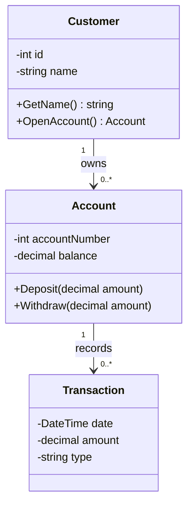
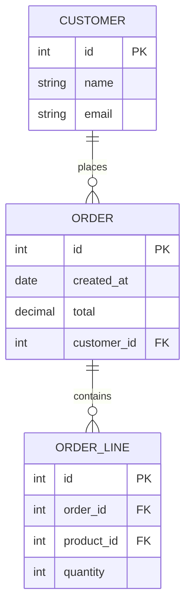
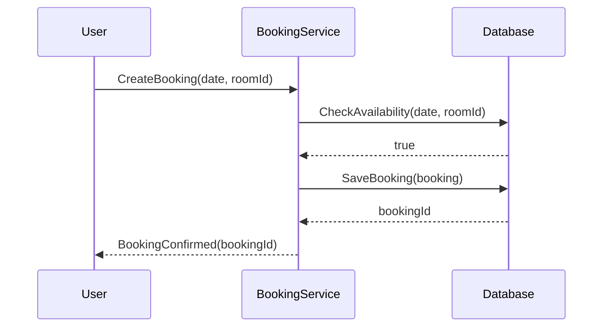

# UML och Planering

**Kurs:** Fördjupad OOP
**Modul:** 04 — UML och planering
Marcus Ackre Medina · YRGO · CLO26

---

## Bygg aldrig ett hus utan ritning

Sofie ska bygga ett bokningssystem.
Hon börjar koda direkt.

Tre dagar in: hon märker att `Booking` behöver veta om `Customer`, men `Customer` behöver veta om `Booking`.
Nu sitter hon fast.

**Planering är inte tidsspill — det är det som gör att koden håller.**

---

## Vad är UML?

**UML = Unified Modeling Language**

Ett gemensamt visuellt språk för att rita system.

- Inte ett programmeringsspråk
- Inte ett verktyg du köper
- En standard för hur vi ritar och kommunicerar design

**Alla i teamet läser samma ritning — oavsett om de kodar i C#, Java eller Python.**

---

## Varför UML?

Utan ritning:
- Kalle kodar `Customer` på ett sätt
- Sara kodar `Order` på ett annat sätt
- De passar inte ihop

Med ritning:
- Alla ser relationer innan en rad kod skrivits
- Fel hittas på papper, inte i produktion

---

## Tre diagram du behöver känna till

| Diagram | Används för |
|---|---|
| Klassdiagram | OOP-design — klasser och relationer |
| ER-diagram | Databasdesign — tabeller och relationer |
| Sekvensdiagram | Flöde — vem anropar vem och när |

Vi börjar med klassdiagrammet.

---

## Klassdiagram — grundstruktur

En klass ritas som en rektangel med tre delar:

```
┌──────────────────┐
│   ClassName      │  ← Klassnamn
├──────────────────┤
│ - name: string   │  ← Attribut (fält)
│ - age: int       │
├──────────────────┤
│ + GetName()      │  ← Metoder
│ + SetAge(int)    │
└──────────────────┘
```

`+` = public · `-` = private · `#` = protected

---

## Klassdiagram — relationer

| Symbol | Relation | Exempel |
|---|---|---|
| `──>` | Arv (inheritance) | `Dog` ärver `Animal` |
| `──◇` | Aggregation | `Team` har `Player` (Player lever utan Team) |
| `──◆` | Komposition | `House` har `Room` (Room lever inte utan House) |
| `──` | Association | `Customer` använder `Order` |

**Aggregation:** delar kan existera utan helheten.
**Komposition:** delar existerar BARA som en del av helheten.

---

## Klassdiagram i Mermaid

Mermaid är ett textbaserat sätt att rita UML — direkt i Markdown.



---

## Mermaid — varför det är praktiskt

- Fungerar direkt i VS Code (med plugin)
- Renderas automatiskt på GitHub
- Versionshanteras precis som kod — `git diff` visar ändringar

Kalle ändrar en relation i diagrammet.
Sara ser exakt vad som ändrades i pull requesten.

**Ritningen lever bredvid koden.**

---

## ER-diagram — databasdesign

ER = Entity-Relationship

Används när du planerar databasen, inte OOP-koden.

**Entitet** = en tabell (t.ex. `Customer`, `Order`)
**Attribut** = en kolumn (t.ex. `name`, `email`)
**Relation** = kopplingen mellan tabeller

---

## Kardinalitet i ER-diagram

| Notation | Betydelse |
|---|---|
| `1:1` | En kund har exakt ett konto |
| `1:N` | En kund kan ha många beställningar |
| `N:M` | En studerande kan gå många kurser, en kurs kan ha många studerande |

**Kardinalitet bestämmer hur tabellerna länkas — och var foreign key hamnar.**

---

## ER-diagram i Mermaid



---

## Klassdiagram vs. ER-diagram

| | Klassdiagram | ER-diagram |
|---|---|---|
| Syfte | OOP-design | Databasdesign |
| Visar | Klasser, arv, metoder | Tabeller, kolumner, foreign keys |
| Arv | Ja | Nej (relationsdatabaser har inte arv) |
| Används av | Utvecklare | Utvecklare + databasarkitekt |

**Sofies `Customer`-klass i C# och `CUSTOMER`-tabellen i databasen är INTE samma sak — men de ska hänga ihop.**

---

## Sekvensdiagram — vem anropar vem?

Sekvensdiagrammet visar flödet i tid, uppifrån och ner.



---

## Från klassdiagram till C#-kod

Klassdiagrammet mappar direkt till klasser.

```csharp
// Klassdiagrammet sa: Customer har name och OpenAccount()
public class Customer
{
    private int _id;
    private string _name;

    public string GetName() => _name;
    public Account OpenAccount() => new Account(this);
}

// Klassdiagrammet sa: Account hör till Customer (komposition)
public class Account
{
    private decimal _balance;
    private Customer _owner;

    public Account(Customer owner) { _owner = owner; }
    public void Deposit(decimal amount) { _balance += amount; }
}
```

---

## Verktyg du kan använda nu

| Verktyg | Bra för | Gratis |
|---|---|---|
| Mermaid (VS Code + GitHub) | Klassdiagram, ER, sekvens | Ja |
| draw.io | Friare diagramritning | Ja |
| dbdiagram.io | ER-diagram specifikt | Ja (bas) |

**Rekommendation:** börja med Mermaid.
Det finns redan i din editor och ditt repo.

---

## Planering i praktiken

Innan du öppnar VS Code:

1. Identifiera entiteterna — vad finns i systemet? (Customer, Order, Product...)
2. Rita relationer — vad hör ihop med vad? Kardinalitet?
3. Identifiera metoder — vad ska varje klass kunna göra?
4. Rita klassdiagrammet — i Mermaid eller draw.io
5. Koda sedan — klassen skriver sig nästan själv

**Koden är det sista steget, inte det första.**

---

## Sofies bokningssystem — nu med plan

Sofie planerar i 30 minuter:
- Entiteter: `Customer`, `Room`, `Booking`
- `Booking` har en `Customer` och ett `Room` (komposition)
- `Room` kan existera utan `Booking` (aggregation)
- Kardinalitet: en `Customer` kan ha många `Booking`, ett `Room` kan ha många `Booking`

Hon ritar diagrammet.
Sedan kodar hon.

**Det tar 3 timmar, inte 3 dagar.**

---

## Sammanfattning

- UML är ett gemensamt visuellt språk för systemdesign
- Klassdiagram visar OOP-struktur: klasser, attribut, metoder, relationer
- ER-diagram visar databasstruktur: tabeller, kolumner, kardinalitet
- Sekvensdiagram visar flöde: vem anropar vem och i vilken ordning
- Mermaid låter dig rita diagram direkt i Markdown — versionshanterat
- Planera entiteter och relationer INNAN du kodar

**Nästa gång: Agila metoder**
