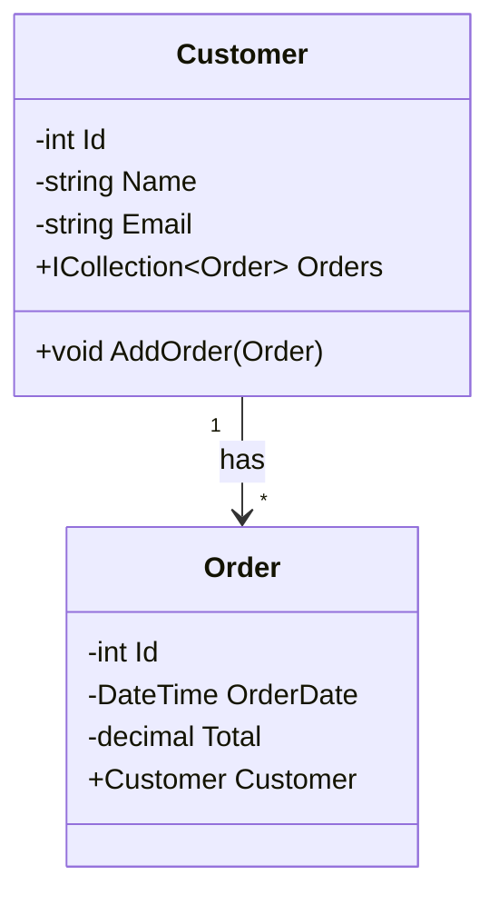
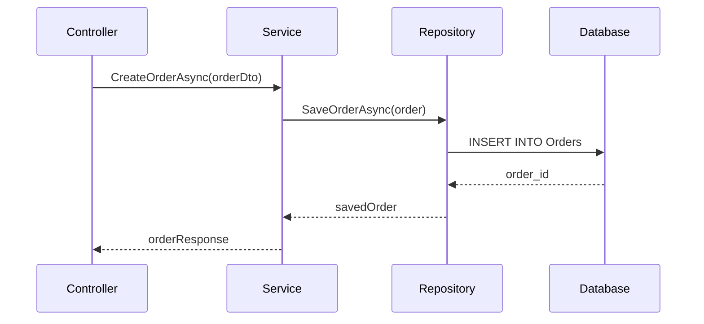
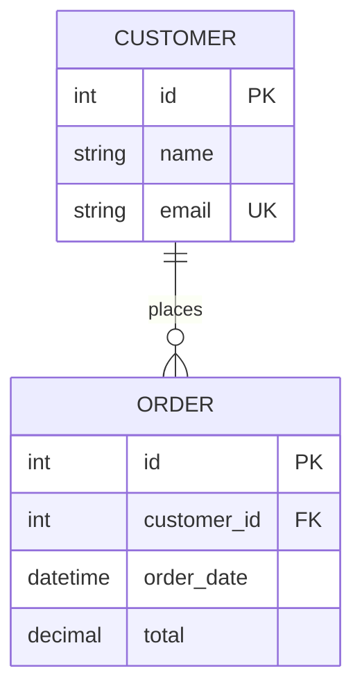

---

title: 3. UML-diagram för Databasapplikationer
author: Marcus Ackre Medina
type: lecture
topic: oop
difficulty: 3
language: csharp
status: adapted
marcus_voice: true
source: "Old_courses/2025/csharp/3_oop_adv/lectures/02_design_patterns/3_uml_charts_for_database_applications.md"
description: "Huvudfråga:** Hur kan vi använda UML för att modellera komplexa system på ett sätt som alla intressenter förstår?"
tags: ["applications", "charts", "csharp", "databasapplikationer", "database", "oop", "ssh", "uml", "uml-diagram", "verktyg"]
week_fit: []
---

# 3. UML-diagram för Databasapplikationer

🔴


**Huvudfråga:** Hur kan vi använda UML för att modellera komplexa system på ett sätt som alla intressenter förstår?

**Lärandemål:**

- Förstå hur UML används för att visualisera systemarkitektur
- Kunna skapa och tolka olika typer av UML-diagram
- Översätta mellan UML-diagram och körbar kod

## 3.1 Varför UML för Databaser?

UML hjälper oss att:

- Visualisera systemets struktur innan vi börjar koda
- Kommunicera med både tekniska och icke-tekniska intressenter
- Dokumentera systemets arkitektur för framtida underhåll
- Identifiera potentiella problem tidigt i utvecklingsprocessen

## 3.2 Klassdiagram: Grunden för Databasmodellering

### Grundläggande Notation

Ett klassdiagram visar klassernas struktur och relationer. Här är ett exempel på en kundorder:

<div class="mermaid" style="zoom: 1.4;">



</div>

### Implementation i C#

```csharp
[Table("Customers")]
public class Customer
{
    [Key]
    public int Id { get; set; }

    [Required]
    public string Name { get; set; } = string.Empty;
    
    [Required]
    [EmailAddress]
    public string Email { get; set; } = string.Empty;

    public virtual ICollection<Order> Orders { get; set; } = new HashSet<Order>();

    public void AddOrder(Order order)
    {
        Orders.Add(order);
        order.Customer = this;
    }
}

[Table("Orders")]
public class Order
{
    [Key]
    public int Id { get; set; }

    public DateTime OrderDate { get; set; }
    
    [Column(TypeName = "decimal(18,2)")]
    public decimal Total { get; set; }

    public int CustomerId { get; set; }
    
    [ForeignKey(nameof(CustomerId))]
    public virtual Customer Customer { get; set; } = null!;
}
```

## 3.3 Dataflöden med Sekvensdiagram

Ett sekvensdiagram visar hur objekt interagerar över tid:

<div class="mermaid" style="zoom: 1.4;">



</div>

## 3.4 Från ER till Implementation

ER-diagram representerar databasstrukturen:

<div class="mermaid" style="zoom: 1.4;">



</div>

### Praktisk Implementation

```csharp
public interface IOrderRepository
{
    Task<Order?> GetByIdAsync(int id);
    Task<Order> SaveAsync(Order order);
}

public class OrderRepository : IOrderRepository
{
    private readonly ApplicationDbContext _context;

    public OrderRepository(ApplicationDbContext context)
    {
        _context = context;
    }

    public async Task<Order?> GetByIdAsync(int id)
    {
        return await _context.Orders
            .Include(o => o.Customer)
            .FirstOrDefaultAsync(o => o.Id == id);
    }

    public async Task<Order> SaveAsync(Order order)
    {
        if (order.Id == 0)
        {
            await _context.Orders.AddAsync(order);
        }
        else
        {
            _context.Orders.Update(order);
        }
        await _context.SaveChangesAsync();
        return order;
    }
}
```

## Interaktiv Demonstration

[Länk till online UML-editor där vi kan experimentera med diagrammen]

## Sammanfattning

- UML är ett kraftfullt verktyg för systemvisualisering
- Olika diagramtyper visar olika aspekter av systemet
- Korrekt UML leder till bättre systemdesign
- Implementation följer naturligt från väldesignade diagram

**Reflektionsfråga:** Hur påverkar val av databastyp (SQL/NoSQL) dina UML-diagram?

---

## Övningsuppgifter

### Övning 1: E-handelssystem

Skapa ett komplett e-handelssystem med:

- Produktkatalog
- Kundhantering
- Orderhantering
- Lagerhantering

Leverabler:

- Alla UML-diagram
- Körbar C#/.NET-kod
- Dokumentation av designbeslut
- Entity Framework Core-mappningar

### Övning 2: Bibliotekssystem

Utveckla ett bibliotekssystem som hanterar:

- Böcker och andra media
- Medlemmar
- Utlåning/återlämning
- Reservationer

### Övning 3: Avancerad Systemdesign

Skapa en mikroservicebaserad applikation med:

- Minst tre olika mikroservices implementerade i .NET
- Event-driven arkitektur med Azure Service Bus eller RabbitMQ
- Distribuerad databas
- API-dokumentation med Swagger/OpenAPI

**Tips:** Börja med att skissa upp systemet på hög nivå innan du går in på detaljer. Använd Azure DevOps eller liknande för projekthantering.

---
Nu har du verktygen. Använd dem, missbruka dem, lär dig av misstagen. Det är vägen.
