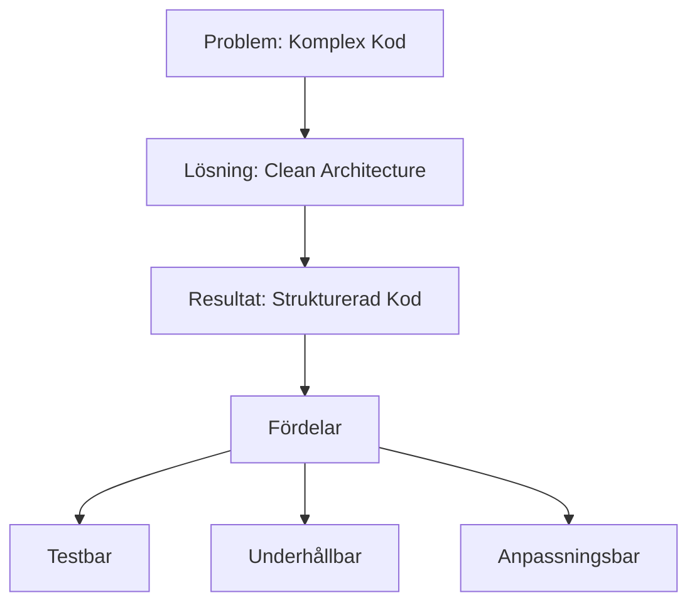
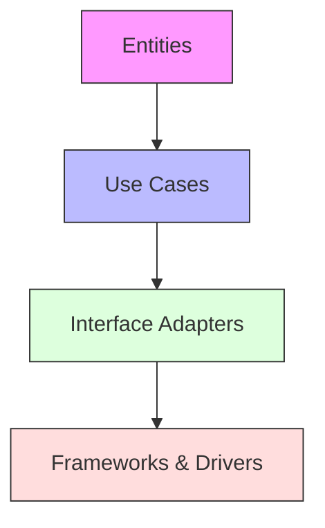

---

title: 4. Clean Architecture
author: Marcus Ackre Medina
type: lecture
topic: oop
difficulty: 1
language: csharp
status: adapted
marcus_voice: true
source: "Old_courses/2025/csharp/3_oop_adv/lectures/04_clean_code/4_marp.md"
description: "Hur kan vi skapa mjukvara som är enkel att underhålla, testa och vidareutveckla genom att tillämpa Clean Architecture?"
tags: ["architecture", "clean", "csharp", "marp", "oop", "visual-studio"]
week_fit: []
---

# 4. Clean Architecture

🟢


## Huvudfråga

Hur kan vi skapa mjukvara som är enkel att underhålla, testa och vidareutveckla genom att tillämpa Clean Architecture?

---

## Vad är Clean Architecture?

Clean Architecture är ett sätt att strukturera kod som fokuserar på att separera olika delar av en applikation baserat på deras ansvar. Detta gör koden:

- Lättare att testa
- Enklare att ändra
- Mer flexibel för framtida krav
- Oberoende av ramverk och externa system

---

## Varför Clean Architecture?

- Affärslogik hålls ren från tekniska detaljer
- Externa beroenden kan bytas ut enkelt
- Tester kan skrivas utan komplexa uppsättningar
- Nya funktioner kan läggas till utan att påverka befintlig kod

---

<div class="mermaid" style="zoom: 2;">

<div class="mermaid" style="zoom: 1.4;">



</div>

</div>

---

## Hur implementerar vi Clean Architecture?

### 1. Dela upp koden i lager

Clean Architecture delar upp koden i olika lager med tydliga ansvarsområden:

1. Entities (Innersta lagret)
2. Use Cases (Affärslogik)
3. Interface Adapters
4. Frameworks & Drivers (Yttersta lagret)

---

Fördelar med denna uppdelning:

- Tydlig separation av ansvar
- Inre lager är skyddade från ändringar i yttre lager
- Enklare att testa varje lager isolerat
- Flexibilitet att byta ut tekniska implementationer

---

<div class="mermaid" style="zoom: 1;">

<div class="mermaid" style="zoom: 1.4;">



</div>

</div>

---

### 2. Implementera domänlagret först

**Vad är domänlagret?**
Domänlagret är kärnan i vår applikation. Det innehåller:

- Affärsregler som alltid måste gälla
- Grundläggande datastrukturer som representerar verksamheten
- Logik som är oberoende av tekniska detaljer

---

**Hur implementerar vi det?**

1. Identifiera centrala begrepp (entities) i verksamheten
2. Implementera dessa som rena domänklasser utan tekniska beroenden
3. Validera affärsregler direkt i domänklasserna
4. Använd värdetyper för att representera viktiga koncept

---

**Varför är detta viktigt?**

- Domänlagret utgör grunden för hela applikationen
- Affärsregler blir tydligt dokumenterade i kod
- Ändringar i tekniska detaljer påverkar inte kärnlogiken
- Enklare att testa eftersom domänklasserna är isolerade

---

Exempel på hur detta kan se ut i praktiken:

```csharp
// Domain Entity
public class Order
{
    public string Id { get; }
    public decimal Amount { get; }
    public OrderStatus Status { get; private set; }

    public Order(string id, decimal amount)
    {
        Id = id;
        Amount = amount;
        Status = OrderStatus.Pending;
    }

    public void Confirm()
    {
        if (Status != OrderStatus.Pending)
        {
            throw new InvalidOperationException("Order must be pending to confirm");
        }
        Status = OrderStatus.Confirmed;
    }
}
```

---

### 3. Skapa use cases

**Vad är use cases?**
Use cases representerar applikationens faktiska funktionalitet - de specifika uppgifter som systemet ska utföra. De är:

- Konkreta implementationer av affärsregler
- Koordinatorer mellan olika domänobjekt
- Gränssnittet mot den yttre världen

---

**Hur implementerar vi use cases?**

1. Skapa ett interface som definierar use caset
2. Implementera en interactor-klass som innehåller logiken
3. Injicera nödvändiga beroenden via konstruktorn
4. Validera input och hantera fel
5. Koordinera arbetet mellan olika domänobjekt

---

```csharp
// Use Case Interface
public interface ICreateOrderUseCase
{
    Task<OrderResult> CreateOrderAsync(CreateOrderRequest request);
}

// Use Case Implementation
public class CreateOrderInteractor : ICreateOrderUseCase
{
    private readonly IOrderRepository _repository;
    private readonly IOrderPresenter _presenter;

    public CreateOrderInteractor(
        IOrderRepository repository, 
        IOrderPresenter presenter)
    {
        _repository = repository;
        _presenter = presenter;
    }

    public async Task<OrderResult> CreateOrderAsync(CreateOrderRequest request)
    {
        var order = new Order(Guid.NewGuid().ToString(), request.Amount);
        await _repository.SaveAsync(order);
        return _presenter.Present(order);
    }
}
```

**15-minutersregeln:** Fastnar du i mer än 15 minuter — fråga klassen, sen AI, sen mig. I den ordningen.

---

### 4. Implementera adapters

**Vad är adapters?**
Adapters är komponenter som översätter mellan domänens interna format och externa system. De:

- Konverterar data mellan olika format
- Hanterar kommunikation med externa system
- Isolerar domänlogiken från tekniska detaljer

---

```csharp
// Repository Interface
public interface IOrderRepository
{
    Task SaveAsync(Order order);
    Task<Order?> FindByIdAsync(string id);
}

// Repository Implementation
public class EntityFrameworkOrderRepository : IOrderRepository
{
    private readonly OrderDbContext _context;

    public EntityFrameworkOrderRepository(OrderDbContext context)
    {
        _context = context;
    }

    public async Task SaveAsync(Order order)
    {
        var entity = OrderEntity.FromDomain(order);
        await _context.Orders.AddAsync(entity);
        await _context.SaveChangesAsync();
    }
}
```

---

## Sammanfattning

- Clean Architecture handlar om separation av ansvar
- Börja med domänlogiken och arbeta utåt
- Använd interfaces för att definiera gränser
- Låt beroenden peka inåt mot domänen
- Utnyttja C#s features som async/await för optimal prestanda

---

## Reflektionsfrågor

1. Hur skulle du omstrukturera ett gammalt projekt med Clean Architecture?
2. Vilka fördelar ser du med denna arkitektur i C#-miljön?
3. Vilka utmaningar kan uppstå vid implementering, särskilt med hänsyn till asynkron programmering?
4. Hur kan du integrera denna arkitektur med populära .NET-ramverk som ASP.NET Core?

---
Nu har du verktygen. Använd dem, missbruka dem, lär dig av misstagen. Det är vägen.
