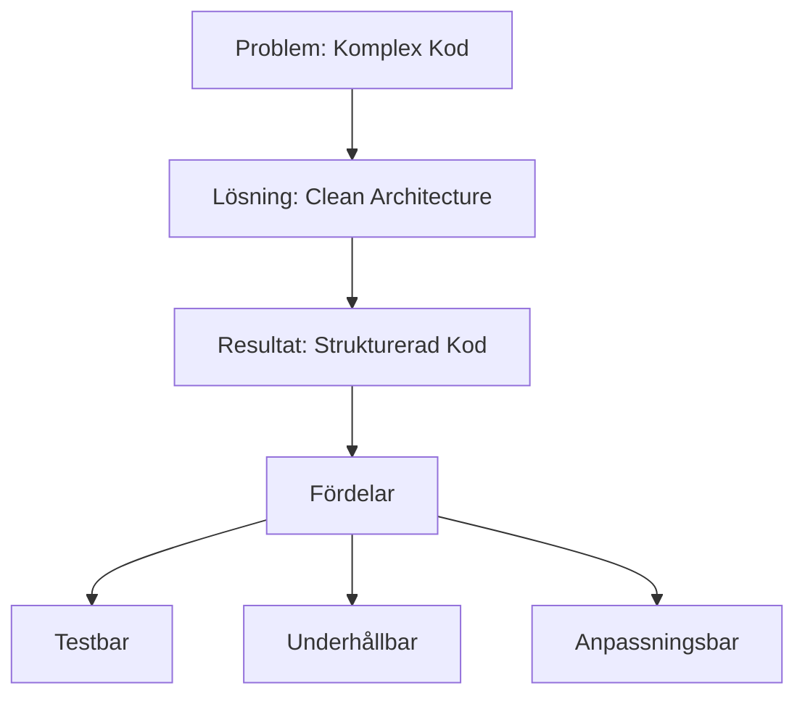
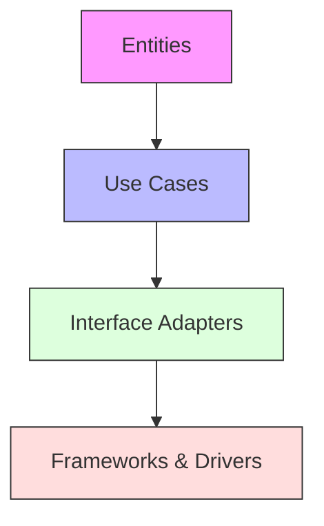

# 4. Clean Architecture

🟢


## Huvudfråga

Hur kan vi skapa mjukvara som är enkel att underhålla, testa och vidareutveckla genom att tillämpa Clean Architecture?

## Vad är Clean Architecture?

Clean Architecture är ett sätt att strukturera kod som fokuserar på att separera olika delar av en applikation baserat på deras ansvar. Detta gör koden:

- Lättare att testa
- Enklare att ändra
- Mer flexibel för framtida krav
- Oberoende av ramverk och externa system

## Varför Clean Architecture?

- Affärslogik hålls ren från tekniska detaljer
- Externa beroenden kan bytas ut enkelt
- Tester kan skrivas utan komplexa uppsättningar
- Nya funktioner kan läggas till utan att påverka befintlig kod

<div class="mermaid" style="zoom: 1.4;">



</div>

## Hur implementerar vi Clean Architecture?

### 1. Dela upp koden i lager

Clean Architecture delar upp koden i olika lager med tydliga ansvarsområden:

1. Entities (Innersta lagret)

- Innehåller företagets affärsregler och datastrukturer
- Oberoende av andra lager
- Exempel: Order, Customer, Product

2. Use Cases (Affärslogik)

- Innehåller applikationsspecifika affärsregler
- Orchestrerar flödet av data mellan entities
- Exempel: CreateOrder, ProcessPayment

3. Interface Adapters

- Konverterar data mellan use cases och externa format
- Innehåller controllers, presenters och gateways
- Exempel: REST controllers, databas repositories

4. Frameworks & Drivers (Yttersta lagret)

- Innehåller tekniska detaljer och ramverk
- Kommunicerar med externa system
- Exempel: Entity Framework Core, ASP.NET Core, UI

<div class="mermaid" style="zoom: 1.4;">



</div>

### 2. Implementera domänlagret först

**Vad är domänlagret?**
Domänlagret är kärnan i vår applikation. Det innehåller:

- Affärsregler som alltid måste gälla
- Grundläggande datastrukturer som representerar verksamheten
- Logik som är oberoende av tekniska detaljer

```csharp
// Domain Entity
public class Order
{
    public string Id { get; }
    public decimal Amount { get; }
    private OrderStatus Status { get; set; }

    public Order(string id, decimal amount)
    {
        Id = id;
        Amount = amount;
        Status = OrderStatus.Pending;
    }

    public void Confirm()
    {
        if (Status != OrderStatus.Pending)
        {
            throw new InvalidOperationException("Order must be pending to confirm");
        }
        Status = OrderStatus.Confirmed;
    }
}
```

### 3. Skapa use cases

**Use Case Interface och Implementation:**

```csharp
// Use Case Interface
public interface ICreateOrderUseCase
{
    Task<OrderResult> CreateOrderAsync(CreateOrderRequest request);
}

// Use Case Implementation
public class CreateOrderInteractor : ICreateOrderUseCase
{
    private readonly IOrderRepository _repository;
    private readonly IOrderPresenter _presenter;

    public CreateOrderInteractor(IOrderRepository repository, IOrderPresenter presenter)
    {
        _repository = repository ?? throw new ArgumentNullException(nameof(repository));
        _presenter = presenter ?? throw new ArgumentNullException(nameof(presenter));
    }

    public async Task<OrderResult> CreateOrderAsync(CreateOrderRequest request)
    {
        var order = new Order(Guid.NewGuid().ToString(), request.Amount);
        await _repository.SaveAsync(order);
        return await _presenter.PresentAsync(order);
    }
}
```

**15-minutersregeln:** Fastnar du i mer än 15 minuter — fråga klassen, sen AI, sen mig. I den ordningen.

### 4. Implementera adapters

```csharp
// Repository Interface
public interface IOrderRepository
{
    Task SaveAsync(Order order);
    Task<Order> FindByIdAsync(string id);
}

// Repository Implementation
public class EfOrderRepository : IOrderRepository
{
    private readonly OrderDbContext _context;

    public EfOrderRepository(OrderDbContext context)
    {
        _context = context ?? throw new ArgumentNullException(nameof(context));
    }

    public async Task SaveAsync(Order order)
    {
        var entity = OrderEntity.FromDomain(order);
        await _context.Orders.AddAsync(entity);
        await _context.SaveChangesAsync();
    }
}
```

## Praktisk Demonstration

```csharp
public class ECommerceDemo
{
    public static async Task Main()
    {
        // Setup dependency injection
        var services = new ServiceCollection()
            .AddScoped<IOrderRepository, InMemoryOrderRepository>()
            .AddScoped<IOrderPresenter, ConsoleOrderPresenter>()
            .AddScoped<ICreateOrderUseCase, CreateOrderInteractor>()
            .BuildServiceProvider();

        // Resolve dependencies
        var useCase = services.GetRequiredService<ICreateOrderUseCase>();

        // Skapa an order
        var request = new CreateOrderRequest { Amount = 99.99m };
        var result = await useCase.CreateOrderAsync(request);

        Console.WriteLine($"Order created: {result.OrderId}");
    }
}
```

[Fortsättning följer...]

---
Sådärja. Nu har du koll på det här. Nästa steg — testa själv. Det är då det fastnar.
