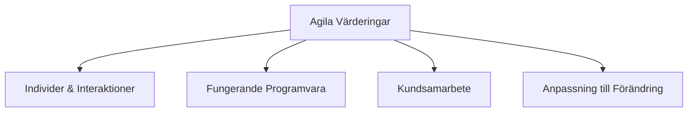
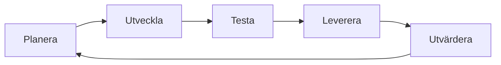

# Introduktion till Agila Metoder

🟢

## Modernisera mjukvaruutveckling genom agila principer

---

## Agenda

1. Det Agila Tankesättet
2. Agila Manifestet
3. Agila Principer i Praktiken
4. Praktiska Verktyg
5. Kanban & Visualisering
6. CI/CD Pipeline

---

## Varför Agilt?

**Problemen med traditionell utveckling:**

- 🕒 Långa utvecklingscykler
- 📝 Sen feedback
- 🔄 Svårt att hantera förändringar
- ⚠️ Hög risk för felinriktning

---

## Det Agila Manifestet

---

## Agila Värderingar i Praktiken

- **Individer & Interaktioner:** Daglig kommunikation
- **Fungerande Programvara:** Körbar kod
- **Kundsamarbete:** Kontinuerlig feedback
- **Anpassning:** Flexibel planering

---

## Iterativ Utveckling

---

## Sprintcykeln

- Korta utvecklingscykler (2-4 veckor)
- Regelbundna leveranser
- Återkommande ceremonier:
  - Sprint Planning
  - Daily Standup
  - Sprint Review
  - Retrospective

---

## Kanban - Visualisering av Arbete

---

## Kanban Principer

- Visualisera arbetsflödet
- Begränsa pågående arbete (WIP - Work In Progress)
- Hantera flödet
- Gör policies explicita
- Implementera feedbackloopar

---

## WIP-begränsningar

- **Syfte:** Optimera flödeseffektivitet
- **Fördelar:**
  - Minskar context switching
  - Ökar leveranshastighet
  - Identifierar flaskhalsar

---

## CI/CD Pipeline

---

## CI/CD Komponenter

- **Kontinuerlig Integration:**

  - Automatiserade byggen
  - Enhetstester
  - Kodkvalitetskontroller

- **Kontinuerlig Leverans:**
  - Automatiserad deployment
  - Miljökonfiguration
  - Säkerhetskontroller

---

## Agila Verktyg

- **Projekthantering:**

  - JIRA
  - Trello
  - Azure Boards

- **Versionshantering:**
  - Git
  - GitHub/GitLab

---

## Bästa Praktiker

- Dagliga standup-möten
- Sprint planning & review
- Retrospektiv
- Pair programming
- Code reviews
- Automatiserad testning

---

## Sammanfattning

- Agilt fokuserar på värdeleverans
- Iterativ utveckling med snabb feedback
- Visualisering av arbete genom Kanban
- Automatisering genom CI/CD
- Kontinuerlig förbättring

---

## Frågor att Reflektera Över

- Hur kan agila principer förbättra ditt nuvarande arbetssätt?
- Vilka första steg kan du ta mot en mer agil process?
- Var finns de största förbättringspotentialerna?

---
Sådärja. Nu har du koll på det här. Nästa steg — testa själv. Det är då det fastnar.
