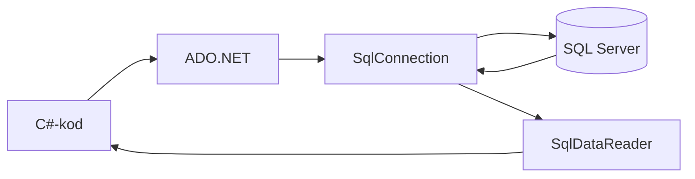
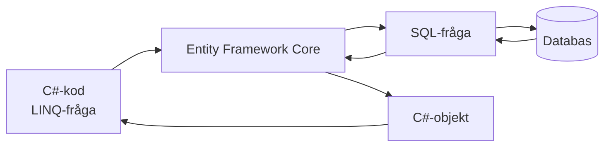
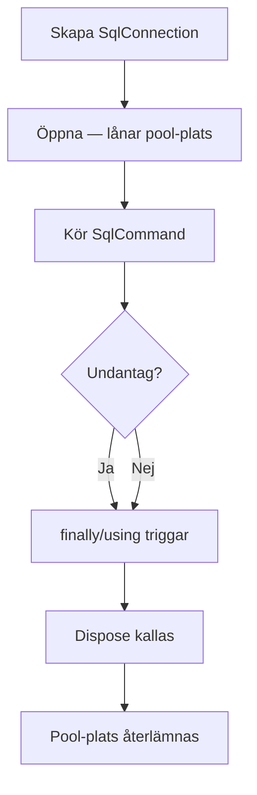

# 01 Databaskopplingar — Programmeringstermer

## ADO.NET

Microsofts äldre databastillgångsteknik för .NET. Du hanterar allt manuellt: öppna anslutning, skicka kommando, läsa resultat, stänga anslutning.

Tänk på det som att laga mat från grunden — du väljer varje ingrediens, tillagar allt själv och diskar efteråt. ORM är som att beställa matlåda färdiglagad.

```csharp
using var connection = new SqlConnection(connectionString);
connection.Open();
var command = new SqlCommand("SELECT * FROM Products", connection);
var reader = command.ExecuteReader();
while (reader.Read())
{
    Console.WriteLine(reader["Name"]);
}
```

ADO.NET ger dig full kontroll men kräver mer kod. Används fortfarande i prestandakritiska situationer eller när du behöver köra komplex rå SQL som en ORM inte kan generera bra nog.



---

## Connection String · Anslutningssträng

En sträng som innehåller all information som behövs för att hitta och logga in på en databas: server, databasnamn, användare och lösenord.

Det är som en nyckelknippa med adressen inskriven på etiketten — utan den hittar du inte databasen och kommer inte in.

```csharp
// I appsettings.json (ALDRIG i koden direkt)
// "ConnectionStrings": { "Default": "Server=localhost;Database=MyShop;..." }

// I C#-koden
string connectionString = configuration.GetConnectionString("Default")!;
```

Lagra aldrig connection strings direkt i koden — de hamnar då i Git-historiken för alltid. Använd `appsettings.json` eller miljövariabler. Om lösenordet läcker kan vem som helst komma åt databasen.

> 🖼️ **Bild:** Meme: "Connection string committad till GitHub" med brandkårs-gif — "This is fine"

---

## SqlConnection · Databasanslutning

Klass i ADO.NET som representerar en öppen kanal till din SQL Server-databas. Måste öppnas innan du kan göra något och stängas (eller dispose:as) efteråt.

Det är som en telefonlinje — du ringer upp (`Open`), pratar (kör kommandon) och lägger på (`Close`/`Dispose`). Lämnar du luren av locket hela natten är linjen blockerad.

```csharp
// using-nyckelordet stänger automatiskt, även vid undantag
using var connection = new SqlConnection(connectionString);
connection.Open();
// ... kör kommandon ...
// Anslutningen stängs här automatiskt
```

Glömmer du stänga anslutningar tar du slut på connection pool-platser och appen börjar hänga sig under last.

---

## SqlCommand · Databaskommando

Representerar en SQL-sats eller lagrad procedur som ska köras mot databasen. Du lägger in SQL-texten och eventuella parametrar här och väljer sedan hur du vill köra den.

Det är som ett brev du skickar till databasen — du skriver meddelandet (`CommandText`), lägger till bilagor (parametrar) och väljer om du vill ha svar tillbaka eller bara en bekräftelse.

```csharp
var command = new SqlCommand(
    "INSERT INTO Products (Name, Price) VALUES (@Name, @Price)",
    connection);
command.Parameters.AddWithValue("@Name", "Kaffemugg");
command.Parameters.AddWithValue("@Price", 49.90m);
int rowsAffected = command.ExecuteNonQuery(); // INSERT/UPDATE/DELETE
```

Tre sätt att köra ett kommando:
- `ExecuteNonQuery()` — INSERT, UPDATE, DELETE (returnerar antal påverkade rader)
- `ExecuteReader()` — SELECT som returnerar flera rader
- `ExecuteScalar()` — SELECT som returnerar ett enda värde (t.ex. `COUNT(*)`)

---

## SqlDataReader · Databasläsare

Läser resultat från en SELECT-fråga rad för rad, framåt. Du kan inte hoppa bakåt eller räkna rader i förväg — du läser en rad, hanterar den, läser nästa.

Det är som ett löpande band — produkterna passerar en i taget. Du plockar ut det du vill ha och de åker vidare. Du kan inte ta tillbaka en produkt som passerat.

```csharp
var reader = command.ExecuteReader();
while (reader.Read()) // Returnerar false när det inte finns fler rader
{
    int id = reader.GetInt32(0);       // Kolumn 0
    string name = reader.GetString(1); // Kolumn 1
    decimal price = reader.GetDecimal(reader.GetOrdinal("Price")); // Med namn
}
```

`SqlDataReader` är snabb och minneseffektiv eftersom den inte laddar hela resultatet på en gång. Bra för stora datamängder. Men om du behöver hoppa runt i resultatet är en `List<T>` bättre.

---

## Parameterized Query · Parametriserad fråga

SQL-fråga där variabla värden skickas som separata parametrar (`@param`) istället för att klistras in i SQL-strängen. Den viktigaste säkerhetstekniken för databaskod.

Det är som skillnaden mellan att fylla i ett formulär (säkert — data och format är separata) och att skriva ett brev för hand med personens input inbäddad (farligt — vad händer om de skriver `; radera allt`?).

```csharp
// FARLIGT — SQL injection möjlig
string sql = "SELECT * FROM Users WHERE Name = '" + userName + "'";

// SÄKERT — parametriserat
var cmd = new SqlCommand("SELECT * FROM Users WHERE Name = @Name", conn);
cmd.Parameters.AddWithValue("@Name", userName);
```

En attackerare kan mata in `' OR '1'='1` som användarnamn och få tillgång till alla konton, eller `'; DROP TABLE Users; --` för att radera databasen. Parametrisering förhindrar det helt.

> 🖼️ **Bild:** xkcd #327 — "Little Bobby Tables" — den klassiska SQL injection-serien om en mamma vars son heter `Robert'); DROP TABLE Students;--`

---

## ORM · Object-Relational Mapping

Teknik som automatiskt mappar databastabeller till C#-klasser och vice versa. Du arbetar med vanliga C#-objekt och metoder — ORM:en sköter SQL-generering och tabellmappning.

Tänk på det som en tolk — du pratar C# och ORM:en översätter till SQL och tillbaka. Du behöver inte kunna flytande SQL för att komma igång.

```csharp
// Med Entity Framework Core — ingen SQL behövs
var products = await context.Products
    .Where(p => p.Price < 100)
    .OrderBy(p => p.Name)
    .ToListAsync();

// Tillägg — EF genererar SQL automatiskt:
// SELECT * FROM Products WHERE Price < 100 ORDER BY Name
```

ORM:er sparar massor av kod men kan generera ineffektiv SQL om du inte förstår vad som händer under huven. Lär dig granska den SQL som genereras — Entity Framework har en inbyggd loggfunktion för det.



---

## Dapper · Micro-ORM

Lättviktig ORM-variant skapad av Stack Overflow-teamet. Du skriver SQL själv, men Dapper mappar resultatet automatiskt till dina C#-klasser — du slipper den manuella rad-för-rad-läsningen.

Det är som halvfabrikat i köket — du skriver fortfarande receptet (SQL) men slipper plocka ihop allt för hand. Snabbare än att laga från grunden, men du behöver ändå veta vad du lagar.

```csharp
using var connection = new SqlConnection(connectionString);

// Dapper mappar automatiskt kolumner till egenskaper
var products = await connection.QueryAsync<Product>(
    "SELECT Id, Name, Price FROM Products WHERE Price < @MaxPrice",
    new { MaxPrice = 100 });

foreach (var product in products)
    Console.WriteLine($"{product.Name}: {product.Price} kr");
```

| | ADO.NET | Dapper | Entity Framework |
|--|---------|--------|-----------------|
| SQL-kontroll | Full | Full | Genereras automatiskt |
| Boilerplate | Mycket | Lite | Minimal |
| Prestanda | Snabbast | Snabb | Kan variera |
| Lärtröskel | Hög | Låg | Medel |

---

## Connection Pooling · Anslutningspoolen

.NET håller automatiskt en pool av förberedda databasanslutningar redo, så att appen slipper öppna en ny TCP-anslutning till databasen varje gång. Att "öppna" en anslutning i koden betyder egentligen att låna en plats från poolen.

Det är som en taxiflotta som alltid är parkerad utanför kontoret — du hoppar in, åker dit du ska och bilen återvänder till poolen. Du beställer inte en ny bil från fabrik varje gång.

Sker automatiskt i bakgrunden — du behöver inte göra något för att aktivera det. Det är precis därför `using var conn = new SqlConnection(...)` är snabbt: du lånar och återlämnar en pool-plats, du skapar inte en riktig TCP-anslutning varje gång.

> 🖼️ **Bild:** Diagram som visar Connection Pool som en parkeringsplats med 10 bilar och app-trådar som "kör iväg" och returnerar bilar

---

## Dispose Pattern · Resursfrigörning

C#-mönster för att frigöra resurser som operativsystemet håller öppen — databasanslutningar, filhandtag, nätverkssockets. Klasser som hanterar sådana resurser implementerar `IDisposable` med en `Dispose()`-metod.

Det är som att lämna tillbaka en bibliokbok — du är klar med den, du lämnar tillbaka platsen åt nästa person. Glömmer du lämna tillbaka böckerna (anslutningarna) tar biblioteket (poolen) slut.

```csharp
// Utan using — farligt, lätt att glömma
var conn = new SqlConnection(connectionString);
try
{
    conn.Open();
    // arbeta
}
finally
{
    conn.Dispose(); // Måste kallas även vid undantag
}

// Med using — garanterat, alltid
using var conn = new SqlConnection(connectionString);
conn.Open();
// arbeta
// Dispose kallas automatiskt här, även om ett undantag kastas ovan
```

Använd alltid `using` för `SqlConnection`, `SqlCommand`, `SqlDataReader` och liknande resurser. Det är inte bara stil — det är korrekthet.


