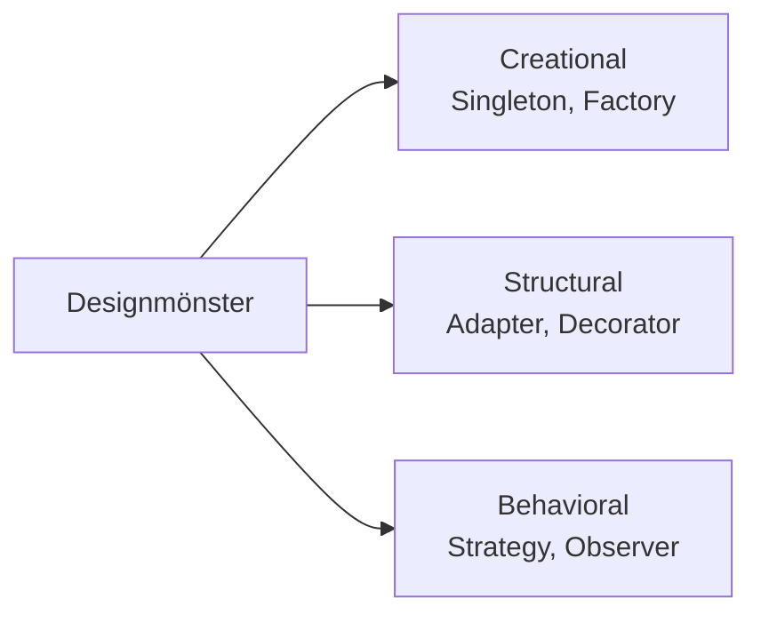
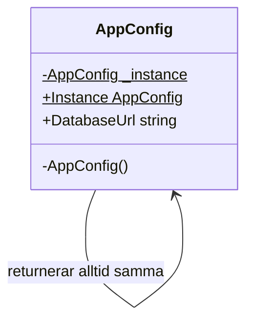
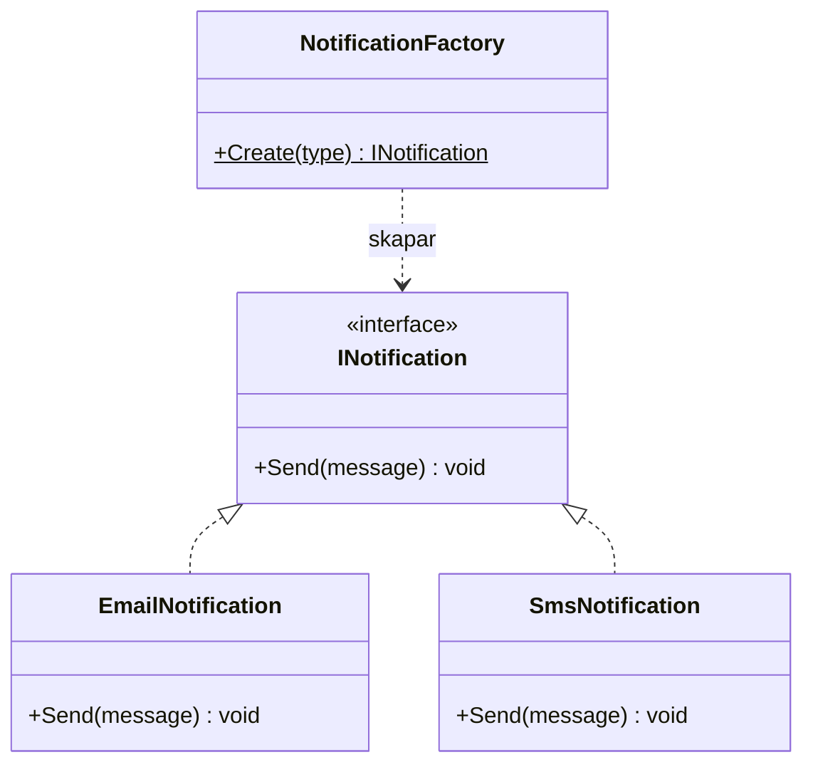
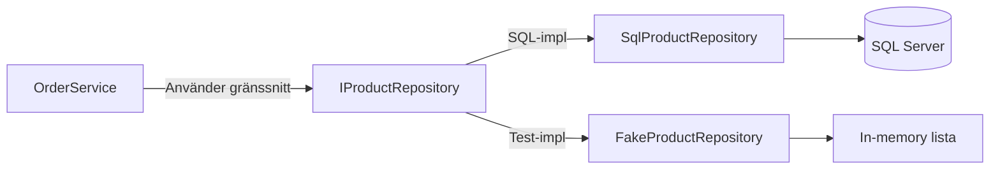
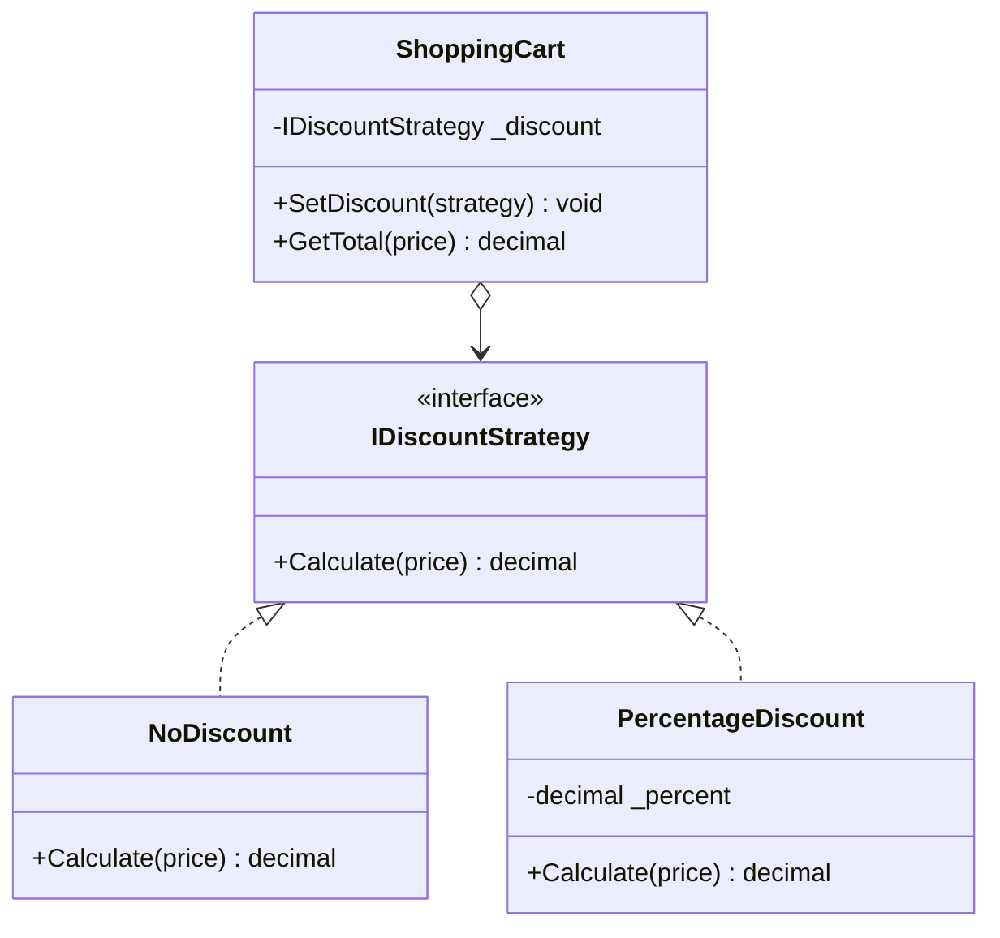
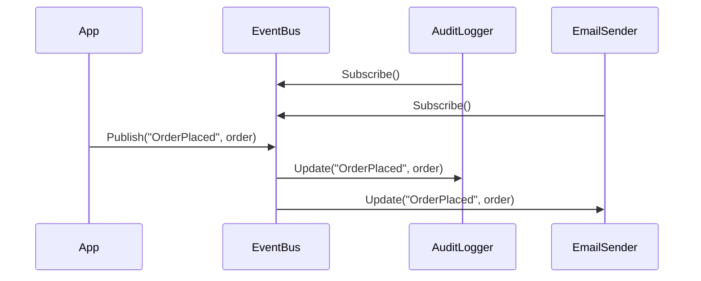
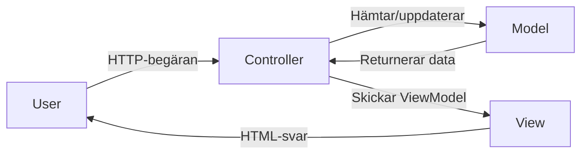

# 02 Designmönster — Programmeringstermer

## Design Pattern · Designmönster

En beprövad, återanvändbar lösning på ett vanligt förekommande problem i mjukvarudesign. Inte en färdig kodsnutt du kopierar — en mall för hur du strukturerar lösningen.

Tänk på det som IKEA-instruktioner — du sätter ihop möbeln på det beskrivna sättet, men träet och skruvarna (koden) är dina egna. Alla som kan IKEA-instruktioner förstår omedelbart strukturen.

Det finns 23 klassiska mönster från "Gang of Four"-boken (1994). De delas in i tre kategorier: creational (hur objekt skapas), structural (hur klasser kopplas ihop) och behavioral (hur objekt kommunicerar).



> 🖼️ **Bild:** Bokomslaget för "Design Patterns: Elements of Reusable Object-Oriented Software" (Gang of Four, 1994) — ett av de mest inflytelserika böckerna inom programmering

---

## Singleton

Creational pattern som garanterar att det bara finns exakt en instans av en klass i hela applikationen, med en global åtkomstpunkt till den.

Det är som chefsrollen på ett kontor — det finns bara en VD. Alla som behöver kontakta VD:n ringer samma nummer. Du skapar aldrig en till VD.

```csharp
public sealed class AppConfig
{
    private static AppConfig? _instance;
    private static readonly object _lock = new();

    private AppConfig() { } // Privat konstruktor — ingen kan new:a utifrån

    public static AppConfig Instance
    {
        get
        {
            lock (_lock)
                return _instance ??= new AppConfig();
        }
    }

    public string DatabaseUrl { get; set; } = "";
}

// Användning — alltid samma instans
AppConfig.Instance.DatabaseUrl = "localhost";
Console.WriteLine(AppConfig.Instance.DatabaseUrl);
```



Singleton används för konfiguration, logging och delade resurser. Varning: för mycket Singleton-användning gör koden svår att testa — du kan inte enkelt byta ut instansen i ett test.

---

## Factory Method · Fabriksmetod

Creational pattern som definierar ett gränssnitt för att skapa objekt, men överlåter till en separat fabriksklass (eller subklass) att bestämma vilken konkret klass som skapas.

Det är som att beställa mat på restaurang — du säger "jag vill ha pasta" och köksmästaren (fabriken) bestämmer exakt hur den lagas. Du behöver inte veta receptet.

```csharp
public interface INotification
{
    void Send(string message);
}

public class EmailNotification : INotification
{
    public void Send(string message) =>
        Console.WriteLine($"E-post: {message}");
}

public class SmsNotification : INotification
{
    public void Send(string message) =>
        Console.WriteLine($"SMS: {message}");
}

public static class NotificationFactory
{
    public static INotification Create(string type) => type switch
    {
        "email" => new EmailNotification(),
        "sms"   => new SmsNotification(),
        _ => throw new ArgumentException($"Okänd typ: {type}")
    };
}

// Användning — koden vet inte vilken klass som skapas
var notification = NotificationFactory.Create("email");
notification.Send("Välkommen till kursen!");
```



Utan Factory-pattern sprids `new EmailNotification()` ut i hela koden. Lägger du till `PushNotification` senare måste du ändra på hundra ställen. Med fabriken ändrar du bara ett ställe.

---

## Repository Pattern · Förvaringsmönster

Abstraktionslager mellan din applikationslogik och databasen. All databaskommunikation sker via repository-klassen — resten av koden vet inte om det är SQL, en fil eller ett API under huven.

Tänk på det som en bibliotekarie — du ber om en bok (data), och bibliotekarien hämtar den. Du behöver inte veta om boken är i källaren, på hyllan eller måste beställas hem.

```csharp
// Kontraktet — vad repository:t kan göra
public interface IProductRepository
{
    Product? GetById(int id);
    IEnumerable<Product> GetAll();
    void Add(Product product);
    void Delete(int id);
}

// SQL-implementationen
public class SqlProductRepository : IProductRepository
{
    private readonly string _connectionString;

    public SqlProductRepository(string connectionString) =>
        _connectionString = connectionString;

    public IEnumerable<Product> GetAll()
    {
        using var conn = new SqlConnection(_connectionString);
        // SQL här — ingenting utanför vet om det
        return new List<Product>(); // Placeholder
    }
    // ... övriga metoder
}

// I tester — byt mot en fake utan att ändra OrderService
public class FakeProductRepository : IProductRepository
{
    private readonly List<Product> _data = new();
    public IEnumerable<Product> GetAll() => _data;
    // ...
}
```



Utan Repository-mönster sprids SQL-anrop ut i hela applikationen. Med mönstret kan du byta databas, och i tester byta mot en in-memory-lista — utan att ändra ett enda ställe utanför repository-klassen.

> 🖼️ **Bild:** Lagerbild: UI → Service → Repository → Databas, med Repository som en "buffert" som isolerar databaslogiken

---

## Strategy Pattern · Strategimönster

Behavioral pattern som låter dig byta ut en algoritm vid runtime. Varje algoritm kapslas in i sin egen klass som implementerar ett gemensamt gränssnitt — du väljer vilken som ska användas.

Det är som att välja navigationsapp — du väljer Google Maps, Waze eller Apple Maps, men resultatet är detsamma: vägbeskrivning. Bilen (systemet) bryr sig inte om vilken app du valt.

```csharp
public interface IDiscountStrategy
{
    decimal Calculate(decimal price);
}

public class NoDiscount : IDiscountStrategy
{
    public decimal Calculate(decimal price) => price;
}

public class PercentageDiscount : IDiscountStrategy
{
    private readonly decimal _percent;
    public PercentageDiscount(decimal percent) => _percent = percent;
    public decimal Calculate(decimal price) => price * (1 - _percent / 100);
}

public class ShoppingCart
{
    private IDiscountStrategy _discount = new NoDiscount();

    public void SetDiscount(IDiscountStrategy strategy) =>
        _discount = strategy;

    public decimal GetTotal(decimal price) =>
        _discount.Calculate(price);
}

// Byt strategi vid runtime
var cart = new ShoppingCart();
cart.SetDiscount(new PercentageDiscount(20)); // 20% rabatt
Console.WriteLine(cart.GetTotal(100m)); // 80 kr
```



Utan Strategy-mönster slutar du med en lång switch-sats för varje rabatttyp. Varje ny rabattyp kräver ändringar i den centrala klassen — en brott mot Open/Closed-principen.

---

## Observer Pattern · Observatörsmönster

Behavioral pattern där ett objekt (subject/publisher) håller en lista av observatörer (subscribers) och automatiskt notifierar dem när dess tillstånd förändras.

Det är som ett nyhetsbrev — du prenumererar, och varje gång det publiceras något nytt får alla prenumeranter ett mail automatiskt. Nyhetsbrevet vet inte exakt vad du gör med mailet — det skickar bara.

```csharp
public interface IObserver
{
    void Update(string eventName, object data);
}

public class EventBus
{
    private readonly List<IObserver> _observers = new();

    public void Subscribe(IObserver observer) =>
        _observers.Add(observer);

    public void Unsubscribe(IObserver observer) =>
        _observers.Remove(observer);

    public void Publish(string eventName, object data)
    {
        foreach (var observer in _observers)
            observer.Update(eventName, data);
    }
}

public class AuditLogger : IObserver
{
    public void Update(string eventName, object data) =>
        Console.WriteLine($"[AUDIT] {eventName}: {data}");
}
```



Observer-mönstret är grunden bakom händelsehantering (`event`/`delegate` i C#), React-komponenter, meddelandeköer och prenumerationsmodeller.

---

## Dependency Injection · Beroendeinjektion

Teknik där ett objekts beroenden (de klasser det behöver) skickas in utifrån istället för att objektet skapar dem själv. Gör koden löst kopplad och enkel att testa och byta ut.

Tänk på det som att beställa pizza — restaurangen (DI-containern) levererar det du behöver. Du skapar inte pizzan inne i ditt vardagsrum.

```csharp
// UTAN DI — hårt kopplad, svår att testa
public class OrderService
{
    private SqlProductRepository _repo = new SqlProductRepository("..."); // Skapar själv
}

// MED DI — löst kopplad, lätt att testa
public class OrderService
{
    private readonly IProductRepository _repo;

    public OrderService(IProductRepository repo) // Injiceras utifrån
    {
        _repo = repo;
    }
}

// I Program.cs — registrera tjänster i DI-containern
builder.Services.AddScoped<IProductRepository, SqlProductRepository>();
// Nu skapar ASP.NET Core automatiskt SqlProductRepository och
// skickar in den i OrderService:s konstruktor
```

DI gör att du enkelt kan byta `SqlProductRepository` mot en `FakeProductRepository` i tester — utan att ändra ett enda ställe i `OrderService`. Det är den praktiska vinsten med löst kopplad kod.

> 🖼️ **Bild:** Diagram som visar konstruktorparameter som en "stickpropp" — olika implementationer kan kopplas in

---

## MVC Pattern · Model-View-Controller

Arkitekturmönster som delar in en applikation i tre ansvarsområden: data och affärslogik (Model), presentation (View) och koordinering (Controller).

Det är som en restaurang — kassen (Controller) tar din order, hämtar maten från köket (Model) och lägger upp den snyggt på tallriken (View) som serveras till dig.



```csharp
// Model — bara data och logik, ingen HTML
public class Product
{
    public int Id { get; set; }
    public string Name { get; set; } = "";
    public decimal Price { get; set; }
}

// Controller — koordinerar
public class ProductsController : Controller
{
    private readonly IProductRepository _repo;
    public ProductsController(IProductRepository repo) => _repo = repo;

    public IActionResult Index()
    {
        var products = _repo.GetAll(); // Hämtar från Model-lagret
        return View(products);          // Skickar till View
    }
}
// View — bara presentation (Razor .cshtml-filen)
```

ASP.NET Core MVC, Blazor och de flesta moderna webbramverk bygger på varianter av MVC. Bryter du separationen — lägger databaslogik i View eller HTML i Model — blir koden snabbt omöjlig att underhålla.

---

## SOLID

Fem designprinciper som, tillsammans, gör kod mer underhållbar, testbar och flexibel. Inte ett mönster — riktlinjer att styra besluten med.

Tänk på SOLID som trafiklagar för kod — du kan köra utan dem, men det slutar illa och det drabbar andra.

| Bokstav | Princip | Kort förklaring |
|---------|---------|----------------|
| **S** | Single Responsibility | En klass = ett ansvarsområde |
| **O** | Open/Closed | Öppen för utökning, stängd för ändring |
| **L** | Liskov Substitution | Subklasser ska kunna ersätta sina föräldrar |
| **I** | Interface Segregation | Hellre många specifika gränssnitt än ett stort |
| **D** | Dependency Inversion | Beroende på abstraktioner, inte konkreta klasser |

```csharp
// S — Single Responsibility
// BAD: Report-klassen gör ALLT
public class Report
{
    public void Generate() { }
    public void SaveToFile() { }
    public void SendEmail() { }
}

// GOOD: dela upp ansvaret
public class ReportGenerator { public void Generate() { } }
public class ReportExporter  { public void SaveToFile() { } }
public class ReportMailer    { public void SendEmail() { } }
```

> 🖼️ **Bild:** Whiteboard med SOLID-bokstäverna och en enkel illustration per princip

---

## Anti-pattern · Antimönster

En vanlig lösning på ett återkommande problem som verkar rimlig i stunden men som faktiskt skapar mer problem än den löser. Det är det motsatta till ett designmönster.

Det är som att ta genvägen genom grannens trädgård varje dag — det sparar tid till en början, men grannrelationen (systemet) försämras gradvis tills det slutar fungera.

| Anti-pattern | Vad det är | Symptom |
|-------------|-----------|---------|
| **God Object** | En klass som gör allt, vet allt | Filen är 2000 rader lång |
| **Spaghetti Code** | Kod utan struktur, logiken hopar sig | Omöjligt att följa flödet |
| **Magic Numbers** | Hårdkodade siffror utan förklaring | `if (score > 42)` — varför 42? |
| **Copy-Paste Programming** | Duplicerad kod istället för extraktion | Samma bugg på 8 ställen |
| **Premature Optimization** | Optimera innan du vet var flaskhalsen är | Snabb kod som ingen förstår |

```csharp
// Magic numbers — dåligt
if (user.Age > 18 && user.Points > 1000)
    GiveDiscount(0.15m);

// Namngivna konstanter — bra
private const int MinimumAge    = 18;
private const int LoyaltyPoints = 1000;
private const decimal LoyaltyDiscount = 0.15m;

if (user.Age > MinimumAge && user.Points > LoyaltyPoints)
    GiveDiscount(LoyaltyDiscount);
```

Om du hittar ett anti-pattern i befintlig kod är det ett tecken på att refactoring behövs — inte att du är en dålig programmerare. Alla har skrivit dessa.
