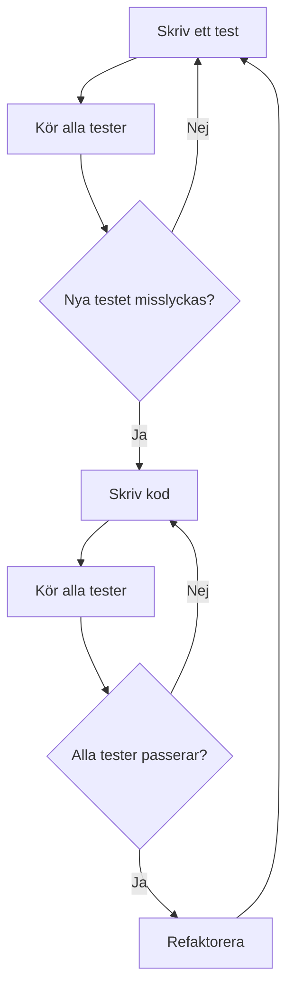

# 1. Introduktion till Testdriven utveckling (TDD)

🔴


## Introduktion

Tänk dig att du är en utvecklare som just har avslutat ett stort projekt. Koden fungerar, men det är svårt att göra ändringar utan att något går sönder. Varje gång du fixar en bugg, dyker två nya upp. Låter det bekant? Detta är en vanlig situation som många utvecklare hamnar i, och det är här Testdriven utveckling (TDD) kommer in i bilden.

### Varför är detta viktigt?

TDD är inte bara en teknik för att skriva tester; det är en fundamental förändring i hur vi närmar oss mjukvaruutveckling. Genom att skriva tester först:

- Säkerställer vi att koden gör exakt det vi förväntar oss
- Skapar vi automatiskt en omfattande testsvit som skyddar mot regressioner
- Tvingas vi att tänka igenom designen innan vi börjar koda
- Producerar vi mer modulär och mindre kopplad kod

I denna lektion kommer du att lära dig grunderna i TDD, hur det relaterar till dina befintliga kunskaper om enhetstestning med JUnit5, och hur du kan integrera det i ditt agila arbetsflöde.

### Översikt över vad du kommer att lära dig

1. Grundläggande principer för TDD
2. Red-Green-Refactor-cykeln
3. Praktisk tillämpning av TDD med JUnit5
4. Integration av TDD i agila utvecklingsprocesser

### Koppling till tidigare kunskap

Du har redan erfarenhet av att skriva enhetstester med JUnit5. TDD bygger vidare på denna kunskap genom att ändra ordningen i vilken du skriver tester och kod. Din förståelse för SOLID-principerna kommer också att vara värdefull, eftersom TDD naturligt leder till kod som följer dessa principer.

## Konceptuell förståelse

### Grundläggande principer för TDD

TDD följer en enkel men kraftfull cykel:

1. Skriv ett test som definierar en önskad förbättring eller ny funktion
2. Kör alla tester och se det nya testet misslyckas
3. Skriv den enklaste koden som får testet att passera
4. Kör alla tester och se dem passera
5. Refaktorera koden

Detta kan visualiseras med följande diagram:



### Hur fungerar det?

1. **Skriv ett test**: Börja med att skriva ett test som definierar hur du vill att din kod ska fungera. Detta test kommer att misslyckas eftersom koden ännu inte existerar.

2. **Kör testet**: Kör testet för att bekräfta att det misslyckas. Detta säkerställer att ditt test faktiskt testar något.

3. **Skriv kod**: Implementera den minsta mängd kod som krävs för att få testet att passera. Fokusera på att lösa det specifika problemet, inte på att skapa en perfekt lösning.

4. **Kör testet igen**: Kör testet igen för att se om din implementation fungerar. Om inte, justera koden tills testet passerar.

5. **Refaktorera**: När testet passerar, titta på din kod och se om du kan förbättra den utan att ändra dess beteende. Detta är din chans att rensa upp och optimera.

### Vanliga missuppfattningar

1. **"TDD tar för lång tid"**: Initialt kan TDD kännas långsamt, men det sparar ofta tid i längden genom färre buggar och enklare underhåll.

2. **"Jag måste skriva tester för allt"**: Fokusera på att testa kritisk affärslogik och komplexa algoritmer. Inte allt behöver testas.

3. **"TDD ersätter andra former av testning"**: TDD kompletterar, men ersätter inte, andra testmetoder som integrationstester och användartester.

## Praktisk implementation

### Steg-för-steg guide med JUnit5

Låt oss implementera en enkel strängomvändare med TDD:

1. Skriv testet först:

```java
import org.junit.jupiter.api.Test;
import static org.junit.jupiter.api.Assertions.*;

public class StringReverserTest {
    @Test
    void shouldReverseString() {
        StringReverser reverser = new StringReverser();
        assertEquals("olleH", reverser.reverse("Hello"));
    }
}
```

2. Kör testet och se det misslyckas (Red)

3. Implementera minimal kod för att få testet att passera:

```java
public class StringReverser {
    public String reverse(String input) {
        return new StringBuilder(input).reverse().toString();
    }
}
```

4. Kör testet igen och se det passera (Green)

5. Refaktorera om nödvändigt (i detta fall behövs ingen refaktorering)

### Best Practices

- Skriv ett test i taget
- Håll testerna små och fokuserade
- Använd beskrivande testnamn
- Testa edge cases (t.ex. tom sträng, null)

### Felsökningsguide

- Om ett test oväntat passerar, kontrollera att det faktiskt testar rätt sak
- Om du fastnar med implementationen, överväg att bryta ner problemet i mindre delar
- Om refaktorering bryter tester, gå tillbaka till den senaste fungerande versionen och gör mindre ändringar

### Optimeringstips

- Använd parameteriserade tester för att testa flera scenarier
- Gruppera relaterade tester i testklasser
- Använd @BeforeEach för att sätta upp gemensamt tillstånd för tester

## Avancerade koncept

### Reella användningsfall

TDD är särskilt användbart i följande scenarier:

- Utveckling av komplexa algoritmer
- Refaktorering av legacy-kod
- Implementering av kritiska affärsregler

### Prestandaöverväganden

- TDD kan leda till mer modulär kod, vilket ofta är lättare att optimera
- Var uppmärksam på att inte övertesta, vilket kan leda till långsammare byggen

### Säkerhetsaspekter

- TDD kan hjälpa till att identifiera säkerhetsbrister tidigt i utvecklingsprocessen
- Skriv specifika tester för säkerhetskrav

### Skalbarhetsfrågor

- TDD främjar lös koppling, vilket gör det lättare att skala system
- Använd mockningar för att testa komponenter i isolation

## Sammanfattning och reflektion

### Nyckelkoncept

- TDD innebär att skriva tester före implementationen
- Red-Green-Refactor-cykeln är kärnan i TDD
- TDD leder ofta till mer testbar och modulär kod
- Integration med JUnit5 gör TDD praktiskt i Java-projekt

### Tänk på

- TDD är en färdighet som tar tid att bemästra
- Balansera mellan att skriva tester och att leverera funktionalitet
- TDD är ett verktyg, inte en silver bullet - använd det där det ger mest värde

### Fördjupningsfrågor

1. Hur skulle du tillämpa TDD i ett befintligt projekt med lite eller ingen testning?
2. På vilka sätt kan TDD påverka systemarkitekturen?
3. Hur kan TDD integreras i en Continuous Integration/Continuous Deployment (CI/CD) pipeline?

### Koppling till nästa ämne

I nästa lektion kommer vi att utforska hur TDD kan kombineras med SOLID-principerna för att skapa ännu mer robust och underhållbar kod.

## Fördjupning: TDD och Legacy-kod

Legacy-kod utan tester är en vanlig utmaning. Här är en strategi för att införa TDD i sådana projekt:

1. Identifiera "seams" (sömmarna) i koden där du kan införa tester
2. Skriv karakteriserande tester som dokumenterar nuvarande beteende
3. Refaktorera gradvis med stöd av de nya testerna
4. Börja använda TDD för ny funktionalitet

Detta tillvägagångssätt, känt som "strangling the monolith", låter dig gradvis förbättra kodkvaliteten utan att behöva göra en fullständig omskrivning.

> **Expertkommentar:**
> "När jag arbetar med legacy-system, börjar jag alltid med att skriva tester som fångar det nuvarande beteendet, även om det är felaktigt. Detta ger mig ett säkerhetsnät för refaktorering och gör det möjligt att gradvis förbättra systemet utan att riskera oväntade sidoeffekter." - Martin Fowler, författare av "Refactoring"

## Fördjupning: TDD och Microservices

TDD är särskilt värdefullt vid utveckling av microservices:

1. Definiera service-gränssnitten genom tester
2. Använd kontraktstestning för att säkerställa kompatibilitet mellan tjänster
3. Implementera mocking för att isolera tjänster under testning
4. Använd TDD för att driva fram en ren domänmodell inom varje tjänst

> **Expertkommentar:**
> "I en microservice-arkitektur blir gränssnitten mellan tjänsterna kritiska. TDD hjälper oss att definiera och upprätthålla dessa gränssnitt på ett robust sätt, vilket minskar friktionen i utvecklingsprocessen och gör det lättare att utveckla tjänster oberoende av varandra." - Sam Newman, författare av "Building Microservices"

## Referenser och vidare läsning

1. "Test Driven Development: By Example" av Kent Beck
2. "Clean Code: A Handbook of Agile Software Craftsmanship" av Robert C. Martin
3. "Working Effectively with Legacy Code" av Michael Feathers
4. "Growing Object-Oriented Software, Guided by Tests" av Steve Freeman och Nat Pryce
5. "Effective Unit Testing" av Lasse Koskela

Dessa resurser ger en djupare förståelse för TDD och hur det kan tillämpas i olika scenarier. De täcker både teoretiska koncept och praktiska tekniker som du kan använda för att förbättra din TDD-praxis.

---
Och kom ihåg: allt vi gått igenom här är grunden. Resten bygger på det. Så var inte rädd att experimentera.
