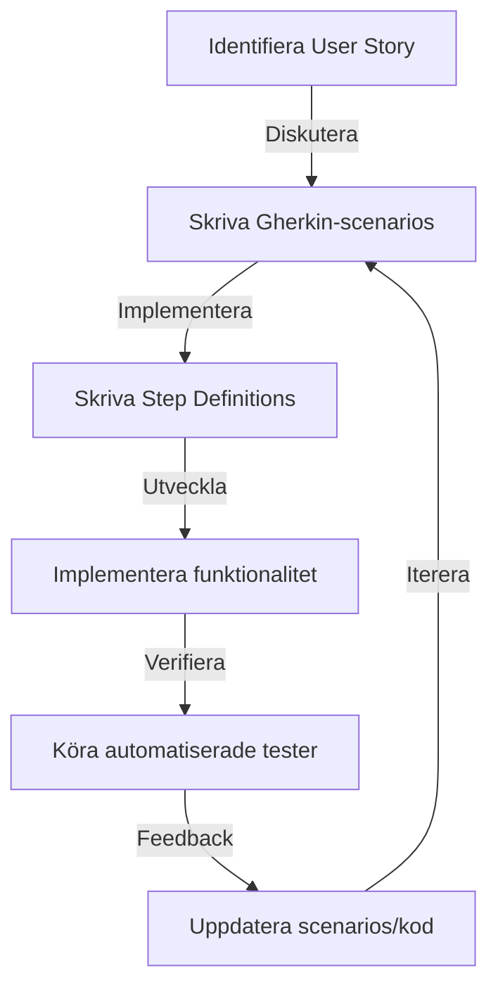

---

title: 2. Introduktion till BDD och Gherkin-syntax
author: Marcus Ackre Medina
type: lecture
topic: testing
difficulty: 3
language: csharp
status: adapted
marcus_voice: true
source: "Old_courses/2025/csharp/4_test/lectures/08_user_story_and_acceptance_criteria/2_introduktion_till_bdd_och_gherkin-syntax.md"
description: "I föregående avsnitt lärde vi oss om User Stories och acceptanskriterier som kraftfulla verktyg för att fånga användarbehov och definiera önskat beteende i mjukvaruutveckling. Nu tar vi steget vidare "
tags: ["bdd", "csharp", "gherkin", "gherkin-syntax", "git", "installation", "syntax", "testing", "till"]
week_fit: []
---

# 2. Introduktion till BDD och Gherkin-syntax

🔴


## Introduktion

I föregående avsnitt lärde vi oss om User Stories och acceptanskriterier som kraftfulla verktyg för att fånga användarbehov och definiera önskat beteende i mjukvaruutveckling. Nu tar vi steget vidare och utforskar hur vi kan omvandla dessa beskrivningar till exekverbara specifikationer genom Behavior-Driven Development (BDD) och Gherkin-syntax.

Tänk dig följande scenario: Ett utvecklingsteam har just levererat en ny funktion baserad på en välskriven User Story med tydliga acceptanskriterier. Trots detta rapporterar QA-teamet flera avvikelser från det förväntade beteendet. Utvecklarna hävdar att de har följt specifikationerna, medan produktägaren insisterar på att funktionen inte möter användarnas behov. Hur kan vi undvika sådana missförstånd och säkerställa att alla inblandade har samma förståelse för vad som ska byggas?

### Varför är detta viktigt?

BDD och Gherkin-syntax erbjuder en lösning på detta vanliga problem genom att:

1. Skapa ett gemensamt språk mellan tekniska och icke-tekniska intressenter.
2. Möjliggöra automatisering av acceptanstester direkt från specifikationerna.
3. Fungera som levande dokumentation som alltid är uppdaterad.
4. Främja samarbete och tidig feedback i utvecklingsprocessen.

### Översikt över vad du kommer att lära dig

I denna del kommer du att:

- Förstå grunderna i Behavior-Driven Development (BDD)
- Lära dig Gherkin-syntax och dess nyckelord
- Se hur BDD och Gherkin integreras med C# och .NET
- Utforska verktyg som SpecFlow för att implementera BDD i C#-projekt
- Lära dig best practices för att skriva effektiva BDD-scenarier

### Koppling till tidigare kunskap

Våra tidigare kunskaper om User Stories och acceptanskriterier lägger grunden för BDD. Nu kommer vi att se hur vi kan ta dessa koncept ett steg längre genom att använda ett strukturerat format (Gherkin) som kan automatiseras. Detta bygger vidare på våra C#-kunskaper och tidigare erfarenheter av enhetstestning med MSTestV2, men introducerar ett nytt lager av abstraktioner som kopplar ihop affärskrav med teknisk implementation.

## Konceptuell förståelse

### Grundläggande principer för BDD och Gherkin

Behavior-Driven Development (BDD) är en agil utvecklingsprocess som fokuserar på att definiera systemets beteende genom exempel, skrivna i ett format som både tekniska och icke-tekniska intressenter kan förstå och verifiera. Gherkin är det strukturerade språk som används för att beskriva dessa exempel eller scenarier.

Gherkin använder nyckelord som:

- **Given**: Beskriver systemets initiala tillstånd
- **When**: Specificerar en händelse eller aktion
- **Then**: Beskriver det förväntade resultatet

Ett enkelt exempel på ett Gherkin-scenario:

```gherkin
Feature: Användarregistrering

Scenario: Framgångsrik registrering av ny användare
  Given att användaren är på registreringssidan
  When användaren fyller i giltiga uppgifter
  And klickar på "Registrera"-knappen
  Then ska systemet skapa ett nytt användarkonto
  And visa ett välkomstmeddelande
```

**15-minutersregeln:** Fastnar du i mer än 15 minuter — fråga klassen, sen AI, sen mig. I den ordningen.

### Visuell förklaring: BDD-processen



### Hur fungerar det?

1. **Identifiera User Story**: Utgå från en User Story som beskriver en önskad funktionalitet.

2. **Skriva Gherkin-scenarios**: Tillsammans med intressenter, omvandla acceptanskriterier till Gherkin-scenarios.

3. **Skriva Step Definitions**: Utvecklare skapar C#-kod som mappar Gherkin-stegen till faktiska testmetoder.

4. **Implementera funktionalitet**: Utveckla den faktiska funktionaliteten baserat på scenarierna.

5. **Köra automatiserade tester**: Använd BDD-verktyg som SpecFlow för att exekvera scenarierna som automatiserade tester.

6. **Feedback och iteration**: Baserat på testresultaten, uppdatera scenarios eller kod vid behov.

### Vanliga missuppfattningar och klargöranden

1. **Missuppfattning**: BDD ersätter helt TDD (Test-Driven Development).
   **Klargörande**: BDD kompletterar TDD genom att fokusera på beteende på en högre nivå. TDD kan fortfarande användas för att driva den detaljerade implementationen.

2. **Missuppfattning**: Gherkin-scenarios är detsamma som testfall.
   **Klargörande**: Gherkin-scenarios beskriver beteende och kan automatiseras till tester, men de är primärt ett kommunikationsverktyg.

3. **Missuppfattning**: BDD är endast för testare.
   **Klargörande**: BDD involverar hela teamet - utvecklare, testare, produktägare och andra intressenter.

## Praktisk implementation

### Steg-för-steg guide för att implementera BDD med SpecFlow i C #

1. **Installera SpecFlow**:
   Lägg till SpecFlow-paketen till ditt C#-projekt via NuGet:

   ```
      Install-Package SpecFlow
      Install-Package SpecFlow.Tools.MsBuild.Generation
      Install-Package SpecFlow.MSTest
   ```

2. **Skapa en Feature-fil**:
   Skapa en ny fil med ändelsen `.feature` och skriv ditt Gherkin-scenario:

   ```gherkin
      Feature: Användarinloggning
   
      Scenario: Framgångsrik inloggning
        Given att användaren är på inloggningssidan
        When användaren anger giltigt användarnamn "john@example.com"
        And anger giltigt lösenord "password123"
        And klickar på inloggningsknappen
        Then ska användaren bli inloggad
        And omdirigeras till startsidan
   ```

3. **Generera Step Definitions**:
   Kör SpecFlow-verktyget för att generera skeleton-kod för Step Definitions:

   ```csharp
      [Binding]
      public class InloggningsSteps
      {
          [Given(@"att användaren är på inloggningssidan")]
          public void GivenAttAnvandarenArPaInloggningssidan()
          {
              // Implementera steget här
          }
   
          [When(@"användaren anger giltigt användarnamn ""(.*)""")]
          public void WhenAnvandarenAngerGiltigtAnvandarnamn(string username)
          {
              // Implementera steget här
          }
   
          // ... Andra stepdefinitioner ...
      }
   ```

4. **Implementera Step Definitions**:
   Fyll i logiken för varje steg:

   ```csharp
      [Binding]
      public class InloggningsSteps
      {
          private readonly LoginPage _loginPage;
          private readonly HomePage _homePage;
   
          public InloggningsSteps(LoginPage loginPage, HomePage homePage)
          {
              _loginPage = loginPage;
              _homePage = homePage;
          }
   
          [Given(@"att användaren är på inloggningssidan")]
          public void GivenAttAnvandarenArPaInloggningssidan()
          {
              _loginPage.NavigateToPage();
          }
   
          [When(@"användaren anger giltigt användarnamn ""(.*)""")]
          public void WhenAnvandarenAngerGiltigtAnvandarnamn(string username)
          {
              _loginPage.EnterUsername(username);
          }
   
          [When(@"anger giltigt lösenord ""(.*)""")]
          public void WhenAngerGiltigtLosenord(string password)
          {
              _loginPage.EnterPassword(password);
          }
   
          [When(@"klickar på inloggningsknappen")]
          public void WhenKlickarPaInloggningsknappen()
          {
              _loginPage.ClickLoginButton();
          }
   
          [Then(@"ska användaren bli inloggad")]
          public void ThenSkaAnvandarenBliInloggad()
          {
              Assert.IsTrue(_homePage.IsUserLoggedIn());
          }
   
          [Then(@"omdirigeras till startsidan")]
          public void ThenOmdirigerasTillStartsidan()
          {
              Assert.AreEqual("/home", _homePage.GetCurrentUrl());
          }
      }
   ```

5. **Kör testerna**:
   Använd MSTest eller ditt föredragna testramverk för att köra SpecFlow-scenarierna.

### Best Practices för att skriva effektiva BDD-scenarier

1. **Håll scenarierna korta och fokuserade**: Ett scenario bör testa en specifik aspekt av beteendet.

2. **Använd domänspecifikt språk**: Skriv scenarierna i termer som är relevanta för verksamheten.

3. **Undvik tekniska detaljer i Gherkin**: Håll scenarierna på en hög nivå och lägg tekniska detaljer i Step Definitions.

4. **Använd bakgrundssektion för gemensamma förutsättningar**:

   ```gherkin
      Background:
        Given att användaren är inloggad
   ```

5. **Använd scenarioöversikter för att testa flera datapunkter**:

   ```gherkin
      Scenario Outline: Inloggning med olika användartyper
        Given att <användartyp> försöker logga in
        When giltiga inloggningsuppgifter anges
        Then ska inloggningen lyckas
   
      Examples:
        | användartyp |
        | admin       |
        | vanlig      |
        | gäst        |
   ```

### Felsökningsguide

- **Problem**: Step Definitions hittas inte.
  **Lösning**: Kontrollera att SpecFlow-paketen är korrekt installerade och att Step Definition-klasserna är markerade med `[Binding]`-attributet.

- **Problem**: Scenarier körs inte som förväntat.
  **Lösning**: Dubbelkolla att Gherkin-syntaxen är korrekt och att det inte finns några stavfel eller formatfel.

- **Problem**: Tester är instabila eller "flaky".
  **Lösning**: Implementera robusta väntetider och tillståndshantering i Step Definitions, särskilt för UI-tester.

### Optimeringstips

1. **Använd Page Object-mönstret**: Kapsla in webbsidans eller appens funktionalitet i separata klasser för att förbättra underhållbarheten.

2. **Implementera parallell exekvering**: Konfigurera SpecFlow för att köra scenarier parallellt för snabbare feedback.

3. **Använd taggning**: Tagga scenarier för att gruppera relaterade tester eller för att köra specifika undergrupper av tester.

4. **Integrera med CI/CD**: Automatisera körningen av BDD-scenarier som en del av din byggnads- och leveransprocess.

## Avancerade koncept

### Reella användningsfall

1. **E-handelssystem**: Använd BDD för att specificera och testa komplexa flöden som beställningsprocesser, returer och lagersaldouppdateringar.

2. **Finansiella applikationer**: Implementera BDD för att säkerställa korrekt beteende i kritiska transaktioner och regelefterlevnad.

3. **IoT-system**: Använd BDD för att definiera och testa interaktioner mellan olika enheter och system i ett IoT-ekosystem.

### Prestandaöverväganden

När du implementerar BDD, tänk på följande prestandaaspekter:

- **Exekveringstid**: Balansera mellan täckning och exekveringstid. Överväg att dela upp långa scenario-sviter för parallell exekvering.
- **Resursanvändning**: Var medveten om resursanvändningen, särskilt för UI-drivna tester. Implementera "teardown"-steg för att frigöra resurser.
- **Datahantering**: Använd effektiva strategier för testdatahantering, som att återställa databaser mellan tester istället för att skapa ny data för varje scenario.

### Säkerhetsaspekter

Integrera säkerhetstänkande i dina BDD-scenarier:

- Inkludera scenarier som testar autentisering och auktorisering.
- Skriv scenarier som verifierar hantering av känslig data.
- Implementera scenarier för att testa systemets beteende under olika säkerhetsrelaterade förhållanden, som inloggningsförsök eller dataåtkomst.

### Skalbarhetsfrågor

För att säkerställa att din BDD-approach är skalbar:

- Organisera feature-filer och Step Definitions i en logisk struktur som stödjer projektets tillväxt.
- Använd abstraktioner och återanvändbara komponenter i dina Step Definitions för att minimera duplicering.
- Implementera strategier för att hantera växande antal scenarier, som selektiv exekvering baserat på taggar eller prioritering.

## Sammanfattning och reflektion

### Nyckelkoncept repetition

- BDD fokuserar på att definiera systemets beteende genom exempel skrivna i Gherkin-syntax.
- Gherkin använder nyckelord som Given, When, Then för att strukturera scenarier.
- SpecFlow är ett populärt verktyg för att implementera BDD i C#/.NET-projekt.
- Effektiva BDD-scenarier är korta, fokuserade och använder domänspecifikt språk.

### Tänk på-punkter

- BDD är ett samarbetsverktyg, inte bara en testteknik. Involvera hela teamet i att skriva och förfina scenarier.
- Balansera mellan detaljnivå och abstraktion i dina scenarier för att maximera värdet och underhållbarheten.
- Kontinuerligt utvärdera och förbättra dina BDD-praktiker baserat på teamets feedback och projektets behov.

### Fördjupningsfrågor

1. Hur kan BDD integreras med existerande teststrategier i ett projekt som redan använder TDD?
2. Vilka utmaningar kan uppstå när man introducerar BDD i ett team som är ovant vid denna approach, och hur kan dessa övervinnas?
3. Hur kan BDD-scenarier användas för att förbättra dokumentationen och kunskapsöverföringen i ett projekt?

### Koppling till nästa ämne

I nästa avsnitt kommer vi att utforska hur vi kan automatisera acceptanstester med SpecFlow och integrera dem i vår kontinuerliga integration och leveransprocess. Vi kommer att se hur BDD-scenarier kan fungera som en brygga mellan kravspecifikation och faktisk implementation, och hur detta kan leda till snabbare feedback och högre kvalitet i mjukvaruutvecklingsprocessen.

## Fördjupning: Avancerade BDD-tekniker

### Fördjupningsruta: Datadriven BDD med SpecFlow

SpecFlow erbjuder kraftfulla möjligheter för datadriven testning, vilket är särskilt användbart när du behöver testa samma scenario med olika datavärden. Detta kan göras genom att använda Scenario Outline och Examples-tabeller.

Exempel:

```gherkin
Scenario Outline: Beräkna rabatt baserat på ordervärde
  Given att en kund har en order värd <ordervärde> kr
  When rabatten beräknas
  Then ska den applicerade rabatten vara <förväntad rabatt> kr

Examples:
  | ordervärde | förväntad rabatt |
  | 100        | 0                |
  | 500        | 50               |
  | 1000       | 150              |
  | 5000       | 1000             |
```

Denna approach möjliggör:

- Testning av multipla datapunkter utan att duplicera scenariot
- Tydlig separation mellan testlogik och testdata
- Enkel utökning av testfallen genom att lägga till rader i Examples-tabellen

### Expertkommentar: BDD och Domain-Driven Design

Dan North, skaparen av BDD, kommenterar kopplingen mellan BDD och Domain-Driven Design (DDD):

"BDD och DDD kompletterar varandra naturligt. Medan DDD fokuserar på att modellera domänen korrekt, hjälper BDD till att verifiera att denna modell faktiskt möter verksamhetens behov. Genom att använda ett gemensamt språk i både domänmodellen och BDD-scenarierna, skapar vi en sömlös koppling mellan krav, design och implementation. Detta leder till mjukvara som inte bara är tekniskt solid, utan också genuint värdefull för användarna."

## Fördjupning: BDD och Continuous Integration

### Fördjupningsruta: Integrering av BDD i CI/CD-pipeline

Att integrera BDD-tester i en Continuous Integration/Continuous Deployment (CI/CD) pipeline är ett kraftfullt sätt att säkerställa kontinuerlig kvalitet och snabb feedback. Här är några nyckelaspekter att tänka på:

1. **Automatiserad körning**: Konfigurera din CI-server (t.ex. Jenkins, GitLab CI, Azure DevOps) för att automatiskt köra SpecFlow-scenarier vid varje commit eller pull request.

2. **Rapportering**: Använd SpecFlow's inbyggda rapporteringsmöjligheter för att generera lättlästa testrapporter. Integrera dessa med din CI-plattform för enkel åtkomst och visualisering.

3. **Parallell exekvering**: För större testsviter, konfigurera parallell exekvering av scenarier för att minska total körningstid.

4. **Selektiv körning**: Implementera strategier för att köra endast relevanta scenarier baserat på vilka delar av koden som har ändrats.

5. **Miljöhantering**: Använd konfigurationsfiler eller miljövariabler för att hantera olika testmiljöer (utveckling, staging, produktion) i dina BDD-tester.

Exempel på en CI-konfiguration för att köra SpecFlow-tester i Azure DevOps:

```yaml
trigger:
- main

pool:
  vmImage: 'windows-latest'

steps:
- task: DotNetCoreCLI@2
  inputs:
    command: 'restore'
    projects: '**/*.csproj'

- task: DotNetCoreCLI@2
  inputs:
    command: 'build'
    projects: '**/*.csproj'

- task: DotNetCoreCLI@2
  inputs:
    command: 'test'
    projects: '**/*Tests.csproj'
    arguments: '--logger trx --collect "Code coverage"'

- task: PublishTestResults@2
  inputs:
    testResultsFormat: 'VSTest'
    testResultsFiles: '**/*.trx'

- task: PublishCodeCoverageResults@1
  inputs:
    codeCoverageTool: 'cobertura'
    summaryFileLocation: '$(System.DefaultWorkingDirectory)/**/*coverage.cobertura.xml'
```

### Expertkommentar: BDD och Kvalitetssäkring

Lisa Crispin, framstående förespråkare för agil testning, delar sina tankar om BDD i kvalitetssäkringsprocessen:

"BDD är inte bara en testteknik, utan en holistisk approach till kvalitetssäkring. Genom att involvera hela teamet i att definiera och automatisera acceptanskriterier, skapar vi en gemensam förståelse för vad som utgör kvalitet i vår produkt. Detta skift från 'testa i efterhand' till 'bygga in kvalitet från början' är avgörande för att leverera värde snabbt och pålitligt. När BDD integreras väl i CI/CD-processen, får vi inte bara snabb feedback på om vår kod möter kraven, utan vi bygger också upp en levande dokumentation av systemets beteende som utvecklas tillsammans med produkten."

## Referenser och vidare läsning

1. North, D. (2006). Introducing BDD. [Better Software Magazine](https://dannorth.net/introducing-bdd/)
2. Wynne, M., & Hellesøy, A. (2012). The Cucumber Book: Behaviour-Driven Development for Testers and Developers. Pragmatic Bookshelf.
3. Smart, J. F. (2014). BDD in Action: Behavior-driven development for the whole software lifecycle. Manning Publications.
4. [SpecFlow Official Documentation](https://specflow.org/documentation/)
5. Crispin, L., & Gregory, J. (2014). More Agile Testing: Learning Journeys for the Whole Team. Addison-Wesley Professional.
6. Evans, E. (2003). Domain-Driven Design: Tackling Complexity in the Heart of Software. Addison-Wesley Professional.
7. [Gherkin Reference](https://cucumber.io/docs/gherkin/reference/)

Dessa resurser erbjuder en djupgående förståelse för BDD, Gherkin och SpecFlow, samt hur dessa koncept kan integreras i modern mjukvaruutveckling. Särskilt rekommenderas Wynne & Hellesøy's bok för praktisk implementation och Smarts bok för en bredare förståelse av BDD i hela utvecklingslivscykeln.

---
Sådärja. Nu har du koll på det här. Nästa steg — testa själv. Det är då det fastnar.
