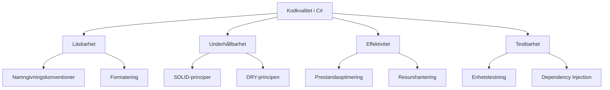

# 2. Vikten av kodkvalitet i C#-utveckling

🔴


## 1. Introduktion

I vår föregående lektion introducerade vi grundläggande OOP-koncept och hur de tillämpas i C#. Nu ska vi bygga vidare på denna kunskap och utforska varför kodkvalitet är avgörande i C#-utveckling.

Föreställ dig att du just har anslutit dig till ett team som arbetar med en stor e-handelsplattform. När du börjar granska koden märker du att den är svårläst, full av upprepningar och saknar konsekvent struktur. Du inser snabbt att detta kommer att leda till ökade underhållskostnader, fler buggar och långsammare utveckling av nya funktioner.

### Varför är detta viktigt?

Kodkvalitet i C#-utveckling är avgörande av flera anledningar:

1. Underhållbarhet: Välskriven kod är lättare att förstå och modifiera.
2. Prestanda: Effektiv kod utnyttjar C#:s och .NET:s styrkor för bättre prestanda.
3. Skalbarhet: Högkvalitativ kod är lättare att skala när applikationen växer.
4. Teamsamarbete: Konsekvent och läsbar kod underlättar samarbete mellan utvecklare.
5. Testbarhet: Välstrukturerad kod är lättare att testa, vilket leder till färre buggar.

### Översikt över vad du kommer att lära dig

- Principer för kodkvalitet i C#
- Verktyg och tekniker för att förbättra kodkvalitet
- Refaktorering av existerande C#-kod
- Best practices för att skriva högkvalitativ C#-kod

### Koppling till tidigare kunskap

Vi kommer att bygga vidare på de OOP-koncept vi diskuterade i föregående lektion, och visa hur dessa kan tillämpas för att förbättra kodkvaliteten i C#-projekt.

## 2. Konceptuell förståelse

### Grundläggande principer för kodkvalitet i C

Kodkvalitet i C# bygger på flera grundläggande principer:



### Hur fungerar det?

1. **Läsbarhet**:

   - Använd beskrivande namn för variabler, metoder och klasser.
   - Följ C#:s namngivningskonventioner (PascalCase för klasser och metoder, camelCase för variabler).
   - Använd konsekvent formatering och indentering.

2. **Underhållbarhet**:

   - Tillämpa SOLID-principerna (Single Responsibility, Open-Closed, Liskov Substitution, Interface Segregation, Dependency Inversion).
   - Följ DRY-principen (Don't Repeat Yourself) för att minimera kodduplicering.
   - Använd kommentarer sparsamt och meningsfullt.

3. **Effektivitet**:

   - Utnyttja C#:s inbyggda funktioner och .NET-ramverkets optimerade klasser.
   - Var medveten om prestandaimplikationer, särskilt vid arbete med stora datamängder.
   - Använd asynkron programmering när det är lämpligt.

4. **Testbarhet**:
   - Skriv små, fokuserade metoder som är lätta att testa.
   - Använd dependency injection för att löst koppla komponenter.
   - Skriv enhetstester för kritisk funktionalitet.

### Vanliga missuppfattningar och klargöranden

- **Missuppfattning**: "Kortare kod är alltid bättre."
  **Klargörande**: I C# är tydlighet ofta viktigare än korthet. Använd exempelvis properties istället för direkta fältåtkomster för att förbättra inkapsling.

- **Missuppfattning**: "Kommentarer gör alltid koden mer läsbar."
  **Klargörande**: I C# bör koden vara självförklarande genom bra namngivning och struktur. Använd kommentarer för att förklara varför något görs, inte vad som görs.

## 3. Praktisk implementation

Låt oss ta en titt på hur vi kan förbättra kodkvaliteten i en existerande C#-klass. Vi börjar med en enkel `Order`-klass och förbättrar den steg för steg.

### Steg 1: Ursprunglig kod

```csharp
/// <summary>
/// Represents an order with a customer name, list of items, and total cost.
/// </summary>
public class Order
{
    /// <summary>
    /// Gets or sets the order ID.
    /// </summary>
    public int id;

    /// <summary>
    /// Gets or sets the customer name.
    /// </summary>
    public string cust_name;

    /// <summary>
    /// Gets or sets the list of items in the order.
    /// </summary>
    public List<string> items;

    /// <summary>
    /// Gets or sets the total cost of the order.
    /// </summary>
    public double total;

    /// <summary>
    /// Adds an item to the order.
    /// </summary>
    /// <param name="item">The item to add.</param>
    public void AddItem(string item)
    {
        items.Add(item);
    }

    /// <summary>
    /// Calculates the total cost of the order based on the items.
    /// </summary>
    public void CalcTotal()
    {
        total = 0;
        foreach (var item in items)
        {
            if (item == "A") total += 10;
            if (item == "B") total += 15;
            if (item == "C") total += 20;
        }
    }
}
```

### Steg 2: Förbättrad namngivning och inkapsling

```csharp
public class Order
{
    public int Id { get; private set; } // Order ID
    public string CustomerName { get; private set; } // Kundens namn
    private List<string> _items; // Lista över beställda varor
    public double Total { get; private set; } // Total kostnad för ordern

    // Konstruktor för att skapa en ny order
    public Order(int id, string customerName)
    {
        Id = id;
        CustomerName = customerName;
        _items = new List<string>();
    }

    // Lägg till en vara i ordern
    public void AddItem(string item)
    {
        _items.Add(item);
    }

    // Beräkna den totala kostnaden för ordern
    public void CalculateTotal()
    {
        Total = 0;
        foreach (var item in _items)
        {
            Total += GetItemPrice(item);
        }
    }

    // Hämta priset för en specifik vara
    private double GetItemPrice(string item)
    {
        switch (item)
        {
            case "A": return 10; // Pris för vara A
            case "B": return 15; // Pris för vara B
            case "C": return 20; // Pris för vara C
            default: throw new ArgumentException("Invalid item");
        }
    }
}
```

### Steg 3: Ytterligare förbättringar med SOLID-principer

```csharp
// Gränssnitt för en orderpost
public interface IOrderItem
{
    string Name { get; }
    double Price { get; }
}

// Klass som implementerar en orderpost
public class OrderItem : IOrderItem
{
    public string Name { get; }
    public double Price { get; }

    public OrderItem(string name, double price)
    {
        Name = name;
        Price = price;
    }
}

// Klass som representerar en order
public class Order
{
    public int Id { get; }
    public string CustomerName { get; }
    private List<IOrderItem> _items;
    public double Total => CalculateTotal();

    public Order(int id, string customerName)
    {
        Id = id;
        CustomerName = customerName;
        _items = new List<IOrderItem>();
    }

    public void AddItem(IOrderItem item)
    {
        _items.Add(item);
    }

    private double CalculateTotal()
    {
        return _items.Sum(item => item.Price);
    }
}

// Användning av Order-klassen
class Program
{
    static void Main()
    {
        Order order = new Order(1, "Alice"); // Skapa en ny order för Alice
        order.AddItem(new OrderItem("A", 10)); // Lägg till vara A
        order.AddItem(new OrderItem("B", 15)); // Lägg till vara B
        order.AddItem(new OrderItem("C", 20)); // Lägg till vara C
        Console.WriteLine($"Total cost: {order.Total}"); // Skriv ut den totala kostnaden
    }
}
```

### Best Practices

1. Använd properties för att kontrollera åtkomst och validering.
2. Implementera inkapsling genom att göra fält privata och exponera dem via properties.
3. Använd meningsfulla namn för variabler, metoder och klasser.
4. Följ Single Responsibility Principle genom att dela upp funktionalitet i mindre, fokuserade metoder.
5. Använd interfaces för att möjliggöra flexibilitet och testbarhet.

### Felsökningsguide

Om du stöter på problem med din C#-kod:

1. Använd debuggern i Visual Studio för att stega igenom koden.
2. Kontrollera att alla properties är korrekt implementerade.
3. Verifiera att konstruktorn initierar alla nödvändiga fält.
4. Säkerställ att privata metoder och fält inte är oavsiktligt exponerade.

### Optimeringstips

1. Använd `IEnumerable<T>` istället för `List<T>` för metoder som bara behöver iterera över samlingen.
2. Överväg att använda `StringBuilder` för omfattande strängmanipulationer.
3. Implementera `IDisposable` för klasser som hanterar omanagerade resurser.
4. Använd LINQ för effektiv datamanipulation, men var medveten om potentiella prestandaimplikationer vid stora datamängder.

## 4. Avancerade koncept

### Reella användningsfall

I större C#-applikationer kan du använda mer avancerade tekniker för att förbättra kodkvaliteten:

1. Dependency Injection för att löst koppla komponenter:

```csharp
// Gränssnitt för en orderrepository
public interface IOrderRepository
{
    void SaveOrder(Order order);
}

// Implementering av en orderrepository
public class OrderService
{
    // Privat fält för att lagra en orderrepository
    private readonly IOrderRepository _orderRepository;

    // Konstruktor för att injicera en orderrepository
    public OrderService(IOrderRepository orderRepository)
    {
        _orderRepository = orderRepository;
    }

    // Metod för att bearbeta en order
    public void ProcessOrder(Order order)
    {
        // Validera och bearbeta ordern
        _orderRepository.SaveOrder(order);
    }
}
```

2. Använd asynkron programmering för I/O-bundna operationer:

```csharp
// Gränssnitt för en orderrepository
public interface IOrderRepository
{
    Task SaveOrderAsync(Order order); // Asynkron metod för att spara en order
}

// Implementering av en orderrepository
public class OrderService
{
    // Privat fält för att lagra en orderrepository
    private readonly IOrderRepository _orderRepository;

    // Konstruktor för att injicera en orderrepository
    public OrderService(IOrderRepository orderRepository)
    {
        // Spara en referens till orderrepository
        _orderRepository = orderRepository;
    }

    // Asynkron metod för att bearbeta en order
    public async Task ProcessOrderAsync(Order order)
    {
        // Validera och bearbeta ordern
        await _orderRepository.SaveOrderAsync(order);
    }
}
```

**15-minutersregeln:** Fastnar du i mer än 15 minuter — fråga klassen, sen AI, sen mig. I den ordningen.

### Prestandaöverväganden

- Använd asynkrona metoder (`async/await`) för I/O-bundna operationer för att förbättra skalbarhet.
- Implementera caching för resurskrävande beräkningar eller databasförfrågningar.
- Använd `Lazy<T>` för att fördröja initiering av resurskrävande objekt.

### Säkerhetsaspekter

- Validera all användarinput för att förhindra injektionsattacker.
- Använd säkra strängformateringsmetoder som `String.Format` eller interpolerade strängar.
- Implementera korrekt felhantering och loggning utan att exponera känslig information.

### Skalbarhetsfrågor

- Designa dina klasser och metoder för att vara trådsäkra.
- Använd asynkron programmering för att hantera många samtidiga anslutningar.
- Implementera mönster som Repository och Unit of Work för dataåtkomst.

## 5. Sammanfattning och reflektion

### Nyckelkoncept repetition

- Kodkvalitet i C# handlar om läsbarhet, underhållbarhet, effektivitet och testbarhet.
- Använd C#:s språkfunktioner som properties, interfaces och generics för att förbättra kodkvaliteten.
- Följ SOLID-principerna och andra designmönster för att skapa flexibel och underhållbar kod.
- Använd verktyg och tekniker som code reviews, statisk kodanalys och enhetstestning för att upprätthålla kodkvaliteten.

### Tänk på

- Kodkvalitet är en kontinuerlig process, inte en engångsaktivitet.
- Balansera mellan perfektion och leverans - sträva efter bra kodkvalitet, men undvik överoptimering.
- Kommunicera med ditt team om kodkvalitetsstandarder och upprätthåll dem konsekvent.

### Fördjupningsfrågor

1. Hur kan du använda C#:s språkfunktioner för att förbättra kodkvaliteten i ett existerande projekt?
2. Vilka verktyg och tekniker kan du använda för att mäta och förbättra kodkvaliteten i ett C#-projekt?
3. Hur kan du balansera kravet på snabb leverans med behovet av högkvalitativ kod i en agil utvecklingsmiljö?

### Koppling till nästa ämne

I nästa del kommer vi att fördjupa oss i Clean Code-principer specifikt för C# och .NET. Vi kommer att utforska hur vi kan tillämpa dessa principer för att ytterligare förbättra kvaliteten och underhållbarheten i våra C#-projekt.

## 6. Fördjupning: Kodanalysverktyg för C

### Statisk kodanalys med Roslyn

Varning: Detta är överkurs! Statisk kodanalys med Roslyn är ett avancerat ämne som kräver goda kunskaper i C# och .NET-ramverket.

C# erbjuder kraftfulla verktyg för statisk kodanalys genom Roslyn-kompilatorn. Här är ett exempel på hur du kan skapa en egen kodanalysregel:

```csharp
// Kodanalysregel för att undvika "magiska nummer"
using Microsoft.CodeAnalysis;
using Microsoft.CodeAnalysis.Diagnostics;

[DiagnosticAnalyzer(LanguageNames.CSharp)]
public class AvoidMagicNumbersAnalyzer : DiagnosticAnalyzer
{
    // Unikt ID för kodanalysregeln
    public const string DiagnosticId = "AvoidMagicNumbers";

    // Kodanalysregelns metadata
    private static readonly DiagnosticDescriptor Rule = new DiagnosticDescriptor(
        DiagnosticId,
        "Avoid magic numbers",
        "Use named constant instead of magic number {0}",
        "Readability",
        DiagnosticSeverity.Warning,
        isEnabledByDefault: true);

    // Vilka typer av syntaxnoder som regeln ska analysera
    public override ImmutableArray<DiagnosticDescriptor> SupportedDiagnostics
    {
        get {
            return ImmutableArray.Create(Rule); // Returnera regeln som stöds
            // ImmutableArray är en del av .NET Core för att skapa oföränderliga samlingar
            // vilket innebär att de inte kan ändras efter att de har skapats
            // Vi använder detta nu för att analysera syntaxnoder i C#-koden
            // där varje rad i koden representeras av en syntaxnod
            // En syntaxnod kan vara en variabel, en metod, en klass, etc.
            // Vi ska nu spana efter numeriska litteraler i koden
            // exempel int x = 42; där 42 är en numerisk literal
            // Vi vill varna för användningen av sådana "magiska nummer"
            // och uppmuntra användningen av namngivna konstanter istället
            // cont answerToLife = 42; där 42 är en konstant med namnet answerToLife
        }
    }

    // Initialisering av kodanalysregeln
    public override void Initialize(AnalysisContext context)
    {
        // Registrera en åtgärd för att analysera numeriska litteraler
        // Detta gör att den kommer att köras varje gång en numerisk literal hittas i koden
        context.RegisterSyntaxNodeAction(AnalyzeNode, SyntaxKind.NumericLiteralExpression);
    }

    private void AnalyzeNode(SyntaxNodeAnalysisContext context)
    {
        // Hämta den numeriska literalen från syntaxnoden
        var literal = (LiteralExpressionSyntax)context.Node;

        // Undvik att varna för numeriska litteraler som är del
        // av en tilldelning eller parameter, exempelvis
        // int x = 42; eller void Method(int value = 42);
        if (literal.Parent.Kind() == SyntaxKind.EqualsValueClause ||
            literal.Parent.Kind() == SyntaxKind.Parameter)
            return;

        // Skapa en kodanalysvarning för den numeriska literalen
        var diagnostic = Diagnostic.Create(Rule, literal.GetLocation(), literal.Token.ValueText);
        // Skapa en kodanalysvarning för den numeriska literalen
        context.ReportDiagnostic(diagnostic);
    }
}
```

Denna analysregel varnar för användningen av "magiska nummer" i koden och uppmuntrar användning av namngivna konstanter istället.

För att testa den behöver vi skapa en kodanalyslösning och inkludera denna regel. Detta är en avancerad process som kräver djupare kunskaper i C# och .NET-ramverket.

I visual studio, skapa ett nytt projekt, välj sedan "Analyzer with Code Fix (.NET Standard)". Detta kommer att skapa en ny lösning med en kodanalysregel och en kodfixerare. Du kan sedan inkludera din egen kodanalysregel i denna lösning.

## 7. Interaktiva element

### Tänk på detta: Refaktorering i praktiken

- Hur skulle du refaktorera en stor switch-sats i C# för att förbättra underhållbarheten?
- Vilka verktyg i Visual Studio kan hjälpa dig att identifiera och åtgärda kodkvalitetsproblem?
- Hur kan du använda C#:s språkfunktioner som `ref` och `out` parametrar för att förbättra prestanda i vissa situationer?

### Övningsuppgift: Refaktorering för förbättrad kodkvalitet

Ta följande C#-kod och refaktorera den för att förbättra kodkvaliteten:

```csharp
class Program
{
    static void Main(string[] args)
    {
        Console.WriteLine("Enter operation: add, subtract, multiply, divide");
        string op = Console.ReadLine();
        Console.WriteLine("Enter first number:");
        double a = Convert.ToDouble(Console.ReadLine());
        Console.WriteLine("Enter second number:");
        double b = Convert.ToDouble(Console.ReadLine());
        double result = 0;
        if (op == "add") result = a + b;
        else if (op == "subtract") result = a - b;
        else if (op == "multiply") result = a * b;
        else if (op == "divide") result = a / b;
        Console.WriteLine("Result: " + result);
    }
}
```

Fokusera på att:

- Separera ansvarsområden (input, beräkning, output)
- Använda enums för operationer
- Implementera felhantering
- Skapa en separat Calculator-klass

## 8. Referenser och vidare läsning

- "Clean Code: A Handbook of Agile Software Craftsmanship" av Robert C. Martin
- "C# in Depth" av Jon Skeet
- Microsoft Docs: C# Coding Conventions (<https://docs.microsoft.com/en-us/dotnet/csharp/fundamentals/coding-style/coding-conventions>)
- "Refactoring: Improving the Design of Existing Code" av Martin Fowler

## 9. Fördjupningsrutor

### Fördjupning: Prestandaoptimering i C

C# erbjuder flera avancerade tekniker för prestandaoptimering:

```csharp
public class PerformanceOptimizedList<T>
{
    private T[] _items;
    private int _count;

    public PerformanceOptimizedList(int capacity = 4)
    {
        _items = new T[capacity];
    }

    public void Add(T item)
    {
        if (_count == _items.Length)
            Array.Resize(ref _items, _items.Length * 2);

        _items[_count++] = item;
    }

    public ReadOnlySpan<T> AsSpan() => new ReadOnlySpan<T>(_items, 0, _count);
}
```

Denna implementering använder `Span<T>` för effektiv minneshantering och undviker onödiga allokeringar.

### Fördjupning: Avancerad asynkron programmering

Här är ett exempel på mer avancerad asynkron programmering i C#:

```csharp
public class AsyncOperationManager
{
    private readonly SemaphoreSlim _semaphore = new SemaphoreSlim(3); // Begränsa till 3 samtidiga operationer

    public async Task<T> ExecuteWithRetryAsync<T>(Func<Task<T>> operation, int maxRetries = 3)
    {
        for (int i = 0; i < maxRetries; i++)
        {
            try
            {
                await _semaphore.WaitAsync();
                return await operation();
            }
            catch (Exception ex) when (i < maxRetries - 1)
            {
                await Task.Delay(1000 * (int)Math.Pow(2, i)); // Exponentiell backoff
            }
            finally
            {
                _semaphore.Release();
            }
        }
        throw new Exception($"Operation failed after {maxRetries} attempts");
    }
}
```

Detta exempel visar hur man kan implementera asynkrona operationer med begränsning av samtidighet och automatisk återförsök med exponentiell backoff.

## 10. Expertkommentarer

### Expertkommentar: Betydelsen av kodkvalitet i agila team

Sarah Johnson, Agile Coach och C# Expert:
"I agila team är kodkvalitet avgörande för att upprätthålla snabb och pålitlig leverans. Högkvalitativ C#-kod möjliggör snabbare iterationer, enklare felsökning och mer effektiv kunskapsöverföring mellan teammedlemmar. Vi använder tekniker som pair programming och regelbundna kodgranskningar för att upprätthålla en hög kodkvalitet. Dessutom har vi automatiserade tester och statisk kodanalys integrerat i vår CI/CD-pipeline för att fånga potentiella problem tidigt."

### Expertkommentar: Balansera kodkvalitet och leveranshastighet

Michael Chen, Lead Developer på ett stort e-handelsföretag:
"Att balansera kodkvalitet med snabb leverans är en ständig utmaning i C#-utveckling. Vi har lärt oss att investera i kodkvalitet från början faktiskt ökar vår leveranshastighet på lång sikt. Vi fokuserar på att skriva testbar kod, använder dependency injection flitigt och har strikta kodgranskningsprocesser. Samtidigt är vi pragmatiska - ibland måste vi göra avvägningar, men vi dokumenterar alltid teknisk skuld och planerar för refaktorering i framtida sprintar."

#### En annan regel som bör nämnas editorconfig

Editorconfig för att undvika magiska värden:

```editorconfig
# EditorConfig för att varna vid användning av magiska tal
root = true

[*.cs]
# Varnar om numeriska värden används utan att deklareras som konstanta
dotnet_style_prefer_named_constants = true:warning
```

Editorconfig är en konfigurationsfil som kan skickas mellan utvecklare och som hjälper till att upprätthålla en konsekvent kodstil och kvalitet i ett projekt. Den kan användas för att definiera kodstilregler, kodkvalitetsregler och mycket mer.

---
Och kom ihåg: allt vi gått igenom här är grunden. Resten bygger på det. Så var inte rädd att experimentera.
