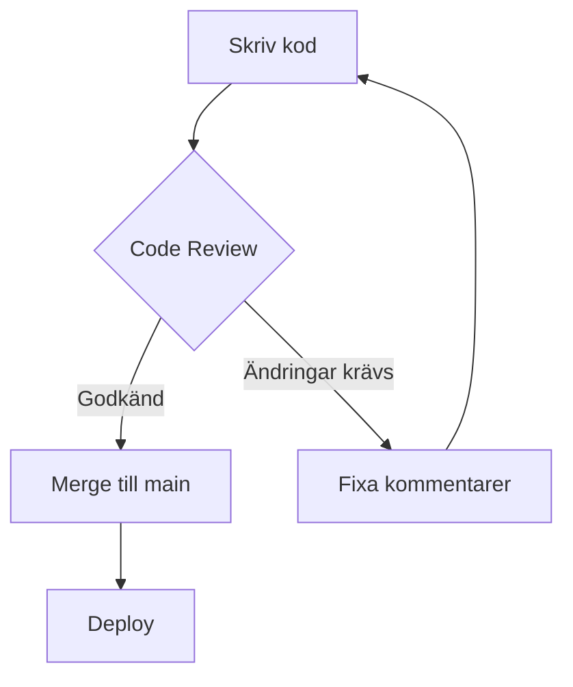
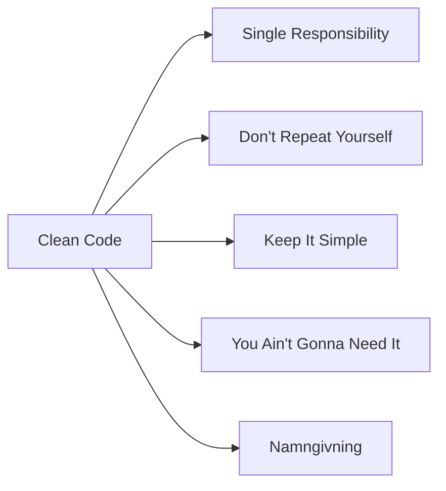

# 01 Clean Code — Programmeringstermer

---

## Clean Code · Ren kod

Kod som är lätt att läsa, förstå och ändra — av dig själv och av dina kollegor. Det handlar om namngivning, enkelhet och tydlig struktur.

Tänk på det som ett recept. Ett bra recept är skrivet så att vem som helst kan följa det utan att gissa sig fram. Dålig kod är ett recept med förkortningar och utelämnade steg — "ta lite deg och håll i ugn ett tag".

```csharp
// Dålig kod — vad gör den här?
int r = p * q / 100;

// Clean Code — kristallklart
int discountedPrice = originalPrice * discountPercent / 100;
```

Varför spelar det roll? Du läser kod tio gånger mer än du skriver den. Om du inte förstår din egen kod om tre veckor — vad händer när en kollega ska förstå den?

> 🖼️ **Bild:** Bild på två recept sida vid sida — ett välstrukturerat med tydliga rubriker och steg, ett rörigt med korrekturer och förkortningar.

---

## Namngivning · Naming

Variabel-, metod- och klassnamn ska beskriva vad de är och gör. Undvik förkortningar och kryptiska bokstäver.

Tänk på det som att namnge kontakter i din telefon. Du sparar inte "M, 073" — du sparar "Marcus, jobbet". Koden är din telefonbok.

```csharp
// Dåligt
int d = 7;
bool chk(string s) { ... }

// Bra
int daysUntilDeadline = 7;
bool IsValidEmail(string email) { ... }
```

En enkel tumregel: kan du säga namnet högt och förstå vad det innehåller? Ja → bra. Nej → byt.

---

## Single Responsibility Principle · Principen om ett ansvar (SRP)

En klass eller metod ska ha exakt ett syfte. Om du kan beskriva vad den gör med "och" i meningen — den gör för mycket.

Tänk på det som en kock som är ansvarig för en sak i köket. Den som grillar, grillar. Den som bakar, bakar. Om kocken både grillar, diskar och tar emot beställningar på samma gång — det slutar dåligt.

```csharp
// Fel — gör för mycket
void ProcessOrder(Order order)
{
    ValidateOrder(order);      // ansvar 1
    SaveToDatabase(order);     // ansvar 2
    SendConfirmationEmail(order); // ansvar 3
}

// Rätt — dela upp i separata metoder/klasser
```

Vanligt misstag: metoder som heter `DoEverything()` eller `HelperUtils.cs` som innehåller precis allting.

---

## DRY · Don't Repeat Yourself

Undvik att skriva samma logik på flera ställen. Om du kopierar och klistrar in kod — du skapar ett underhållsproblem.

Tänk på det som att ha ett nyckelschema på jobbet. Om samma nyckelinformation finns i tio olika dokument och du behöver uppdatera det — lycka till att hitta alla tio.

```csharp
// Inte DRY — samma beräkning på tre ställen
double totalWithVAT = price * 1.25;
double shippingWithVAT = shipping * 1.25;

// DRY — en metod gör jobbet
double AddVAT(double amount) => amount * 1.25;
```

> 🖼️ **Bild:** Meme — "copy paste programmer" med bilden på Ctrl+C / Ctrl+V som superkrafter, med texten "When you don't know about DRY".

---

## KISS · Keep It Simple, Stupid

Den enklaste lösningen som fungerar är nästan alltid den bästa. Lägg inte till komplexitet för att det känns mer "proffigt".

Tänk på det som att välja väg på Google Maps. Det finns en direktväg på 20 minuter. Det finns också en "optimerad" route via fem motorvägar och tre broar som tar 45 minuter. KISS väljer direktvägen.

```csharp
// Onödigt komplex
bool IsEven(int number)
{
    if (number % 2 == 0) { return true; }
    else { return false; }
}

// KISS
bool IsEven(int number) => number % 2 == 0;
```

---

## YAGNI · You Ain't Gonna Need It

Bygg bara det du behöver nu. Lägg inte till funktionalitet "för framtida behov" som du inte vet om du kommer ha.

Tänk på det som att packa resväska. Du packar inte paraplyet "om det kanske regnar", skidkläderna "om vi råkar åka till fjällen" och frackskjortan "ifall det blir galamiddag". Du packar det du vet att du behöver.

Varför det är en fälla: framtida behov ändras. Du lägger fem timmar på en funktion som aldrig används, och koden blir mer komplex av funktioner som inte fyller något syfte.

---

## Magic Number · Magisk siffra

En hårdkodad siffra i koden utan förklaring. Vad är `42`? Vad är `1440`? Ingen vet utan kontext.

Tänk på det som att hitta en lapp i köket med texten "17". Ingen rubrik, ingen förklaring. Är det temperaturen? Antal gäster? Minuter i ugnen?

```csharp
// Magic number — vad är 0.25?
double tax = price * 0.25;

// Förklarat med konstant
const double SwedishVATRate = 0.25;
double tax = price * SwedishVATRate;
```

---

## Kommentarer · Comments

Bra kommentarer förklarar **varför** — inte **vad** koden gör. Koden visar vad. Kommentaren förklarar beslutet bakom.

Tänk på det som post-it-lappar i en bok. Du lägger inte en lapp på varje sida med "det här är en mening". Du lägger en lapp när du vill minnas varför ett visst kapitel var viktigt.

```csharp
// Dålig kommentar — upprepar bara koden
// Multiplicera price med 1.25
double priceWithVAT = price * 1.25;

// Bra kommentar — förklarar varför
// 1.25 = standard Swedish VAT (25%). Rates stored in config for other markets.
double priceWithVAT = price * 1.25;
```

Ta bort utkommenterad kod. Den tillhör git-historiken, inte källkoden.

---

## Coding Standards · Kodstandarder

Gemensamma regler för hela teamet: indentering, namnkonventioner, filstruktur. Alla skriver koden på samma sätt.

Tänk på det som ett spel där alla spelarna läser samma regelbok. Om hälften spelar efter egna regler blir det kaos. Kodstandarden är regelboken.

Exempel på konventioner i C#:
- Klassnamn: `PascalCase` → `CustomerOrder`
- Metoder: `PascalCase` → `CalculateTotal()`
- Variabler: `camelCase` → `totalAmount`
- Privata fält: `_camelCase` → `_databaseConnection`

---

## Code Review · Kodgranskning

En kollega läser igenom din kod innan den mergas in i projektet. Syftet är att hitta buggar, förbättra kvalitet och sprida kunskap i teamet.

Tänk på det som korrekturläsning innan en tidningsartikel publiceras. Inte för att hitta fel med skribenten — utan för att texten ska bli bättre.

Vanligt misstag: att ta code review personligt. Det är koden som granskas, inte du.

> 🖼️ **Bild:** Skärmdump från GitHub Pull Request med ett review-kommentar på en kodrad — "Bör den här metoden inte returnera null istället för att kasta exception här?"

---



---


