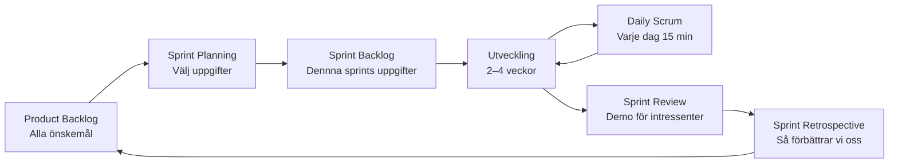
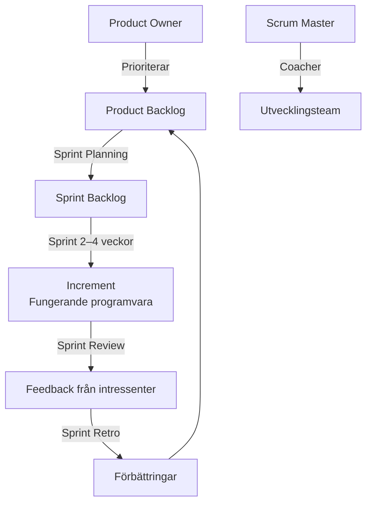

# 04 Scrum och Agilt — Programmeringstermer

---

## Agilt · Agile

En filosofi för mjukvaruutveckling som prioriterar flexibilitet, samarbete och täta leveranser framför detaljerad planering och strikta processer.

Tänk på det som att laga mat på känn kontra att slaviskt följa ett recept. Agilt innebär att du smakar av och justerar längs vägen — istället för att laga klart hela rätten och sedan inse att det smakar fel.

Det motsatta (vattenfallsmodellen) planerar allt i förväg och levererar allt på en gång. Problemet: kunden vet inte alltid vad de vill förrän de ser något.

> 🖼️ **Bild:** Jämförelsebild — vänster: traditionell vattenfall med faser (krav → design → kod → test → leverans) som ett högt stup. Höger: agilt spiralmönster med korta cykler och täta leveranser.

---

## Scrum

Det vanligaste agila ramverket. Organiserar arbetet i korta fasta iterationer (sprints) med tydliga roller, möten och verktyg.

Tänk på det som ett rugbylag (därav namnet). Hela laget rusar framåt tillsammans mot målet — inte var och en med sin uppgift i ett vakuum.

Scrum definieras av tre saker:
- **Roller**: Product Owner, Scrum Master, Utvecklingsteam
- **Artefakter**: Product Backlog, Sprint Backlog, Increment
- **Events**: Sprint, Planning, Daily Scrum, Review, Retrospective

---

---

## Product Owner · Produktägare

Rollen som äger produktvisionen och beslutar vad teamet ska bygga härnäst. Prioriterar backloggen baserat på affärsvärde.

Tänk på det som en restaurangchef som bestämmer menyn. Kockarna (teamet) lagar maten — men chefen bestämmer vilka rätter som prioriteras och i vilken ordning.

Viktigt: Product Owner är inte chef över teamet. PO äger vad — teamet äger hur.

---

## Scrum Master

Processledaren som säkerställer att Scrum följs och hjälper teamet att ta bort hinder.

Tänk på det som en tränare i ett sportlag. Spelarna spelar matchen — tränaren ser till att spelarna har rätt förutsättningar, löser konflikter och coachar.

Scrum Master är inte projektledare. SM kontrollerar inte arbetet — SM möjliggör det.

---

## Sprint · Sprint

En fast tidsperiod (vanligtvis 1–4 veckor) där teamet arbetar mot ett tydligt mål. I slutet levereras något funktionellt.

Tänk på det som ett pusselmaraton med tidsbegränsning. Klockan tickar, och när den stannar ska du ha ett komplett område av pusslet klart — inte ett halvfärdigt pusselstycke utan sammanhang.

Sprints ger rytm. Teamet vet alltid: vi levererar på fredag. Inget pågår i all evighet utan slut.

---

## Sprint Planning · Sprintplanering

Mötet i början av varje sprint där teamet väljer vilka backlog-uppgifter som ska slutföras och planerar hur.

Tänk på det som att planera en veckas mat. Du tittar i kylskåpet (backloggen), väljer vad du ska laga (uppgifterna) och bestämmer vilken dag du lagar vad (planen).

Vanligt misstag: ta på sig för mycket. Teamet ska välja realistiskt utifrån sin velocity — inte försöka imponera.

---

## Sprint Review · Sprintgranskning

Mötet i slutet av sprinten där teamet demonstrerar vad de byggt för Product Owner och intressenter.

Tänk på det som en redovisning i skolan — fast roligare. Du visar det du faktiskt gjort, inte en presentation om vad du planerade att göra.

Nyckeln: Review handlar om feedback. Inte om godkännande. PO och intressenter ger input som kan påverka nästa sprint.

---

## Sprint Retrospective · Sprintretrospektiv

Mötet efter Review där **teamet** (inte intressenterna) reflekterar: vad gick bra, vad gick dåligt, vad ska vi ändra?

Tänk på det som en spelfilm-analys med laget efter matchen. Inte för att peka finger — utan för att bli bättre till nästa match.

Tre standardfrågor:
1. Vad gick bra? (behåll)
2. Vad gick dåligt? (förbättra)
3. Vad ska vi faktiskt ändra till nästa sprint?

Sista frågan är den viktigaste. Retro utan konkreta åtgärder är bara pratande.

---

## Daily Scrum · Dagligt möte

15 minuters möte varje dag där teamet synkroniserar och identifierar hinder. Ingen genomgång — snabb synk.

Tänk på det som en daglig väderleksrapport för teamet. Kort, faktabaserad, alla håller sig informerade.

Tre frågor (klassiska men valfria):
1. Vad gjorde jag igår?
2. Vad ska jag göra idag?
3. Finns det något som blockerar mig?

Vanligt misstag: Daily Scrum blir ett statusrapporteringsmöte till Scrum Master. Det är ett möte **för teamet**, inte en rapportering uppåt.

---

## Product Backlog · Produktbacklogg

Den prioriterade listan med allt som produkten ska innehålla — funktioner, buggar, förbättringar. Backloggen lever och uppdateras hela tiden.

Tänk på det som en önskelista för en produkt. Product Owner äger listan och bestämmer ordningen. Det översta i listan är alltid det viktigaste.

---

## Sprint Backlog · Sprintbacklogg

Uppgifterna teamet valt att göra under den aktuella sprinten. Teamet äger sprintbackloggen — inte Product Owner.

---

## Velocity · Hastighet

Mätvärdet på hur mycket arbete ett team slutför per sprint, mätt i story points. Används för att planera framtida sprints.

Tänk på det som att mäta din genomsnittliga körtid till jobbet. En vecka tar det 25 minuter, nästa 30, nästa 20. Snittet ger dig en rimlig prognos inför planering.

Viktigt: velocity är ett planeringsverktyg, inte ett betyg på hur bra teamet är.

---

## Burndown Chart · Nedbränningsdiagram

Diagram som visar hur mycket arbete som återstår i sprinten dag för dag. En nedåtgående linje är målet.

Tänk på det som en bränslemätare på en bil. Du ser hur mycket som återstår och kan avgöra om du kommer nå målet utan att tanka.

> 🖼️ **Bild:** Klassisk burndown chart — X-axel = dagar i sprinten, Y-axel = återstående arbete (story points). Ideal-linje som går rakt ner, aktuell linje som kanske är över eller under.

---

## Inkrementell Utveckling · Incremental Development

Systemet byggs och levereras i små, fungerande delar — varje sprint lägger till ett nytt inkrement.

Tänk på det som att bygga en IKEA-bokhylla. Du monterar ett hyllplan i taget och hyllan är användbar redan efter det första planet — du väntar inte tills alla hyllplan är monterade.

Kontrast: vattenfallsmodellen levererar allt på en gång i slutet. Inkrementellt levererar du fungerande delar hela tiden.

---

