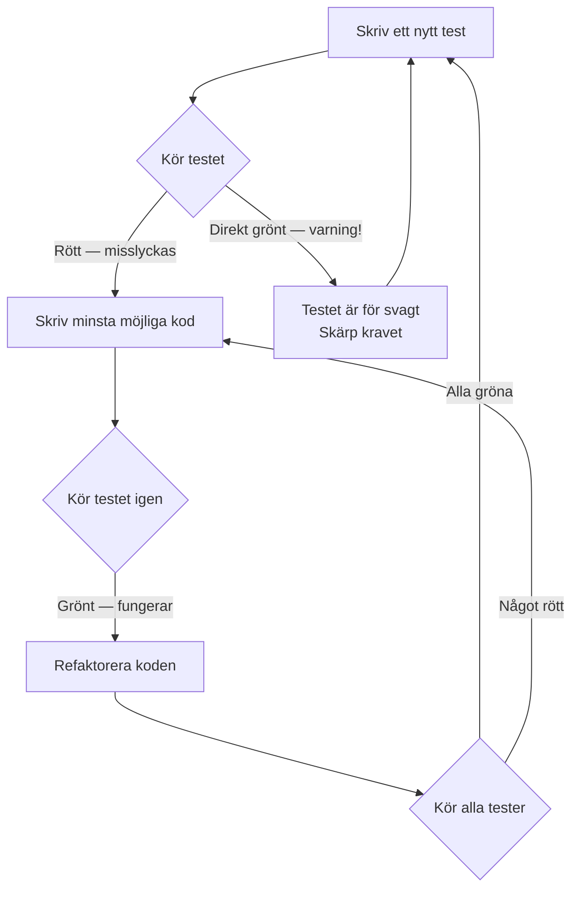
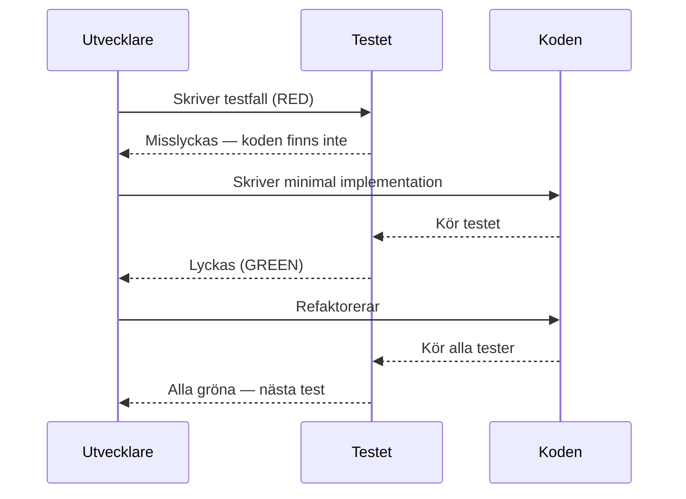

# 03 TDD — Programmeringstermer

---

## TDD · Test-Driven Development

En arbetsmetod där du skriver testet **innan** du skriver koden. Testet definierar vad koden ska göra — sedan skriver du koden som uppfyller det.

Tänk på det som att skriva facit innan du gör provet. Facit (testet) definierar rätt svar — sedan löser du uppgiften (skriver koden) tills svaret stämmer.

```csharp
// Steg 1: Skriv testet FÖRST
[Fact]
public void Multiply_ThreeAndFour_ReturnsTwelve()
{
    var calc = new Calculator();
    Assert.Equal(12, calc.Multiply(3, 4));
}

// Steg 2: Skriv koden som gör testet grönt
public int Multiply(int a, int b) => a * b;
```

Utan TDD skriver du kod och testar manuellt. Med TDD har du permanent dokumentation på att koden fungerar.

---

## Red-Green-Refactor · Röd-grön-refaktorera

TDD:s grundcykel i tre steg som upprepas hela tiden.

Tänk på det som ett trafikljus: Rött = stopp (testet misslyckas). Grönt = kör (koden fungerar). Sen städar du bilen (refaktorerar koden) inför nästa runda.

```
1. RED    → Skriv ett test som misslyckas (koden finns inte än)
2. GREEN  → Skriv minsta möjliga kod för att testet ska bli grönt
3. REFACTOR → Förbättra koden utan att bryta testet
```

Nyckeln: du refaktorerar **efter** att testet är grönt. Aldrig under. Testet är ditt skyddsnät.

> 🖼️ **Bild:** Illustration av ett trafikljus med tre faser: rött (skriv test), grönt (skriv kod), gult/blått (refaktorera). Enkel och tydlig.

---



---

## Baby Steps · Små steg

TDD-principen att göra så liten förändring som möjligt mellan varje test. Skriv ett test, gör det grönt, refaktorera — sedan nästa.

Tänk på det som att gå uppför en trappa i mörker. Du tar ett steg i taget och känner efter att foten är säker innan du tar nästa. Du springer inte upp hela trappan på en gång och hoppas att det gick bra.

Fördelen: om något går sönder vet du exakt vilket steg som orsakade det. Liten förändring = enkel felsökning.

---

## Fake It ('Til You Make It) · Fejka det tills du klarar det

TDD-strategi: returnera först ett hårdkodat värde för att göra testet grönt, och ersätt sedan med riktig implementation.

Tänk på det som att öva ett tal inför en publik. Första gången läser du direkt från pappret (hårdkodat). Sedan lär du dig det utantill (riktig implementation).

```csharp
// Steg 1: Fake it
public int Add(int a, int b) => 5; // Hårdkodat — testet kräver bara 5

// Steg 2: Lägg till ett nytt test som bryter den naiva lösningen
// Steg 3: Make it — riktig implementation
public int Add(int a, int b) => a + b;
```

---

## Triangulering · Triangulation

TDD-teknik där du lägger till fler testfall med olika indata för att tvinga fram en generell lösning istället för hårdkodad.

Tänk på det som navigering utan GPS: med ett enda vägmärke vet du bara en sak. Med tre vägmärken kan du lokalisera dig exakt. Varje nytt test är ett nytt vägmärke som preciserar lösningen.

```csharp
// Första testet — kan "lösas" med hårdkodat 0
Assert.Equal(0, calc.Multiply(0, 5));

// Andra testet — tvingar fram riktig multiplikation
Assert.Equal(12, calc.Multiply(3, 4));

// Tredje testet — hanterar negativa tal
Assert.Equal(-6, calc.Multiply(-2, 3));
```

---

## Test List · Testlista

En lista du skriver i början av en TDD-session med alla tester du planerar att skriva. Hjälper dig hålla fokus.

Tänk på det som en inköpslista. Du bestämmer vad du behöver innan du går till affären — annars glömmer du saker och handlar felaktigt.

```
Testlista för Calculator.Divide:
[ ] Dela 10 med 2 → returnerar 5
[ ] Dela med 0 → kastar DivideByZeroException
[ ] Dela negativt tal → returnerar negativt resultat
[ ] Dela 0 med tal → returnerar 0
```

---

## Mutation Testing · Mutationstestning

Teknik där ett verktyg automatiskt introducerar små buggar (mutationer) i koden och kontrollerar om testerna fångar dem. Om en mutation överlever — testerna är för svaga.

Tänk på det som att anlita en inbrottstjuv för att testa ditt larm. Tjuven provar olika sätt att ta sig in. Om larmet inte reagerar på ett av dem — du har ett problem du inte visste om.

Verktyg för .NET: Stryker.NET.

> 🖼️ **Bild:** Diagram som visar: Original kod → Mutant (en rad ändrad) → Tester körs → "Mutant killed" (test fångade det) eller "Mutant survived" (test misslyckas att fånga det).

---

## Kent Beck

Skaparen av TDD och Extreme Programming (XP). Hans bok *"Test-Driven Development: By Example"* (2002) är standardverket — fortfarande relevant idag.

Viktig poäng från Kent Beck: TDD handlar inte om att skriva tester. Det handlar om att designa kod. Testerna är ett redskap för att tänka igenom designen.

---

## Transformation Priority Premise · Transformationsprioritering

En modell av Robert C. Martin som rangordnar implementationsstrategier från enklast till svårast. I TDD väljer du alltid den enklaste transformationen som gör testet grönt.

Ordning (enklast till svårast):
1. Ingen kod → returnera konstant
2. Konstant → variabel
3. Lägg till villkor (if)
4. Lägg till loop
5. Använd datastruktur / rekursion

---

## Outside-In TDD · Utifrån-och-in TDD

Börja med tester på hög nivå (vad användaren ser) och arbeta dig nedåt mot detaljerna. Kontrast till Inside-Out (ren enhetstestning).

Tänk på det som att bygga ett hus utifrån perspektivet av den som ska bo där: "Jag vill ha tre sovrum och ett kök" (Outside-In) versus att börja med betongblandningen (Inside-Out).

```
Outside-In:
  1. Acceptanstest: "Användaren kan logga in"
  2. Integrationstest: LoginController fungerar
  3. Enhetstest: UserService.Authenticate fungerar
```

---


