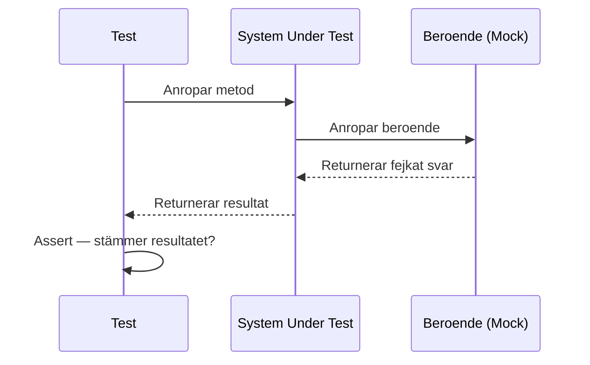
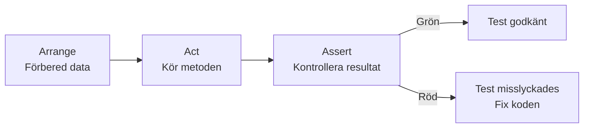

# 02 Unit Testning — Programmeringstermer

---

## Unit Test · Enhetstest

Ett test som kontrollerar att en enskild metod eller funktion fungerar korrekt — isolerat från allt annat.

Tänk på det som att testa ett enda pussel-bit: passar den ihop med den intilliggande biten? Du testar inte hela bilden på en gång — du testar en bit i taget.

```csharp
[Fact]
public void Add_TwoNumbers_ReturnsCorrectSum()
{
    var calculator = new Calculator();
    int result = calculator.Add(3, 4);
    Assert.Equal(7, result);
}
```

Utan enhetstester hittar du buggar sent — när kunden hittar dem, inte du.

---

## Test Case · Testfall

Ett specifikt test som verifierar ett scenario med tydlig indata och ett förväntat resultat.

Tänk på det som ett ärende till kundtjänst: "Jag ringde med nummer 073-XXXXX, sa 'jag vill boka om', och förväntat svar var att bli kopplad till bokningsavdelningen." Klart, spårbart, verifierbart.

Varje test case ska testa **ett** scenario. Inte fem saker på en gång.

---

## Assertion · Verifiering

Kontrollen i ett test som kontrollerar att det faktiska resultatet matchar det förväntade. Om assertion misslyckas — testet är rött.

Tänk på det som checklistan efter att du lagat mat: "Smakar det rätt? Är temperaturen tillräcklig? Är färgen korrekt?" Varje fråga är en assertion.

```csharp
Assert.Equal(expected: 10, actual: result);    // lika med
Assert.True(isLoggedIn);                        // sant
Assert.NotNull(user);                           // inte null
Assert.Throws<ArgumentException>(() => ...);   // kastar rätt exception
```

---

## AAA-mönster · Arrange, Act, Assert

Standardstrukturen för ett enhetstest: förbered, utför, kontrollera. Gör testet läsbart och förutsägbart.

Tänk på det som ett experiment i kemi: förbered kemikalierna (Arrange), blanda dem (Act), mät resultatet (Assert). Alltid i den ordningen.

```csharp
[Fact]
public void Discount_TenPercent_ReducesPrice()
{
    // Arrange
    var product = new Product { Price = 100 };

    // Act
    double discounted = product.ApplyDiscount(10);

    // Assert
    Assert.Equal(90, discounted);
}
```

> 🖼️ **Bild:** Enkel illustration med tre kolumner: "Arrange" (knivar och skärbräda), "Act" (skär grönsaken), "Assert" (kontrollera att biten är rätt storlek).

---

## Test Fixture · Testfixtur

Förbedd data eller miljö som återanvänds av flera testmetoder i samma testklass. Undviker upprepning i arrange-steget.

Tänk på det som att förbereda köket innan du börjar laga mat: skära alla grönsaker, värma ugnen, ta fram verktygen. Den förberedelsen sker en gång — inte om och om igen för varje rätt.

```csharp
public class OrderTests
{
    private readonly Order _sampleOrder;

    public OrderTests()
    {
        // Fixture — körs innan varje test
        _sampleOrder = new Order { Id = 1, Total = 500 };
    }

    [Fact]
    public void Order_IsNotEmpty() => Assert.True(_sampleOrder.Total > 0);
}
```

---

## Mock · Fejkat objekt

Ett simulerat beroende som ersätter ett riktigt objekt under testet. Används för att isolera det du vill testa.

Tänk på det som statister i en film. Ingen av dem är riktiga läkare — de spelar läkare. Filmscenen (testet) fungerar ändå som den ska, utan att involvera riktiga sjukhus.

```csharp
// Med Moq-biblioteket
var mockEmailService = new Mock<IEmailService>();
mockEmailService.Setup(e => e.Send(It.IsAny<string>())).Returns(true);

var orderService = new OrderService(mockEmailService.Object);
```

Vanligt misstag: mocka för mycket. Mocka bara det som är ett externt beroende (databas, e-post, API). Testa riktig logik med riktig kod.

---

## Stub · Stubb

En enkel falsk implementation som returnerar förutbestämda värden. Skillnaden mot mock: en stub bryr sig inte om hur den anropas — den returnerar bara rätt svar.

Tänk på det som ett manus för en telefonintervju: du vet exakt vad den "andra personen" kommer att svara, oavsett vad du frågar.

```csharp
// Stub — returnerar alltid samma svar
public class FakeUserRepository : IUserRepository
{
    public User GetById(int id) => new User { Name = "Testsson", Id = 1 };
}
```

---

## Code Coverage · Kodtäckning

Mått på hur stor andel av koden som faktiskt körs av testerna. Uttrycks i procent.

Tänk på det som en säkerhetsinspektion av ett hus: hur stor andel av rummen inspekterades? 80% täckning = 20% av koden är inte testad och kan gömma buggar.

Viktigt: hög täckning är inte detsamma som bra tester. Du kan ha 100% täckning med tester som inte kontrollerar något vettigt.

> 🖼️ **Bild:** Skärmdump från Visual Studio med code coverage-visualisering — gröna linjer (täckta) och röda linjer (otäckta).

---

## xUnit · Testramverk

Det vanligaste testramverket för .NET. Kör dina tester och rapporterar vad som gick grönt eller rött.

Tänk på det som en domare vid en tävling. Du kör din kod, domaren (xUnit) kontrollerar resultaten och meddelar vilka som klarade sig.

Andra alternativ: NUnit, MSTest. xUnit är standard i .NET-världen idag.

```csharp
// xUnit-attribut
[Fact]         // Ett enskilt test
[Theory]       // Datadrivet test med flera datamängder
[InlineData]   // Datamängd för Theory-test
```

---

## Fluent Assertions · Flytande verifieringar

Bibliotek som gör assertions mer läsbara — nästan som engelska meningar.

```csharp
// Standard xUnit
Assert.Equal(5, result);

// Fluent Assertions
result.Should().Be(5);
result.Should().BeGreaterThan(0).And.BeLessThan(10);
list.Should().HaveCount(3).And.Contain("Marcus");
```

Tänk på det som att skriva "Resultatet ska vara 5" istället för "Kontrollera att 5 är lika med result". Mer läsbart, lättare att förstå felen.

---



---


