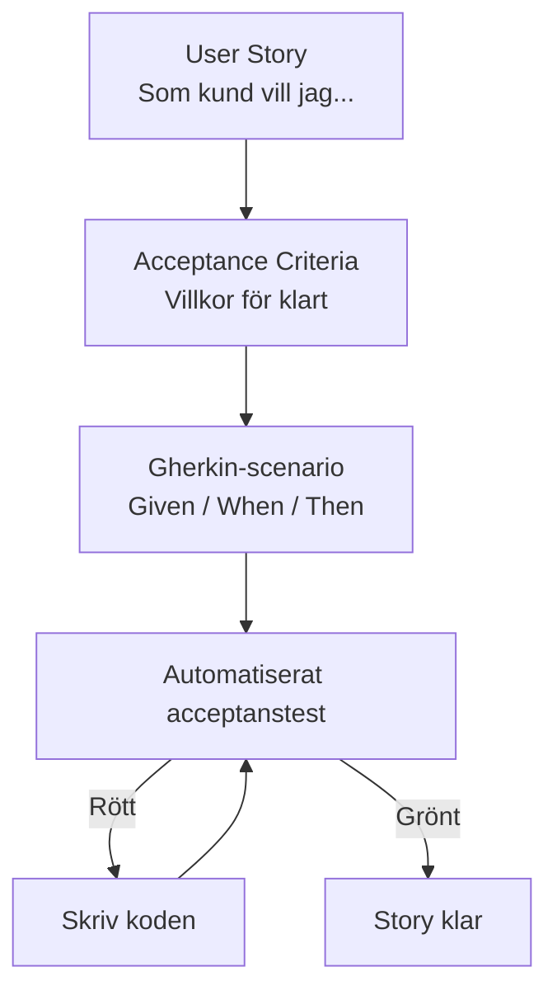
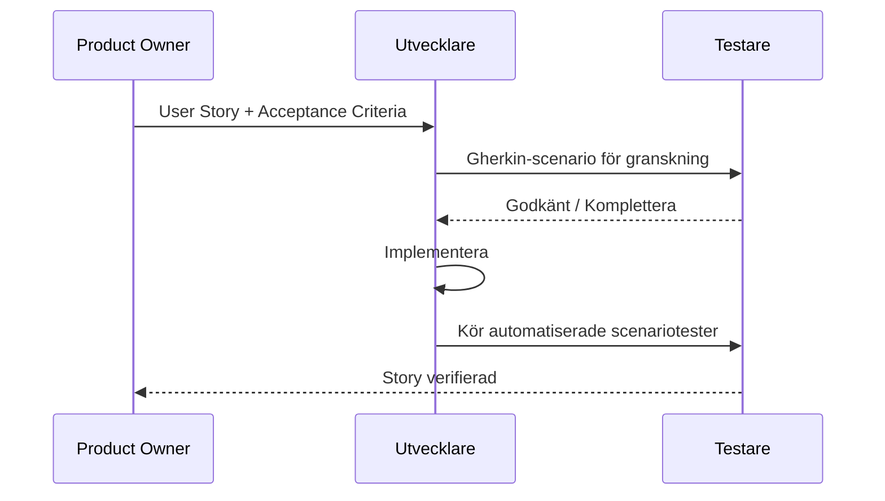

# 05 User Stories och Gherkin — Programmeringstermer

---

## User Story · Användarberättelse

Ett krav beskrivet ur användarens perspektiv i en enkel mening. Syftet är att hålla fokus på värdet för användaren — inte på tekniska detaljer.

Tänk på det som en beställning på en restaurang: "Jag vill ha en pizza med extra ost för att jag är hungrig." Inte: "Hetta upp ugnen till 225 grader, tillsätt..." — det är implementationsdetaljer. User storyn är beställningen.

**Format:**
> Som [roll] vill jag [funktion] för att [nytta].

```
Som inloggad kund vill jag kunna se min orderhistorik
för att enkelt följa mina tidigare köp.
```

Utan user stories tenderar teams att bygga tekniska lösningar på problem ingen egentligen hade.

---

## INVEST-kriterierna

Sex egenskaper som definierar en välskriven user story. INVEST är ett akronym.

Tänk på det som en checklista innan du publicerar en jobbannonns: är den tillräckligt tydlig? Attraktiv? Realistisk? Alla kriterier måste stämma.

| Bokstav | Engelska | Vad det betyder |
|---------|----------|-----------------|
| **I** | Independent | Kan göras utan att en annan story är klar |
| **N** | Negotiable | Detaljerna kan diskuteras med teamet |
| **V** | Valuable | Ger tydligt värde för användaren eller affären |
| **E** | Estimable | Teamet kan uppskatta hur stor den är |
| **S** | Small | Kan slutföras inom en sprint |
| **T** | Testable | Det går att verifiera att den är klar |

En story som inte uppfyller INVEST behöver bearbetas innan den kan tas in i en sprint.

> 🖼️ **Bild:** En user story på ett post-it-kort i ett Kanban-flöde (To Do → In Progress → Done), med INVEST-bokstäverna listade på kortet.

---

## Acceptance Criteria · Acceptanskriterier

Tydliga villkor som måste uppfyllas för att en user story ska anses komplett. De definierar gränsen för "klart".

Tänk på det som villkoren i ett hyreskontrakt. Du ska lämna lägenheten i "befintligt skick" — men vad innebär det konkret? Städad, inga hål i väggarna, alla nycklar inlämnade. Varje villkor är ett acceptanskriterium.

```
User Story: Som kund vill jag kunna logga in med e-post och lösenord.

Acceptanskriterier:
- Korrekt e-post + lösenord → användaren är inloggad och omdirigeras till startsidan
- Fel lösenord → felmeddelande visas, lösenordet rensas
- Tre misslyckade försök → kontot låses i 15 minuter
- Lösenord visas aldrig i klartext
```

---

## Gherkin

Ett strukturerat textspråk för att beskriva systemets beteende på ett sätt som både affärsmänniskor och utvecklare förstår.

Tänk på det som ett körkort-scenario i trafikskolan: "Givet att du kör på en motorväg, när du ser ett stopp-tecken, då ska du stanna." Klart, spårbart, testbart.

Gherkin är grunden för BDD (Behavior-Driven Development) och används i verktyg som Cucumber och SpecFlow.

```gherkin
Feature: Inloggning

  Scenario: Lyckad inloggning
    Given att användaren är på inloggningssidan
    And att användaren har ett konto med e-post "test@example.com"
    When användaren anger korrekt e-post och lösenord
    And klickar på "Logga in"
    Then ska användaren omdirigeras till startsidan
    And välkomstmeddelandet "Hej, Test!" visas
```

---

## Given · Givet

Gherkin-nyckelord som beskriver **förutsättningarna** — systemets tillstånd innan något händer. Motsvarar Arrange i AAA-mönstret.

```gherkin
Given att en produkt med pris 100 kr finns i kundkorgen
And att kunden är inloggad
```

Tänk på det som "Givet att spelet redan är startat och det är din tur..."

---

## When · När

Gherkin-nyckelord som beskriver **händelsen** — vad användaren gör eller vad som triggas. Motsvarar Act i AAA-mönstret.

```gherkin
When kunden klickar på "Lägg till rabattkod"
And anger koden "SOMMAR25"
```

Tänk på det som den faktiska handlingen: "... när du slår ett slag med schackpjäsen..."

---

## Then · Då

Gherkin-nyckelord som beskriver **förväntat resultat** — vad som ska ha hänt efter händelsen. Motsvarar Assert i AAA-mönstret.

```gherkin
Then ska produktpriset visas som 75 kr
And ett meddelande "Rabatt 25% tillämpad" visas
```

Tänk på det som konsekvensen: "... då ska det stå schack."

---

## Scenario · Scenario

Ett konkret exempel på beteende i Gherkin. Varje scenario är ett testfall.

En Feature (funktion) kan ha flera Scenarios — lycklig väg, felvärden, kantfall.

```gherkin
Feature: Sök produkt

  Scenario: Sök med exakt produktnamn
    Given att produktdatabasen innehåller "Blå Tröja"
    When användaren söker på "Blå Tröja"
    Then ska produkten "Blå Tröja" visas i resultaten

  Scenario: Sök som ger noll resultat
    When användaren söker på "Osynlig Enhörning"
    Then ska meddelandet "Inga produkter hittades" visas
```

---

## Scenario Outline · Scenariomall

Gherkin-mall för att köra samma scenario med flera datakombinationer. Minskar upprepning.

Tänk på det som en Excel-mall för formulär — samma struktur, olika värden i cellerna.

```gherkin
Scenario Outline: Dela ett tal
  Given att täljaren är <täljare>
  And att nämnaren är <nämnare>
  When division utförs
  Then ska resultatet vara <resultat>

  Examples:
    | täljare | nämnare | resultat |
    | 10      | 2       | 5        |
    | 9       | 3       | 3        |
    | 100     | 4       | 25       |
```

---

## BDD · Behavior-Driven Development

Utvecklingsmetod där man definierar systemets beteende i affärsspråk (Gherkin) innan koden skrivs. Stärker kommunikationen mellan affär, test och utveckling.

Tänk på det som att skriva filmmanuset innan regissören börjar filma. Alla vet vad scenen ska åstadkomma — ingen behöver gissa sig till resultatet efteråt.

BDD är TDD fast på högre nivå: istället för enhetstester startar du med acceptanstester skrivna i ett språk alla förstår.

> 🖼️ **Bild:** Diagram med tre personer (Product Owner, Testare, Utvecklare) som alla bidrar till samma Gherkin-scenario — visar hur BDD binder ihop rollerna.

---



---


