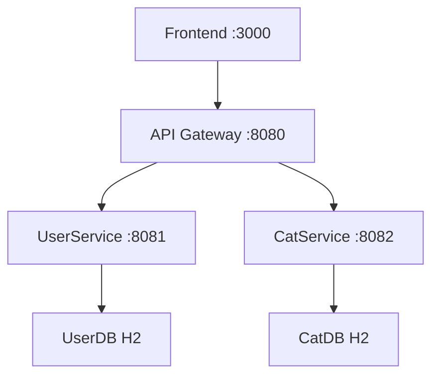

# 🔧 Service-by-Service Setup Guide

🟢


## 📋 Overview

This guide provides detailed setup and configuration instructions for each service in the microservices architecture. Each service is designed to be independently deployable and maintainable.

---

## 🌐 API Gateway Service

### 🎯 **Purpose**
The API Gateway serves as the single entry point for all client requests, handling routing, CORS, authentication, and request logging.

### 📁 **Directory Structure**
```
api-gateway/
├── src/main/java/se/dsve/api_gateway/
│   ├── ApiGatewayApplication.java      # Main application class
│   ├── controller/
│   │   └── GatewayController.java      # Routing logic
│   ├── config/
│   │   ├── CorsConfig.java             # CORS configuration
│   │   └── SecurityConfig.java         # Security settings
│   └── filter/
│       └── CorrelationIdFilter.java    # Request correlation
├── src/main/resources/
│   └── application.properties          # Configuration
├── logs/                               # Log files
├── target/                             # Compiled classes
└── pom.xml                            # Dependencies
```

### ⚙️ **Configuration**

#### **Port & Application**
```properties
server.port=8080
spring.application.name=api-gateway
```

#### **Service URLs**
```properties
userservice.url=http://localhost:8081
catservice.url=http://localhost:8082
```

#### **Security**
```properties
security.jwt.secret-key=NHQ3dyF6JUMqRi1KYU5kUmdValhuMnI1dTh4L0E/RyhHK0tiUGVTaFZtWXEzczZ2OXkmRSlIQE1jUWZU
security.jwt.expiration-time=86400000
```

### 🚀 **Running the Service**

#### **Prerequisites**
- Java 21+
- Maven 3.8+
- Ports 8081 and 8082 available (for downstream services)

#### **Startup Commands**
```bash
cd api-gateway

# Build the service
mvn clean compile

# Run the service
mvn spring-boot:run

# Run in background
mvn spring-boot:run > api-gateway.log 2>&1 &
```

#### **Health Check**
```bash
# Check if service is running
curl http://localhost:8080/api/health

# Expected response: {"status":"ok"}
```

### 🔗 **Routing Configuration**

The Gateway routes requests based on URL patterns:

| Pattern | Destination | Purpose |
|---------|-------------|---------|
| `/api/auth/**` | UserService:8081 | Authentication endpoints |
| `/api/cats/**` | CatService:8082 | Cat management endpoints |
| `/api/health` | Gateway itself | Health check |

### 🛡️ **CORS Configuration**
- **Allowed Origins**: `http://localhost:3000` (React frontend)
- **Allowed Methods**: GET, POST, PUT, DELETE, OPTIONS
- **Allowed Headers**: Content-Type, Authorization, X-Correlation-Id

### 📝 **Logs**
- **Console**: Real-time output with correlation IDs
- **File**: `logs/api-gateway.log` (10MB rotation, 30 days retention)

---

## 👤 User Service

### 🎯 **Purpose**
Handles all user-related functionality including authentication, user registration, and user profile management.

### 📁 **Directory Structure**
```
user-service/
├── src/main/java/se/dsve/userservice/
│   ├── UserServiceApplication.java     # Main application class
│   ├── controller/
│   │   └── AuthController.java         # Authentication endpoints
│   ├── service/
│   │   ├── AuthService.java           # Authentication logic
│   │   └── UserService.java           # User management logic
│   ├── repository/
│   │   └── UserRepository.java         # Database access
│   ├── model/
│   │   └── User.java                   # User entity
│   ├── dto/
│   │   ├── LoginRequest.java          # Request/Response objects
│   │   ├── RegisterRequest.java
│   │   └── AuthResponse.java
│   └── config/
│       └── SecurityConfig.java         # Security configuration
├── src/main/resources/
│   └── application.properties          # Configuration
├── data/                               # H2 database files
├── logs/                               # Log files
└── pom.xml                            # Dependencies
```

### ⚙️ **Configuration**

#### **Port & Application**
```properties
server.port=8081
spring.application.name=user-service
```

#### **Database (H2)**
```properties
spring.datasource.url=jdbc:h2:file:./data/userdb;AUTO_SERVER=TRUE
spring.datasource.driver-class-name=org.h2.Driver
spring.datasource.username=sa
spring.datasource.password=password
spring.jpa.hibernate.ddl-auto=update
spring.h2.console.enabled=true
```

#### **JWT Configuration**
```properties
security.jwt.secret-key=NHQ3dyF6JUMqRi1KYU5kUmdValhuMnI1dTh4L0E/RyhHK0tiUGVTaFZtWXEzczZ2OXkmRSlIQE1jUWZU
security.jwt.expiration-time=86400000
```

### 🚀 **Running the Service**

#### **Prerequisites**
- Java 21+
- Maven 3.8+
- Port 8081 available

#### **Startup Commands**
```bash
cd user-service

# Build the service
mvn clean compile

# Run the service
mvn spring-boot:run

# Run in background
mvn spring-boot:run > user-service.log 2>&1 &
```

#### **Health Check**
```bash
# Check if service is running
curl http://localhost:8081/auth/users

# Expected response: [] or list of users
```

### 📊 **Database Access**

#### **H2 Console**
- **URL**: http://localhost:8081/h2-console
- **JDBC URL**: `jdbc:h2:file:./data/userdb`
- **Username**: `sa`
- **Password**: `password`

#### **Database Files**
Database files are stored in `data/` directory:
- `userdb.mv.db` - Main database file
- `userdb.trace.db` - Trace file (if debugging enabled)

### 🔌 **API Endpoints**

#### **Authentication Endpoints**
```bash
# Register new user
POST /auth/signup
Content-Type: application/json
{
    "email": "user@example.com",
    "password": "password123",
    "fullName": "John Doe"
}

# Login user
POST /auth/login
Content-Type: application/json
{
    "email": "user@example.com",
    "password": "password123"
}

# Get current user profile (requires JWT)
GET /auth/me
Authorization: Bearer <JWT_TOKEN>

# List all users (admin endpoint)
GET /auth/users
```

### 🔒 **Security Configuration**
- **CORS**: Disabled (handled by Gateway)
- **CSRF**: Disabled (stateless JWT)
- **Session Management**: Stateless
- **Authentication**: JWT tokens only

---

## 🐱 Cat Service

### 🎯 **Purpose**
Manages all cat-related functionality including CRUD operations for cats, cat ownership, and cat business logic.

### 📁 **Directory Structure**
```
cat-service/
├── src/main/java/se/dsve/catservice/
│   ├── CatServiceApplication.java      # Main application class
│   ├── controller/
│   │   └── CatController.java          # Cat endpoints
│   ├── service/
│   │   └── CatService.java            # Cat business logic
│   ├── repository/
│   │   └── CatRepository.java          # Database access
│   ├── model/
│   │   └── Cat.java                    # Cat entity
│   ├── dto/
│   │   ├── CreateCatRequest.java      # Request objects
│   │   └── CatResponse.java           # Response objects
│   └── config/
│       └── SecurityConfig.java         # Security configuration
├── src/main/resources/
│   └── application.properties          # Configuration
├── data/                               # H2 database files
├── logs/                               # Log files
└── pom.xml                            # Dependencies
```

### ⚙️ **Configuration**

#### **Port & Application**
```properties
server.port=8082
spring.application.name=cat-service
```

#### **Database (H2)**
```properties
spring.datasource.url=jdbc:h2:file:./data/catdb;AUTO_SERVER=TRUE
spring.datasource.driver-class-name=org.h2.Driver
spring.datasource.username=sa
spring.datasource.password=password
spring.jpa.hibernate.ddl-auto=update
spring.h2.console.enabled=true
```

### 🚀 **Running the Service**

#### **Prerequisites**
- Java 21+
- Maven 3.8+
- Port 8082 available

#### **Startup Commands**
```bash
cd cat-service

# Build the service
mvn clean compile

# Run the service
mvn spring-boot:run

# Run in background
mvn spring-boot:run > cat-service.log 2>&1 &
```

#### **Health Check**
```bash
# Check if service is running
curl http://localhost:8082/cats/health

# Expected response: "ok"
```

### 📊 **Database Access**

#### **H2 Console**
- **URL**: http://localhost:8082/h2-console
- **JDBC URL**: `jdbc:h2:file:./data/catdb`
- **Username**: `sa`
- **Password**: `password`

#### **Database Files**
Database files are stored in `data/` directory:
- `catdb.mv.db` - Main database file
- `catdb.trace.db` - Trace file (if debugging enabled)

### 🔌 **API Endpoints**

#### **Cat Management Endpoints**
```bash
# Health check
GET /cats/health

# Get all cats (requires authentication via Gateway)
GET /cats
Authorization: Bearer <JWT_TOKEN>

# Create new cat (requires authentication via Gateway)
POST /cats
Authorization: Bearer <JWT_TOKEN>
Content-Type: application/json
{
    "name": "Fluffy",
    "color": "white",
    "age": 3
}

# Get cat by ID (requires authentication via Gateway)
GET /cats/{id}
Authorization: Bearer <JWT_TOKEN>

# Update cat (requires authentication via Gateway)
PUT /cats/{id}
Authorization: Bearer <JWT_TOKEN>
Content-Type: application/json
{
    "name": "Fluffy Updated",
    "color": "gray",
    "age": 4
}

# Delete cat (requires authentication via Gateway)
DELETE /cats/{id}
Authorization: Bearer <JWT_TOKEN>
```

### 🔒 **Security Configuration**
- **CORS**: Disabled (handled by Gateway)
- **CSRF**: Disabled (stateless JWT)
- **Session Management**: Stateless
- **Authentication**: Trusts headers from Gateway

---

## ⚛️ Frontend Service

### 🎯 **Purpose**
React-based web application providing the user interface for the cat management system.

### 📁 **Directory Structure**
```
frontend/
├── public/
│   ├── index.html                      # HTML template
│   └── favicon.ico                     # Site icon
├── src/
│   ├── components/                     # React components
│   │   ├── Auth/
│   │   │   ├── Login.js               # Login form
│   │   │   └── Register.js            # Registration form
│   │   ├── Cats/
│   │   │   ├── CatList.js             # Display cats
│   │   │   ├── CatForm.js             # Add/Edit cat form
│   │   │   └── CatCard.js             # Individual cat display
│   │   └── Layout/
│   │       ├── Header.js              # Navigation
│   │       └── Layout.js              # Main layout
│   ├── services/
│   │   └── api.js                      # API integration
│   ├── utils/
│   │   ├── auth.js                    # Authentication utilities
│   │   └── constants.js               # App constants
│   ├── App.js                         # Main application component
│   └── index.js                       # Application entry point
├── package.json                        # Dependencies and scripts
├── package-lock.json                  # Dependency lock file
└── build/                             # Production build output
```

### ⚙️ **Configuration**

#### **API Configuration** (`src/services/api.js`)
```javascript
const API_BASE_URL = 'http://localhost:8080/api';

const api = axios.create({
  baseURL: API_BASE_URL,
  timeout: 10000,
  headers: {
    'Content-Type': 'application/json',
  }
});
```

#### **Environment Variables** (`.env`)
```env
REACT_APP_API_URL=http://localhost:8080/api
PORT=3000
```

### 🚀 **Running the Service**

#### **Prerequisites**
- Node.js 18+
- npm 9+
- Port 3000 available
- API Gateway running on port 8080

#### **First-time Setup**
```bash
cd frontend

# Install dependencies
npm install
```

#### **Development Commands**
```bash
# Start development server
npm start

# Build for production
npm run build

# Run tests
npm test

# Run in background
npm start > frontend.log 2>&1 &
```

### 🌐 **Access Points**
- **Development**: http://localhost:3000
- **Production Build**: Serve `build/` directory with web server

### 📱 **Features**
- **User Registration**: Create new user accounts
- **User Authentication**: Login/logout with JWT tokens
- **Cat Management**: CRUD operations for cats
- **Responsive Design**: Works on desktop and mobile
- **Error Handling**: User-friendly error messages
- **Loading States**: Visual feedback during API calls

---

## 🔧 Troubleshooting Guide

### Common Issues

#### **Service Won't Start**

**Problem**: `Port already in use`
```bash
# Solution: Kill existing processes
lsof -ti:8080 | xargs kill -9  # Gateway
lsof -ti:8081 | xargs kill -9  # UserService
lsof -ti:8082 | xargs kill -9  # CatService
lsof -ti:3000 | xargs kill -9  # Frontend
```

**Problem**: `Java/Maven not found`
```bash
# Solution: Verify installations
java --version   # Should show Java 21+
mvn --version    # Should show Maven 3.8+
```

#### **Database Issues**

**Problem**: `Database locked` or `Connection failed`
```bash
# Solution: Stop all services and restart
./stop-services.sh
rm */data/*.lock  # Remove lock files
./start-services.sh
```

**Problem**: `H2 Console won't load`
- Verify service is running: `curl http://localhost:8081/h2-console`
- Check JDBC URL: `jdbc:h2:file:./data/userdb`
- Verify credentials: username=`sa`, password=`password`

#### **Network/Connectivity Issues**

**Problem**: `CORS errors in browser`
- ✅ **Correct**: Frontend calls Gateway: `http://localhost:8080/api/`
- ❌ **Wrong**: Frontend calls services directly: `http://localhost:8081/`

**Problem**: `Gateway can't reach services`
```bash
# Test service connectivity
curl http://localhost:8081/auth/users  # UserService
curl http://localhost:8082/cats/health # CatService

# Check Gateway configuration
grep -r "userservice.url\|catservice.url" api-gateway/src/main/resources/
```

#### **Authentication Issues**

**Problem**: `JWT token invalid`
- Verify same JWT secret across all services
- Check token expiration (24 hours default)
- Ensure Authorization header format: `Bearer <token>`

**Problem**: `User registration fails`
```bash
# Test registration directly
curl -X POST http://localhost:8080/api/auth/signup \
  -H "Content-Type: application/json" \
  -d '{"email":"test@test.com","password":"test123","fullName":"Test User"}'
```

### Service Dependencies



**Startup Order** (Important):
1. UserService (8081) - Authentication dependency
2. CatService (8082) - Independent
3. API Gateway (8080) - Routes to above services
4. Frontend (3000) - Depends on Gateway

### Log Analysis

#### **Log File Locations**
- UserService: `user-service/user-service.log`
- CatService: `cat-service/cat-service.log`
- API Gateway: `api-gateway/api-gateway.log`
- Frontend: `frontend/frontend.log`

#### **Key Log Patterns**
```bash
# Find correlation ID for request tracing
grep "CORRELATION_ID" */logs/*.log

# Find authentication failures
grep -i "unauthorized\|forbidden" */logs/*.log

# Find database errors
grep -i "database\|sql\|h2" */logs/*.log

# Find CORS issues
grep -i "cors\|origin" */logs/*.log
```

### Performance Monitoring

#### **Health Check Commands**
```bash
# Quick health check all services
curl -s http://localhost:8080/api/health && echo " - Gateway OK"
curl -s http://localhost:8081/auth/users >/dev/null && echo " - UserService OK"
curl -s http://localhost:8082/cats/health >/dev/null && echo " - CatService OK"
curl -s http://localhost:3000 >/dev/null && echo " - Frontend OK"

# Detailed service status
./test-services.sh
```

#### **Resource Monitoring**
```bash
# Check memory usage
ps aux | grep -E "(java|node)" | grep -v grep

# Check port usage
lsof -i:8080,8081,8082,3000

# Check disk usage (database files)
du -sh */data/
```

---

## 📋 Service Configuration Summary

| Service | Port | Database | Main Purpose | Health Check |
|---------|------|----------|--------------|--------------|
| **API Gateway** | 8080 | None | Request routing, CORS, Auth | `/api/health` |
| **UserService** | 8081 | H2 (userdb) | Authentication, User mgmt | `/auth/users` |
| **CatService** | 8082 | H2 (catdb) | Cat management | `/cats/health` |
| **Frontend** | 3000 | None | User interface | `http://localhost:3000` |

## 🎯 Success Criteria

You have successfully configured and understand each service when you can:

- [ ] Start each service independently
- [ ] Access each service's health endpoint
- [ ] Connect to H2 databases for data services
- [ ] Route requests through the API Gateway
- [ ] Understand service dependencies and startup order
- [ ] Troubleshoot common configuration issues
- [ ] Explain the role of each service in the architecture

---

**🎉 Congratulations!** You now have a complete understanding of each service's configuration, dependencies, and operational characteristics. This knowledge is essential for maintaining and extending microservices architectures.