```mermaid
flowchart LR
    subgraph On-prem["On-premises — du äger allt"]
        OP_HW[Hårdvara]
        OP_OS[Operativsystem]
        OP_APP[Applikation]
        OP_DATA[Data]
    end

    subgraph IaaS["IaaS — du hyr hårdvara"]
        I_HW[Hårdvara ✅ Leverantör]
        I_OS[Operativsystem ⚠️ Du]
        I_APP[Applikation ⚠️ Du]
        I_DATA[Data ⚠️ Du]
    end

    subgraph PaaS["PaaS — du hyr plattform"]
        P_HW[Hårdvara ✅ Leverantör]
        P_OS[OS + Runtime ✅ Leverantör]
        P_APP[Applikation ⚠️ Du]
        P_DATA[Data ⚠️ Du]
    end

    subgraph SaaS["SaaS — du hyr allt"]
        S_HW[Hårdvara ✅ Leverantör]
        S_OS[OS + Runtime ✅ Leverantör]
        S_APP[Applikation ✅ Leverantör]
        S_DATA[Data ⚠️ Du]
    end

    On-prem --> IaaS --> PaaS --> SaaS
```

# Cloud Intro — Programmeringstermer

Termer och begrepp för det första mötet med molnet. Fördjupning finns i separata filer: `tjänstmodeller.md`, `azure-arkitektur.md`, `hanterbarhet.md`, `ai-iot.md`.

---

## Cloud computing · Molntjänster

Att leverera datorkraft, lagring och tjänster via internet — på begäran och mot betalning per förbrukning. Du hyr kapacitet istället för att äga hårdvara.

Tänk på det som elnätet. Du köper inte ett eget kraftverk för att driva din lägenhet — du kopplar in dig och betalar för det du förbrukar. Molnet fungerar likadant: servrar, lagring och nätverk levereras som en tjänst via en kabel du aldrig behöver se.

> 🖼️ **Bild:** Jämförelse sida vid sida — ett serverrack i ett kontor bredvid en plugg i ett eluttag, med texten "Äga vs. förbruka"

---

## CapEx vs OpEx · Investeringskostnad vs driftskostnad

Två sätt att betala för IT-infrastruktur — och en av de viktigaste anledningarna till att företag byter till molnet.

| Modell | Vad det innebär | Exempel |
|--------|-----------------|---------|
| **CapEx** (Capital Expenditure) | Köp hårdvara, äg den, skriv av den under 3–5 år | Egna servrar, eget datacenter |
| **OpEx** (Operational Expenditure) | Betala löpande för det du faktiskt använder | Molntjänster, prenumerationer |

Molnet är OpEx. Du slipper köpa servrar, underhålla dem och fundera på vad du gör när de är tre år gamla och halvt föråldrade. Du betalar månadsvis för vad du faktiskt förbrukade.

> CapEx kan fortfarande vara rätt för stabila, förutsägbara system. Men för dynamiska arbetsbelastningar och snabbt växande verksamheter vinner OpEx-flexibiliteten nästan alltid.

---

## Consumption-based model · Förbrukningsbaserad prissättning

Du betalar bara för det du faktiskt använder. Inga fasta avgifter för resurser som inte körs.

- Startade du en VM kl 09:00 och stängde ner den kl 17:00? Du betalar för 8 timmar.
- Kör du en Azure Function som aldrig anropas den här månaden? Du betalar ingenting.

Det gör att du kan experimentera billigt, skala upp vid behov och inte betala för idle-kapacitet.

---

## Azure

Microsofts molnplattform. Erbjuder 200+ tjänster: virtuella servrar, databaser, AI-tjänster, nätverkslösningar, identitetshantering, DevOps-verktyg och mer — allt i ett ekosystem.

Azure finns i 60+ regioner globalt — inklusive `Sweden Central` utanför Sandviken — vilket betyder att datan kan lagras inom EU och EU-regler (GDPR) kan uppfyllas utan speciallösningar.

Om du jobbar på ett Microsoft-orienterat företag (Windows, .NET, Office 365) är Azure det naturliga valet för molnmigrering — allt hänger ihop.

---

## IaaS · Infrastructure as a Service

Du hyr hårdvara — servrar, nätverk, lagring. Leverantören sköter det fysiska. Du sköter allt ovanpå: operativsystem, patchar, konfiguration, applikationer.

Maximal kontroll, men också maximalt egenansvar.

**Exempel i Azure:** Virtuella maskiner (VM:er), Azure Virtual Network

Se `tjänstmodeller.md` för fullständig genomgång av IaaS, PaaS och SaaS.

---

## PaaS · Platform as a Service

Du hyr en hel utvecklingsmiljö — OS, runtime och verktyg ingår och sköts av leverantören. Du fokuserar på kod och data. Inget OS att patcha, inga licenser att jaga.

**Exempel i Azure:** App Service, Azure SQL Database, Azure Functions

---

## SaaS · Software as a Service

Du använder ett färdigt program via webbläsaren. Leverantören sköter allt — infrastruktur, plattform, applikation, uppdateringar. Du hanterar bara ditt konto och dina data.

**Exempel:** Microsoft 365, Gmail, Slack

---

## VM · Virtual Machine (Virtuell dator)

En server som körs som programvara på Microsofts hårdvara. Du väljer operativsystem, installerar vad du vill och konfigurerar som du vill. IaaS i sin renaste form — full kontroll, fullt ansvar.

Se `02_virtuell_server/programmeringstermer/` för fördjupning.

---

## Scalability · Skalbarhet

Systemets förmåga att hantera ökad arbetsbelastning.

Tänk på det som ett café som öppnar extrakassor vid lunchruschen och stänger dem igen kl 14 — du anpassar kapaciteten efter trycket, betalar inte för tomt kafépersonal som väntar.

| Typ | Vad | Hur |
|-----|-----|-----|
| **Vertikal skalning** (scale up) | Gör resursen kraftfullare | Byt till större VM |
| **Horisontell skalning** (scale out) | Lägg till fler instanser | Fler VM:er bakom en load balancer |

Molnet erbjuder båda — och kan göra det automatiskt (auto-scaling). Se `hanterbarhet.md`.

---

## Availability · Tillgänglighet

Andel tid ett system är operationellt och tillgängligt för användare. Mäts i procent.

| Tillgänglighet | Nertid per år |
|---------------|---------------|
| 99 % | ~87 timmar |
| 99,9 % (tre nior) | ~8,7 timmar |
| 99,99 % (fyra nior) | ~52 minuter |

En sekunds nertid i ett e-handelssystem kan kosta mer än ett helt år av infrastrukturkostnader. Därför är tillgänglighet en affärsfråga, inte bara en teknisk fråga.

---

## Region · Region

Geografiskt område med Azures datacenter. Du väljer region när du skapar en resurs. Valet påverkar var datan lagras (GDPR), hur nära dina användare tjänsten körs (latens) och vilka tjänster som finns tillgängliga.

**Sverige:** `Sweden Central`

Se `azure-arkitektur.md` för regioner, tillgänglighetszoner och regionpar.

---

## Resource group · Resursgrupp

En logisk behållare för resurser som hör ihop. Webbapp, databas och lagring för samma projekt samlas i en resursgrupp — och när projektet är slut tar du bort hela gruppen på en gång.

Din städenhet i Azure.

Se `azure-arkitektur.md` för full genomgång av Azure-hierarkin.

---

## Reliability · Tillförlitlighet

Molnets förmåga att hålla tjänster uppe och återhämta sig från avbrott. Bygger på redundans — data och tjänster replikeras på flera ställen så att ett hårdvarufel inte slår ut hela systemet.

---

## Security · Säkerhet

Molnleverantörer investerar mer i säkerhet än de flesta enskilda företag har råd med. Fysisk säkerhet, kryptering, DDoS-skydd, identitetshantering — det är deras kärnaffär.

Men säkerhet är delat ansvar. Leverantören skyddar fundamentet. Du ansvarar fortfarande för identiteter, åtkomstregler och din egen applikationskod.

> 🖼️ **Bild:** "Shared responsibility model" — ett diagram som visar vem som ansvarar för vad i IaaS/PaaS/SaaS (liknande Microsofts officiella diagram men ritad i Marcus stil)

---

