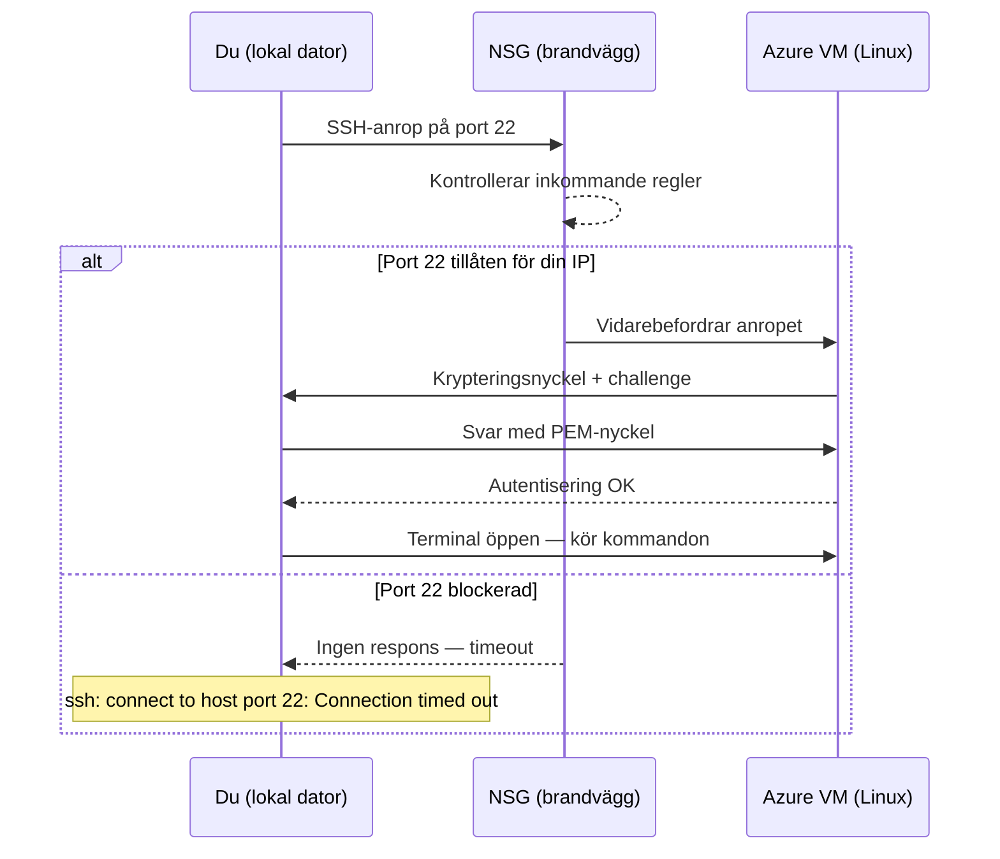
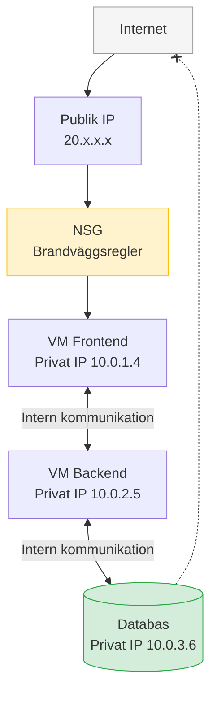

# Virtuell Server — Programmeringstermer

Att starta en virtuell server är IaaS-molnet i sin renaste form. Du har en server, du ansluter till den, du konfigurerar den — och du ansvarar för allt ovanpå hårdvaran. Den här filen täcker de begrepp du behöver för att faktiskt arbeta med en VM i Azure.

---

## SSH · Secure Shell

Krypterat protokoll för att fjärransluta till en Linux-server via terminalen. Port 22.

Tänk på det som en säker telefontunnel direkt in i servern — allt du skriver skickas krypterat, servern svarar krypterat. Ingen som lyssnar på trafiken kan se vad som skickas.

```bash
ssh -i ~/.ssh/minNyckel.pem azureuser@20.123.45.67
```

`-i` pekar ut din privata nyckel. `azureuser` är standardanvändaren på Azures Ubuntu-images. IP-adressen är serverns publika adress.

Om SSH hänger och aldrig ansluter — kontrollera NSG:n. Port 22 måste vara öppen för din IP.

> 🖼️ **Bild:** Skärmdump av en terminal med en aktiv SSH-session mot en Azure VM — prompten visar `azureuser@vm-dev-swec-001:~$`

---

## RDP · Remote Desktop Protocol

Microsofts protokoll för att fjärransluta till en Windows-server med grafiskt gränssnitt. Port 3389.

SSH ger dig en terminal. RDP ger dig ett komplett Windows-skrivbord — du ser servern precis som om du satt framför den fysiskt. Klicka, dra, öppna program.

Anslut från Windows: sök "Anslutning till fjärrskrivbord" (`mstsc.exe`). Från Mac: hämta Microsoft Remote Desktop från App Store.

> RDP mot `0.0.0.0/0` (hela internet) är en av de vanligaste attackvektorerna mot Windows-servrar. Begränsa alltid till din specifika IP i NSG:n.

---

## PEM-nyckel · Privat SSH-nyckel

En fil (`.pem`) som innehåller din privata nyckel — det digitala passet för SSH-autentisering. Säkrare än lösenord: en nyckel kan inte gissas och kan inte phishas via ett falskt inloggningsformulär.

Tänk på det som ett gammaldags cylinderlås: den publika nyckeln är låset (sitter på servern), den privata nyckeln är din nyckel (du har den). Bara du kan låsa upp — och nyckeln kan inte kopieras utan att du märker det.

```bash
# Sätt rätt behörigheter — annars vägrar SSH att använda filen
chmod 400 ~/.ssh/minNyckel.pem

# Anslut
ssh -i ~/.ssh/minNyckel.pem azureuser@<PUBLIC-IP>
```

Azure genererar nyckelpar åt dig när du skapar en VM — ladda ner `.pem`-filen direkt vid skapandet. Du kan inte hämta den igen.

> Tappa inte din PEM-nyckel. Det finns ingen "glömt lösenord"-knapp. Du måste återskapa åtkomsten via Azure-portalen om nyckeln försvinner.

---

## Public IP · Publik IP-adress

En IP-adress som är nåbar från internet — det är dit du SSH:ar, det är vad dina användare träffar när de besöker din tjänst.

Azures publika IP-adresser finns i två varianter:

| Typ | Vad | När |
|-----|-----|-----|
| **Dynamisk** | Ändras vid varje omstart | Dev/test, billigare |
| **Statisk** | Ändras aldrig | Produktion, DNS-pekning |

> En publik IP kostar pengar även om den inte är kopplad till någon resurs. Glöm inte att ta bort oanvända adresser — de syns inte i din VM-vy.

---

## Private IP · Privat IP-adress

En IP-adress som bara är nåbar inom det virtuella nätverket — inte från internet. Kommunikation mellan VM:er, databaser och andra interna resurser sker via privata IP-adresser.

```
Internet → träffar bara VM-frontend via publik IP (20.x.x.x)
VM-frontend (10.0.1.4) → pratar med VM-backend (10.0.2.5) via privat IP
Databas (10.0.3.6) → aldrig exponerad mot internet
```

Bra arkitektur: exponera bara det som måste exponeras. Databaser och interna API:er ska aldrig ha en publik IP.

---

## NSG · Network Security Group

Azures inbyggda brandvägg på nätverksnivå. En uppsättning in- och utgångsregler som styr exakt vilken trafik som får passera till och från din VM.

Tänk på det som säkerhetsvakter vid entrén — varje paket kontrolleras mot reglerna. Passar inte paketet in? Det stoppas.

Exempel på en rimlig NSG för en webbserver:

| Prioritet | Regel | Port | Källa | Åtgärd |
|-----------|-------|------|-------|--------|
| 100 | Tillåt SSH | 22 | Din IP | Tillåt |
| 110 | Tillåt HTTP | 80 | Alla | Tillåt |
| 120 | Tillåt HTTPS | 443 | Alla | Tillåt |
| 4096 | Neka allt | * | * | Neka |

**Vanliga misstag:**
- Öppna port 22 mot `0.0.0.0/0` — gör det aldrig i produktion
- Glömma port 80/443 på en webbserver och undra varför ingenting svarar

> 🖼️ **Bild:** Skärmdump av NSG-regler i Azure-portalen — med port 22 begränsad till en specifik IP-adress och port 80/443 öppna mot alla

---

## Image · VM-avbildning

En förbyggd mall med operativsystem och eventuellt förinstallerade verktyg. Du väljer en image när du skapar din VM — istället för att installera OS från scratch på tom hårdvara.

Azure Marketplace erbjuder hundratals images: Ubuntu 24.04, Windows Server 2022, Red Hat Enterprise Linux, Docker-klar Ubuntu, och mer.

Du kan också skapa en **custom image** — konfigurera en VM exakt som du vill ha den, "stämpla" den, och använd den som startpunkt för nya identiska VM:er. Praktiskt när alla servrar i ett kluster ska se likadana ut.

---

## Snapshot · Ögonblicksbild

En punkt-i-tid-kopia av en VM-disk. Om du installerar något nytt och det går fel kan du rulla tillbaka till snapshotet.

Tänk på det som quicksave i ett spel — innan du gör något riskabelt tar du en save, och om allt exploderar laddar du bara om.

```
Situation: Du ska uppdatera nginx-konfigurationen i produktion
Steg 1: Ta snapshot (tar 1–3 minuter)
Steg 2: Gör ändringen
Steg 3: Om allt funkar → ta bort snapshotet (det kostar pengar)
Steg 3b: Om det går åt pipan → restore till snapshot
```

> Snapshots ersätter inte en riktig backup-strategi. De lagras i samma region och skyddar inte mot ett regionalt avbrott eller att du råkar radera data manuellt.

> 🖼️ **Bild:** Meme — "Tar snapshot innan jag kör det där skriptet i prod" — Thanos nickar gillande

---

## Auto-shutdown · Automatisk avstängning

En schemalagd tid då Azure automatiskt stänger ner en VM. En glömd VM som aldrig stängs kostar lika mycket som en du aktivt använder.

En VM som stängs automatiskt kl 18:00 varje vardag kostar ungefär hälften mot en som aldrig stängs av.

Aktivera i portalen: **VM → Auto-shutdown → On → Välj tid och tidszon → Spara**

> Auto-shutdown är perfekt för dev- och test-VMs. Produktions-VMs ska aldrig ha auto-shutdown påslaget.

---



---


