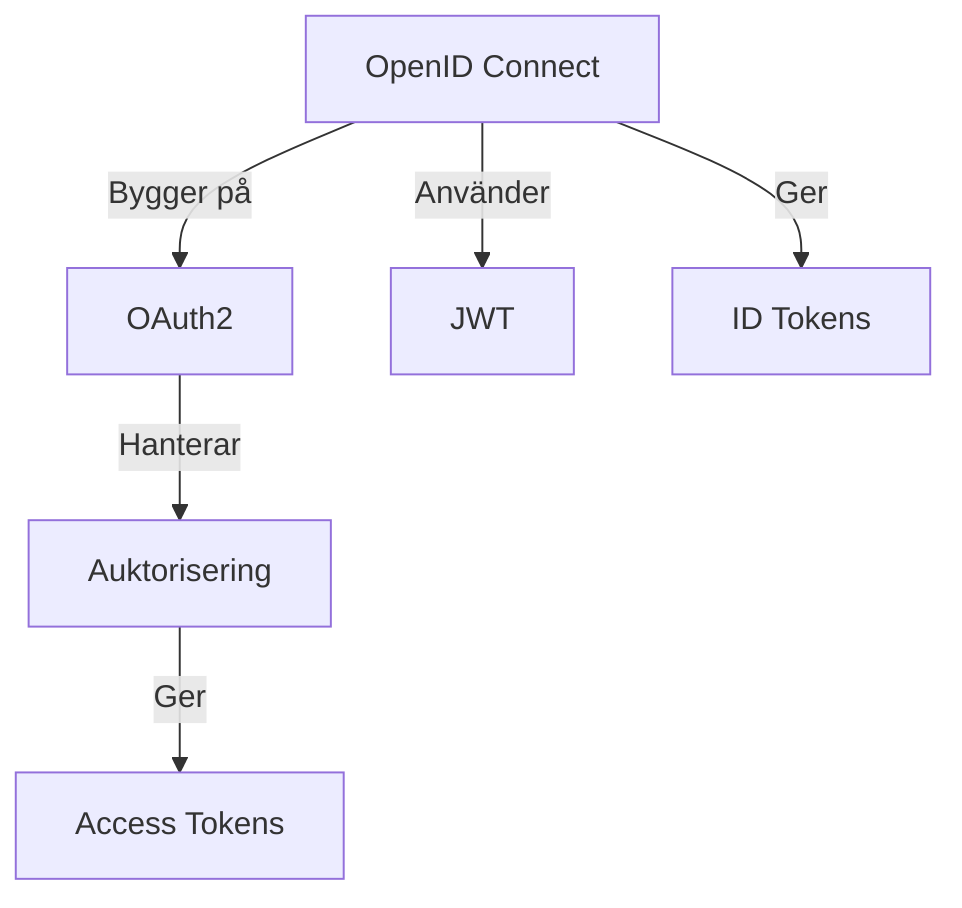
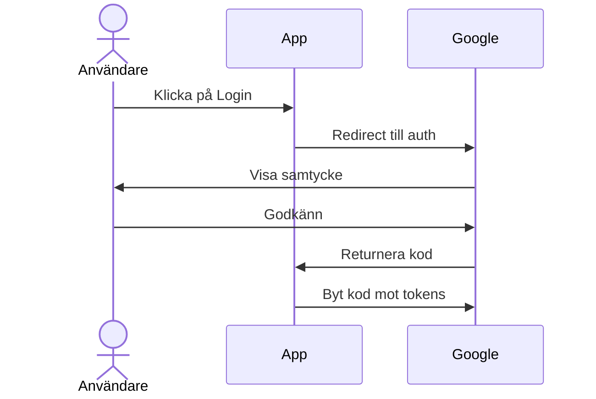

---

title: OAuth2 och OpenID Connect
author: Marcus Ackre Medina
type: example
topic: api
difficulty: 1
language: mixed
status: adapted
marcus_voice: true
source: "Old_courses/2025/java/5_api/08_more_authentication_and_authorization/2_oauth2_marp.md"
description: "A[OAuth2] -->|Hanterar| B[Auktorisering]"
tags: ["api", "connect", "javascript", "marp", "oauth2", "openid", "visual-studio"]
week_fit: []
---

# OAuth2 och OpenID Connect

🟢


## För nybörjare som kan JWT

---

# Grundläggande Koncept

<div class="mermaid">



</div>

---

# Liknelser

#### OAuth2 = Hotellkort 🔑

- Tillgång till specifika rum
- Tidsbegränsad access
- Ingen personlig info

#### OpenID Connect = ID-kort 📇

- Identitetsbevis
- Personlig information
- Bygger på OAuth2

---

# Implementationsexempel

```javascript
const config = {
  clientId: "din-app-id",
  authEndpoint: "https://accounts.google.com/o/oauth2/v2/auth",
  scope: "openid profile email",
  redirectUri: "https://din-app.com/callback",
};
```

---

# Autentiseringsflöde

<div class="mermaid">



</div>

---

# Token-hantering

```javascript
async function hanteraCallback(kod) {
  const tokens = await hämtaTokens(kod);
  // Access token & ID token
  sparaTokensSäkert(tokens);
}
```

---

# Viktiga Begrepp

#### Scope

- Definierar åtkomsträttigheter
- `openid profile email`

#### Tokens

- **ID Token**: JWT med användarinfo
- **Access Token**: API-åtkomst

---

# Säkerhetstips

1. ✅ **Använd HTTPS**
2. ❌ **Undvik localStorage**
3. ✅ **Validera tokens**
4. ✅ **Säkra cookies**

---

# Sammanfattning

- OAuth2 för auktorisering
- OIDC för autentisering
- JWT som bärare av identitet
- Säkerhet främst!
