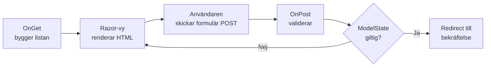

# Övning — HyresBil: presentationslager

🟡

HyresBil AB vill ha en enkel webbplats. Ingen databas, inga konton, inget krångel.

Bara en lista med tillgängliga bilar och ett formulär för att boka.

Det är precis vad du ska bygga nu. Fokuset är att förstå hur data **flödar** i en Razor Pages-applikation — från serverlogiken i PageModel till vyn, och tillbaka igen via ett formulär.



---

## Steg 1: Skapa projektet

```bash
dotnet new webapp -n HyresBil
cd HyresBil
dotnet run
```

Öppna `https://localhost:5001` och kontrollera att sidan visas. Du ska se Razors standardsida med texten "Welcome".

> `dotnet new webapp` ger dig ett Razor Pages-projekt. Mappen `Pages/` innehåller vyerna. Varje vy har en `.cshtml.cs`-fil bredvid sig — det är PageModel, serverlogiken bakom sidan.

---

## Steg 2: Skapa modellerna

Skapa mappen `Models/` i projektroten och lägg till två filer.

### Models/Bil.cs

```csharp
namespace HyresBil.Models;

// Representerar en bil i bilparken
public class Bil
{
    public string Märke { get; set; } = string.Empty;
    public string Modell { get; set; } = string.Empty;
    public int År { get; set; }
    public decimal PrisDygn { get; set; }
}
```

### Models/BokningsFormulär.cs

```csharp
using System.ComponentModel.DataAnnotations;

namespace HyresBil.Models;

// Formulärmodellen — ASP.NET Core validerar mot attributen automatiskt
public class BokningsFormulär
{
    [Required(ErrorMessage = "Du måste ange ditt namn.")]
    [StringLength(100, MinimumLength = 2, ErrorMessage = "Namn måste vara mellan 2 och 100 tecken.")]
    public string Namn { get; set; } = string.Empty;

    [Required(ErrorMessage = "Du måste välja en bil.")]
    public string BilModell { get; set; } = string.Empty;

    [Required(ErrorMessage = "Startdatum krävs.")]
    public DateTime StartDatum { get; set; } = DateTime.Today;

    [Required(ErrorMessage = "Slutdatum krävs.")]
    public DateTime SlutDatum { get; set; } = DateTime.Today.AddDays(1);
}
```

`[Required]` och `[StringLength]` är *data annotations* — attribut som definierar valideringsregler. Du behöver inte skriva valideringskod för hand. ASP.NET Core kontrollerar dem åt dig när formuläret skickas.

---

## Steg 3: Indexsidan — lista bilar

Öppna `Pages/Index.cshtml.cs` och ersätt innehållet:

### Pages/Index.cshtml.cs

```csharp
using Microsoft.AspNetCore.Mvc.RazorPages;
using HyresBil.Models;

namespace HyresBil.Pages;

public class IndexModel : PageModel
{
    // Vyn läser den här listan via Model.Bilar
    public List<Bil> Bilar { get; set; } = new();

    public void OnGet()
    {
        // Hårdkodad lista — ingen databas ännu
        Bilar = new List<Bil>
        {
            new Bil { Märke = "Volvo",  Modell = "V60",     År = 2023, PrisDygn = 699 },
            new Bil { Märke = "Tesla",  Modell = "Model 3", År = 2024, PrisDygn = 899 },
            new Bil { Märke = "Toyota", Modell = "Yaris",   År = 2022, PrisDygn = 499 },
            new Bil { Märke = "Ford",   Modell = "Focus",   År = 2021, PrisDygn = 449 },
        };
    }
}
```

Öppna `Pages/Index.cshtml` och ersätt innehållet:

### Pages/Index.cshtml

```html
@page
@model IndexModel

<h1>HyresBil — tillgängliga bilar</h1>
<p>Välj en bil och boka direkt online.</p>

@foreach (var bil in Model.Bilar)
{
    <div>
        <h3>@bil.Märke @bil.Modell</h3>
        <p>Årsmodell: @bil.År</p>
        <p>Pris: @bil.PrisDygn kr/dygn</p>
        <a href="/Boka?bilModell=@Uri.EscapeDataString($"{bil.Märke} {bil.Modell}")">
            Boka den här bilen
        </a>
    </div>
}
```

Kör projektet och kontrollera att fyra bilar visas med en länk under varje.

### Förväntad output

```plaintext
HyresBil — tillgängliga bilar
Välj en bil och boka direkt online.

Volvo V60
Årsmodell: 2023
Pris: 699 kr/dygn
Boka den här bilen

Tesla Model 3
Årsmodell: 2024
Pris: 899 kr/dygn
Boka den här bilen

Toyota Yaris
Årsmodell: 2022
Pris: 499 kr/dygn
Boka den här bilen

Ford Focus
Årsmodell: 2021
Pris: 449 kr/dygn
Boka den här bilen
```

> **Flödet hittills:** `OnGet()` i PageModel bygger listan → Razor-vyn läser `Model.Bilar` och renderar HTML. Data rör sig **nedåt** — från server till webbläsare.

---

## Steg 4: Bokningsformuläret

Skapa två nya filer: `Pages/Boka.cshtml` och `Pages/Boka.cshtml.cs`.

### Pages/Boka.cshtml.cs

```csharp
using Microsoft.AspNetCore.Mvc;
using Microsoft.AspNetCore.Mvc.RazorPages;
using HyresBil.Models;

namespace HyresBil.Pages;

public class BokaModel : PageModel
{
    // [BindProperty] kopplar formulärfälten till modellen automatiskt vid POST
    [BindProperty]
    public BokningsFormulär Formulär { get; set; } = new();

    // Körs vid GET — förifyllar bilmodell från URL-parametern
    public void OnGet(string? bilModell)
    {
        if (bilModell is not null)
        {
            Formulär.BilModell = bilModell;
        }
    }

    // Körs vid POST — när användaren skickar formuläret
    public IActionResult OnPost()
    {
        if (!ModelState.IsValid)
        {
            // Validering misslyckades — visa sidan igen med felmeddelanden
            return Page();
        }

        // Allt ok — skicka vidare till bekräftelsesidan
        return RedirectToPage("/Bekraftelse", new
        {
            namn  = Formulär.Namn,
            bil   = Formulär.BilModell,
            start = Formulär.StartDatum.ToString("yyyy-MM-dd"),
            slut  = Formulär.SlutDatum.ToString("yyyy-MM-dd")
        });
    }
}
```

### Pages/Boka.cshtml

```html
@page
@model BokaModel

<h1>Boka bil — @Model.Formulär.BilModell</h1>

<form method="post">
    <div>
        <label asp-for="Formulär.Namn">Ditt namn</label>
        <input asp-for="Formulär.Namn" type="text" />
        <span asp-validation-for="Formulär.Namn"></span>
    </div>

    <div>
        <label asp-for="Formulär.BilModell">Vald bil</label>
        <input asp-for="Formulär.BilModell" type="text" readonly />
    </div>

    <div>
        <label asp-for="Formulär.StartDatum">Startdatum</label>
        <input asp-for="Formulär.StartDatum" type="date" />
        <span asp-validation-for="Formulär.StartDatum"></span>
    </div>

    <div>
        <label asp-for="Formulär.SlutDatum">Slutdatum</label>
        <input asp-for="Formulär.SlutDatum" type="date" />
        <span asp-validation-for="Formulär.SlutDatum"></span>
    </div>

    <button type="submit">Bekräfta bokning</button>
</form>
```

`asp-for` och `asp-validation-for` är *Tag Helpers* — Razors sätt att koppla HTML-element direkt till modellens properties. De genererar rätt `name`- och `id`-attribut automatiskt, och visar felmeddelanden från `[Required]`-reglerna utan att du skriver en rad extralogik.

Klicka nu på "Boka den här bilen" på indexsidan. Formuläret öppnas med bilen förifylld.

Testa att skicka formuläret **tomt** — du ska se valideringsfel.

---

## Steg 5: Bekräftelsesidan

Skapa `Pages/Bekraftelse.cshtml` och `Pages/Bekraftelse.cshtml.cs`.

### Pages/Bekraftelse.cshtml.cs

```csharp
using Microsoft.AspNetCore.Mvc.RazorPages;

namespace HyresBil.Pages;

public class BekraftelseModel : PageModel
{
    public string Namn { get; set; } = string.Empty;
    public string Bil { get; set; } = string.Empty;
    public string Start { get; set; } = string.Empty;
    public string Slut { get; set; } = string.Empty;

    // Parametrarna matchar nycklarna i RedirectToPage-anropet i BokaModel
    public void OnGet(string namn, string bil, string start, string slut)
    {
        Namn = namn;
        Bil = bil;
        Start = start;
        Slut = slut;
    }
}
```

### Pages/Bekraftelse.cshtml

```html
@page
@model BekraftelseModel

<h1>Bokning bekräftad!</h1>

<p>Tack, <strong>@Model.Namn</strong>!</p>
<p>Du har bokat: <strong>@Model.Bil</strong></p>
<p>Från: @Model.Start</p>
<p>Till: @Model.Slut</p>

<a href="/">Tillbaka till startsidan</a>
```

### Förväntad output

```plaintext
Bokning bekräftad!

Tack, Anna Svensson!
Du har bokat: Volvo V60
Från: 2026-08-01
Till: 2026-08-05

Tillbaka till startsidan
```

---

## Flödet i ord

Det här är det viktigaste du ska ta med dig från den här övningen:

```
GET /Boka?bilModell=Volvo%20V60
  → OnGet("Volvo V60") körs i BokaModel
  → Formulär.BilModell = "Volvo V60"
  → Sidan renderas med förifyllt fält

POST /Boka  (användaren klickar "Bekräfta bokning")
  → Razor Pages läser formulärdata och binder till Formulär (tack vare [BindProperty])
  → OnPost() körs
  → ModelState.IsValid kontrolleras mot [Required] och [StringLength]
      → false → Page() — visa sidan igen med felmeddelanden intakta
      → true  → RedirectToPage("/Bekraftelse") — vidare
```

Data flödar i två riktningar:

- **Nedåt (GET):** `OnGet()` fyller properties → Razor läser `Model.*` → HTML skickas till webbläsaren
- **Uppåt (POST):** HTML-formulär → `[BindProperty]` → `OnPost()` → `ModelState`

---

## Utmanande frågor

<details><summary>Tips 1 — Vad händer utan [BindProperty]?</summary>

```plaintext
Ta bort [BindProperty] från Formulär-propertyn i BokaModel.
Fyll i formuläret och skicka.

Vad värde har Formulär.Namn inne i OnPost() nu?
Varför?

Lägg tillbaka [BindProperty] och kontrollera att det fungerar igen.
```

</details>

<details><summary>Tips 2 — Lägg till en egen valideringsregel</summary>

```plaintext
[Required] och [StringLength] kontrolleras av ModelState.IsValid automatiskt.
Men vad händer om SlutDatum är samma dag som StartDatum, eller till och med tidigare?
Det är en logikregel, inte en datatypsregel — du måste lägga till den manuellt.

Titta på ModelState.AddModelError() i dokumentationen.
Var i koden ska den kontrollen sitta?
```

</details>

<details><summary>Tips 3 — Vad ändras om du byter till databas?</summary>

```plaintext
Just nu är bilarna hårdkodade i OnGet() i IndexModel.
Om du vill hämta dem från en databas istället —

Vilken fil behöver du ändra?
Vad kan du lämna helt oförändrat?
Det är just det som är poängen med att separera data från presentation.
```

</details>

<details><summary>Lösningsförslag</summary>

**Tips 1:** Utan `[BindProperty]` vet Razor Pages inte att den ska koppla formulärdata till propertyn. `Formulär.Namn` är en tom sträng i `OnPost()` — data försvinner. `[BindProperty]` är det enda du behöver lägga till för att modellbindningen ska fungera.

**Tips 2:** Lägg till det här i `OnPost()`, direkt efter `if (!ModelState.IsValid)`-blocket:

```csharp
if (Formulär.SlutDatum <= Formulär.StartDatum)
{
    ModelState.AddModelError(
        nameof(Formulär.SlutDatum),
        "Slutdatum måste vara minst en dag efter startdatum."
    );
    return Page();
}
```

`nameof(Formulär.SlutDatum)` kopplar felmeddelandet till rätt fält i vyn — det visas bredvid slutdatumfältet.

**Tips 3:** Bara `OnGet()` i `IndexModel` behöver ändras — raden där du skapar `new List<Bil>`. Vyn, länkarna och resten av applikationen är helt opåverkade. Det är det som menas med separation mellan data och presentation.

</details>

---

Det här är grunden för presentationslagret i ASP.NET Core. Razor Pages håller serverlogik och vy nära varandra — en vy, en PageModel, ett ansvar. Kör igång, boka en imaginär bil, läs felmeddelandena när något strular. Det är så det fastnar.
