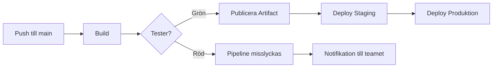

# CI/CD — Programmeringstermer

> 🖼️ **Bild:** Meme — "det funkar på min dator" med en person som skjuter iväg sin laptop. Undertext: "Continuous Integration löser detta."

---

## CI · Kontinuerlig integration

CI betyder att alla i teamet pushar kod ofta — flera gånger per dag — och att koden automatiskt byggs och testas varje gång.

Tänk på det som en kock som smakar av maten kontinuerligt medan den lagas, inte bara på tallriken. Du hittar problemen innan det är dags att servera.

```yaml
# azure-pipelines.yml (minimal CI-trigger)
trigger:
  - main

pool:
  vmImage: ubuntu-latest

steps:
  - script: dotnet build
  - script: dotnet test
```

Utan CI: du kodar i en vecka, mergar, och allt explodera. Med CI: du vet direkt om din ändring bröt något.

> 🖼️ **Bild:** Skärmdump av ett grönt CI-bygge i Azure DevOps — alla checkmarks, "Build succeeded"

---

## CD · Kontinuerlig leverans/driftsättning

CD är nästa steg efter CI. När koden passerat testerna rullas den automatiskt ut — antingen till en staging-miljö (Continuous Delivery) eller direkt till produktion (Continuous Deployment).

Det är som en löpande band-fabrik. Bilen byggs, inspekteras, och glider direkt ut på lastbilen — ingen mänsklig handpåläggning.

```yaml
stages:
  - stage: Deploy
    jobs:
      - job: DeployToAzure
        steps:
          - task: AzureWebApp@1
            inputs:
              appName: 'min-webapp'
```

Skillnaden: Delivery kräver att en människa trycker på "godkänn". Deployment skickar ut automatiskt. På ett nytt jobb — fråga alltid vilket de kör.

---

## Pipeline · Rörledning

En pipeline är kedjan av automatiserade steg som koden går igenom: bygg → test → publicera → deploy. Varje steg måste lyckas innan nästa startar.

Tänk på det som ett fabriksband — om en maskin hakar upp sig, stannar hela bandet. Inget halvfärdigt hamnar hos kunden.



Utan pipeline: "fungerar på min dator" är ett äkta problem. Med pipeline: om det byggs och testas automatiskt vet du att det fungerar objektivt.

> 🖼️ **Bild:** Skärmdump av en Azure DevOps-pipeline med gröna/röda steg synliga

---

## Build Agent · Byggserver

En build agent är servern som faktiskt kör pipeline-jobben. Microsoft tillhandahåller gratis agenter (Microsoft-hosted) eller så kör du din egen (self-hosted).

Tänk på det som en lärling som tar emot dina instruktioner, kör dem, och rapporterar tillbaka om det gick bra eller dåligt.

En Microsoft-hosted agent startar fräsch vid varje pipeline-körning — inga kvarlevor från tidigare byggen. En self-hosted agent kör på din egen server och kan ha verktyg förininstallerade.

Vanligt misstag: du installerar ett verktyg lokalt men glömmer att konfigurera agenten att göra samma. Pipelinen misslyckas med "command not found".

---

## Artifact · Byggartefakt

En artifact är resultatet av ett bygge — den kompilerade applikationen, en zip-fil, ett Docker-image — packad och sparad så att senare steg kan använda den.

Det är som att baka ett bröd: mjöl + vatten + värme → bröd. Brödets artifact är brödet — klart att ätas (eller deployeras).

```yaml
- task: PublishBuildArtifacts@1
  inputs:
    pathToPublish: '$(Build.ArtifactStagingDirectory)'
    artifactName: 'webapp'
```

Poängen: deploy-steget ska använda den färdigbyggda artifakten, inte bygga om från källkod. Annars kan deploy och test ha kört på olika kod.

---

## Trigger · Utlösare

En trigger är händelsen som startar en pipeline. Vanligast: push till en branch, en pull request, eller ett schemalagt klockslag.

Det är som ett larm — du ställer in vad som ska hända (push till main) och vad som ska triggas (kör hela pipelinen).

```yaml
trigger:
  branches:
    include:
      - main
      - feature/*

pr:
  branches:
    include:
      - main
```

Här kör pipelinen när du pushar till `main` eller en `feature/`-branch, och även när en pull request öppnas mot `main`.

---

## YAML Pipeline · YAML-pipeline

En YAML-pipeline är en pipeline definierad i en textfil (`azure-pipelines.yml`) som ligger i repot — alltså versionshanterad precis som din kod.

Tänk på det som ett recept i kokboken. Det är skrivet ned, alla kan läsa det, och det ändras bara om du medvetet skriver om det.

Motsatsen är en "klassisk pipeline" som konfigureras i ett GUI — svårt att se historik, svårt att code-reviewa, svårt att återskapa om något går fel.

> 🖼️ **Bild:** Sida-vid-sida: YAML-pipeline i VS Code till vänster, Azure DevOps pipeline-visualisering till höger

---

## Stage · Fas

En stage är en logisk fas i pipelinen. Typiskt: Build, Test, Deploy-Staging, Deploy-Prod. Stages körs i ordning och kan bero på varandra.

Det är som tre våningar i en byggnad — du kan inte gå till tredje utan att passera andra. Deploy till produktion kräver att build och test redan är gröna.

```yaml
stages:
  - stage: Build
    jobs: [...]

  - stage: Test
    dependsOn: Build
    jobs: [...]

  - stage: Deploy
    dependsOn: Test
    jobs: [...]
```

Du kan också ha stages som kräver manuellt godkännande — någon i teamet trycker "OK" innan deploy till produktion.

---

## Job · Jobb

Ett job är en samling tasks som körs sekventiellt på en build agent. Olika jobs i samma stage kan köras parallellt på olika agenter.

Tänk på det som en arbetsorder till en specifik lärling. En lärling kör en sak i taget, men du kan ha flera lärlingar igång samtidigt.

```yaml
jobs:
  - job: BuildBackend
    steps:
      - script: dotnet build src/Api

  - job: BuildFrontend
    steps:
      - script: npm run build
```

Här körs `BuildBackend` och `BuildFrontend` parallellt — sparar tid om du har en stor app med backend + frontend.

---

## Task · Uppgift

En task är det minsta steget i en pipeline — ett enskilt kommando eller en inbyggd Azure DevOps-action.

Det är som en enskild instruktion på en arbetslista: "kör dotnet build", "ladda upp fil", "skicka notifiering".

```yaml
steps:
  - task: DotNetCoreCLI@2
    inputs:
      command: 'build'
      projects: '**/*.csproj'

  - task: DotNetCoreCLI@2
    inputs:
      command: 'test'
      projects: '**/*Tests.csproj'
```

Microsoft har hundratals färdiga tasks (Azure Web App, Docker, Kubernetes, NuGet...). Du kan också skriva egna script-tasks med `- script:`.
