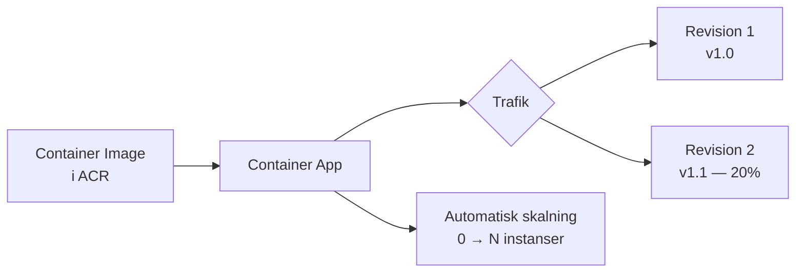

# Container Appar — Programmeringstermer

> 🖼️ **Bild:** Azure-portalen med en Container App som visar aktiva revisioner och en grön "Running"-status

---

## Container App · Containerapp

Azure Container Apps är en hanterad plattform för att köra containeriserade applikationer utan att du behöver tänka på servrar, Kubernetes eller skalning.

Tänk på det som att hyra en kontorsplats med gemensam reception, IT och städning — du behöver bara fokusera på ditt eget arbete, inte byggnaden.



Utan Container Apps: du behöver konfigurera Kubernetes, Ingress Controllers, certifikat, auto-scaling policies — hundrals rader YAML. Med Container Apps: det är inbyggt.

---

## Revision · Revision

Varje gång du deployar en ny version av din Container App skapas en ny revision. Gamla revisioner kan köras parallellt med nya.

Tänk på det som versioner av ett dokument — du kan gå tillbaka till version 3 om version 4 visade sig ha buggar.

```bash
az containerapp update \
  --name min-app \
  --resource-group min-rg \
  --image myregistry.azurecr.io/min-app:v2

# Nu finns revision v1 och revision v2 — du kan dela trafiken
```

Revisioner används för canary releases: skicka 10% av trafiken till den nya revisionen och se om den beter sig som förväntat innan du kör 100%.

> 🖼️ **Bild:** Azure-portalen — "Revisions" flik med två revisioner, en med 80% trafik och en med 20%

---

## Ingress · Ingångspunkt

Ingress i Container Apps styr hur trafik når din app: HTTPS eller HTTP, extern (internet) eller intern (bara inom Azure), och på vilken port.

Det är som receptionen på ett kontor. All besökstrafik går igenom receptionen, som kontrollerar att folk är välkomna och visar dem rätt väg.

```yaml
# I Bicep/ARM-konfiguration
ingress:
  external: true      # Tillgänglig från internet
  targetPort: 80      # Container lyssnar på port 80
  transport: http
  traffic:
    - latestRevision: true
      weight: 100
```

Vanligt misstag: du ändrar containerporten utan att uppdatera `targetPort` i ingress-konfigurationen. App:en deployar men svarar inte på förfrågningar.

---

## Scaling · Skalning

Azure Container Apps kan skala antalet containerinstanser automatiskt — ner till noll om ingen använder appen, upp till hundratals om det plötsligt strömmar in trafik.

Det är som ett butiksbiträde som kallas in när det är kö och går hem när det är tomt — du betalar bara när de jobbar.

```json
{
  "minReplicas": 0,
  "maxReplicas": 10,
  "rules": [
    {
      "name": "http-scaling",
      "http": {
        "metadata": {
          "concurrentRequests": "100"
        }
      }
    }
  ]
}
```

Skala till noll = ingen kostnad när appen inte används. Bra för dev/test-miljöer. I produktion: sätt minReplicas till 1 om cold start (uppstartstid) är ett problem.

---

## Dapr · Dapr

Dapr (Distributed Application Runtime) är ett ramverk som förenklar kommunikation och tillståndshantering mellan mikroservices. Azure Container Apps har inbyggt stöd.

Tänk på det som en standardiserad post-service för dina appar. Istället för att varje app skriver sin egen kod för att skicka meddelanden, hantera state och anropa varandra — använder de alla samma post-service.

Dapr ger dig: service-to-service-anrop, pub/sub-meddelanden, state management, secret management — utan att du skriver infrastrukturkod.

Behöver du Dapr i kurs-06? Förmodligen inte — det är avancerat. Men det är bra att veta att det finns och vad det löser.

---

## Environment Variables · Miljövariabler

Konfiguration som injiceras i containern vid start: databaskopplingar, API-nycklar, feature-flaggor. Aldrig hårdkodade i imagen.

Det är som att fylla i ett formulär när du hyr en kontorsplats: WiFi-lösenord, dörrkodar, printeradress — du får dem på plats, de är inte inbyggda i möblerna.

```bash
az containerapp update \
  --name min-app \
  --resource-group min-rg \
  --set-env-vars \
    "ASPNETCORE_ENVIRONMENT=Production" \
    "ConnectionStrings__Default=secretref:db-connection"
```

Hemligheter (lösenord, API-nycklar) pekas ut med `secretref:` och lagras separat — aldrig i klartext i konfigurationen. Använd Azure Key Vault för känsliga värden.

> 🖼️ **Bild:** Azure-portalen — "Environment variables"-flik med synliga nycklar men dolda värden (asterisker)

---

## Ingress Restriction · Ingångsbegränsning

Du kan begränsa vem som kan nå din Container App: bara från specifika IP-adresser, bara från Azure Virtual Network, eller bara internt inom Container Apps-miljön.

Tänk på det som dörrkodar till en byggnad. Ni på kontoret har koden — besökare utifrån utan kod kan inte komma in.

I produktion: din admin-API bör aldrig vara tillgänglig från internet. Sätt ingress till `internal` och nå den bara via Azure Private Endpoint eller VPN.

Vanligt misstag: du lämnar allt öppet externt under dev och glömmer att begränsa i produktion. Resultat: en öppen admin-endpoint på internet.

---

## GitHub Container Registry (GHCR) · GitHub-containerregister

GHCR är GitHubs inbyggda containerregister. Du pushar images dit som en del av din GitHub Actions-pipeline och Azure Container Apps hämtar dem därifrån.

Det är som att ha ett eget bildbibliotek på din GitHub-profil. Allt ligger samlat — källkod, CI/CD och images.

```yaml
# GitHub Actions — bygg och pusha image till GHCR
- name: Build and push
  uses: docker/build-push-action@v5
  with:
    push: true
    tags: ghcr.io/ditt-användarnamn/min-app:latest
```

Fördelen: gratis för publika repos, billigt för privata. Nackdelen jämfört med ACR: sämre integration med Azure's hanterade identiteter.

---

## Azure Container Registry (ACR) · Azure-containerregister

ACR är Microsofts privata containerregister — tätt integrerat med Azure Container Apps, Azure Kubernetes Service och Azure DevOps.

Det är som ett privat bildbibliotek inne i Azure. Container Apps kan hämta images utan att du behöver hantera inloggningsuppgifter — tack vare Managed Identity.

```bash
# Skapa ett ACR
az acr create --name mittregistry --resource-group min-rg --sku Basic

# Bygg och pusha direkt i Azure (utan lokal Docker)
az acr build --registry mittregistry --image min-app:v1 .
```

Med Managed Identity: Container App autentiserar mot ACR automatiskt — inga hemliga nycklar att hantera. Det är rätt sätt att göra det.

---

## KEDA · KEDA

KEDA (Kubernetes Event-driven Autoscaling) skapar containrar baserat på externa händelser — inte bara CPU eller HTTP-trafik. Meddelanden i en Azure Service Bus-kö, rader i en databas, meddelanden i en event hub.

Tänk på det som att ta in extrapersonal exakt när en beställning läggs, inte när serverrummet blir varmt.

```json
{
  "name": "queue-scaling",
  "azureQueue": {
    "queueName": "beställningar",
    "queueLength": "5",
    "connectionFromEnv": "QUEUE_CONNECTION"
  }
}
```

Praktiskt scenario: du har en video-konverterare som container. KEDA skalas upp en ny instans för varje video som läggs i kön — och ner till noll när kön är tom. Perfekt passform, perfekt kostnad.
