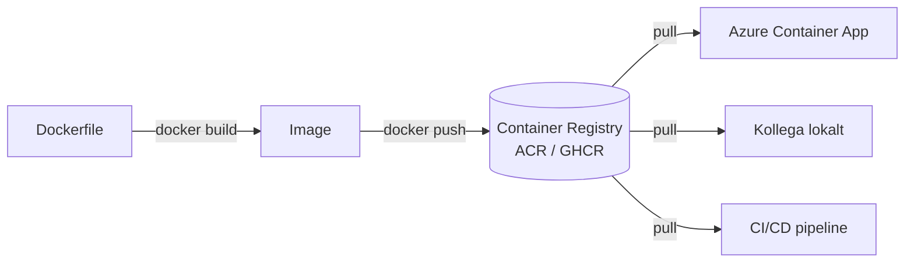

# Docker — Programmeringstermer

> 🖼️ **Bild:** Den klassiska Docker-logotypen med valen som bär containrar på ryggen. Undertill: "en container = en sak, en sak = en container"

---

## Container · Container

En container är en lättviktig, fristående körbar enhet som packar ihop din kod, alla beroenden och konfiguration — och kör likadant oavsett var du startar den.

Tänk på det som en matbehållare med lock: maten är din app, behållaren är containern. Öppnar du den hemma eller på jobbet — maten är densamma.

```bash
docker run -p 8080:80 nginx
# Startar en nginx-webbserver, tillgänglig på localhost:8080
```

Utan containrar: "fungerar på min dator" är ett äkta problem. Med containrar: om det kör i din container kör det i Azures container.

> 🖼️ **Bild:** Diagram — din dator vs servern, med containern som "reser" exakt likadan mellan dem

---

## Image · Avbild

En image är mallen som containrar skapas från. Den är oföränderlig — du kan inte ändra en körande image, bara skapa en ny version.

Det är som ett IKEA-instruktionsblad. Du kan bygga hur många hyllor som helst från samma instruktionsblad, och de blir identiska varje gång.

```bash
docker build -t min-app:v1 .
docker images
# REPOSITORY   TAG   IMAGE ID       SIZE
# min-app      v1    abc123def456   215MB
```

Images versionshanteras med taggar (`v1`, `latest`, `2.3.1`). I produktion: använd aldrig `latest` — det är oförutsägbart vad du faktiskt kör.

---

## Dockerfile · Dockerfil

En Dockerfile är textfilen med instruktioner för att bygga en image. Varje rad skapar ett nytt lager i imagen.

Tänk på det som ett recept: ingredienser i ordning, steg för steg. Docker följer receptet och bakar din image.

```dockerfile
FROM mcr.microsoft.com/dotnet/aspnet:9.0 AS base
WORKDIR /app
EXPOSE 80

FROM mcr.microsoft.com/dotnet/sdk:9.0 AS build
COPY . .
RUN dotnet publish -c Release -o /app/publish

FROM base AS final
COPY --from=build /app/publish .
ENTRYPOINT ["dotnet", "MinApp.dll"]
```

Varje `RUN`, `COPY`, `FROM` skapar ett lager. Layrar cachas — ändrar du bara din kod (sista lagret) behöver Docker inte ladda ner SDK:n igen.

> 🖼️ **Bild:** Diagram som visar Dockerfile → lager-på-lager → färdig image som en tårta med synliga lager

---

## Docker Hub · Dockernav

Docker Hub är standardregistret för Docker-images. Publika images (nginx, postgres, node) finns här gratis. Du kan också ladda upp egna — publika eller privata.

Det är som App Store men för containrar. Vill du köra en Redis-databas lokalt: `docker pull redis` hämtar den officiella imagen direkt.

```bash
docker pull redis:7.2
docker run -d redis:7.2
```

Var försiktig med okänd images från Docker Hub — precis som att installera okänd mjukvara. Officiella images (märkta "Docker Official Image") är granskade.

---

## Container Registry · Containerregister

Ett container registry är en tjänst för att lagra och distribuera dina egna container-images. Tänk Docker Hub, men privat och integrerat med din CI/CD-pipeline.

Det är som ett privat förråd på jobbet. Ditt team pushar images dit, Azure hämtar därifrån — ingen utomstående ser något.



Azure Container Registry (ACR) är Microsofts version. GitHub Container Registry (GHCR) är GitHubs. Båda integrerar sömlöst med Azure-tjänster.

---

## Volume · Volym

En volume är persistent lagring kopplad till en container. Data i volymer överlever omstarter och nya versioner av containern.

Tänk på det som ett USB-minne inkopplat i en dator. Du byter ut datorn (ny container-version) men USB-minnet följer med och har all data kvar.

```bash
docker run -v min-databas:/var/lib/mysql mysql:8.0
# Data i /var/lib/mysql sparas i volymen "min-databas"
# Startar du om containern finns datan kvar
```

Utan volume: varje gång du startar om en databascontainer är databasen tom. Det vill du inte i produktion.

---

## Port Mapping · Portmappning

Containers har sina egna interna portar. Port mapping bestämmer vilken port på din dator (eller server) som leder in till containern.

Det är som ett kontorskomplexs telefonväxel. Utifrån ringer du 08-123 4567 (port 8080), men inuti kopplar växeln dig till rum 206 (port 80).

```bash
docker run -p 8080:80 nginx
#              ↑    ↑
#     din dator  container
# localhost:8080 → container:80
```

Kör du flera containrar på samma server behöver de olika yttre portar. Du kan ha tusen containrar som alla lyssnar internt på port 80 — ingen konflikt.

---

## Multi-stage Build · Flerstegbygge

En multi-stage Dockerfile har flera `FROM`-satser. Den separerar byggmiljön (med SDK, kompilatorer, devtools) från produktionsmiljön (bara runtime).

Tänk på det som att baka bröd i ett bageri men leverera det i en ren kartong. Bageriet (SDK) behöver inte följa med hem till kunden.

```dockerfile
# Steg 1: Bygg (stor image med SDK)
FROM mcr.microsoft.com/dotnet/sdk:9.0 AS build
COPY . .
RUN dotnet publish -c Release -o /out

# Steg 2: Runtime (liten image utan SDK)
FROM mcr.microsoft.com/dotnet/aspnet:9.0
COPY --from=build /out .
ENTRYPOINT ["dotnet", "MinApp.dll"]
```

Resultatet: en .NET SDK-image är ~750 MB. En runtime-image är ~250 MB. Du halverar storleken och minskar attackytan.

> 🖼️ **Bild:** Storlek-jämförelse — stor byggimage (SDK) till vänster, liten produktionsimage (runtime) till höger med måttband

---

## docker-compose · Docker Compose

docker-compose låter dig definiera och starta flera containrar med en enda YAML-fil. Webbapp + databas + cache = tre containrar, en fil, ett kommando.

Det är som att beställa en hel kontorsuppsättning i ett enda formulär istället för att beställa skrivbord, stol och lampa var för sig.

```yaml
# docker-compose.yml
services:
  web:
    build: .
    ports:
      - "8080:80"
    depends_on:
      - db

  db:
    image: postgres:16
    environment:
      POSTGRES_PASSWORD: hemligt123
    volumes:
      - pgdata:/var/lib/postgresql/data

volumes:
  pgdata:
```

```bash
docker compose up    # Startar allt
docker compose down  # Stoppar och tar bort containrarna
```

Används primärt för lokal utveckling. I Azure kör du Container Apps eller liknande istället.

---

## Orchestrator · Orkestrator

En orchestrator är systemet som hanterar containrar i stor skala: startar dem, stänger ned dem, skalar upp och ner, och håller dem igång om de kraschar.

Det är som en platschef på en byggarbetsplats. Platschefen vet vilka hantverkare (containrar) som behövs, kontrollerar att de är på plats, och kallar in fler om arbetsbelastningen ökar.

Kubernetes är den dominerande orkestratorern. Azure Kubernetes Service (AKS) är Microsofts hanterade variant. Azure Container Apps är en förenklad version som sköter Kubernetes-komplexiteten åt dig.

Behöver du verkligen Kubernetes? De flesta appar behöver det inte. Azure Container Apps ger 80% av kapaciteten utan 80% av komplexiteten.
