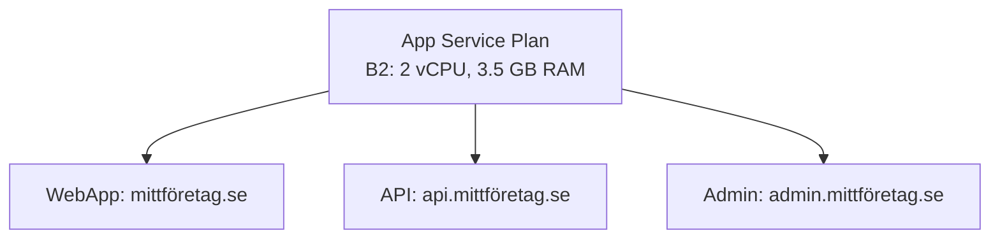
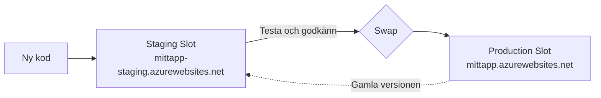
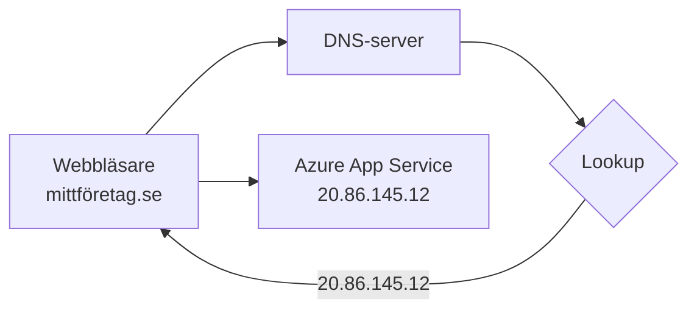

# Webbapplikationer — Programmeringstermer

> 🖼️ **Bild:** Azure-portalen med en App Service som visar "Running" i grönt, URL synlig i övre hörnet

---

## Azure App Service · Azure App Service

Azure App Service är Microsofts PaaS-tjänst för webbapplikationer. Du laddar upp din kod (eller container-image) och Azure sköter servrar, OS-uppdateringar, lastbalansering och certifikat.

Tänk på det som att hyra ett färdigt kontor med el, internet och städning ingått. Du tar med dig ditt arbete och börjar jobba — du bygger inte kontoret från grunden.

```bash
# Deploya en .NET-app direkt till App Service
az webapp up \
  --name min-webbapp \
  --resource-group min-rg \
  --runtime "DOTNET|9.0" \
  --location swedencentral
```

App Service passar bäst för traditionella webbappar och API:er. Behöver du mer kontroll eller containrar i skala — titta på Azure Container Apps istället.

---

## App Service Plan · App Service-plan

En App Service Plan definierar de faktiska resurserna — CPU, minne, antal instanser — som din App Service körs på. Du kan ha flera App Services på samma plan.

Det är som ett kontorsgolv du hyr. Du kan ha fem team (App Services) på samma golv (plan), men golvet har ett fast antal skrivbord (resurser). Alla team delar.



Prisnivåer: Free (F1), Shared (D1), Basic (B1–B3), Standard (S1–S3), Premium (P1v3–P3v3). Free och Shared delar resurser med andra kunder. Basic och uppåt är dedikerade.

Vanligt misstag: du kör tre appar på Free-planen och undrar varför det är långsamt. Svaret: 60 minuters CPU/dag för alla tre, delade med tusentals andra.

---

## Deploy Slot · Driftsättningsplats

En deployment slot är en separat slot på din App Service — med en unik URL — där du kan testa en ny version innan den går live. Du byter sedan med "swap".

Tänk på det som ett provrum i en klädbutik. Du provar jackan i provrummet (staging-slot) innan du tar på dig den och går ut (swap till produktion).



Swap byter DNS — ingen downtime. Om den nya versionen har fel kan du swap tillbaka på sekunder. Kräver Standard-plan eller högre.

> 🖼️ **Bild:** Azure-portalen — "Deployment slots"-flik med "production" och "staging" synliga, swap-knappen markerad

---

## Kudu · Kudu

Kudu är det inbyggda hanteringsverktyget i App Service. Via Kudu kan du se filer, köra kommandon i en konsol, inspektera processer och debugga.

Det är som nödingången på baksidan av en byggnad. Behöver du se vad som faktiskt pågår inuti en körande app — Kudu ger dig direkt tillgång.

```
# Nå Kudu på:
https://din-app.scm.azurewebsites.net
```

Kudu visar loggfiler i realtid, låter dig köra PowerShell eller Bash, och ser vilka filer som faktiskt är deployade. Ovärderligt när något krånglar i produktion.

---

## WebJobs · Webbjobb

WebJobs är bakgrundsjobb som körs inuti en App Service. Continuous (kör hela tiden), eller Triggered (startar på schema eller manuellt).

Det är som städpersonalen på ett kontor. Webbappen hjälper besökarna på dagtid; WebJobbet städar och underhåller under natten utan att störa.

```csharp
// Program.cs — WebJob
var builder = new HostBuilder()
    .ConfigureWebJobs(b =>
    {
        b.AddAzureStorageCoreServices();
        b.AddAzureStorageQueues();
    });

// Kör när ett meddelande dyker upp i kön
public static void ProcessQueueMessage(
    [QueueTrigger("min-kö")] string meddelande,
    ILogger logger)
{
    logger.LogInformation($"Bearbetar: {meddelande}");
}
```

Alternativ: Azure Functions (bättre för event-driven), eller Container Apps med KEDA-scaling. WebJobs är äldst och enklast om du redan kör App Service.

---

## Always On · Alltid på

Inställningen "Always On" håller App Service-processen levande även om inga förfrågningar kommer in. Utan den stängs appen ner efter inaktivitet.

Tänk på det som att hålla en butik öppen vs att låsa dörrarna när det är tomt. Med Always On är butiken alltid öppen och redo att ta emot kunder direkt.

```bash
az webapp config set \
  --name min-app \
  --resource-group min-rg \
  --always-on true
```

Utan Always On: din app "somnar" efter 20 minuter. Nästa besökare upplever en lång cold start (5–30 sekunder). Kräver Basic-plan eller högre. Nödvändigt för WebJobs.

---

## DNS · DNS

DNS (Domain Name System) översätter domännamn (mittföretag.se) till IP-adresser som datorer faktiskt kan kommunicera med.

Det är som en telefonkatalog. Du slår upp "mittföretag.se" (namn) och får tillbaka "20.86.145.12" (numret). Utan DNS skulle du behöva memorera IP-adresser.



DNS-poster du behöver känna till:
- **A-post**: pekar domän → IP-adress
- **CNAME**: pekar domän → en annan domän (alias)
- **TXT**: verifieringspost (används av Azure för att bekräfta ägande)

---

## Custom Domain · Eget domännamn

En custom domain är ditt egna domännamn kopplat till App Service — istället för den automatiska `*.azurewebsites.net`-adressen.

Det är skillnaden mellan att ge ut `mittföretag.azurewebsites.net` och `mittföretag.se` på ditt visitkort. Den ena ser professionell ut, den andra ser ut som ett dev-test.

```bash
# 1. Lägg till domänen i App Service
az webapp config hostname add \
  --webapp-name min-app \
  --resource-group min-rg \
  --hostname www.mittföretag.se

# 2. Azure ger dig en TXT/CNAME att lägga i DNS
# 3. Din DNS-leverantör: skapa posten
# 4. Azure verifierar och aktiverar
```

Processen: köp domän → skapa DNS-post hos din DNS-leverantör → lägg till i App Service → Azure verifierar → klart.

> 🖼️ **Bild:** Skärmdump av Azure-portalen "Custom domains"-flik med en grön bock bredvid ett domännamn

---

## TLS/SSL · TLS/SSL

TLS (Transport Layer Security) krypterar trafiken mellan webbläsaren och servern. Det är det som gör att webbläsaren visar hänglåset och `https://`.

Tänk på det som ett oansenligt kuvert som du förseglar med vax. Ingen kan läsa innehållet utan att bryta förseglingen — och du ser direkt om någon försökt.

```bash
# App Service med eget domännamn — aktivera gratis certifikat
az webapp config ssl bind \
  --certificate-thumbprint <tumavtryck> \
  --ssl-type SNI \
  --name min-app \
  --resource-group min-rg
```

App Service har inbyggd integration med gratis SSL-certifikat via App Service Managed Certificate. Utan TLS sänder webbläsare varningar — och din app tappar trafik.

---

## App Configuration · Appkonfiguration

Azure App Configuration är en central tjänst för att hantera konfigurationsvärden och feature flags för alla dina appar — istället för att ha dem spridda i appsettings.json-filer.

Det är som en central inköpslista för hela huset. Istället för att varje rum har sin egen lista finns allt på ett ställe — och alla vet var de ska leta.

```csharp
// Program.cs — koppla App Configuration
builder.Configuration.AddAzureAppConfiguration(options =>
{
    options.Connect(connectionString)
           .UseFeatureFlags();
});

// Använda en feature flag i koden
if (_featureManager.IsEnabledAsync("NyStartsida").Result)
{
    // Visa ny design
}
```

Feature flags är det riktigt kraftfulla: du kan aktivera ny funktionalitet för 10% av användarna, utan en ny deploy. Perfekt för A/B-testning och gradvis utrullning.
