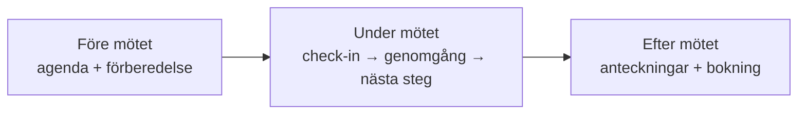
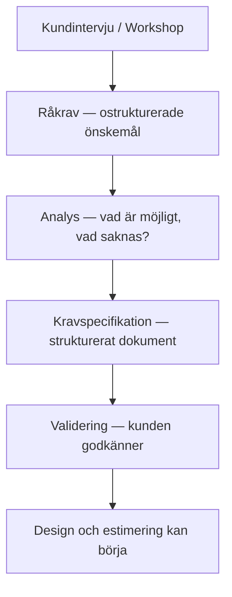
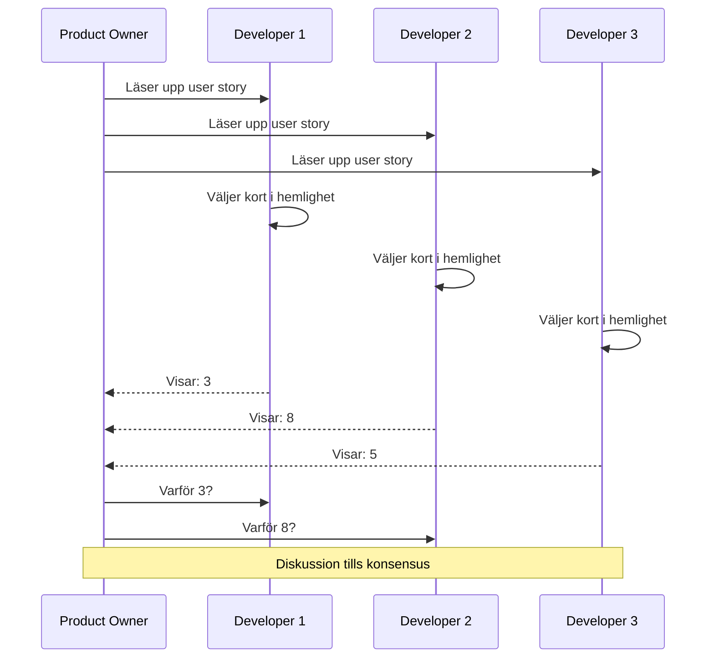
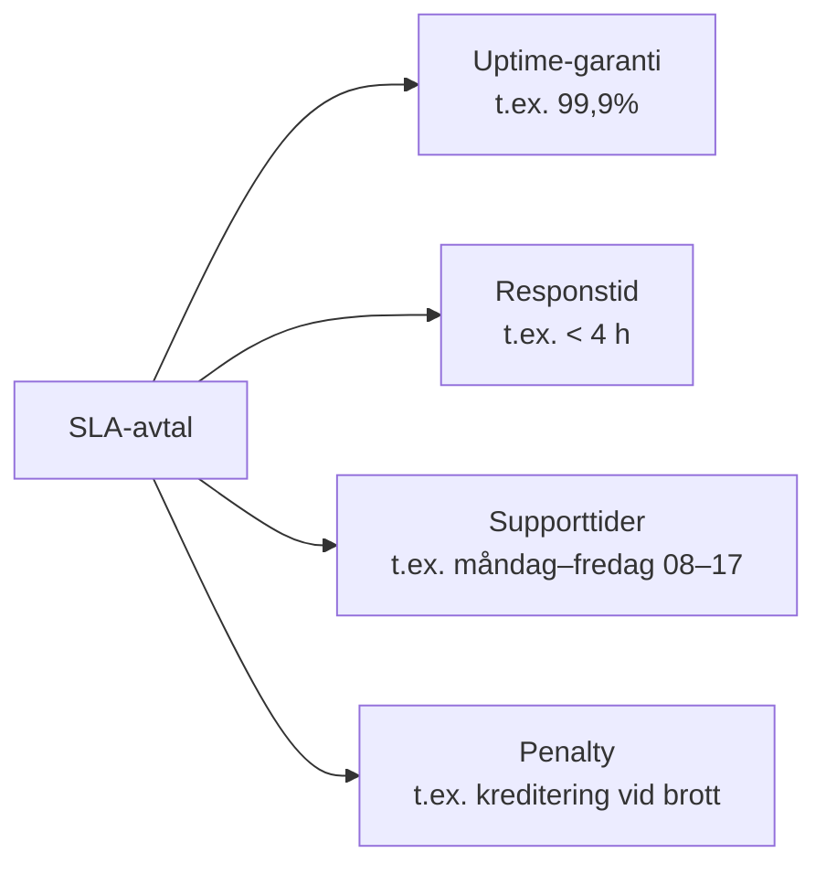
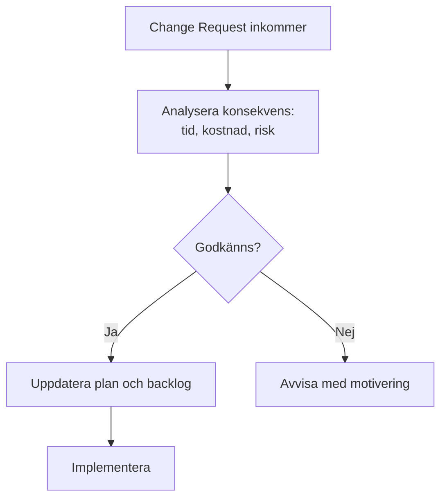

# 02 Kundmöten och Konsultarbete — Programmeringstermer

---

## Kundmöte · Client Meeting

Ett strukturerat möte med kund där ni stämmer av status, visar framsteg, samlar krav eller fattar beslut. Ett bra kundmöte har en agenda, ett syfte och ett tydligt nästa steg.

Tänk på det som ett sprint review fast med publiken utanför teamet — du visar vad du byggt och lyssnar på om det är rätt sak.

**Mötets tre faser:**

| Fas | Vad du gör | Vanligt misstag |
|---|---|---|
| Före | Skicka agenda, förbered demo | Improvisera utan förberedelse |
| Under | Lyssna mer än du pratar | Köra monolog om teknik |
| Efter | Skicka anteckningar inom 24 h | Glömma att följa upp |

**Vanligt misstag:** Gå in i ett kundmöte utan agenda. Kunden vet inte vad de ska ta med sig — och mötet blir en öppen diskussion utan beslut.

> 🖼️ **Bild:** En laptop-skärm med en Google Docs-agenda för ett kundmöte — tidssatta punkter, tydliga ägare per punkt.

---

## Kravinsamling · Requirements Gathering

Processen att ta reda på vad kunden faktiskt behöver — inte bara vad de säger att de vill ha. Kunder vet ofta vad de upplever som problem, men inte alltid vilken lösning som löser det.

Tänk på det som att fråga en patient om symtom — du lyssnar, men du ställer egna frågor för att ställa rätt diagnos. Kunden berättar om smärtan, du räknar ut vad som orsakar den.

**Frågetekniker:**

| Fråga | Syfte |
|---|---|
| "Kan du ge ett konkret exempel?" | Gör abstrakt krav till verklighet |
| "Vad händer om den här funktionen saknas?" | Bedöm prioritet |
| "Varför är det viktigt?" | Förstå det verkliga behovet |
| "Hur vet vi att det är klart?" | Definiera acceptanskriterier |
| "Vem använder det och hur ofta?" | Förstå användarbeteende |

**Vanligt misstag:** Kunden säger "vi vill ha en sökfunktion". Utan kravinsamling bygger du kanske en fulltext-sökning när de egentligen bara vill filtrera på kategori.

> 🖼️ **Bild:** Sticky-notes på en whiteboard, grupperade i teman — ett affinity map från en kravworkshop.

---

## Kravspecifikation · Requirements Specification

Ett dokument som formellt beskriver vad systemet ska göra, hur bra det ska göra det och vad som definerar "klart". Grundlaget för design, estimering och test.

Tänk på det som ett kontrakt i pseudokod — det är inte kod, men det är tillräckligt precist för att du ska kunna koda mot det.

**Kravspecifikationens delar:**

| Del | Vad det är | Exempel |
|---|---|---|
| Funktionella krav | Vad systemet ska göra | "Användaren ska kunna logga in med e-post" |
| Icke-funktionella krav | Hur bra det ska göra det | "Inloggning ska ta < 2 sekunder" |
| Acceptanskriterier | Hur vi vet att det är klart | "Testat med 100 concurrent users utan timeout" |
| Prioritering | MoSCoW — Must/Should/Could/Won't | "Inloggning = Must, Dark mode = Could" |

**Edge case:** Kravspecifikationer skrivna utan kundvalidering leder till att du bygger rätt system för fel behov. Kunden som inte läser specen har ingen rätt att klaga — men det är fortfarande ditt problem.

> 🖼️ **Bild:** En Google Docs-kravspecifikation med tre kolumner: krav, prioritet, acceptanskriterium — och en kommentartråd där kunden svarar.

---

## Tidsestimering · Time Estimation

Att uppskatta hur lång tid en uppgift tar att utföra. En av de svåraste sakerna i softwareutveckling — och en av de viktigaste för att hålla deadlines och förtroende.

Tänk på det som att packa en ryggsäck inför en vandring: du vet aldrig exakt vad som behövs, men du har lärt dig att alltid ta med mer än du tror.

**Hofstadters lag:** Allt tar längre tid än du tror — även när du tar hänsyn till Hofstadters lag.

**Estimeringsregel:**
1. Dela upp uppgiften i delar om 3–8 timmar
2. Summera
3. Multiplicera med 1,5–2x
4. Lägg till overhead: möten, review, deploy, buggar

| Overhead-typ | Typisk kostnad |
|---|---|
| Code review | 15–30 % |
| Möten och kommunikation | 10–20 % |
| Deploy och miljöproblem | 10–20 % |
| Oförutsedda buggar | 20–30 % |

**Vanligt misstag:** Estimera enbart kodscrkningstid och glömma allt runtomkring. En funktion som tar 2 timmar att koda kan ta 6 timmar att leverera.

> 🖼️ **Bild:** En post-it-planering (t.ex. Jira-sprint board) med tre tasks, var och en med estimat och faktisk tid — visually ser man att faktisk alltid är mer.

---

## Planeringspoker · Planning Poker

En Scrum-teknik för att estimera storlek på user stories. Teamet röstar samtidigt med kort (Fibonacci-sekvensen: 1, 2, 3, 5, 8, 13, 21) för att undvika grupptänk och anchoring.

Tänk på det som att alla håller upp sin hand med slutna fingrar tills någon säger "visa" — då visar alla sin gissning samtidigt. Det förhindrar att den första rösten styr resten.

**Varför Fibonacci och inte 1–10:** Fibonacci-skalets ökande gap speglar att precisionen minskar ju större uppgiften är. En task på "8" är inte dubbelt så stor som "4" — den är fundamentalt mer osäker.

**Vanligt misstag:** Använda planeringspoker utan att ha brutit ned user stories i förväg. Du kan inte estimera "Bygg inloggning" — men du kan estimera "Implementera JWT-validering i middleware".

> 🖼️ **Bild:** Fysiska planning poker-kort (med Fibonacci-siffrorna) på ett bord runt ett team — eller en digital version som PlanningPoker.live.

---

## Konsultrollen · The Consultant Role

Att arbeta som extern expert hos en kund — du är inte anställd av dem, men du levererar som om du vore det. Du fakturerar din tid, men det du säljer är egentligen expertis och förtroende.

Tänk på det som en läkarvikarie: du kliver in i ett system du inte byggt, lär dig snabbt hur det fungerar, och levererar värde — sedan går du vidare till nästa uppdrag.

**De fyra konsultdygderna:**

| Dygd | Vad det innebär i praktiken |
|---|---|
| Punktlighet | Möten, leveranser, svar — alltid i tid |
| Förberedelse | Du kan inte improvisera på kundens tid |
| Pålitlighet | Gör vad du lovar — eller meddela tidigt om du inte kan |
| Kunskapsöverföring | Lämna kunden bättre än du hittade dem |

**Vanligt misstag:** Leverera timmar utan att leverera värde. En konsult som sitter åtta timmar om dagen utan mätbar output är en konsult som inte bokas om.

**Skalning av förväntningar:** Som junior konsult förväntas du lära dig fort och leverera konkret. Som senior förväntas du också vägleda kunden i vad de egentligen borde bygga.

> 🖼️ **Bild:** En konsult i ett onboardingmöte med ett nytt kundteam — laptop, whiteboard, intro-presentation. Professionell men inkluderande.

---

## Offert · Quote / Proposal

En formell prisuppgift för ett konsultuppdrag. Kunden jämför offerten med vad de tror problemet kostar att lösa — din offert måste motivera priset, inte bara deklarera det.

Tänk på det som en restaurangmeny: om den bara har priser utan beskrivning av rätten, beställer du sällan det dyraste alternativet.

**Offertenens delar:**

| Del | Varför den finns |
|---|---|
| Scope — vad ingår | Undviker scope creep och missförstånd |
| Scope — vad ingår INTE | Lika viktigt som vad som ingår |
| Prismodell | Timpris, fastpris eller löpande |
| Giltighetstid | Håller priset i 30 dagar? 60? |
| Leveransvillkor | Milestones, betalningsplan |

**Timpris vs fastpris:**
- **Timpris** — bättre när scopet är oklart, risk bärs av kunden
- **Fastpris** — bättre när scopet är precist, risk bärs av dig (överskott tas av din marginal)

> 🖼️ **Bild:** En offert-PDF med tydliga rubriker och tre prisnivåer (grundpaket, standardpaket, premiumpaket) — ett välstrukturerat affärsdokument.

---

## SLA · Service Level Agreement

Ett avtal om vilken servicenivå du garanterar — svarstider, tillgänglighet, supporttider. SLA:er används i driftskontrakt, supportavtal och cloud-tjänster.

Tänk på det som ett parkeringstillstånd: det specificerar exakt vad du har rätt till, under vilka villkor, och vad som händer om det bryts.

**Vad 99,9 % uptime egentligen innebär:**

| SLA | Tillåten nedetid per år |
|---|---|
| 99 % | 87,6 timmar |
| 99,9 % | 8,76 timmar |
| 99,95 % | 4,38 timmar |
| 99,99 % | 52,6 minuter |

**Varför det spelar roll:** Om du lovar 99,9 % uptime och inte når det, kan kunden ha rätt till kompensation. Om du inte har ett SLA alls, förhandlar kunden sin förväntning i varje incident.

> 🖼️ **Bild:** Azure Service Health-dashboard med uptime-statistik per tjänst — ett visuellt SLA-kvitto i realtid.

---

## Förändringshantering · Change Management

Processen att hantera ändringar i krav eller scope under projektets gång. Utan förändringshantering slutar varje "liten ändring" med att projektet är tre månader försenat.

Tänk på det som en change request i Git: du branchar ut, beskriver vad och varför, och mergear när det är reviewat — inte bara pushes direkt till main.

**Vanliga orsaker till change requests:**
- Kunden förstår inte vad de ville ha förrän de ser det
- Marknaden förändrades under projektet
- Tekniska begränsningar dök upp under implementation

**Varför det spelar roll:** Utan formell förändringshantering hamnar du i situationen att du gjort dubbelt arbete, inte har kompensation för det, och kunden tycker ändå att du misslyckades.

> 🖼️ **Bild:** En enkel Change Request-blankett i Notion eller Google Forms — fält för beskrivning, påverkan på tid och kostnad, och godkännandestatus.

---

## Fakturering · Invoicing

Debitering av utfört arbete. På ett konsultuppdrag är fakturan det sista steget i leveransen — och ett felaktigt eller otydlig faktura förstör ett i övrigt bra uppdrag.

Tänk på det som att fakturan är din tekniska dokumentation för affärsrelationen: den ska vara så tydlig att kunden förstår exakt vad de betalar för och varför.

**En korrekt konsultfaktura innehåller:**
- Fakturadatum och förfallodatum
- Ditt organisationsnummer och kundens
- Specificering: datum, antal timmar, timpris, vad utfördes
- Eventuella utlägg (resor, licenser) specificerat
- Moms korrekt (25 % standard i Sverige)
- Betalningsinformation (bankgiro eller IBAN)

**Vanliga misstag:**
- Vaga beskrivningar: "Konsulttjänster" utan detaljer
- Glömma moms
- Fakturera utan avtalat referensnummer (kunden kan inte matcha mot sin bokföring)
- Vänta för länge — fakturera nära utfört arbete, inte månader senare

> 🖼️ **Bild:** En faktura-PDF i ett faktureringssystem (t.ex. Fortnox eller Billogram) med tydliga rader per arbetsdag och summering — ett välstrukturerat affärsdokument.
