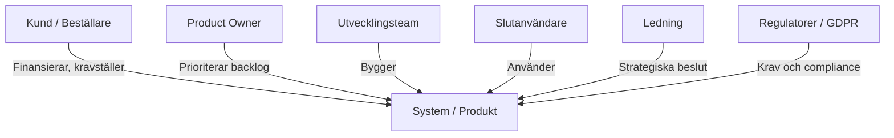
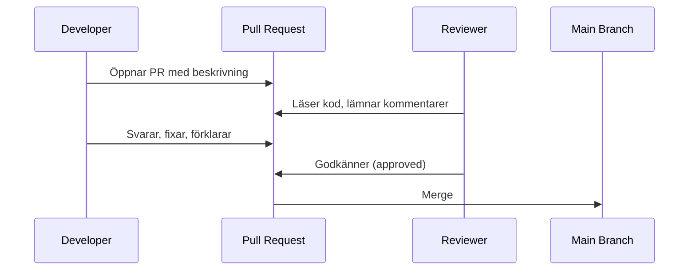
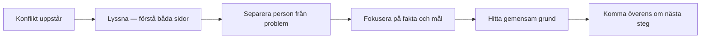
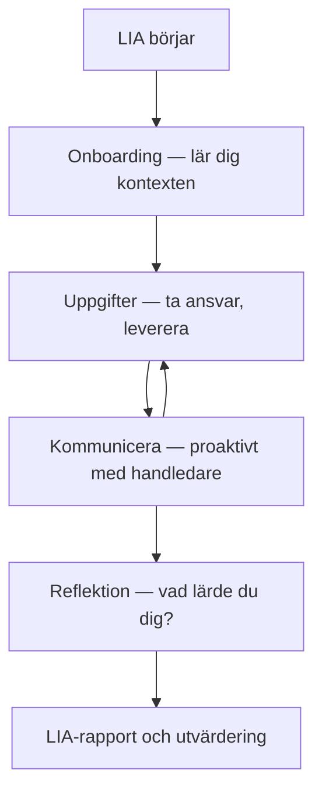

# 01 Yrkesroll och Kommunikation — Programmeringstermer

---

## Yrkesroll · Developer Role

En yrkesroll beskriver vad som förväntas av dig — inte bara tekniskt, utan som professionell i ett team och mot en kund. En senior developer kodar, men kommunicerar också, mentorerar, estimerar och tar ansvar för leveransen.

Tänk på det som en arbetsbeskrivning som är skriven på tre rader men som i praktiken innehåller trettio ansvarsområden. Du förstår vilka de är när du jobbar.

```
[Yrkesroll]
  ├── Teknisk kompetens      → kod, arkitektur, felsökning
  ├── Kommunikation          → kund, team, ledning
  ├── Leveransansvar         → deadline, kvalitet, dokumentation
  └── Professionell tillväxt → lärande, mentorskap, bidra till teamet
```

**Varför det spelar roll:** Att vara tekniskt skicklig räcker inte. Kunder och chefer bedömer dig på helheten. En developer som inte kan kommunicera sina beslut tappar trovärdighet oavsett hur bra koden är.

> 🖼️ **Bild:** T-shaped developer-diagram — bred kompetens på ytan, djup på ett område. En klassisk bild från tech-rekrytering.

---

## Stakeholder · Intressent

Alla som påverkas av projektet — eller som kan påverka det. Kund, slutanvändare, produktägare, din chef, ditt team, och ibland myndigheter eller leverantörer.

Tänk på det som alla som sitter runt ett bord när ett beslut fattas om ditt system. Vissa är där, andra är inte det — men de påverkas ändå.



**Varför det spelar roll:** Om du inte vet vem dina stakeholders är, kommunicerar du med fel person på fel nivå — och missar det som faktiskt är viktigt för dem.

> 🖼️ **Bild:** En post-it-workshop där team och kund gemensamt identifierar stakeholders på en whiteboard.

---

## Kommunikation · Technical Communication

Förmågan att anpassa hur du förklarar teknik beroende på vem som lyssnar. En produktägare behöver inte veta hur din API fungerar — de behöver veta om den levererar värde i tid.

Tänk på det som en tolk som kan byta register: samma budskap, men ord och detaljnivå anpassas till mottagaren.

| Mottagare | Vad de bryr sig om | Undvik |
|---|---|---|
| Kund / PO | Funktion, kostnad, datum | Teknisk implementation |
| Chef / ledning | Risk, resurser, framsteg | Kod-nivå-detaljer |
| Medarbetare i teamet | Arkitektur, tekniska beslut | Byråkratisk abstraktion |
| Slutanvändare | Att det fungerar | Hur det fungerar |

**Vanligt misstag:** Förklara tekniska detaljer för en kund som frågade om deadline. Kunden tolkar det som att du undviker frågan — eller att du inte vet vad du håller på med.

> 🖼️ **Bild:** Meme — "When the client asks 'how does it work?' and you explain the full microservices architecture." Klienten ser ut som ett frågetecken.

---

## Time Management · Tidshantering

Konsten att planera, prioritera och skydda din tid. På ett konsultuppdrag är din tid direkt kopplad till värde och fakturor — att slösa tid är inte bara improduktvt, det är dyrt.

Tänk på det som att du har en kalender med 40 celler per vecka. Varje cell är en timme. Jobbet är att lägga rätt sak i rätt cell — inte bara fylla dem.

| Teknik | Princip | Bäst för |
|---|---|---|
| Pomodoro | 25 min fokus, 5 min paus | Djuparbete, kodning |
| Eisenhower-matris | Viktigt + bråttom prioriteras | Prioritering av backlog |
| Time-boxing | Avsatt tid per uppgift, oavsett | Möten, estimering |
| Eat the Frog | Gör det jobbigaste först | Undvika prokrastinering |

**Edge case:** Pomodoro fungerar dåligt i open-space-kontorsmiljöer med många avbrott. Att sätta hörlurar och en synlig "fokus"-signal är en vanlig lösning.

> 🖼️ **Bild:** Eisenhower-matris som en 2x2-tabell, ifylld med typiska developertasks som exempel.

---

## Code Review · Kodgranskning

En systematisk genomgång av en kollegas kod innan den mergas in i huvudbranchen. Målet är att hitta buggar, diskutera design och sprida kunskap — inte att döma.

Tänk på det som att läsa ett utkast till en rapport med en vänlig penna, inte en röd bläckpenna. Du letar efter om det kommunicerar rätt, inte om du gillar stilen.



**Som granskare:**
- Fråga "Varför valde du det här?" istället för att påstå att det är fel
- Skilj på blockerare (måste fixas) och förslag (kan fixas)
- Godkänn om det är tillräckligt bra — 100% är sällan rätt mål

**Som den som granskas:**
- Ta inte kritik personligt — de kommenterar koden, inte dig
- Håll PR:er små (max 200–300 rader) — stora PR:er granskas slarvig
- Skriv en tydlig beskrivning av vad och varför

> 🖼️ **Bild:** Skärmdump av en GitHub PR med två godkänna-checkmarks och en kommentar-tråd med ett konstruktivt kodförslag.

---

## Mentorskap · Mentorship

En mer erfaren person vägleder en junior — inte genom att ge svar, utan genom att ställa rätt frågor och visa vägen. Mentorskap är en del av professionell kultur på mogna techbolag.

Tänk på det som att lära sig köra bil. Körkortshandledaren sitter bredvid och låter dig köra, men finns där om något går snett. De tar inte ratten.

**Mentor — konkret ansvar:**
- Schemalägg 1:1-möten regelbundet (inte ad hoc)
- Ställ frågor: "Vad har du försökt?" innan du visar lösningen
- Ge feedback på beteende, inte bara kod

**Adept — konkret ansvar:**
- Be om hjälp senast efter 20–30 minuters fastnad
- Förbered frågor — "Jag fastnade här, jag har provat X och Y"
- Ta ägandeskap — mentorn är ett stöd, inte en backup

**Varför det spelar roll:** Team utan mentorskap tappar juniora developers snabbt. Och seniors som inte mentorerar tänker inte klart på vad de faktiskt kan.

> 🖼️ **Bild:** Parprogrammering vid en skärm — den mer erfarne pekar på skärmen, den junior kör tangentbordet.

---

## Konflikthantering · Conflict Resolution

Förmågan att hantera meningsskiljaktigheter professionellt — separera sakfrågan från personkemin och hitta en väg framåt som teamet kan stå bakom.

Tänk på det som en PR-konflikt i kod: du löser den inte genom att ta bort någons ändringar utan förklaring — du tittar på båda, förstår intentionen och hittar det bästa av de två.



**Vanliga misstag:**
- Undvika konflikten — den eskalerar av sig själv
- Ta det personligt — konflikter handlar nästan alltid om information, prioritering eller brist på klarhet
- "Vinna" diskussionen — målet är en bra lösning, inte ett poäng

**I techteam specifikt:** Arkitekturdiskussioner (React vs Vue, monolith vs microservices) kan bli upphetsa. Använd data och prototyper istället för åsikter.

> 🖼️ **Bild:** Whiteboard med ett flödesdiagram ritat under en diskussion — symboliserar att konflikten lösts strukturerat, inte emotionellt.

---

## Självledarskap · Self-Leadership

Ta ansvar för din egen prestation, din inlärning och dina leveranser — utan att vänta på att någon berättar vad du ska göra härnäst.

Tänk på det som att driva ett litet eget projekt parallellt med jobbet: du är din egen produktägare, projektledare och QA.

**Konkreta beteenden:**
- Be om hjälp efter 20–30 min fastnat — inte efter 3 timmar
- Meddela om du inte hinner leverera i tid — gör det tidigt, inte strax före deadline
- Dokumentera vad du lär dig — en veckologg, en Notion-sida, vad som helst
- Sätt egna mål: "Om 3 månader vill jag kunna X"

**Vad självledarskap INTE är:** att aldrig be om hjälp, att alltid säga ja, eller att göra allt själv.

> 🖼️ **Bild:** En Notion- eller Obsidian-sida med veckovisa lärdomar och mål — ett enkelt men konkret sätt att visualisera självledarskap i praktiken.

---

## Agil Kultur · Agile Culture

De värderingar och beteenden som gör agilt arbete möjligt i praktiken. Det handlar inte om Jira-tickets — det handlar om transparens, snabb feedback och vilja att anpassa sig.

Tänk på det som att det finns ett Scrum-framework (verktygen), men sedan finns det en agil kultur (hur folk faktiskt beter sig). Du kan ha verktygen utan kulturen — men då funkar det inte.

| Agilt värde | Konkret beteende |
|---|---|
| Individer och interaktioner | Prata med varandra, inte via tickets |
| Fungerande mjukvara | Leverera något körbart varje sprint |
| Kundsamarbete | Involvera kunden, inte bara i slutet |
| Anpassa sig till förändring | Ändra planen när verkligheten kräver det |

**Vanligt hinder:** Organisationer som kallar sig agila men har årsplaner utan flexibilitet, eller som bestraffar teamet när de ber om mer tid.

> 🖼️ **Bild:** Agila manifestet — en skärmdump av agilemanifesto.org, med de fyra värdena framhävda.

---

## LIA · Lärande i Arbete

Praktikperioden i YH-utbildningen. Du arbetar i ett verkligt företag, med verkliga projekt, under handledning. Det är inte ett extrajobb — det är en del av examen.

Tänk på det som en prolonged code review av dig själv, utförd av arbetslivet. Du applicerar allt du lärt dig och ser vad som håller.

**Vad som förväntas av dig under LIA:**
- Ta initiativ — fråga vad du kan bidra med
- Kommunicera som en professionell, inte som en elev
- Lär dig hur just det här företaget arbetar
- Dokumentera vad du lär dig — LIA-dagbok eller rapport

**Vad LIA-handledaren tittar på:**
- Kan du leverera självständigt?
- Kommunicerar du proaktivt när du fastnar?
- Bidrar du till teamet, inte bara till din uppgift?



> 🖼️ **Bild:** En person med laptop som deltar i ett team-standup, tydligt utmärkt som "praktikant" — men med samma roll som alla andra runt bordet.
