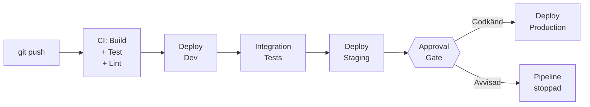
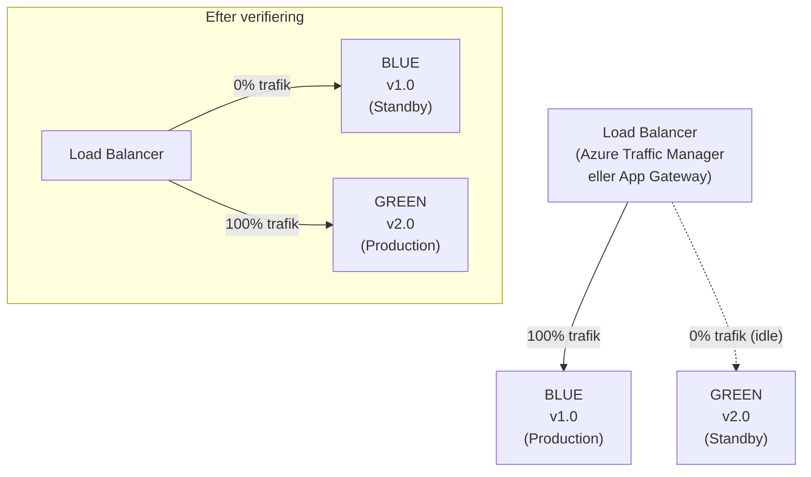
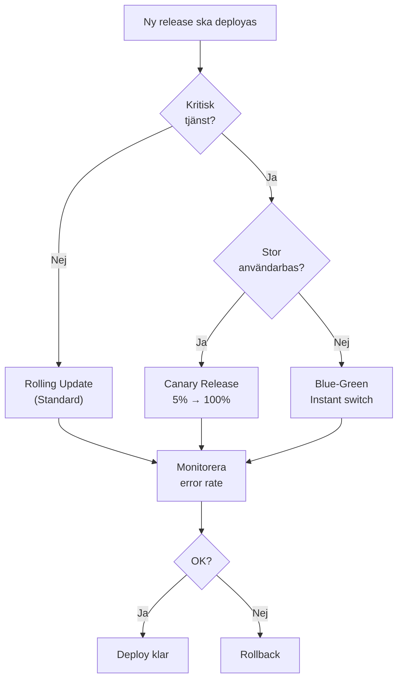

# 02 CI/CD Avancerat — Programmeringstermer

CI/CD-pipelines är inte längre "bygg och deploya". Avancerade pipelines hanterar miljöer, godkännandeflöden, lansstrategier och fallback. Här är verktygslådan.

---

## Multi-stage Pipeline

En CI/CD-pipeline med flera distinkta faser som representerar olika miljöer: dev → test → staging → production. Varje stage kan ha egna jobb, godkännanden och miljöspecifika konfigurationer.

Tänk på det som ett löpande band på en fabrik: produkten (koden) passerar flera kvalitetsstationer innan den når kunden. Varje station kan stoppa bandet om något är fel.

```yaml
# GitHub Actions — multi-stage pipeline
jobs:
  build:
    runs-on: ubuntu-latest
    steps:
      - uses: actions/checkout@v4
      - name: Build
        run: dotnet build

  deploy-staging:
    needs: build
    environment: staging
    steps:
      - name: Deploy to staging
        run: ./deploy.sh staging

  deploy-production:
    needs: deploy-staging
    environment: production  # kräver manuellt godkännande
    steps:
      - name: Deploy to production
        run: ./deploy.sh production
```

**Vad händer om du INTE har stages?** Du deployer direkt till produktion från varje commit. En typo i ett config-värde tar ner prod.



---

## Approval Gate · Godkännandeport

Manuellt godkännande inbyggt i pipeline-flödet. En namngiven person (eller grupp) måste godkänna innan nästa stage kör. Vanligt vid deployment till staging eller production.

Tänk på det som flygets "two-person rule": piloten och kopiloten måste båda bekräfta en procedur. En person ensam kan inte råka deploya fel.

**GitHub Actions — konfigurera environment med required reviewer:**
```yaml
# I GitHub: Settings → Environments → production
# Lägg till Required reviewers: @release-managers

deploy-production:
  environment: production   # utlöser approval-kravet
  needs: deploy-staging
```

**Vanliga fallgropar:**
- Gate på fel ställe (efter prod istället för före)
- Ingen tydlig ägare för godkännandet — alla väntar på varandra
- Gate bypassas "tillfälligt" under stress och glöms aldrig tillbaka

> 🖼️ **Bild:** GitHub Actions-vy med en väntande deployment och "Review deployments"-knapp. Visar hur approval ser ut i verktyget.

---

## Environment · Miljö

I GitHub Actions/Azure DevOps: en namngiven miljö som kopplar deployments till specifika regler, godkännanden och historik. Inte samma sak som en server — det är en policy-container.

Tänk på det som ett passersystem på ett jobb: olika rum kräver olika behörighet. Development är öppet för alla. Production kräver chef-godkännande.

**Vad en environment spårar:**
- Vilken commit som senast deployades dit
- Vem som godkände
- Deployment-historik per miljö
- Nuvarande hälsa (Success/Failure)

**Best practice — namnge konsekvent:**
```
development  →  Test branches
staging      →  Release candidates (speglar prod)
production   →  Livekod
```

---

## Deployment Strategy · Lanseringsstrategi

Hur du ersätter gammal kod med ny i produktion. Valet påverkar driftstopp, risk och återställningstid.

| Strategi | Driftstopp | Risk | Rollback | Använd när |
|----------|-----------|------|---------|------------|
| In-place | Ja | Hög | Svår | Icke-kritiska system |
| Rolling | Nej | Medium | Medium | Standardval |
| Blue-Green | Nej | Låg | Sekunder | Kritiska system |
| Canary | Nej | Mycket låg | Automatisk | Stor användarvolym |

---

## Blue-Green Deployment

Två identiska produktionsmiljöer körs parallellt. Blue = nuvarande version, Green = ny version. När Green är verifierad switchas all trafik dit — omedelbart.

Tänk på det som att ha två broar över samma å. Bilar kör på den gamla (Blue) medan du bygger och testar den nya (Green). Sedan ändrar du skylten — trafiken tar den nya vägen. Den gamla är kvar som fallback.



**Rollback:** Byt tillbaka trafiken till Blue. Tar sekunder. Ingen kod behöver deployas.

**Kostnad:** Dubbel infrastruktur körs under switch-perioden. Acceptabelt för kritiska tjänster.

> 🖼️ **Bild:** Diagram med lastbalanserare i mitten, blue-miljö till vänster, green-miljö till höger, pil som byter riktning. Enkelt och visuellt tydligt.

---

## Canary Release

Ny version deployas till en liten andel av användarna (t.ex. 5%). Om inga fel uppstår ökas andelen gradvis tills 100% av trafiken går till nya versionen.

Tänk på det som gruvarbetarens kanariefågel: du skickar in en liten del av trafiken först. Om fågeln (eller 5%-gruppen) överlever, är det säkert att gå vidare.

```yaml
# Azure Traffic Manager — Canary med viktad routing
profiles:
  - name: weighted-traffic
    routingMethod: Weighted
    endpoints:
      - name: v1-stable
        weight: 95
      - name: v2-canary
        weight: 5   # Börja med 5%, öka gradvis
```

**Automatisera gradvis ökning:** Koppla canary till metrics — om error rate > 1% hos canary-gruppen, automatisk rollback.

**Canary vs Blue-Green:**
- Canary testar med verkliga användare, gradvis
- Blue-Green switchar allt på en gång, ingen gradvis test

---

## Feature Flags · Feature Toggles

Kod som kan slås av och på utan ny deployment. Funktionen finns i koden men aktiveras via en konfigurationsflagga.

Tänk på det som ljusströmbrytare för features: du kan installera lampan och dra ledningarna (deployer koden) utan att skruva i glödlampan (aktivera featuren) förrän du är redo.

```csharp
// Enkel feature flag-kontroll
if (_featureManager.IsEnabled("NewCheckoutFlow"))
{
    return RedirectToAction("CheckoutV2");
}
return RedirectToAction("CheckoutV1");
```

**Användningsfall:**
- **A/B-testning:** 50% ser varianta A, 50% ser varianta B
- **Gradvis utrullning:** Aktivera för 10% → 50% → 100%
- **Kill switch:** Stäng av en trasig feature direkt utan deployment
- **Beta-access:** Aktivera för specifika användare eller grupper

**Verktyg:** Azure App Configuration (feature management), LaunchDarkly, Unleash.

**Varning:** Feature flags skapar teknisk skuld. Rensa upp flaggor som är 100% aktiverade och inte längre behövs.

---

## Self-hosted Agent · Egenhanterad byggagent

En build-agent som du installerar och underhåller på egna maskiner (VM, container, on-prem). Alternativ till de molnhanterade agenter som GitHub/Azure DevOps erbjuder.

Tänk på det som att ha en egen grillstation istället för att använda restaurangens — mer jobb att underhålla, men du väljer exakt vad som finns tillgängligt.

**Använd self-hosted när:**
- Bygget behöver åtkomst till privata nätverksresurser (intern NuGet, databaser)
- Compliance kräver att källkod aldrig lämnar organisationens infrastruktur
- Speciell hårdvara eller programvara krävs (GPU, licensierad mjukvara)
- Kostnadsoptimering vid extremt höga byggtider

```yaml
# Använda en self-hosted runner
jobs:
  build:
    runs-on: self-hosted   # Istället för ubuntu-latest
    steps:
      - name: Build
        run: dotnet build
```

**Underhållskostnad:** Du ansvarar för OS-uppdateringar, skalning och tillgänglighet. Räkna på det.

---

## Pipeline Caching · Cachning i pipeline

Spara beroenden (NuGet-paket, npm-moduler, Docker-layers) mellan pipeline-körningar för att slippa ladda ner dem varje gång.

Tänk på det som att handla mat för hela veckan istället för att gå till affären varje dag. Första gången tar tid, sedan är det snabbt.

```yaml
# GitHub Actions — cacha NuGet-paket
- name: Cache NuGet packages
  uses: actions/cache@v4
  with:
    path: ~/.nuget/packages
    key: nuget-${{ hashFiles('**/*.csproj') }}
    restore-keys: |
      nuget-

- name: Restore dependencies
  run: dotnet restore
```

**Hur cache-nyckeln fungerar:** `hashFiles('**/*.csproj')` genererar en hash från alla `.csproj`-filer. Ändrar du ett NuGet-beroende, ändras hashen, och en ny cache skapas automatiskt.

**Typisk tidsbesparing:** 2–8 minuter per pipeline-körning för medelstora projekt.

---

## Retention Policy · Bevarandepolicy

Regler för hur länge pipeline-körningar, logs, artifacts och container-images sparas. Balans mellan lagringskostnad och förmågan att spåra och återskapa historiska versioner.

Tänk på det som gallringsregler för pappersarkiv: du sparar inte allt för evigt, men du kastar inte heller allt direkt.

**Typisk policy:**
| Typ | Retention |
|-----|-----------|
| Failed builds | 7 dagar |
| Successful builds | 30 dagar |
| Release builds (prod) | 1 år |
| Container images (latest 10) | Permanent |
| Old container images | 90 dagar |

**Varför det spelar roll:**
- Lagring kostar pengar — outloggade gamla pipelines kan ackumulera GB/TB
- Compliance kan kräva att du BEVARAR releases i minst X månader
- Troubleshooting kräver att logs finns kvar när problemet rapporteras (ofta dagar senare)

> 🖼️ **Bild:** Azure DevOps → Pipelines → Retention settings-skärm, eller GitHub → Actions → Artifact and log retention med siffror ifyllda. Visar var i verktyget inställningen sitter.

---

## Beslutsflöde: Vilken deployment-strategi?


