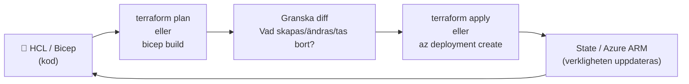
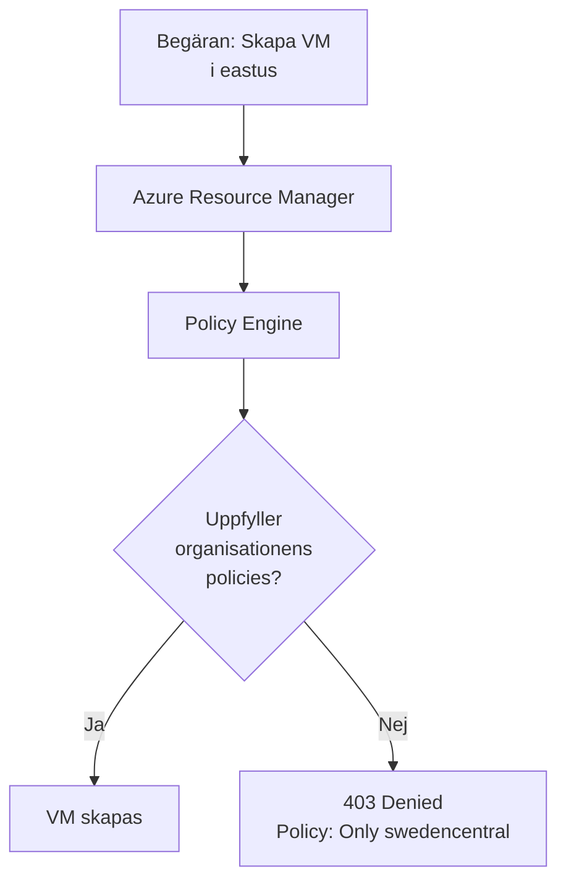

# 01 IaC — Programmeringstermer

Infrastruktur är kod. Det är inte en metafor — det är hur moderna DevOps-team faktiskt jobbar.

---

## IaC · Infrastructure as Code

Hantera servrar, nätverk och databaser med kodfiler istället för att klicka i ett GUI. Infrastrukturen versionshanteras i Git precis som applikationskod.

Tänk på det som att byta från att bygga IKEA-möbler utan instruktioner (klicka runt i portalen) till att följa ett exakt ritningspaket som vem som helst kan reproducera.

```hcl
# Terraform-exempel — skapa en Azure Resource Group
resource "azurerm_resource_group" "main" {
  name     = "prod-rg"
  location = "swedencentral"
}
```

**Varför det spelar roll:** Utan IaC är varje server ett "snowflake" — unikt, skört, och ingen vet exakt hur det sattes upp. Med IaC kan du återskapa hela miljön på en timme efter en katastrof.

> 🖼️ **Bild:** Sida-vid-sida: vänster = Azure Portal med massor av klickmenyer; höger = terminal med `terraform apply` och en lista med skapade resurser. Caption: "Same result. Very different repeatability."

---

## Declarativ vs Imperativ

**Deklarativt:** Du beskriver det önskade slutläget — "Jag vill ha 3 VM". Verktyget räknar ut hur.
**Imperativt:** Du beskriver varje steg — "Skapa VM1, sedan VM2, sedan VM3, och om VM1 redan finns, hoppa över det".

Tänk på det som GPS-navigation: deklarativt är att säga "ta mig till Göteborg", imperativt är att ge precisa svänginstruktioner. Bicep och Terraform är deklarativa. Bash-skript är imperativa.

| Stil | Verktyg | Fördel |
|------|---------|--------|
| Deklarativ | Bicep, Terraform | Idempotent, läsbar, hanterbar drift |
| Imperativ | Bash, PowerShell | Flexibel, exakt kontroll |

**Tumregel:** Välj deklarativt för infrastrukturprovisioning. Välj imperativt för deployment-skript med komplex logik.

---

## Bicep

Microsofts domänspecifika språk för att deploya Azure-resurser. Kompileras till ARM JSON under huven, men är dramatiskt enklare att läsa och skriva.

Tänk på det som: ARM JSON är maskinspråk, Bicep är ett modernt programmeringsspråk ovanpå det.

```bicep
// Skapa ett Storage Account med Bicep
resource storageAccount 'Microsoft.Storage/storageAccounts@2023-01-01' = {
  name: 'mystorageaccount'
  location: resourceGroup().location
  sku: {
    name: 'Standard_LRS'
  }
  kind: 'StorageV2'
}
```

**Välj Bicep när:** Du jobbar uteslutande i Azure och vill ha first-class Microsoft-support, bra IntelliSense i VS Code, och tight integration med Azure Policy.

> 🖼️ **Bild:** VS Code med Bicep-fil öppen — IntelliSense visar autocomplete-lista för resource-typer. Visar hur IDE-stödet funkar i praktiken.

---

## ARM Template

Azure Resource Manager-mall. En JSON-fil som beskriver Azure-resurser. Det är formatet som Azure faktiskt förstår — Bicep kompileras hit.

Tänk på det som bytekod: du kan läsa det om du måste, men du skriver det inte för hand.

```json
{
  "$schema": "https://schema.management.azure.com/schemas/2019-04-01/deploymentTemplate.json#",
  "contentVersion": "1.0.0.0",
  "resources": [
    {
      "type": "Microsoft.Storage/storageAccounts",
      "apiVersion": "2023-01-01",
      "name": "mystorageaccount",
      "location": "[resourceGroup().location]",
      "sku": { "name": "Standard_LRS" },
      "kind": "StorageV2"
    }
  ]
}
```

**I praktiken:** Du stöter på ARM-templates i äldre projekt och exporterade resurser från portalen. Nytt skrivs i Bicep.

---

## Terraform

HashiCorps IaC-verktyg. Använder HCL (HashiCorp Configuration Language). Det stora skillnaden mot Bicep: Terraform är multi-cloud och fungerar mot Azure, AWS, GCP och hundratals providers.

Tänk på det som ett universalverktyg — Bicep är en skruvmejsel anpassad exakt för Ikea-skruvar, Terraform är en fullsatt verktygslåda.

```hcl
# Konfigurera Azure Provider
terraform {
  required_providers {
    azurerm = {
      source  = "hashicorp/azurerm"
      version = "~> 3.0"
    }
  }
}

provider "azurerm" {
  features {}
}

resource "azurerm_resource_group" "main" {
  name     = "prod-rg"
  location = "swedencentral"
}
```

**Välj Terraform när:** Du har multi-cloud-infrastruktur, eller teamet redan kan Terraform och ska inte behöva lära sig ett nytt verktyg.



---

## State File

Terraforms fil (`.tfstate`) som håller reda på exakt vad Terraform skapat — resurser, ID:n, beroenden. Det är Terraforms "minne" om verkligheten.

Tänk på det som kassaregistrets dagbok: utan den vet Terraform inte vad den redan skapat och vad som är nytt.

**Var du ALLTID ska lagra state i produktion:**

```hcl
# Backend-konfiguration — spara state i Azure Blob Storage
terraform {
  backend "azurerm" {
    resource_group_name  = "tfstate-rg"
    storage_account_name = "tfstatestorageacct"
    container_name       = "tfstate"
    key                  = "prod.terraform.tfstate"
  }
}
```

**Vad händer om du förlorar state-filen?** Terraform vet inte längre vad den äger. Nästa `apply` kan skapa dubbletter eller misslyckas. **State-filen är kritisk infrastruktur** — lagra den aldrig lokalt i produktion.

> 🖼️ **Bild:** Meme — "When you accidentally delete the tfstate file" + kaos-bild. Eller: diagram som visar state-fil i Azure Blob Storage, låst under `terraform apply`.

---

## Modul · Module

Återanvändbar IaC-komponent. En modul är som en funktion i kod — du definierar den en gång och kallar den med olika parametrar.

Tänk på det som ett Lego-standardblock: du behöver inte uppfinna ett nytt nätverk för varje projekt, du anropar nätverksmodulen med rätt variabler.

```hcl
# Anropa en modul för virtuellt nätverk
module "vnet" {
  source              = "./modules/vnet"
  resource_group_name = azurerm_resource_group.main.name
  location            = "swedencentral"
  address_space       = ["10.0.0.0/16"]
  subnets = {
    frontend = "10.0.1.0/24"
    backend  = "10.0.2.0/24"
  }
}
```

**Modulstruktur i ett verkligt projekt:**

```
modules/
├── vnet/          # Virtuellt nätverk med subnets
├── aks/           # AKS-kluster med standardkonfiguration
├── sql/           # Azure SQL med backup och failover
└── monitoring/    # Log Analytics + Application Insights
```

---

## Idempotens · Idempotency

Egenskap att köra samma operation flera gånger ger samma resultat. Kör `terraform apply` 10 gånger — infrastrukturen är densamma varje gång.

Tänk på det som att trycka på en hissknapp: du kan trycka 20 gånger, hissen kommer ändå bara en gång. Ingen extra skada.

**Utan idempotens** (imperativt skript):

```bash
# Farligt — skapar duplicerade resurser om det körs igen
az group create --name prod-rg --location swedencentral
az storage account create --name mystorage --resource-group prod-rg
```

**Med idempotens** (Bicep/Terraform): Verktyget jämför önskat tillstånd med verkligt tillstånd och gör bara nödvändiga ändringar.

**Varför det spelar roll:** CI/CD-pipelines kör IaC-scripts automatiskt, ibland flera gånger. Utan idempotens riskerar du oavsiktliga dupliceringar och kostnader.

---

## Azure Blueprints

Mallar som definierar policy, RBAC-roller och resurser för hela prenumerationer eller hanteringsgrupper. En Blueprint reproducerar en komplett governance-konfiguration.

Tänk på det som en "ny-hyresgäst-konfiguration" för Azure: varje ny avdelning som får en prenumeration får automatiskt rätt brandväggsregler, rätt roller och rätt resurser från start.

**Innehåller typiskt:**
- Azure Policy-tilldelningar
- RBAC-rolltilldelningar
- Resource Group-definitioner
- ARM/Bicep-templates

**Obs:** Azure Blueprints är on the way out — Microsoft rekommenderar nu Azure Deployment Stacks för nytt arbete. Känner du igen pattern? Det händer mycket i cloud-världen.

---

## Policy as Code

Azure Policy definierad och versionshanterad i kod. Säkerställer att resurser i din miljö följer organisationens regler — automatiskt, inte manuellt.

Tänk på det som en körkortsautomat: bilen startar inte om du inte spänner bältet. Policy as Code gör att resurser inte skapas om de bryter mot regler.

```json
{
  "if": {
    "allOf": [
      { "field": "type", "equals": "Microsoft.Compute/virtualMachines" },
      { "field": "location", "notIn": ["swedencentral", "swedenwest"] }
    ]
  },
  "then": { "effect": "deny" }
}
```

**Vanliga policies:**
- Tillåt bara godkända Azure-regioner
- Kräv tagg `CostCenter` på alla resurser
- Kräv att VM har backup aktiverat
- Neka publicIP utan Azure Firewall framför



> 🖼️ **Bild:** Azure Portal → Policy → Compliance-vy med resurser markerade som compliant/non-compliant i rött och grönt. Visar hur Policy as Code ger faktisk synlighet.

---

## Jämförelsetabell: Bicep vs Terraform

| Kriterium | Bicep | Terraform |
|-----------|-------|-----------|
| Multi-cloud | Nej (Azure only) | Ja |
| Syntax | HCL-liknande, ren | HCL |
| State management | Azure hanterar (ARM) | Extern state-fil |
| IDE-stöd | Utmärkt (VS Code) | Bra |
| Modular | Ja | Ja (ekosystem) |
| Välj när... | Azure-only, Microsoft-stack | Multi-cloud, stort community |
