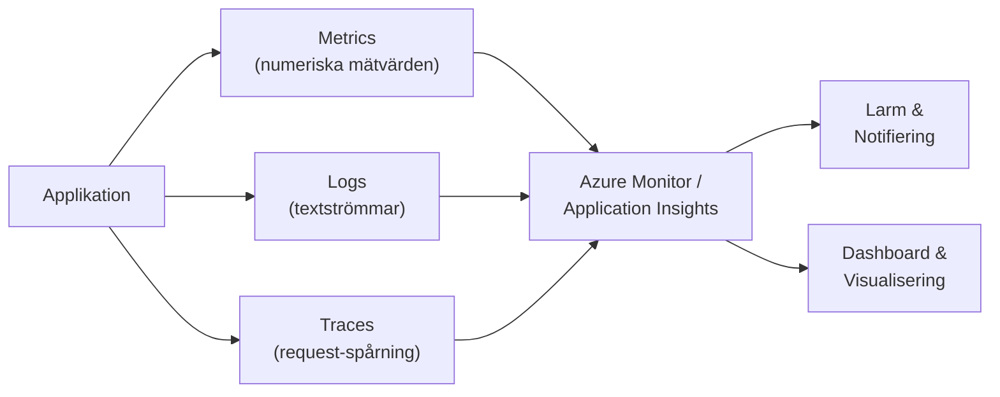
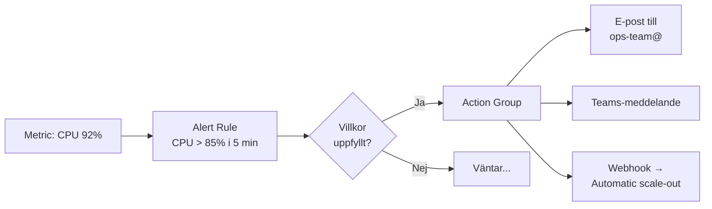
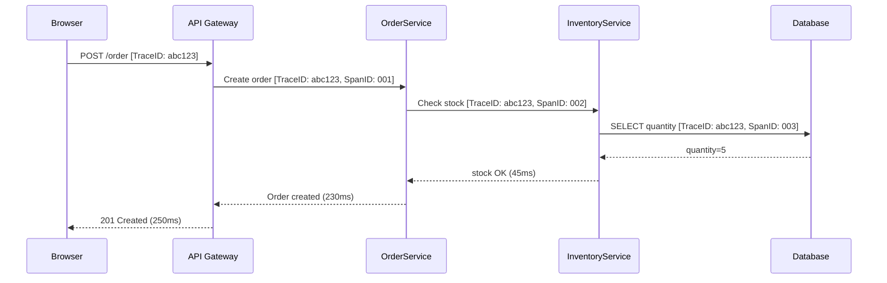
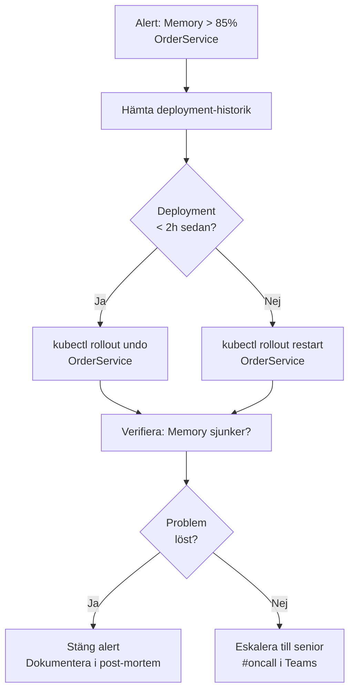

# 03 Monitorering — Programmeringstermer

Om du inte mäter det, vet du inte om det funkar. Monitorering är skillnaden mellan att reagera på kundklagomål och att åtgärda problem innan kunden märker dem.

---

## Monitorering · Monitoring

Kontinuerlig övervakning av systemhälsa, prestanda och tillgänglighet. Samla in data, visualisera trender, och reagera automatiskt på avvikelser.

Tänk på det som en puls- och blodtrycksmonitor på intensivvårdsavdelningen: systemet varnar aktivt om något är fel — läkaren (du) behöver inte sitta och stirra på skärmen hela tiden.

**De tre pelarna i modern monitorering:**
- **Metrics** — Numeriska mätvärden: CPU, requests/sekund, svarstider
- **Logs** — Textbaserade händelseströmmar: "User X logged in at 14:32"
- **Traces** — Spårning av enskilda requests genom systemet

**Vad händer om du INTE monitorerar?** Du får reda på att produktionen är nere när en kund ringer — inte när problemet uppstod.



---

## Application Insights

Microsofts hanterade tjänst för applikationsmonitorering i Azure. Instrumenterar automatiskt (med SDK) eller manuellt din applikation och samlar in requests, exceptions, dependencies och custom events.

Tänk på det som en svart låda i ett flygplan — den registrerar allt som händer i systemet, så du kan rekonstruera exakt vad som hände när något gick fel.

```csharp
// Lägg till i Program.cs
builder.Services.AddApplicationInsightsTelemetry();

// Custom event — logga affärshändelse
_telemetryClient.TrackEvent("OrderPlaced", new Dictionary<string, string>
{
    ["OrderId"] = order.Id.ToString(),
    ["CustomerId"] = order.CustomerId.ToString(),
    ["Amount"] = order.Total.ToString("F2")
});

// Custom exception — fånga och skicka
try { /* ... */ }
catch (Exception ex)
{
    _telemetryClient.TrackException(ex);
    throw;
}
```

**Vad Application Insights ger dig ur lådan:**
- Request rate, failure rate, response time
- Dependency calls (SQL, HTTP, queues)
- Exception stack traces med kontext
- User sessions och page views
- Live Metrics Stream (realtid under deployment)

> 🖼️ **Bild:** Application Insights → Application Map — ett diagram som visar hur olika tjänster anropar varandra med genomsnittliga svarstider och failure rates på varje pil. Visar kraften i automatic dependency tracking.

---

## Log Analytics

Azures centrala logglagring och frågeverktyg. Alla Azure-tjänster, Application Insights, VM-loggar och custom loggar samlas hit. Du frågar dem med KQL.

Tänk på det som ett centralt arkiv för alla landets myndighetsdokument — istället för att varje myndighet har sina egna pärmar som ingen annan kan se.

**Workspace-arkitektur:**

```
Log Analytics Workspace
├── AppInsights logs
├── Azure Activity Log (vem ändrade vad i Azure)
├── NSG Flow Logs (nätverkstrafik)
├── VM performance counters
└── Custom application logs
```

**Retention-kostnad:** Logs äldre än 30 dagar kostar extra att behålla. Sätt rätt retention baserat på ditt compliance-krav.

---

## Metric · Mätvärde

Ett numeriskt mätvärde som samlas in över tid med ett fast intervall. CPU-användning, requests per sekund, queue depth, svarstid. Metrics är grunden för larm och dashboards.

Tänk på det som ett speedometer: ett ögonblicksvärde som du kan jämföra mot ett normalvärde och ett maxvärde.

**Fyra gyllene signals (Google SRE-metodiken):**

| Signal | Vad den mäter | Exempel |
|--------|---------------|---------|
| Latency | Hur lång tid tar requests? | P95 response time < 200ms |
| Traffic | Hur mycket last? | Requests per sekund |
| Errors | Hur många misslyckas? | Error rate < 0.1% |
| Saturation | Hur nära kapacitetsgränsen? | CPU < 80%, disk < 85% |

**Percentiler vs medelvärde:** Använd P95/P99 (95:e/99:e percentilen) för svarstider, inte medelvärde. Medelvärde döljer att 5% av dina användare får 10 sekunder svarstid.

---

## Alert · Larm

Automatisk notifiering när ett mätvärde passerar en definierad tröskel. Kan skicka e-post, SMS, Teams-meddelande, eller trigga en Azure Function för automatisk åtgärd.

Tänk på det som brandlarmet: det reagerar automatiskt utan att någon behöver sitta och vänta på att det ska börja brinna.



**Alert fatigue — den verkliga risken:** För många larm, för låg tröskel = teamet ignorerar alla larm. Börja med FEW, MEANINGFUL larm. Bättre att sakna ett larm än att drunkna i brus.

**Action Groups:** En återanvändbar grupp av notifieringsåtgärder (e-post, SMS, ITSM, webhook). Definiera dem en gång, återanvänd i flera alert rules.

> 🖼️ **Bild:** Azure Monitor → Alerts → Active alerts-lista med severity-nivåer (Sev 0 = kritisk, röd) och en "Fired" och "Resolved" kolumn. Visar hur alert-listan ser ut i verkligheten.

---

## Dashboard

Visuell sammanfattning av systemhälsa på en och samma skärm. Kombinerar metrics-grafer, log-queries och Azure-resurs-status.

Tänk på det som ett kontrollrum på ett kärnkraftverk: all kritisk information samlad, visuellt kodat, läsbart på sekunder.

**Tre typer i Azure-världen:**
- **Azure Dashboard** — Inbyggt i portalen, drag-and-drop
- **Azure Workbooks** — Interaktiva rapporter med KQL och parametrar
- **Grafana** — Open-source, kraftfullare visualisering, kopplas till Azure Monitor

**Vad ett bra production dashboard innehåller:**
1. Uptime och error rate (de senaste 24h)
2. Request volume + latency P95
3. Aktiva larm
4. Senaste deployments
5. Resursanvändning (CPU, minne, disk)

---

## Distributed Tracing · Distribuerad spårning

Spåra en enskild request genom ett system med flera tjänster (microservices, queues, databaser). Varje steg i kedjan får ett gemensamt trace ID som binder samman hela flödet.

Tänk på det som ett paket med spårningsnummer: du kan se exakt var paketet befinner sig i kedjan, hur lång tid varje station tog, och var det fastnade.



**Instrumentering i .NET:**

```csharp
// OpenTelemetry — standard för distributed tracing
builder.Services.AddOpenTelemetry()
    .WithTracing(tracing => tracing
        .AddAspNetCoreInstrumentation()
        .AddHttpClientInstrumentation()
        .AddSqlClientInstrumentation()
        .AddAzureMonitorTraceExporter());
```

**Vad du hittar med traces:** Vilken tjänst som är den långsammaste i kedjan (den faktiska flaskhalsen — inte bara "API:et är långsamt").

---

## KQL · Kusto Query Language

Azure Monitors frågespråk för loggar och metrics. Används i Log Analytics, Application Insights och Azure Data Explorer.

Tänk på det som SQL för tidsseriedata och loggar — samma tankesätt (filtrera, aggregera, visualisera) men optimerat för logganalys.

```kql
// Visa de 10 vanligaste felen de senaste 24 timmarna
exceptions
| where timestamp > ago(24h)
| where severityLevel >= 3
| summarize count() by type, outerMessage
| order by count_ desc
| take 10
```

```kql
// P95-svarstid per endpoint de senaste 7 dagarna
requests
| where timestamp > ago(7d)
| summarize P95 = percentile(duration, 95) by name
| order by P95 desc
```

```kql
// Alla logins från ovanliga länder (säkerhetsanalys)
SigninLogs
| where TimeGenerated > ago(24h)
| where Location !in ("SE", "NO", "DK", "FI")
| project TimeGenerated, UserPrincipalName, Location, IPAddress
| order by TimeGenerated desc
```

**KQL vs SQL:**
| KQL | SQL |
|-----|-----|
| `| where` | `WHERE` |
| `| summarize count() by` | `GROUP BY` |
| `| order by` | `ORDER BY` |
| `| take 10` | `TOP 10` / `LIMIT 10` |
| `ago(24h)` | `NOW() - INTERVAL 24 HOUR` |

> 🖼️ **Bild:** Log Analytics-portal med en KQL-query i editorn och ett resultat-grid nedanför. Visar hur man faktiskt arbetar med KQL i praktiken.

---

## SLA Monitoring · SLA-övervakning

Kontinuerlig jämförelse av faktisk tillgänglighet och prestanda mot din avtalade SLA (Service Level Agreement). Ge larm innan du bryter SLA:n, inte efter.

Tänk på det som en budget-tracker för tillgänglighet: din SLA är ett månadsbudget, varje minut nedsida kostar av budgeten. Kör du tom på budget, bryter du kontraktet.

**Error Budget-konceptet (SRE):**

```
SLA: 99.9% uptime per månad
Tillåtna nedtid: ~43 minuter/månad

Om du redan har haft 40 minuters nedsida:
→ Du har bara 3 minuter "error budget" kvar
→ Inga riskfyllda deployments resten av månaden
```

**Relevanta metrics:**
- Availability (MTBF — Mean Time Between Failures)
- Recovery (MTTR — Mean Time To Recover)
- SLI (Service Level Indicator) — faktisk mätning
- SLO (Service Level Objective) — internt mål
- SLA (Service Level Agreement) — kundlöfte

---

## Runbook · Åtgärdsguide

Dokumenterad procedur för att hantera kända driftsituationer: vad du gör när X larmar, steg för steg. Minska MTTR (Mean Time To Resolve) och säkerställ att rätt åtgärder vidtas av rätt person.

Tänk på det som ett manus för nödsituationer — ingen ska behöva improvisera mitt i natten när databasen är nere.

**Struktur för ett runbook:**

```markdown
# Runbook: High Memory Alert — OrderService

## Symptom
Alert "Memory > 85% i 10 min" på OrderService i prod.

## Troliga orsaker
1. Minnesläcka efter deploy (verifiera med deployment-tidsstämpel)
2. Oväntat hög last (kolla request rate)
3. Cache-invalidering misslyckades

## Åtgärdssteg
1. Kör: `kubectl top pods -n production` — identifiera pod med hög användning
2. Kontrollera senaste deployment: `kubectl rollout history deployment/order-service`
3. Om deployment < 2h sedan → `kubectl rollout undo deployment/order-service`
4. Om inte deployment-relaterat → starta om pod: `kubectl rollout restart deployment/order-service`
5. Eskalera till senior om minnesanvändning inte sjunker inom 15 min

## Eskalering
On-call senior: #oncall i Teams
```

**Automatiserade runbooks:** Azure Automation Runbooks kan köras automatiskt som svar på ett larm — nollinblandning av människa för kända problemtyper.


