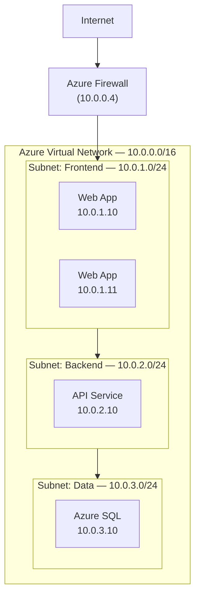
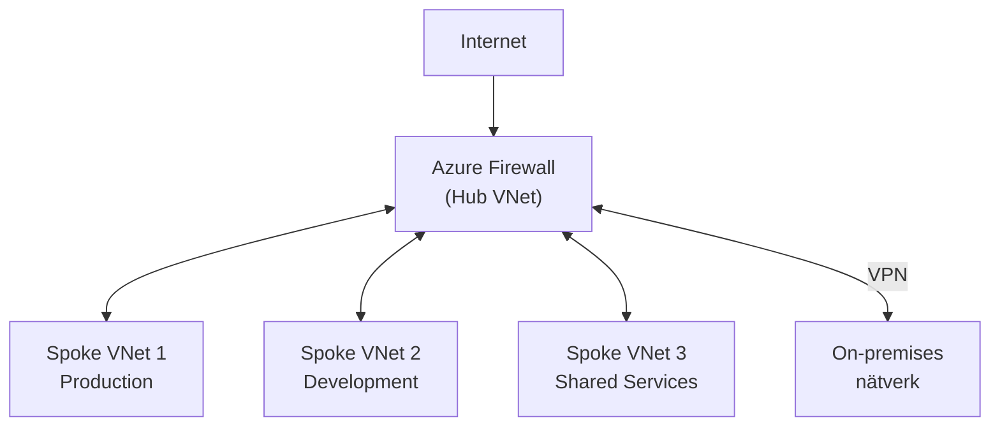
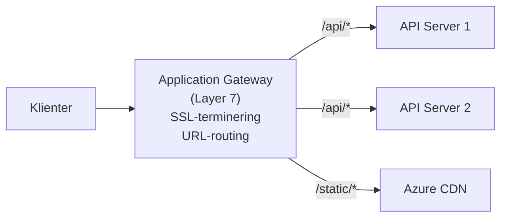
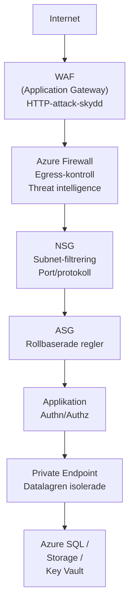

# 04 Säkerhet & Nätverk — Programmeringstermer

Nätverkssäkerhet i Azure handlar om att bygga lager på lager av skydd. En enda brandvägg räcker inte — du behöver djupförsvar (defense in depth).

---

## Azure Virtual Network · VNet

Logiskt isolerat privat nätverk i Azure. Din grundläggande nätverksbehållare — resurser i samma VNet kan kommunicera internt utan att exponeras mot internet.

Tänk på det som ett privat kontorsnät: alla datorer på kontoret ser varandra, men ingen utifrån kan nå dem direkt.



**Address space:** Välj ett RFC 1918-block som inte krockar med ditt on-prem-nätverk om du planerar VPN. Vanliga val: `10.0.0.0/16`, `172.16.0.0/16`.

---

## Subnet · Delnätverk

Underindelning av ett VNet. Separera resurser med olika säkerhetsprofil i olika subnets — du kan sedan applicera olika regler per subnet.

Tänk på det som våningar i en kontorsbyggnad med kortläsare mellan dem: receptionen (frontend) är tillgänglig för alla, serverhallen (databas) kräver speciell behörighet.

**Standard subnet-design för en webbapplikation:**

| Subnet | Address range | Innehåll | Tillgänglig från |
|--------|---------------|----------|-----------------|
| AzureFirewallSubnet | 10.0.0.0/26 | Azure Firewall | Internet |
| frontend | 10.0.1.0/24 | Web/App tier | Firewall |
| backend | 10.0.2.0/24 | API/services | Frontend subnet |
| data | 10.0.3.0/24 | SQL, Storage | Backend subnet |
| GatewaySubnet | 10.0.255.0/27 | VPN Gateway | On-premises |

**Viktigt:** Vissa Azure-tjänster kräver dedikerade subnets (Azure Firewall, VPN Gateway, AKS). Planera addressrymd i förväg.

---

## Network Security Group · NSG

Brandväggsregler för subnets eller nätverkskort. Allow/Deny baserat på protokoll, port, källadress och destinationsadress. Appliceras i prioritetsordning (lägre nummer = körs först).

Tänk på det som dörrlistor på ett nattklubb: regel 100 "Tillåt VIP-gäster" körs innan regel 200 "Neka alla andra".

```bicep
// NSG med regler för en backend-subnet
resource nsgBackend 'Microsoft.Network/networkSecurityGroups@2023-04-01' = {
  name: 'nsg-backend'
  location: resourceGroup().location
  properties: {
    securityRules: [
      {
        name: 'Allow-Frontend-to-API'
        properties: {
          priority: 100
          protocol: 'Tcp'
          access: 'Allow'
          direction: 'Inbound'
          sourceAddressPrefix: '10.0.1.0/24'  // Frontend subnet
          sourcePortRange: '*'
          destinationAddressPrefix: '*'
          destinationPortRange: '8080'
        }
      }
      {
        name: 'Deny-All-Inbound'
        properties: {
          priority: 4000
          protocol: '*'
          access: 'Deny'
          direction: 'Inbound'
          sourceAddressPrefix: '*'
          sourcePortRange: '*'
          destinationAddressPrefix: '*'
          destinationPortRange: '*'
        }
      }
    ]
  }
}
```

**Default-regler:** NSG:er har inbyggda default-regler som du inte kan ta bort: AllowVNetInBound (65000), AllowAzureLoadBalancerInBound (65001), DenyAllInBound (65500).

> 🖼️ **Bild:** Azure Portal → NSG → Inbound security rules med en lista av regler, prioritetsnummer till vänster och Allow/Deny-ikoner (grön/röd) till höger.

---

## Application Security Group · ASG

Gruppera VM och nätverksgränssnitt logiskt efter applikationsroll (t.ex. "WebServers", "ApiServers"). Skriv NSG-regler mot ASG-gruppen istället för mot specifika IP-adresser.

Tänk på det som arbetsroller istället för namnskyltslista: "alla marknadsförare får gå in i konferensrummet" — du behöver inte lista varje persons namn.

**Fördel:** VM-IP:er ändras när du skapar/tar bort VM. Med ASG uppdateras reglerna automatiskt när en VM tillhör rätt ASG.

```bicep
// Skapa ASG för webbtjänster
resource asgWebServers 'Microsoft.Network/applicationSecurityGroups@2023-04-01' = {
  name: 'asg-webservers'
  location: resourceGroup().location
}

// NSG-regel som refererar ASG istället för IP
{
  name: 'Allow-LB-to-WebServers'
  properties: {
    priority: 100
    access: 'Allow'
    direction: 'Inbound'
    sourceApplicationSecurityGroups: [{ id: asgLoadBalancer.id }]
    destinationApplicationSecurityGroups: [{ id: asgWebServers.id }]
    destinationPortRange: '443'
  }
}
```

---

## Azure Firewall

Hanterad, stateful brandväggstjänst i Azure. Centralt ställe för att hantera all nätverkstrafik med threat intelligence, FQDN-filtrering och DNS-proxy.

Tänk på det som gränstullens "smarta" vaktstation: den kollar inte bara port och IP, utan också vart trafiken ska (FQDN) och om IP-adressen är känd som skadlig (threat intelligence).

**Azure Firewall vs NSG:**

| Funktion | NSG | Azure Firewall |
|---------|-----|----------------|
| Nivå | Layer 4 (TCP/UDP) | Layer 4 + Layer 7 |
| FQDN-filtrering | Nej | Ja |
| Threat intelligence | Nej | Ja |
| Centraliserad policy | Nej | Ja (Firewall Manager) |
| Kostnad | Gratis | ~€800/månad |
| Välj när | Grundläggande nät-filtrering | Enterprise-säkerhet, egress-kontroll |

**Hub-and-Spoke med Azure Firewall:**



---

## VPN Gateway

Krypterad nätverkstunnel (IPsec/IKE) som ansluter ditt lokala nätverk till Azure VNet. Trafiken krypteras och flödar via det publika internet — men ingen kan läsa den.

Tänk på det som ett hemligt diplomatpost-rör under Nordsjön: brev åker via den vanliga posten, men röret är privat och krypterat.

**Site-to-Site vs Point-to-Site:**
| Typ | Användning |
|-----|-----------|
| Site-to-Site (S2S) | Kontoret ↔ Azure (permanent tunnel) |
| Point-to-Site (P2S) | Enskild laptop → Azure (VPN-klient) |
| ExpressRoute | Privat fiber, inte via internet (dyrare, snabbare) |

**Obs:** VPN Gateway tar 30–45 minuter att deploya och kan inte ändra SKU utan att ta bort och återskapa — planera rätt från start.

---

## Private Endpoint

Privat IP-anslutning (inom ditt VNet) till en Azure PaaS-tjänst som Azure Storage, Azure SQL, Key Vault. Tjänsten exponeras aldrig mot internet — all trafik går via privat nätverk.

Tänk på det som att ha ett privat rum i ett hotell med direktanslutning till hotellets kök — du behöver inte gå ut på gatan för att beställa frukost.

```bicep
// Private Endpoint för Azure SQL
resource sqlPrivateEndpoint 'Microsoft.Network/privateEndpoints@2023-04-01' = {
  name: 'pe-sql-prod'
  location: resourceGroup().location
  properties: {
    subnet: { id: dataSubnet.id }
    privateLinkServiceConnections: [
      {
        name: 'sql-connection'
        properties: {
          privateLinkServiceId: sqlServer.id
          groupIds: ['sqlServer']
        }
      }
    ]
  }
}
```

**Private Endpoint vs Service Endpoint:**

| | Private Endpoint | Service Endpoint |
|-|-----------------|-----------------|
| IP i VNet | Ja (privat IP) | Nej |
| Åtkomst från on-prem via VPN | Ja | Nej |
| Kostar extra | Ja | Nej |
| Blockerar publik åtkomst | Valfritt | Nej |
| Välj när | Produktion, compliance | Dev/test, enkla krav |

---

## Load Balancer · Lastbalanserare

Fördela inkommande trafik över flera server-instanser. Eliminerar single point of failure och möjliggör horisontell skalning.

Tänk på det som en receptionist som fördelar inkommande samtal till lediga medarbetare — ingen enskild person svarar på alla samtal.

**Azure Load Balancer vs Application Gateway:**

| Funktion | Azure Load Balancer | Application Gateway |
|---------|---------------------|---------------------|
| OSI-lager | Layer 4 (TCP/UDP) | Layer 7 (HTTP/HTTPS) |
| URL-baserad routing | Nej | Ja |
| SSL-terminering | Nej | Ja |
| WAF (Web App Firewall) | Nej | Ja (WAF SKU) |
| Kostnad | Låg | Medium-hög |
| Välj när | TCP/UDP, icke-HTTP | Webb-applikationer |



---

## TLS Termination · TLS-avslutning

HTTPS-kryptering avslutas vid lastbalanseraren. Backend-servrarna pratar okrypterat HTTP internt — de slipper hantera certifikat och kryptering.

Tänk på det som ett postkontor som öppnar ett krypterat brev, läser innehållet, och skickar ett vanligt brev vidare internt. Bekvämt — men kräver att du litar på intern trafik.

**Säkerhetsövervägande:** Om intern nätverkstrafik (lastbalanserare → backend) inte krypteras, måste du lita på att ditt nätverk är isolerat. I högsäkerhetsmiljöer: kryptera hela vägen (end-to-end TLS).

**Certifikathantering i Azure:**
```
Azure Key Vault
  └── Certifikat (auto-renewed)
        └── Application Gateway refererar → Key Vault
              → Automatisk rotation utan manuell inblandning
```

> 🖼️ **Bild:** Diagram: Browser (HTTPS/443) → Application Gateway (TLS termineras) → Backend (HTTP/80). Pil från Key Vault till Application Gateway med "certificate". Visar flödet tydligt.

---

## Service Endpoint

Optimerar routing för trafik från ditt VNet till Azure PaaS-tjänster via Microsofts backbone-nätverk istället för via internet. Äldre alternativ till Private Endpoint — ger inte en privat IP i VNet.

Tänk på det som en VIP-utgång från kontoret: du tar ändå den offentliga vägen till destinationen, men du slipper köerna och tar en snabbare väg.

**När Service Endpoint räcker:**
- Dev/test-miljöer
- Kostnadskänslighet (gratis vs Private Endpoint)
- Kravet är "begränsa åtkomst till VNet" men inte full isolation

**Migrera till Private Endpoint:** För produktion och compliance-känsliga system, migrera från Service Endpoint till Private Endpoint. Det är mer arbete men ger faktisk nätverksisolation.

---

## Defense in Depth — Det fullständiga skiktade skyddet



Varje lager stoppar en annan typ av attack. Om en angripare tar sig förbi ett lager, finns nästa lager.
