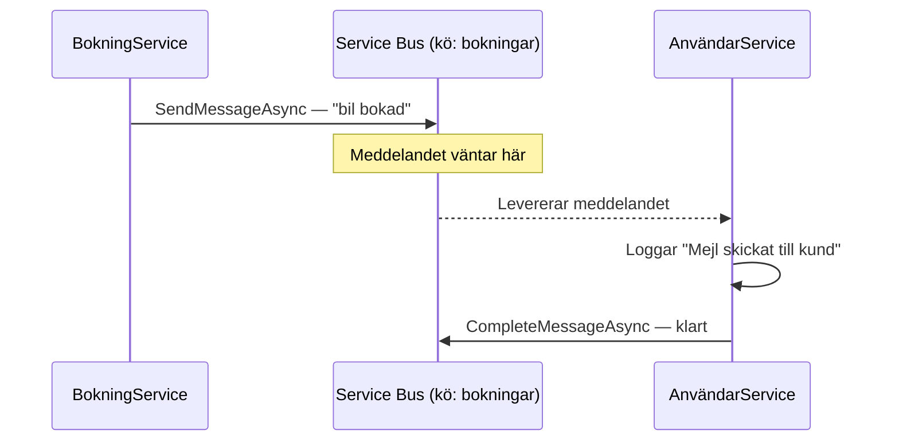

# Övning — Event-driven arkitektur med Azure Service Bus

🔴

**15-minutersregeln:** Fastnar du i mer än 15 minuter — fråga klassen, sen AI, sen mig. I den ordningen.

---

I förra övningen kopplade vi ihop tjänster via HttpClient. BokningService anropade AnvändarService direkt, väntade på svar och hoppades att tjänsten var uppe. Det är synkront — och det är ett problem.

Tänk dig att AnvändarService kraschar. Vad händer med bokningen? Den tappas. Kunden får inget mejl. Ingen vet vad som gick fel.

Den här övningen löser det. Du bygger en arkitektur där **BokningService** och **AnvändarService** aldrig pratar direkt. Istället lägger BokningService ett meddelande i en **Service Bus-kö** — och AnvändarService hämtar det när den är redo. Även om AnvändarService är nere i tio minuter går inget förlorat.



---

## Steg 1: Skapa Service Bus i Azure

Öppna en terminal och logga in:

```bash
az login
```

Kör sedan kommandona ett i taget:

```bash
# Skapa resource group — hoppa över om du redan har en
az group create \
  --name rg-bokningapp \
  --location swedencentral

# Skapa Service Bus namespace
# Byt ut [ditt-namn] — namnet måste vara globalt unikt
az servicebus namespace create \
  --resource-group rg-bokningapp \
  --name sb-bokningapp-[ditt-namn] \
  --location swedencentral \
  --sku Basic

# Skapa kön
az servicebus queue create \
  --resource-group rg-bokningapp \
  --namespace-name sb-bokningapp-[ditt-namn] \
  --name bokningar

# Hämta connection string — kopiera hela raden du får tillbaka
az servicebus namespace authorization-rule keys list \
  --resource-group rg-bokningapp \
  --namespace-name sb-bokningapp-[ditt-namn] \
  --name RootManageSharedAccessKey \
  --query primaryConnectionString \
  --output tsv
```

Spara connection string. Du behöver den i steg 2 och 3.

---

## Steg 2: BokningService — publisher

Skapa ett nytt consoleprojekt i en terminal:

```bash
dotnet new console -n BokningService
cd BokningService
dotnet add package Azure.Messaging.ServiceBus
```

Ersätt allt i `Program.cs`:

```csharp
using Azure.Messaging.ServiceBus;
using System.Text.Json;

// Klistra in din connection string från steg 1
const string connectionString = "Endpoint=sb://sb-bokningapp-[ditt-namn].servicebus.windows.net/;SharedAccessKeyName=RootManageSharedAccessKey;SharedAccessKey=...";
const string queueName = "bokningar";

// Simulerar att en kund bokar en bil
var bokning = new Bokning(
    BokningId: Guid.NewGuid(),
    Kund: "Anna Lindgren",
    Bil: "Volvo XC60",
    Datum: DateTime.Now.AddDays(3).ToString("yyyy-MM-dd")
);

await using var client = new ServiceBusClient(connectionString);
await using var sender = client.CreateSender(queueName);

// Serialisera bokningen till JSON och skicka
var json = JsonSerializer.Serialize(bokning);
var message = new ServiceBusMessage(json)
{
    ContentType = "application/json",
    Subject = "BilBokning"
};

await sender.SendMessageAsync(message);

Console.WriteLine("Bokning skapad och skickad till Service Bus!");
Console.WriteLine($"  ID:    {bokning.BokningId}");
Console.WriteLine($"  Kund:  {bokning.Kund}");
Console.WriteLine($"  Bil:   {bokning.Bil}");
Console.WriteLine($"  Datum: {bokning.Datum}");

// Record — en enkel databehållare för en bokning
record Bokning(Guid BokningId, string Kund, string Bil, string Datum);
```

### Förväntad output (BokningService)

```plaintext
Bokning skapad och skickad till Service Bus!
  ID:    a3f1c2b4-7e91-4d2a-b6c3-1f8e5d0a9c4e
  Kund:  Anna Lindgren
  Bil:   Volvo XC60
  Datum: 2026-07-16
```

---

## Steg 3: AnvändarService — consumer

Öppna en **ny terminal** (håll BokningService-terminalen öppen) och skapa ett nytt projekt:

```bash
dotnet new console -n AnvändarService
cd AnvändarService
dotnet add package Azure.Messaging.ServiceBus
```

Ersätt allt i `Program.cs`:

```csharp
using Azure.Messaging.ServiceBus;
using System.Text.Json;

// Samma connection string och könamn som BokningService
const string connectionString = "Endpoint=sb://sb-bokningapp-[ditt-namn].servicebus.windows.net/;SharedAccessKeyName=RootManageSharedAccessKey;SharedAccessKey=...";
const string queueName = "bokningar";

await using var client = new ServiceBusClient(connectionString);
await using var processor = client.CreateProcessor(queueName, new ServiceBusProcessorOptions());

// Körs automatiskt varje gång ett meddelande anländer
processor.ProcessMessageAsync += async args =>
{
    var body = args.Message.Body.ToString();
    var bokning = JsonSerializer.Deserialize<Bokning>(body);

    Console.WriteLine("Bokning mottagen!");
    Console.WriteLine($"  Kund:  {bokning!.Kund}");
    Console.WriteLine($"  Bil:   {bokning.Bil}");
    Console.WriteLine($"  Datum: {bokning.Datum}");
    Console.WriteLine("Mejl skickat till kund!");
    Console.WriteLine();

    // Markera som klart — meddelandet tas bort ur kön
    await args.CompleteMessageAsync(args.Message);
};

// Loggar om något går fel vid hantering
processor.ProcessErrorAsync += args =>
{
    Console.WriteLine($"Fel vid hantering: {args.Exception.Message}");
    return Task.CompletedTask;
};

Console.WriteLine("AnvändarService startad — lyssnar på bokningar...");
Console.WriteLine("Tryck Enter för att avsluta.");
Console.WriteLine();

await processor.StartProcessingAsync();
Console.ReadLine();
await processor.StopProcessingAsync();

record Bokning(Guid BokningId, string Kund, string Bil, string Datum);
```

### Förväntad output (AnvändarService)

```plaintext
AnvändarService startad — lyssnar på bokningar...
Tryck Enter för att avsluta.

Bokning mottagen!
  Kund:  Anna Lindgren
  Bil:   Volvo XC60
  Datum: 2026-07-16
Mejl skickat till kund!
```

---

## Steg 4: Kör båda i separata terminaler

Starta tjänsterna i den här ordningen:

**Terminal 1 — starta AnvändarService först:**

```bash
dotnet run --project AnvändarService
```

Vänta tills du ser "lyssnar på bokningar..." innan du går vidare.

**Terminal 2 — skicka en bokning:**

```bash
dotnet run --project BokningService
```

Titta i den första terminalen. Meddelandet dyker upp — utan att tjänsterna känner till varandras URL, port eller om den andra ens är igång.

Kör BokningService igen. Och igen. Varje bokning hanteras av AnvändarService en i taget.

---

## Asynkront = löst kopplat = mer resilient

Stäng av AnvändarService. Kör BokningService. Starta AnvändarService igen.

Vad händer? Meddelandet som skickades när AnvändarService var nere hänger kvar i kön. AnvändarService plockar upp det direkt när den startar.

Det är skillnaden mot HttpClient-varianten. Med HttpClient: om mottagaren är nere — tappar du meddelandet och får ett undantag. Med Service Bus: meddelandet väntar tills mottagaren är redo.

Tjänsterna bryr sig inte om varandra. BokningService behöver inte veta att AnvändarService existerar. AnvändarService behöver inte veta varifrån meddelandet kom. Det är vad "löst kopplat" faktiskt innebär i praktiken — inte bara en fin arkitekturterm.

---

## Utmanande frågor

<details><summary>Tips 1</summary>

```plaintext
Du kör BokningService tre gånger medan AnvändarService är avstängd.
Sedan startar du AnvändarService.

Hur många meddelanden hanteras? I vilken ordning?
Vad säger det om garantierna Service Bus ger?
```

</details>

<details><summary>Tips 2</summary>

```plaintext
Kommentera bort raden:
    await args.CompleteMessageAsync(args.Message);

Kör övningen igen. Vad ser du? Varför levereras meddelandet fler gånger?

Ledtråd: kolla vad "lock duration" och "max delivery count" betyder i Service Bus.
```

</details>

<details><summary>Tips 3</summary>

```plaintext
Basic-tier stöder bara queues — inte topics.
Vad är en topic? Hur skiljer sig publish/subscribe från point-to-point?

Scenario: tre tjänster ska alla reagera på samma bokning (AnvändarService, FakturaService, LagerService).
Kan du lösa det med en queue? Vad skulle du behöva byta till?
```

</details>

<details><summary>Lösningsförslag — reflektionsfrågor</summary>

**Tips 1 — kö och ordning**

Service Bus är en FIFO-kö (First In, First Out) med Basic-tier. Alla tre meddelanden sparas och levereras i den ordning de skickades. Det är grundgarantin — "at-least-once delivery". Inget försvinner, men i sällsynta fall kan ett meddelande levereras mer än en gång. Därför är det viktigt att din consumer-kod är idempotent — dvs. att hantera samma meddelande två gånger inte skapar problem.

**Tips 2 — CompleteMessageAsync**

Om du inte anropar `CompleteMessageAsync` lämnas meddelandet låst under "lock duration" (default 60 sekunder). När låset löper ut återlevereras meddelandet. Det fortsätter tills `max delivery count` (default 10) är uppnådd — då hamnar meddelandet i dead-letter queue. Det är skyddsnätet för meddelanden som aldrig kan hanteras.

**Tips 3 — topics och subscriptions**

Med en queue går varje meddelande till exakt en consumer. För att tre tjänster ska kunna reagera behöver du en **topic** med tre **subscriptions** — en per tjänst. Det kräver Standard-tier eller högre. Varje tjänst får sin egen kopia av meddelandet och hanterar det självständigt.

```
Topic: bil-bokningar
  ├── Subscription: anvandare-service
  ├── Subscription: faktura-service
  └── Subscription: lager-service
```

Det är publish/subscribe-mönstret — en publisher, många consumers. Ingen av dem vet om de andra.

</details>

---

*Marcus Ackre Medina — Nion Education — marcus.medina@nionit.com*
