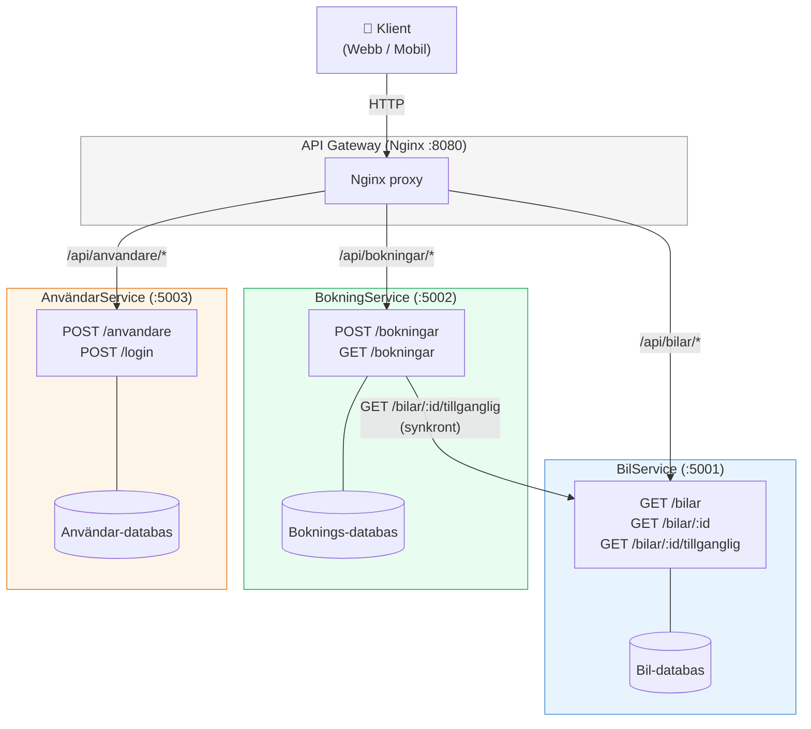

# Övning — Dela upp HyresBil i microservices

🔴

---

## Vad du ska göra

HyresBil AB:s system har vuxit okontrollerat. Det är nu en monolit med 15 controllers, ett enda SQL Server-schema och ett deploy-paket på 900 MB. Varje fredag ska allt ut i produktion på en gång, och varje fredag ber alla i teamet en tyst bön.

Du ska göra det som teamet har skjutit upp i sex månader: dela upp monoliten i tre självständiga microservices.

Det är inte svårt rent tekniskt. Det svåra är att tänka rätt från början — var går gränsen?

---

## Steg 1 — Identifiera bounded contexts

Innan du skriver en enda rad kod sitter du med ett tomt papper. Det är det viktigaste steget.

En **bounded context** är ett område i systemet som har ett tydligt eget ansvar och ett eget språk. Inuti en bounded context vet alla vad "Bokning" betyder. Utanför kan samma ord betyda något annat.

HyresBil har tre:

**BilService** äger allt som handlar om bilar:
- Registerplåt, märke, modell, årsmodell
- Tillgänglighet (är bilen ledig just nu?)
- Skaderapporter och underhållshistorik
- Prissättning per bil och bilklass

**BokningService** äger hela bokningsflödet:
- Skapa, ändra och avboka en bokning
- Koppla en kund till en bil under en period
- Status: aktiv, avslutad, avbruten

**AnvändarService** äger allt som rör kunden som person:
- Registrering, inloggning, lösenord
- Körkortsstatus och kreditbetyg
- Notifieringspreferenser (e-post, SMS)

Lägg märke till vad som händer med en bokning: BokningService vet att bokning nr 4711 gäller registerplåt `ABC 123` och kund-ID `99`. Den vet *inte* vad bilen heter eller vem kunden är. Den lagrar bara ID:n och frågar grannarna när den behöver mer info.

Det är meningen. Varje service äger sin data.

> **Kontrollpunkt:** Innan du går vidare — kan du säga, utan att tveka, vart du lägger "tillgänglighet"? Och vart hamnar "körkortsstatus"? Om du inte är säker, diskutera med en klasskomis. Det är ett riktigt arkitekturbeslut, inte en trick-fråga.

---

## Steg 2 — Skapa de tre projekten

Skapa en gemensam mapp för hela systemet och bygg de tre projekten i den:

```
mkdir HyresBil
cd HyresBil
dotnet new webapi --no-openapi -n BilService
dotnet new webapi --no-openapi -n BokningService
dotnet new webapi --no-openapi -n AnvandarService
```

Du ska ha tre separata mappar — tre separata appar. Kör dem på var sin port under utveckling:

| Service | Port |
|---|---|
| BilService | 5001 |
| BokningService | 5002 |
| AnvandarService | 5003 |

Starta `BilService` och verifiera att den svarar:

```
cd BilService
dotnet run --urls="http://localhost:5001"
```

I en annan terminal:

```
curl http://localhost:5001/weatherforecast
```

Du ska få ett JSON-svar. Defaultendpointen är kvar från mallen — det bekräftar att appen startar rätt. Gör samma sak för de andra två.

> **Kontrollpunkt:** Alla tre appar startar och svarar på var sin port utan krockar.

---

## Steg 3 — Bygg ett minimalt domänlager

Ersätt bort defaultendpointen i `BilService/Program.cs` och bygg en enkel in-memory-lista med bilar:

> `BilService/Program.cs`

```csharp
var builder = WebApplication.CreateBuilder(args);
var app = builder.Build();

// In-memory "databas" — i produktion hade detta varit ett riktigt lager
var bilar = new List<Bil>
{
    new(1, "ABC 123", "Volvo V60",  2022, true),
    new(2, "XYZ 456", "Tesla Model 3", 2024, true),
    new(3, "DEF 789", "BMW 3-serie", 2021, false) // under service
};

app.MapGet("/bilar", () => Results.Ok(bilar));

app.MapGet("/bilar/{id}", (int id) =>
{
    var bil = bilar.FirstOrDefault(b => b.Id == id);
    return bil is null ? Results.NotFound() : Results.Ok(bil);
});

app.MapGet("/bilar/{id}/tillganglig", (int id) =>
{
    var bil = bilar.FirstOrDefault(b => b.Id == id);
    if (bil is null) return Results.NotFound();
    return Results.Ok(new { bilId = id, tillganglig = bil.Tillganglig });
});

app.Run();

record Bil(int Id, string Registerplat, string Modell, int Arsmodell, bool Tillganglig);
```

Kör och testa:

```
curl http://localhost:5001/bilar
curl http://localhost:5001/bilar/1/tillganglig
```

### Förväntad output — `/bilar/1/tillganglig`

```json
{
  "bilId": 1,
  "tillganglig": true
}
```

> **Kontrollpunkt:** `/bilar` listar tre bilar. `/bilar/3/tillganglig` returnerar `false`. `/bilar/99` returnerar 404.

---

## Steg 4 — Service-till-service-kommunikation med HttpClient

BokningService behöver fråga BilService om en bil är tillgänglig innan den skapar en bokning. Det gör den via HTTP.

Ersätt `BokningService/Program.cs`:

> `BokningService/Program.cs`

```csharp
var builder = WebApplication.CreateBuilder(args);

// Registrera en typad HttpClient som pekar mot BilService
builder.Services.AddHttpClient("BilService", client =>
{
    // I produktion: hämta URL från miljövariabel eller konfiguration
    client.BaseAddress = new Uri("http://localhost:5001");
    client.Timeout = TimeSpan.FromSeconds(5);
});

var app = builder.Build();

var bokningar = new List<Bokning>();
var nextId = 1;

app.MapPost("/bokningar", async (BokningRequest request, IHttpClientFactory factory) =>
{
    var httpClient = factory.CreateClient("BilService");

    // Fråga BilService om bilen är tillgänglig
    HttpResponseMessage svar;
    try
    {
        svar = await httpClient.GetAsync($"/bilar/{request.BilId}/tillganglig");
    }
    catch (Exception ex)
    {
        // BilService svarar inte — vi kan inte skapa bokningen
        return Results.Problem(
            detail: $"Kunde inte nå BilService: {ex.Message}",
            statusCode: 503
        );
    }

    if (!svar.IsSuccessStatusCode)
        return Results.BadRequest(new { fel = "Bilen hittades inte i BilService" });

    var tillganglighet = await svar.Content.ReadFromJsonAsync<Tillganglighetssvar>();

    if (tillganglighet is null || !tillganglighet.Tillganglig)
        return Results.Conflict(new { fel = "Bilen är inte tillgänglig just nu" });

    // Bilen är ledig — skapa bokningen
    var bokning = new Bokning(nextId++, request.BilId, request.KundId, DateTime.UtcNow);
    bokningar.Add(bokning);

    return Results.Created($"/bokningar/{bokning.Id}", bokning);
});

app.MapGet("/bokningar", () => Results.Ok(bokningar));

app.Run();

record BokningRequest(int BilId, int KundId);
record Bokning(int Id, int BilId, int KundId, DateTime Skapad);
record Tillganglighetssvar(int BilId, bool Tillganglig);
```

Starta BilService (port 5001) och BokningService (port 5002) i varsin terminal. Testa:

```
curl -X POST http://localhost:5002/bokningar \
  -H "Content-Type: application/json" \
  -d '{"bilId": 1, "kundId": 99}'
```

### Förväntad output

```json
{
  "id": 1,
  "bilId": 1,
  "kundId": 99,
  "skapad": "2026-07-13T..."
}
```

Testa med bil 3 (som är under service):

```
curl -X POST http://localhost:5002/bokningar \
  -H "Content-Type: application/json" \
  -d '{"bilId": 3, "kundId": 99}'
```

Du ska få 409 Conflict — bilen är inte ledig.

> **Kontrollpunkt:** Lyckad bokning returnerar 201 Created med boken i body. Bokning på otillgänglig bil returnerar 409. Bokning på bil-ID 99 (finns inte) returnerar 400.

---

## Steg 5 — Varför API Gateway?

Klienten (en mobilapp, en webbsida) ska inte behöva veta att det finns tre separata servicar på tre separata portar. Det är din interna arkitektur — inte klientens problem.

En **API Gateway** är ingångspunkten. Klienten pratar alltid med gatewayen. Gatewayen routar vidare till rätt service bakom kulisserna.

```
Klient → API Gateway (port 80) → BilService (port 5001)
                               → BokningService (port 5002)
                               → AnvandarService (port 5003)
```

Det ger dig mer än bara ett enkelt gränssnitt:
- **Autentisering på ett ställe** — gatewayen validerar token, servicarna litar på gatewayen
- **Rate limiting** — begränsa antal requests per klient utan att ändra servicarna
- **Loggning** — se all trafik på ett ställe
- **TLS-terminering** — HTTPS hanteras av gatewayen, inte av varje service

I produktion använder du YARP (för .NET), Kong, Nginx, eller Azure API Management. Här kör vi Nginx lokalt för att förstå principen.

Skapa filen `nginx.conf` i `HyresBil/`-mappen:

> `HyresBil/nginx.conf`

```nginx
events {}

http {
    # Klienten pratar alltid med port 8080
    server {
        listen 8080;

        # /api/bilar/** → BilService
        location /api/bilar/ {
            proxy_pass http://localhost:5001/bilar/;
            proxy_set_header Host $host;
        }

        # /api/bokningar/** → BokningService
        location /api/bokningar/ {
            proxy_pass http://localhost:5002/bokningar/;
            proxy_set_header Host $host;
        }

        # /api/anvandare/** → AnvandarService
        location /api/anvandare/ {
            proxy_pass http://localhost:5003/anvandare/;
            proxy_set_header Host $host;
        }
    }
}
```

Starta Nginx med din config:

```
nginx -c $(pwd)/nginx.conf
```

Testa via gatewayen — klienten vet ingenting om portarna 5001–5003:

```
curl http://localhost:8080/api/bilar/1
```

Du ska få samma svar som `curl http://localhost:5001/bilar/1`. Nginx har vidarebefordrat anropet transparent.

Stoppa Nginx när du är klar:

```
nginx -s stop
```

> **Kontrollpunkt:** Du kan nå BilService via port 8080 utan att ange port 5001 direkt. Nginx-loggen (i terminalen) visar att proxyn tar emot och vidarebefordrar anropet.

---

## Steg 6 — Vad händer när BokningService är nere?

Kör det här experimentet. Stoppa BilService (Ctrl+C i den terminalen) och försök sedan skapa en bokning via BokningService:

```
curl -X POST http://localhost:5002/bokningar \
  -H "Content-Type: application/json" \
  -d '{"bilId": 1, "kundId": 99}'
```

Du får 503 Service Unavailable med ett felmeddelande. Det är bra — vi hanterade felet. Men nu hänger anropet i 5 sekunder (din timeout) innan det ger upp. Och om 100 kunder försöker boka samtidigt, hänger 100 anrop i 5 sekunder vardera.

Det kallas **kaskadfel** (cascading failure). En service som är nere drar ner hela resten av systemet.

### Circuit Breaker — säkringsprincipen

En **Circuit Breaker** är en elektrisk säkring i mjukvaruform. Den håller koll på hur ofta anrop till en extern service misslyckas. Om felen överstiger en tröskel öppnar den kretsen — framtida anrop nekas *direkt* utan att ens försöka nå servicen. Efter en stund (timeout) försöker den igen. Fungerar det, stänger kretsen.

Tre tillstånd:

| Tillstånd | Vad händer |
|---|---|
| **Closed** (normalt) | Anrop går igenom som vanligt. Fel räknas. |
| **Open** (säkringen har löst ut) | Anrop nekas omedelbart. Ingen väntar. |
| **Half-Open** (testläge) | Några anrop tillåts. Fungerar de? Stäng kretsen. Misslyckas de? Öppna igen. |

I .NET-ekosystemet använder du `Microsoft.Extensions.Http.Resilience` (eller Polly v8 som den bygger på). Det är ett par rader konfiguration i DI-containern — men konceptet är det viktiga just nu.

I koden från steg 4 har du en try/catch som returnerar 503 när BilService är nere. Det är ett första skydd. En Circuit Breaker är nästa lager — den skyddar BilService från att överväldigas av misslyckade anrop när den håller på att återhämta sig.

> **Kontrollpunkt:** Du kan förklara skillnaden mellan ett timeout-fel och ett kaskadfel. Du kan beskriva de tre tillstånden i en Circuit Breaker utan att titta.

---

## Steg 7 — Arkitekturdiagrammet

Här är hela systemet i ett diagram. Läs det noga — du ska kunna förklara varje pil.



Pilarna du behöver kunna förklara:

- Klient till Gateway — varför pratar klienten inte direkt med servicarna?
- Gateway till servicarna — vad är routing-regeln i Nginx-configen?
- BokningService till BilService — varför är detta en synkron HTTP-call och inte ett event?
- Varje service har sin **egen** databas — varför delar de inte en?

---

## Trade-offs — det du inte får glömma

Microservices löser problem. De skapar också nya. Det är inte gratis.

**Du vinner:**
- Kan deploya BilService utan att röra BokningService
- Kan skala BokningService separat under semestertoppar
- Teamet kan jobba på varsin service utan merge-konflikter
- En krasch i AnvändarService tar inte ner hela systemet

**Du betalar:**
- Nätverksanrop kan misslyckas — det kan inte ett method-anrop inom monoliten
- Transaktioner är svåra. Att atomärt skapa en bokning *och* markera bilen som ej tillgänglig kräver distribuerade mönster (Saga, eventual consistency)
- Testmiljön är tre gånger svårare att sätta upp
- Du måste oroa dig för service discovery, versionshantering av API:er, och nätverkslatens
- Debugging: ett fel kan uppstå i kaskad över tre servicar — du måste följa en distribuerad trace

**Faustregel för dig att ta med dig:** Börja alltid med en monolit. Dela upp när smärtan är konkret — inte som en förebyggande åtgärd.

---

## Kontrollpunkter

Gå igenom listan innan du markerar övningen som klar:

- [ ] Du kan namnge de tre bounded contexts och motivera varje gräns
- [ ] Alla tre projekt startar på var sin port utan konflikter
- [ ] BilService svarar på `/bilar`, `/bilar/:id`, och `/bilar/:id/tillganglig`
- [ ] BokningService anropar BilService via HttpClient och skapar bara bokning om bilen är ledig
- [ ] Bokning på otillgänglig bil returnerar 409, inte 500
- [ ] Du kan förklara vad en API Gateway gör med egna ord (utan att kolla)
- [ ] Du testade vad som händer när BilService stoppas
- [ ] Du kan förklara Circuit Breaker med de tre tillstånden: Closed, Open, Half-Open
- [ ] Du kan peka på minst tre konkreta nackdelar med microservices jämfört med monoliten

---

**15-minutersregeln:** Fastnar du i mer än 15 minuter på ett steg — fråga klassen, sen en AI, sen mig. I den ordningen.
