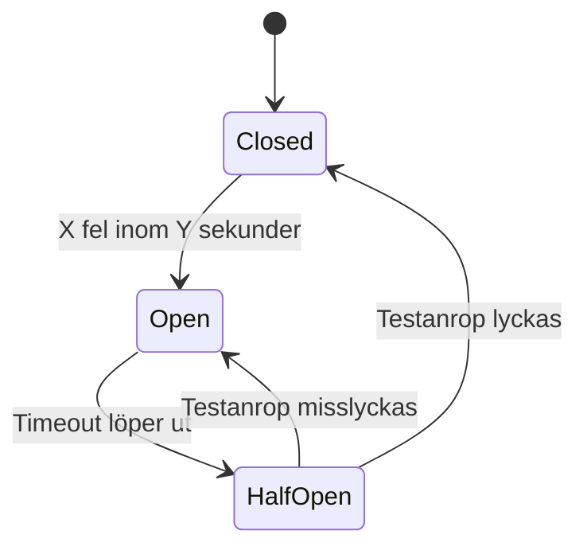

# Cloud-arkitekturmönster

Mönster är inte uppfinningar — de är mönster. Någon har stött på problemet före dig, löst det, och gett lösningen ett namn så att alla slipper uppfinna hjulet igen.

Det här är fem mönster som dyker upp i verkligen distribuerade system. Alla är applicerade på HyresBil — ett biluthyrningssystem med flera tjänster som pratar med varandra.

---

## CQRS — Command Query Responsibility Segregation

I de flesta system gör samma datamodell två väldigt olika saker: den skriver ny data och den läser data för att visa upp. Det funkar bra i ett litet system. I ett stort system krockar de.

Skrivningar kräver validering, affärslogik, och transaktioner. Läsningar kräver snabbhet, filtrering, och ofta en helt annan datastruktur än det som lagrades.

**CQRS** delar upp detta i två separata flöden:

| Sida | Ansvar | Optimerad för |
|------|--------|---------------|
| Command | Skriva, validera, ändra tillstånd | Korrekthet och integritet |
| Query | Läsa, filtrera, presentera | Snabbhet och format |

**HyresBil-exempel:** Bokningen skrivs via ett `BookingCommand` som validerar tillgänglighet och uppdaterar databasen. Söksidan läser istället från ett separat read model — en färdigdenormaliserad vy med bil, pris och lediga dagar — som inte behöver köra joins vid varje anrop.

Nackdelen: mer kod, fler delar att hålla synkade. Fördelen: varje sida kan skalas och optimeras oberoende.

---

## Event Sourcing — lagra händelser, inte tillstånd

Traditionellt lagrar du det aktuella tillståndet: "bilen är bokad av Anna 14–17 juli". Om någon undrar *hur* det blev så — det finns ingen historik.

**Event Sourcing** vänder på det. Du lagrar aldrig tillståndet direkt. Du lagrar händelserna som *ledde till* tillståndet:

```
BilSkapad          { bilId: 42, reg: "ABC123" }
BokningGjord       { bilId: 42, kundId: 7, från: 14/7, till: 17/7 }
BokningAvbokad     { bilId: 42, bokningId: 99, orsak: "kunden ångrade sig" }
BokningGjord       { bilId: 42, kundId: 12, från: 14/7, till: 17/7 }
```

Nuläget är summan av alla händelser. Vill du veta vad som hände för en vecka sedan? Spela upp händelseloggen till det datumet.

**HyresBil-exempel:** Kundtjänst kan se exakt vad som hände med en bokning — vem som ändrade, när, och varför — utan att någon behövt spara en separat ändringslogg. Det är ett fullständigt revisionsregister utan extra arbete.

Nackdelen: att rekonstruera nuläget kräver att du spelar upp alla händelser (mildras med snapshots). Tekniken passar bra ihop med CQRS.

---

## Circuit Breaker — stoppa kaskadfel

Om Betaltningstjänsten är nere och varje anrop till den tar 30 sekunder att tajma ut — och Bokningstjänsten gör hundra anrop i sekunden — är du snart i ett kaskadproblem som drar ner hela systemet.

**Circuit Breaker** fungerar som en säkring. Den har tre tillstånd:



| Tillstånd | Beteende |
|-----------|----------|
| Closed | Anrop går igenom normalt |
| Open | Anrop blockeras direkt — inget väntar |
| HalfOpen | Ett testanrop tillåts — lyckas det stängs kretsen |

I .NET används biblioteket **Polly** för att konfigurera detta:

```csharp
var policy = Policy
    .Handle<HttpRequestException>()
    .CircuitBreakerAsync(
        exceptionsAllowedBeforeBreaking: 5,
        durationOfBreak: TimeSpan.FromSeconds(30)
    );
```

**HyresBil-exempel:** Bokningstjänsten anropar Betalning. Om Betalning svarar fel fem gånger på tio sekunder öppnas kretsen. Nästa 30 sekunder returneras ett snabbt fel istället för att vänta — och HyresBil kan visa ett vettigt meddelande till kunden.

---

## Saga — distribuerade transaktioner utan lås

I en monolitt kan du linda in hela ett köpflöde i en databastransaktion. I ett distribuerat system sitter Bokning, Betalning och Notifiering i olika tjänster med egna databaser. Det finns ingen gemensam transaktion.

**Saga-mönstret** hanterar detta med en sekvens av lokala transaktioner. Om ett steg misslyckas körs kompenserande åtgärder bakåt:

```
1. Reservera bil        → OK
2. Debitera kort        → OK
3. Skicka bekräftelse   → MISSLYCKAS

Kompensation bakåt:
3. (hoppas över)
2. Återbetala debiteringen
1. Frigör bilreservationen
```

**HyresBil-exempel:** En ny bokning startar en Saga. Varje tjänst gör sitt steg och publicerar ett event. Om bekräftelsemailet inte kan skickas avbokas betalningen och bilen frigörs — utan att någon koordinator håller ett lås i 10 sekunder.

---

## Strangler Fig — migrera monoliten steg för steg

Att skriva om ett system från grunden är nästan alltid en dålig idé. Det tar månader, affärslogik tappas bort, och under hela tiden levererar du ingenting.

**Strangler Fig** (uppkallad efter ett träd som växer runt ett annat och sakta tar över) innebär att du bygger nya microservices vid sidan av monoliten och dirigerar om trafik steg för steg:

```
Fas 1: All trafik → Monolit
Fas 2: /api/bilar → BilTjänst (ny), resten → Monolit
Fas 3: /api/bokningar → BokningsTjänst (ny), resten → Monolit
Fas 4: Monoliten avvecklad
```

**HyresBil-exempel:** HyresBils gamla PHP-monolit lever kvar medan en ny BilTjänst i C# byggs parallellt. En reverse proxy (t.ex. NGINX eller Azure API Management) skickar `/api/bilar`-anrop till den nya tjänsten. Kunderna märker ingenting. När BilTjänsten är stabil extraheras nästa del.

---

## Sammanfattning

| Mönster | Löser |
|---------|-------|
| CQRS | Läsning och skrivning har olika krav — separera dem |
| Event Sourcing | Du behöver fullständig historik och revisionsspår |
| Circuit Breaker | En nere tjänst ska inte dra ner resten |
| Saga | Transaktioner som spänner över flera tjänster |
| Strangler Fig | Migrera bort från en monolit utan big bang-omskrivning |

Inget av dessa mönster löser allt — de introducerar varsin komplexitet. Frågan är aldrig "vilket mönster ska vi använda?" utan "har vi faktiskt det problem det här mönstret löser?".
