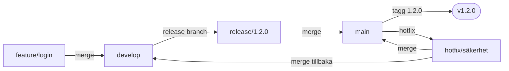
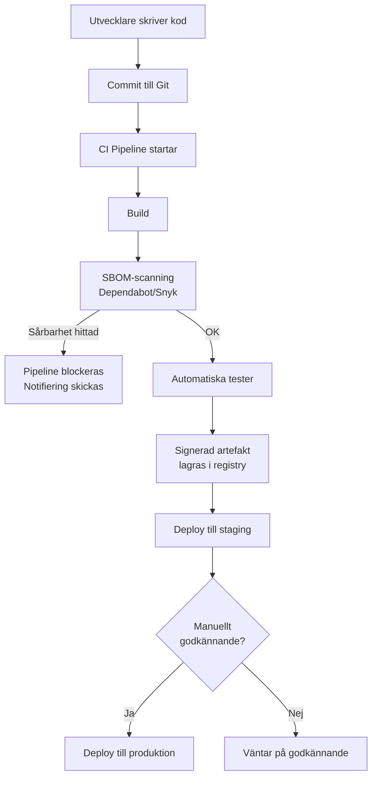

# 01 Continuous Delivery — Programmeringstermer

---

## Continuous Delivery · Kontinuerlig leverans

Continuous Delivery (CD) innebär att varje kodändring automatiskt byggs, testas och görs redo att lanseras till produktion — utan manuella steg. Det är inte samma sak som att *deployas* automatiskt (det är Continuous Deployment), utan att det *kan* deployas när som helst.

Tänk på det som ett löpande band i en fabrik: varje del som lämnar bandet är kvalitetskontrollerad och förpackad. Ingen behöver springa runt och fixa saker i sista sekunden — allt är redan klart att leverera.

**Utan CD:** "Vi deployas fredag kväll, alla stannar kvar, det är alltid kaos."
**Med CD:** "Vi deployas när affären vill det. Inga konstigheter."

```yaml
# Azure DevOps pipeline — CD-steget
- stage: Deploy
  dependsOn: Build
  condition: succeeded()
  jobs:
  - deployment: DeployProd
    environment: 'production'
    strategy:
      runOnce:
        deploy:
          steps:
          - task: AzureWebApp@1
            inputs:
              appName: 'min-app'
              package: '$(Pipeline.Workspace)/drop/*.zip'
```

Vanligaste misstaget: man bygger en pipeline men glömmer att testa i en staging-miljö som liknar produktion. Sedan är det "fungerar på min maskin"-debaklet fast i molnet.

> 🖼️ **Bild:** Tidslinje som visar skillnaden mellan "big bang release" (sällan, smärtfullt) vs Continuous Delivery (tätt, lugnt). Gärna ett burndown-chart med stressnivå som kurva.

---

## GitFlow · Förgreningsstrategi med struktur

GitFlow är en branchstrategi med fem typer av branches: `main`, `develop`, `feature/*`, `release/*` och `hotfix/*`. Varje branch har en tydlig roll och livscykel.

Tänk på det som ett kök på en restaurang: det finns en kökschef (main), en sous-chef (develop), stationer för varje rätt (feature-branches) och en snabb åtgärdsplan när något bränner vid (hotfix). Tydliga roller, men mycket koordination.

```
feature/ny-funktion → develop → release/1.2.0 → main
                                                 ↘ hotfix/1.2.1 → main
```

**Passar när:** du har schemalagda releaser, ett större team med formell releaseprocess, eller ett projekt där inte alla kan merga direkt.

**Passar inte när:** du vill deploya kontinuerligt — för mycket overhead, för många merge-konflikter.



> 🖼️ **Bild:** Det klassiska GitFlow-diagrammet med färgkodade branches — finns på Atlassians blogg, eller rita en kopia med era egna branch-namn.

---

## Trunk-Based Development · Allt mot main

I Trunk-Based Development (TBD) jobbar alla mot en enda branch (main / trunk). Feature-branches lever max 1–2 dagar. Feature flags används istället för långlivade branches.

Tänk på det som ett öppet kontorslandskap jämfört med separata kontor. Alla ser vad alla gör — det skapar snabbare kommunikation men kräver att alla är lite mer disciplinerade.

**Jämförelse mot GitFlow:**

| | GitFlow | Trunk-Based |
|---|---|---|
| Branch-livslängd | Dagar–veckor | Timmar–dagar |
| Merge-konflikter | Vanliga | Sällsynta |
| CI-hastighet | Långsammare | Snabb feedback |
| Passar | Schemalagda releaser | Continuous Deployment |

```bash
# Trunk-based workflow — ingen develop-branch
git checkout -b feature/kortlivad-branch
# ... kod ...
git push origin feature/kortlivad-branch
# PR → review → merge till main samma dag
```

Vanliga misstaget: man tror man kör TBD men har feature-branches som lever i tre veckor. Då är det inte TBD, det är bara GitFlow utan namngivning.

---

## Release Train · Tidtabellstyrd release

En release train är en schemalagd releasecykel — till exempel varje onsdag kl. 10. Funktioner som är klara åker med. De som inte är klara väntar till nästa tåg.

Det är exakt som ett pendeltåg: tåget går 10:15 oavsett om du hann springa dit eller inte. Ingen håller tåget för dig.

**Fördelar:** förutsägbart, alla vet när nästa release är, enklare planering.
**Nackdelar:** en viktig feature som missade tåget kan vänta en vecka. Kan skapa stress inför tågavgång.

SAFe (Scaled Agile Framework) bygger på release trains — Program Increment (PI) är ett "supratåg" som kör var 8–12:e vecka.

> 🖼️ **Bild:** Tågstationen med tider på tavlan — varje avgång är en release. Features som är "på perrongen" hinner med; de som fastnade i trafiken (ej klara) väntar.

---

## Semantic Versioning · Meningsfull versionering

Semantic Versioning (SemVer) ger versionsnummer formen `MAJOR.MINOR.PATCH`. Varje del har en exakt innebörd som kommunicerar förändringars storlek till alla som använder biblioteket.

Tänk på det som hus-adresser: `2.1.3` — hus 2, lägenhet 1, rum 3. Om du byter hus (MAJOR) måste alla uppdatera sin adressbok. Byter du lägenhet (MINOR) är det ny funktionalitet men samma hus. Flyttar du möbler (PATCH) märker besökaren ingenting.

```
1.0.0 → lansering
1.1.0 → ny endpoint tillagd (bakåtkompatibelt)
1.1.1 → bugfix i ny endpoint
2.0.0 → API-ändring som bryter befintliga klienter
```

**Regel:** Bumpa MAJOR vid breaking changes. Annars tror andra att det är säkert att uppgradera — och sedan slutar deras kod fungera.

```bash
# I package.json / NuGet: versionsbegränsning
"MinApi": "^1.2.0"   # accepterar 1.x.x men INTE 2.0.0
"MinApi": "~1.2.0"   # accepterar 1.2.x men INTE 1.3.0
```

---

## Rollback · Backa bandet

Rollback innebär att återgå till föregående version av en applikation när en ny release orsakar problem. Det låter enkelt men är ofta det svåraste i hela leveranskedjan.

Tänk på det som att ångra en renovering — du kan ta ner den nya tapeten, men om du redan rivit en vägg är det svårare att backa.

**Problemet:** databas-migreringar. Om version 2.0 lade till en kolumn och version 1.9 inte vet om den, bryter rollback databasen.

**Strategi:** Gör migreringar bakåtkompatibla i tre steg:
1. Deploy 2.0 (lägg till kolumn, men använd den inte)
2. Deploy 2.1 (börja använda kolumnen)
3. Deploy 2.2 (ta bort gammal kod)

Kan du rulla tillbaka nu? Ja, till vilket steg som helst.

```bash
# Azure App Service — rulla tillbaka till slot
az webapp deployment slot swap \
  --name min-app \
  --resource-group min-rg \
  --slot staging \
  --target-slot production
```

> 🖼️ **Bild:** Meme: "Rollback took 5 minutes. The 3-hour outage was because of the migration we forgot about."

---

## Artifact Repository · Byggartefakternas hem

Ett artifact repository är ett centralt lager för byggresultat — kompilerade binärer, Docker-images, NuGet-paket, npm-paket. Du bygger en gång, lagrar artefakten, deployas från lagret.

Tänk på det som ett centrallager (t.ex. ICA:s centrallager) — produkterna tillverkas en gång, lagras centralt, och distribueras därifrån till alla butiker. Du tillverkar inte en ny produkt för varje butik.

**Varför det spelar roll:** om du bygger om koden vid varje deploy finns ingen garanti att du deployer exakt vad du testade. Artefakten är beviset på vad som testades.

```yaml
# Publicera NuGet-paket till Azure Artifacts
- task: NuGetCommand@2
  inputs:
    command: 'push'
    packagesToPush: '$(Build.ArtifactStagingDirectory)/**/*.nupkg'
    nuGetFeedType: 'internal'
    publishVstsFeed: 'min-feed'
```

**Vanliga alternativ:**
- Azure Artifacts (paket + feeds)
- GitHub Packages (nära källkoden)
- Azure Container Registry (Docker-images)
- JFrog Artifactory (enterprise, alla format)

---

## Dependency Management · Beroendestyrning

Dependency management handlar om att kontrollera vilka externa bibliotek din kod beror på, i vilka versioner, och att dessa beroenden är säkra och reproducerbara.

Tänk på det som en lista av ingredienser i ett recept — om du inte anger exakt mängd och typ kan rätten bli annorlunda varje gång du lagar den.

```xml
<!-- NuGet — packages.lock.json låser exakta versioner -->
<PackageReference Include="Microsoft.EntityFrameworkCore" Version="8.0.7" />
```

**Lock-filer är kritiska:** `packages.lock.json` (NuGet), `package-lock.json` (npm), `Pipfile.lock` (Python). Utan lock-fil kan `dotnet restore` hämta en annan version nästa vecka och introducera en bugg du aldrig sett.

Vanligaste misstaget: inte commita lock-filen. Alla teammedlemmar och CI/CD-pipelinen får då potentiellt olika versioner.

---

## SBOM · Software Bill of Materials

En SBOM är ett maskinläsbart dokument som listar alla komponenter i din applikation — bibliotek, versioner, licenser, ursprung. Det är ett ingrediensförteckning för mjukvara.

Om en kritisk sårbarhet hittas i ett open source-bibliotek (t.ex. Log4Shell 2021) kan du med en SBOM på sekunder avgöra om du berörs — istället för att manuellt leta igenom projektet.

```bash
# Generera SBOM med dotnet
dotnet tool install --global Microsoft.Sbom.DotNetTool
dotnet sbom generate --PackageName "MinApp" --PackageVersion "1.0.0"
```

**Formater:** SPDX och CycloneDX är de vanligaste öppna standarderna. GitHub kan generera SBOM automatiskt.

EU:s Cyber Resilience Act (2025+) kräver SBOM för mjukvaruprodukter som säljs. Det är inte längre frivilligt.

---

## Supply Chain Security · Säkerhet i leveranskedjan

Supply chain security handlar om att verifiera att koden och biblioteken du använder faktiskt är vad de utger sig för att vara — att ingen har manipulerat ett paket på vägen från källan till din produktion.

Tänk på det som att köpa mat — du vill veta att det du köper i butiken inte manipulerats på vägen från bonden. Supply chain security är ursprungscertifikat och kylkedja för kod.

**SolarWinds-attacken (2020):** Angriparna komprometterade en uppdateringsserver. Alla kunder som installerade den legitima uppdateringen fick in skadlig kod. 18 000 organisationer drabbades — inklusive amerikanska myndigheter.

**Motåtgärder:**
- Signera paket kryptografiskt
- Verifiera hash vid nedladdning
- Pin exakta versioner i lock-filer
- Använd Dependabot / Renovate för att hålla beroenden uppdaterade
- Genomför regelbunden SBOM-scanning mot CVE-databaser

```yaml
# GitHub Actions — säkerhetsskanning av beroenden
- name: Run Snyk to check for vulnerabilities
  uses: snyk/actions/dotnet@master
  env:
    SNYK_TOKEN: ${{ secrets.SNYK_TOKEN }}
```



> 🖼️ **Bild:** Nyhetsrubrik om SolarWinds-attacken bredvid ett diagram som visar hur en komprometterad uppdatering sprids till tusentals kunder — visuellt kraftfullt sätt att motivera varför detta spelar roll.
