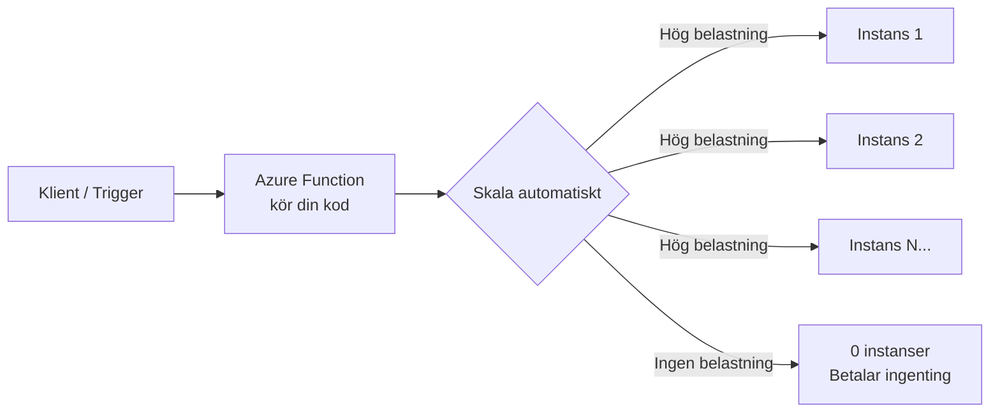
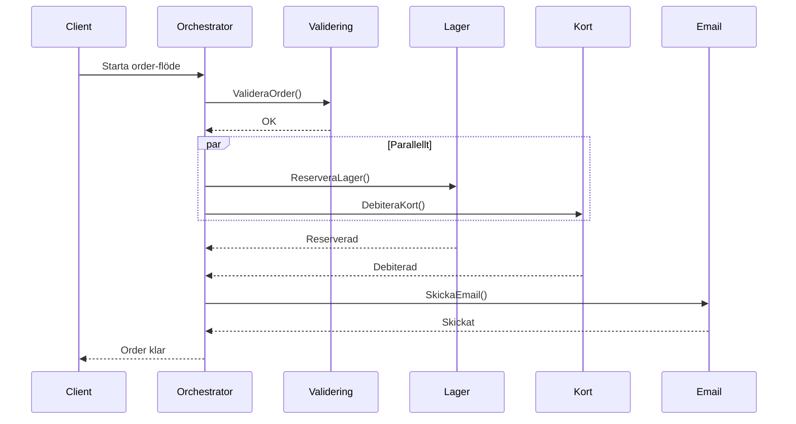

# 02 Serverless — Programmeringstermer

---

## Serverless · Serverlös beräkning

Serverless är en exekveringsmodell där du deployer kod utan att tänka på vilka servrar den körs på — molnleverantören hanterar allt under huven. Du betalar per faktisk exekvering (och den tid exekveringen tar), inte per timme en server är igång.

Tänk på det som ett hyrstudio: du betalar bara de timmar du faktiskt spelar in, inte för att lokalen existerar dygnet runt. Jämfört med att äga ett eget studio (VM) som kostar pengar även när ingen är där.

**Utan serverless:** du betalar 24/7 för en server som kanske används 2% av tiden.
**Med serverless:** du betalar exakt för de 2% — ibland hundra gånger billigare.



**Passar när:** sporadisk belastning, event-driven logik, korta tasks (under 10 min), API-backends med ojämn trafik.

**Passar inte när:** långvariga beräkningar, realtidsspel, WebSocket-servrar, extremt latenskänsliga system.

> 🖼️ **Bild:** Kostnadsgraf — traditionell VM (platt linje, alltid hög kostnad) vs serverless (följer trafiken, noll på natten). Visar dramatiskt kostnadsskillnad för en app med ojämn användning.

---

## Azure Functions · Händelsestyrd kod i Azure

Azure Functions är Azures serverless compute-tjänst. Du skriver en funktion i C#, Python, JavaScript eller Bash — och binder den till en händelse (HTTP-anrop, timer, kömeddelande, blob-uppladdning). Azure startar och stoppar infrastrukturen åt dig.

Tänk på det som en vakt med ett automatiskt svarssystem: funktionen sover tills något händer, vaknar, gör sitt jobb och somnar igen. Du betalar bara när vakten är vaken.

```csharp
// HTTP-triggad Azure Function i C#
[Function("HälsaFunction")]
public IActionResult Run(
    [HttpTrigger(AuthorizationLevel.Anonymous, "get")] HttpRequest req)
{
    string namn = req.Query["namn"];
    return new OkObjectResult($"Hej, {namn ?? "världen"}!");
}
```

**Versioner:** Functions v4 är aktuell. Stöder .NET 8 in-process och isolated worker (föredra isolated för bättre separation).

Vanligaste misstaget: skriva för komplex logik i en funktion. En Function ska göra EN sak. Om din funktion är 300 rader lång är det förmodligen flera funktioner i disguise.

---

## Function App · Behållaren för dina functions

En Function App är Azure-resursen som är värd för en eller flera Azure Functions. Alla funktioner i en Function App delar samma körmiljö, konfiguration, identitet och skalningsinställningar.

Tänk på det som ett kontor: Function App är byggnaden, och varje Azure Function är en anställd i den byggnaden. Alla delar kopiatorerna (konfiguration) och receptionen (nätverksinställningar).

**En Function App per domän:** håll samman relaterade funktioner (t.ex. alla order-relaterade) i en Function App. Blanda inte unrelated concerns i samma App — det skapar skalningsproblem och svår felsökning.

```bash
# Skapa Function App via Az CLI
az functionapp create \
  --resource-group min-rg \
  --name min-function-app \
  --storage-account minstorage \
  --runtime dotnet-isolated \
  --runtime-version 8 \
  --functions-version 4 \
  --consumption-plan-location westeurope
```

> 🖼️ **Bild:** Azure Portal-skärmdump av en Function App med tre funktioner listade — visar hierarkin: Function App → Functions.

---

## Trigger · Vad som startar funktionen

En trigger är händelsen som gör att en Azure Function körs. Varje funktion har exakt en trigger. Triggern definierar VART din kod svarar på.

Tänk på det som ett larmur — triggern är det som ringer. Du ställer in vad som ska ringa (HTTP, klocka, kömeddelande) och din funktion är det som händer när larmet går.

**De vanligaste triggrarna:**

| Trigger | Startar när... | Typiskt användningsfall |
|---|---|---|
| HttpTrigger | Inkommande HTTP-request | REST API, webhooks |
| TimerTrigger | Cron-schema uppnås | Nightly jobs, cleanup |
| QueueTrigger | Meddelande läggs i Storage Queue | Async processing |
| BlobTrigger | Fil laddas upp till Blob Storage | Bildbearbetning |
| ServiceBusTrigger | Meddelande på Service Bus topic | Event-driven microservices |
| EventGridTrigger | Event Grid-händelse | Systemintegration |

```csharp
// Timer-trigger — kör varje dag kl. 02:00
[Function("NattligtJobb")]
public void Run([TimerTrigger("0 0 2 * * *")] TimerInfo timer)
{
    _logger.LogInformation($"Nattligt jobb startat: {DateTime.UtcNow}");
    // Rensa gamla sessioner, skicka sammanfattning, etc.
}
```

---

## Binding · Deklarativ datakoppling

En binding är ett deklarativt sätt att koppla en funktion till en datakälla eller ett datamål — utan att du skriver boilerplate-kod för att ansluta, autentisera eller serialisera. Input bindings läser data, output bindings skriver data.

Tänk på det som plumbing-kopplingarna i ett kök: du deklarerar "det här röret ska gå till kylskåpet och det här ska gå till diskhon" — Azure ordnar rörsystemet. Du behöver inte bygga rören själv.

```csharp
// HttpTrigger (input) + Blob Storage output binding
[Function("SpараFil")]
[BlobOutput("uploads/{name}.json", Connection = "AzureWebJobsStorage")]
public string Run(
    [HttpTrigger(AuthorizationLevel.Anonymous, "post")] HttpRequest req,
    string name)
{
    // Returvärdet skrivs automatiskt till Blob Storage
    return $"{{\"timestamp\": \"{DateTime.UtcNow}\", \"name\": \"{name}\"}}";
}
```

**Fördelen:** du slipper skriva `BlobServiceClient`, autentisera mot storage och serialisera JSON. Bindings tar hand om det — du fokuserar på affärslogiken.

Vanligaste misstaget: använda bindings för komplex logik (t.ex. queries). Bindings är för enkla read/write. Behöver du söka i en databas med komplexa queries, injicera databasens klient istället.

---

## Durable Functions · Tillståndsfulla serverless-flöden

Durable Functions är ett ramverk ovanpå Azure Functions för att orkestrera långvariga, tillståndsfulla arbetsflöden. Det löser problemet med att serverless per definition är stateless och korta.

Tänk på det som en projektledare som håller koll på status för ett projekt med flera parallella uppgifter — orkestratorn vet var i flödet vi är, väntar på svar från underleverantörer (aktivitetsfunktioner) och återupptar arbetet när svar kommer in.

```csharp
// Orchestrator-funktion
[Function("BearbetaOrder")]
public static async Task<string> Run(
    [OrchestrationTrigger] TaskOrchestrationContext context)
{
    // Steg 1: Validera
    await context.CallActivityAsync("ValideraOrder", context.GetInput<Order>());
    
    // Steg 2: Parallellt — reservera lager OCH debitera kort
    await Task.WhenAll(
        context.CallActivityAsync("ReserveraLager", orderId),
        context.CallActivityAsync("DebiteraKort", orderId)
    );
    
    // Steg 3: Skicka bekräftelsemejl
    return await context.CallActivityAsync<string>("SkickaEmail", orderId);
}
```

**Användningsfall:** godkännandeflöden (vänta på mänskligt input), long-polling, fan-out/fan-in (parallellt arbete), sagor (Saga Pattern).



---

## Cold Start · Uppvärmningstiden

Cold start är fördröjningen som uppstår när en serverless-funktion körs för första gången efter en period av inaktivitet — molnet måste starta en ny instans, ladda körmiljön och din kod innan exekveringen kan börja.

Tänk på det som att starta en gammal bil på vintern: den startar, men det tar ett par sekunder extra innan den är klar att köra. En bil som redan är varm startar direkt.

**Typiska cold start-tider:**
- Node.js: 100–500 ms
- C# (in-process): 1–3 sekunder
- C# (isolated worker): 2–5 sekunder
- Python: 500 ms–2 sekunder

**Strategier mot cold starts:**

| Strategi | Hur | Kostnad |
|---|---|---|
| Premium Plan | Pre-warmed instances alltid igång | Hög |
| Always On (App Service) | Pingas regelbundet | Medel |
| Warm-up trigger | Anropa funktionen var 5:e minut | Låg |
| Minimera beroenden | Färre paket = snabbare laddning | Ingen |

> 🖼️ **Bild:** Graf som visar responstid — de flesta requests under 50 ms, men de första request efter inaktivitet plötsligt 2000 ms. Tydligt visar cold start som en outlier i latency-grafen.

---

## Consumption Plan · Betala per exekvering

Consumption Plan är den grundläggande, serverless-faktiska värdplanen för Azure Functions. Du betalar per exekvering (1 miljon gratis/månad) och per GB-sekund. Skalningen är helt automatisk — ner till noll instanser vid inaktivitet.

Det är som att hyra en taxi: du betalar per resa, inte för att bilen existerar. Perfekt om du inte vet i förväg hur mycket du kör.

**Begränsningar:**
- Max 10 minuters exekveringstid per function-anrop
- Cold starts förekommer
- Begränsad nätverkskonfiguration (ingen VNET-integration på grundnivå)
- Max 1,5 GB RAM per instans

**Passar:** sporadiska jobb, event-driven APIs med ojämn trafik, dev/test-miljöer.

---

## Premium Plan · Serverless utan cold starts

Premium Plan ger serverless-beteende (automatisk skalning, event-driven) men med pre-warmed instances som alltid är igång. Inga cold starts. Du kan också integrera med Virtual Networks och köra längre exekveringar.

Det är som att ha en varm taxi som alltid väntar utanför dörren — du betalar mer, men det är alltid direkt.

**Premium Plan vs Consumption:**

| | Consumption | Premium |
|---|---|---|
| Cold start | Ja | Nej |
| Min instanser | 0 | 1+ (alltid varm) |
| VNET-integration | Nej | Ja |
| Max exekveringstid | 10 min | Obegränsat |
| Pris | Betala per anrop | Månadsavgift + anrop |

Vanligaste misstaget: välja Premium Plan för ett jobb som körs en gång per dag. Cold start på ett nattjobb spelar ingen roll — du slösar pengar på pre-warmed instances ingen använder.

---

## Event Grid · Azures händelserouter

Azure Event Grid är en fullständigt hanterad händelserouter i Azure — en "pub/sub"-tjänst som kopplar samman publishers (t.ex. Blob Storage, din applikation) med subscribers (t.ex. Azure Functions, Logic Apps, webhooks).

Tänk på det som ett digitalt postkontor med tidningar: publishers lämnar in tidningar (händelser), postkontoret ser till att rätt prenumeranter får exakt de tidningar de beställt — utan att publishern behöver veta vem som läser.

```mermaid
flowchart LR
    BLOB[Blob Storage\n"fil uppladdad"] -->|Händelse| EG[Event Grid]
    APP[Din app\n"order skapad"] -->|Custom Event| EG
    EG -->|Filtrerat| F1[Azure Function\nBearbeta bild]
    EG -->|Filtrerat| F2[Azure Function\nSkicka email]
    EG -->|Filtrerat| LApp[Logic App\nNotifiera team]
```

**Skillnad mot Service Bus:**

| | Event Grid | Service Bus |
|---|---|---|
| Modell | Push (levererar direkt) | Pull (konsument hämtar) |
| Ordning | Inte garanterad | FIFO möjlig |
| Retry | 24 timmar | Konfigurerbara dead-letters |
| Passar | Reaktiva händelser | Tillförlitliga köer |

```bash
# Prenumerera på Blob Storage-händelser
az eventgrid event-subscription create \
  --name "bild-bearbetning" \
  --source-resource-id "/subscriptions/.../storageaccounts/min-storage" \
  --endpoint-type azurefunction \
  --endpoint "/subscriptions/.../functions/BearbetaBild" \
  --included-event-types Microsoft.Storage.BlobCreated
```

> 🖼️ **Bild:** Azure Portal — Event Grid Topics-vyn med publishers på vänster sida och subscribers på höger, med pilar som visar routing. Visar konkret hur händelser flödar.
