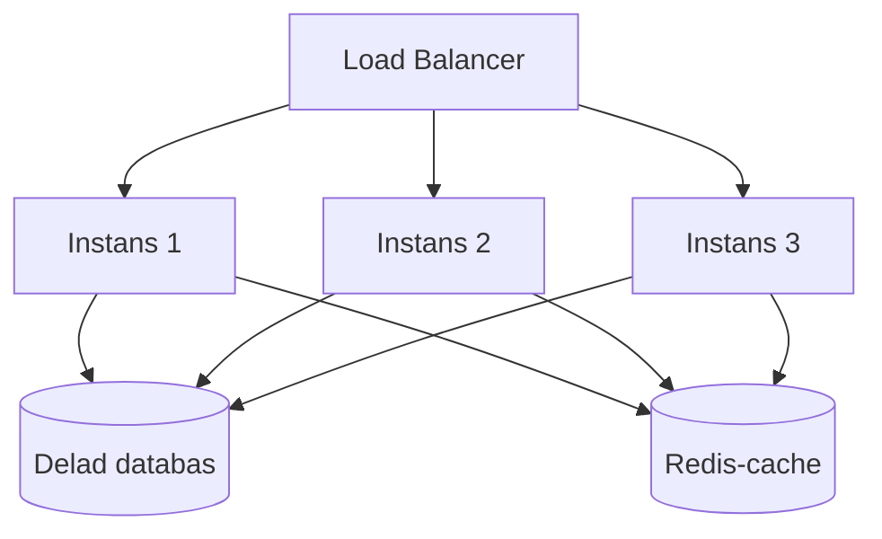
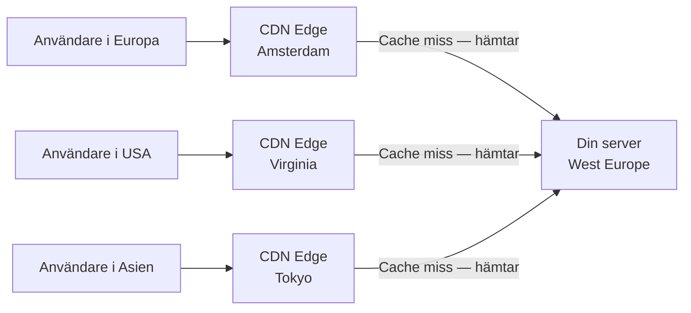

# 03 Skalning och Lastbalansering — Programmeringstermer

---

## Horisontell Skalning · Scale Out

Horisontell skalning innebär att du lägger till fler instanser av samma tjänst för att hantera ökad belastning — fler maskiner som delar på arbetet, snarare än att en maskin blir kraftfullare.

Tänk på det som en restaurang som öppnar en extra kassa när kön blir lång. Varje kassa gör exakt samma sak — du lägger till fler, inte en snabbare.

**Kräver stateless design:** om din app lagrar sessionsdata i minnet (local state) fungerar inte horisontell skalning — request 1 träffar server A, request 2 träffar server B, och server B vet ingenting om sessionen på server A.

**Lösning:** flytta state till extern lagring — Redis för sessions, en databas för affärsdata.



**Skalbarhet i praktiken:** Azure App Service kan ha 1–30 instanser (Standard/Premium tier). Kubernetes kan ha hundratals pods. Serverless skalar automatiskt till tusentals instanser.

> 🖼️ **Bild:** Animerat GIF eller serie av bilder — 1 server → 3 servrar → 6 servrar bakom en load balancer, allt medan trafik-pilen till vänster växer. Visar skalningskonceptet visuellt.

---

## Vertikal Skalning · Scale Up

Vertikal skalning innebär att du ger en befintlig server mer resurser — mer CPU, mer RAM, snabbare disk. Samma maskin, bara kraftfullare.

Tänk på det som att byta ut kocken mot en snabbare kock istället för att anställa fler. Det fungerar — men det finns ett tak för hur snabb en kock kan vara.

**Begränsning:** det finns en fysisk övre gräns. Den största VM-storleken i Azure (t.ex. Standard_M416ms_v2) har 5,7 TB RAM — men kostar tusentals kronor per timme och är fortfarande ett enskilt felkritiskt system.

**Nedtid:** vertikal skalning kräver ofta en omstart av servern, vilket innebär planerat driftstopp.

**Jämförelse:**

| | Horisontell | Vertikal |
|---|---|---|
| Skalningsgräns | Praktiskt taget obegränsad | Hårdvarugräns |
| Stateless krav | Ja | Nej |
| Nedtid vid skalning | Nej (rullas ut) | Ofta ja |
| Komplexitet | Högre (load balancing) | Lägre |
| Kostnad vid hög belastning | Flexibel | Kan bli dyrare |

**Regel:** börja vertikalt om din app inte är redo för horisontell skalning. Planera att gå horisontellt när du växer.

---

## Load Balancer · Trafikfördelaren

En load balancer tar emot inkommande trafik och fördelar den över flera backend-instanser. Målet är att ingen enskild instans får för mycket arbete — och att trafiken automatiskt undviker trasiga instanser.

Tänk på det som en receptionist på ett sjukhus som fördelar patienter till tillgängliga doktorer. Receptionen vet vilka doktorer som är lediga och skickar aldrig patienter till en sjukskriven läkare.

**Azure erbjuder flera nivåer:**

| Tjänst | Nivå | Passar för |
|---|---|---|
| Azure Load Balancer | L4 (TCP/UDP) | VM-trafik, intern load balancing |
| Application Gateway | L7 (HTTP/HTTPS) | Webbappar, SSL-termination, WAF |
| Azure Front Door | Global L7 | Multi-region, CDN, DDoS-skydd |
| Traffic Manager | DNS-baserad | Geo-routing, disaster recovery |

```bash
# Skapa Azure Load Balancer
az network lb create \
  --resource-group min-rg \
  --name min-lb \
  --sku Standard \
  --public-ip-address min-lb-ip \
  --frontend-ip-name min-frontend \
  --backend-pool-name min-backend
```

**L4 vs L7:** L4-load balancing ser bara på IP och port — snabbt men primitivt. L7 förstår HTTP och kan routa baserat på URL-path, cookies och headers — kraftfullt men lite långsammare.

---

## Health Probe · Hälsokontroll

En health probe är en regelbunden kontroll som load balancern utför för att avgöra om en backend-instans är frisk och ska ta emot trafik. En instans som inte svarar på proben tas bort från rotationen tills den svarar igen.

Tänk på det som en periodisk check-in: load balancern ringer var 30:e sekund. Om ingen svarar tre gånger i rad antar den att servern är borta och slutar skicka trafik dit.

```csharp
// ASP.NET Core — health check endpoint
builder.Services.AddHealthChecks()
    .AddDbContextCheck<AppDbContext>()  // Kollar att databasen svarar
    .AddCheck("redis", () =>
        redis.IsConnected
            ? HealthCheckResult.Healthy()
            : HealthCheckResult.Unhealthy("Redis svarar inte"));

app.MapHealthChecks("/health");
```

**Konfiguration:**
- **Intervall:** hur ofta proben körs (standard: 15 sekunder)
- **Timeout:** hur länge load balancern väntar på svar (standard: 5 sekunder)
- **Tröskel:** hur många misslyckanden innan instansen tas bort (standard: 2)

Vanligaste misstaget: en health probe som alltid returnerar 200 OK oavsett vad — den bekräftar att webbservern lever, men inte att databasen fungerar. Din app är nere i praktiken men load balancern skickar fortfarande trafik dit.

---

## Session Persistence · Sticky Sessions

Session persistence (sticky sessions) innebär att load balancern säkerställer att en specifik användares requests alltid skickas till samma backend-instans — inte slumpmässigt fördelat.

Tänk på det som att alltid ha samma handläggare på banken. Handläggaren känner din ärende-historia. Problemet uppstår om den handläggaren är sjuk — då måste du förklara allt om från början.

**Varför det behövs (och varför det är ett problem):**

Stateful appar som lagrar sessionsdata i minnet kräver sticky sessions — annars kommer request 2 till en server som inte vet vem du är. Men sticky sessions skapar ojämn belastning och försvårar horisontell skalning.

**Den bättre lösningen:** gör appen stateless. Lagra sessioner i Redis.

```csharp
// ASP.NET Core — distribuerad session i Redis
builder.Services.AddStackExchangeRedisCache(options => {
    options.Configuration = "min-redis.redis.cache.windows.net:6380,password=...";
});
builder.Services.AddSession(options => {
    options.IdleTimeout = TimeSpan.FromMinutes(30);
});
```

> 🖼️ **Bild:** Diagram — vänster sida: sticky sessions där server A har 80% av trafiken (ojämnt), server B bara 20%. Höger sida: stateless design med Redis där trafiken är jämnt fördelad. Tydlig kontrast.

---

## Auto Scaling · Automatisk skalning

Auto scaling är funktionen som automatiskt lägger till eller tar bort instanser baserat på mätbara mätvärden — CPU-användning, antal requests, ködjup, eller en tidtabell.

Tänk på det som ett trafikljus med sensorer: när trafiken är tung öppnar fler filer. När det är tomt stängs de. Ingen mänsklig styrning behövs.

**Regler vs prediktiv skalning:**
- **Regelbaserad:** CPU > 70% → lägg till en instans. Enkel men reagerar i efterhand.
- **Schemabaserad:** lägg alltid till instanser inför lunch (kl. 11:30). Du vet att det kommer.
- **Prediktiv (Azure):** AI förutsäger belastning baserat på historisk data.

```bash
# Auto-scale regel för App Service Plan
az monitor autoscale create \
  --resource-group min-rg \
  --resource min-app-plan \
  --resource-type Microsoft.Web/serverfarms \
  --name min-autoscale \
  --min-count 1 \
  --max-count 10 \
  --count 1

az monitor autoscale rule create \
  --resource-group min-rg \
  --autoscale-name min-autoscale \
  --scale out 1 \
  --condition "CpuPercentage > 70 avg 5m"
```

**Cooldown-period:** efter att en scale-out-åtgärd utförts väntar Azure (standard: 5 minuter) innan nästa bedömning. Utan cooldown riskerar du att lägga till 10 instanser på en minut när belastningen spiker.

---

## Scale Set · Azure VM Scale Sets

Azure VM Scale Sets (VMSS) är en Azure-resurs för att köra en grupp identiska virtuella maskiner som kan skalas automatiskt. Alla VMs startar från samma image och konfiguration.

Tänk på det som att klona sig själv — du har en mall på hur du ser ut och vad du kan, och när det behövs fler "kloner" skapas de exakt likadana.

```bash
# Skapa en VM Scale Set
az vmss create \
  --resource-group min-rg \
  --name min-vmss \
  --image Ubuntu2204 \
  --vm-sku Standard_B2s \
  --instance-count 2 \
  --admin-username azureuser \
  --generate-ssh-keys \
  --load-balancer min-lb
```

**Användningsfall:** batch-processing, rendering-jobb, spelservrar, CI/CD-agenter som behöver fler maskiner vid hög byggaktivitet.

**Skillnad mot App Service auto scaling:** VMSS ger dig full kontroll över OS och miljö, men kräver mer hantering. App Service är enklare men mer opak.

---

## Rate Limiting · Begränsa antalet anrop

Rate limiting sätter ett tak på hur många requests en klient (IP-adress, API-nyckel, användare) kan göra under en viss tidsperiod. Det skyddar din backend mot att överbelastas — oavsett om det är av en illvillig aktör eller bara en buggig klient.

Tänk på det som en kö på IKEA i relation-period: du får handla, men inte mer än X artiklar per besök. Oberoende av avsikt — det gäller alla.

```csharp
// ASP.NET Core — rate limiting med policy
builder.Services.AddRateLimiter(options =>
{
    options.AddFixedWindowLimiter("api-policy", limiterOptions =>
    {
        limiterOptions.PermitLimit = 100;          // Max 100 requests
        limiterOptions.Window = TimeSpan.FromMinutes(1); // Per minut
        limiterOptions.QueueLimit = 10;            // Kö-djup
    });
});

app.UseRateLimiter();

// På controller eller endpoint
[EnableRateLimiting("api-policy")]
[HttpGet("data")]
public IActionResult HämtaData() { ... }
```

**Algoritmer:**

| Algoritm | Beteende | Passar |
|---|---|---|
| Fixed Window | N requests per fast tidsperiod | Enkel, men kan spike vid periodbyte |
| Sliding Window | N requests per rullande tidsperiod | Jämnare, lite mer komplex |
| Token Bucket | Tokens fylls på i jämn takt | Tillåter bursts, vanlig i API-gateways |

---

## CDN · Content Delivery Network

Ett CDN är ett globalt nätverk av edge-servrar som cachar statiskt innehåll (bilder, JavaScript, CSS, videor) nära slutanvändaren. Istället för att alla request går till din server i West Europe får en användare i Tokyo innehållet från en server i Tokyo.

Tänk på det som ett bibliotek med filialer: istället för att alla måste åka till centralbiblioteket (origin-server) finns populära böcker (statiskt innehåll) kopierade till biblioteket i ditt kvarter.



**Azure CDN vs Azure Front Door:**
- **Azure CDN:** renodlad caching, enklare konfiguration, lägre pris.
- **Azure Front Door:** CDN + load balancing + WAF + global routing. Det rätta valet för enterprise-appar.

```bash
# Aktivera CDN på ett Azure Storage account (för statisk webbsida)
az cdn endpoint create \
  --resource-group min-rg \
  --profile-name min-cdn-profile \
  --name min-endpoint \
  --origin minstorage.blob.core.windows.net \
  --origin-host-header minstorage.blob.core.windows.net
```

**Cache-Control är kritiskt:** utan rätt HTTP-headers vet CDN:et inte hur länge det ska cacha innehållet. `Cache-Control: max-age=86400` (24 timmar) för statiska filer som sällan ändras. Glömmer du detta cacher CDN:et antingen ingenting eller för länge.

> 🖼️ **Bild:** Världskarta med Azure CDN-noder utmarkerade som punkter. Visar hur en request från Tokyo träffar en lokal nod i stället för att resa hela vägen till Europa — illustrerar latency-förbättringen.
