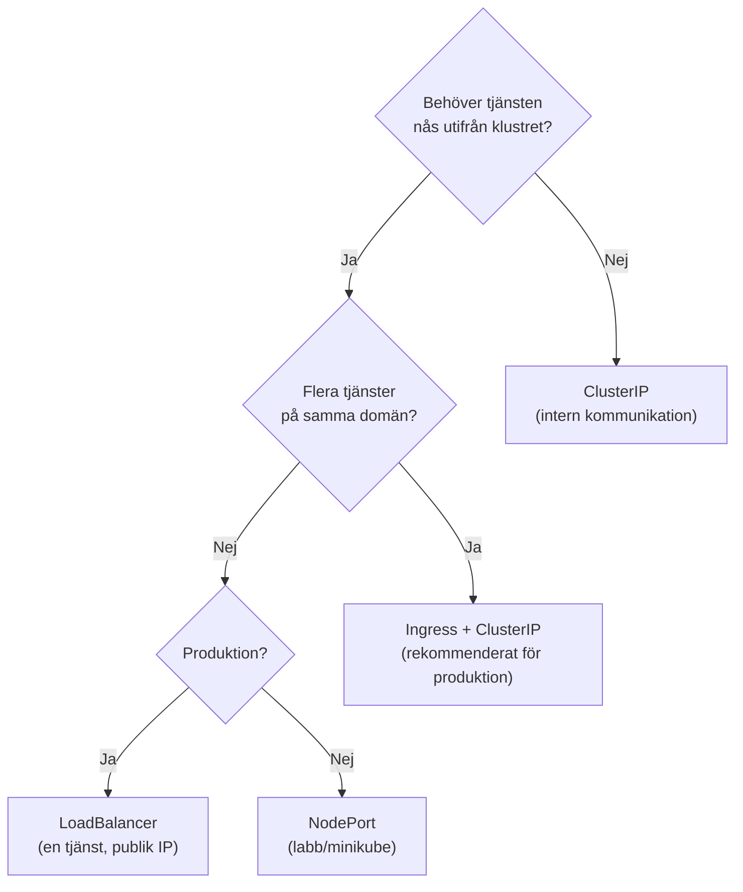
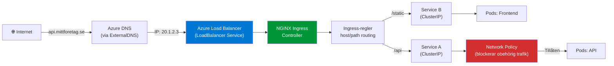

# 03 Ingress och Tillgänglighet — Programmeringstermer

> Nivå: Advanced Cloud (kurs-10) — hur trafik tar sig in i klustret, och hur du gör applikationer tillgängliga på riktigt.

---

## Ingress · Ingress

Ingress är en Kubernetes-resurs som definierar regler för hur extern HTTP/HTTPS-trafik ska routas till tjänster inuti klustret. En Ingress-resurs utan en Ingress Controller gör ingenting — regeln behöver en implementation.

Tänk på det som ett recept för en receptionist: "om någon frågar efter /api, skicka dem till konferensrum 2; om de frågar efter /admin, skicka dem till direktörsvåningen." Receptionisten (Ingress Controller) exekverar reglerna.

```yaml
apiVersion: networking.k8s.io/v1
kind: Ingress
metadata:
  name: min-app-ingress
  annotations:
    nginx.ingress.kubernetes.io/rewrite-target: /
spec:
  ingressClassName: nginx
  tls:
    - hosts:
        - api.mittforetag.se
      secretName: tls-secret
  rules:
    - host: api.mittforetag.se
      http:
        paths:
          - path: /api
            pathType: Prefix
            backend:
              service:
                name: api-service
                port:
                  number: 80
          - path: /admin
            pathType: Prefix
            backend:
              service:
                name: admin-service
                port:
                  number: 80
```

**Varför inte bara köra LoadBalancer Services per tjänst?** En LoadBalancer Service per tjänst = en Azure Load Balancer per tjänst = en IP-adress per tjänst = kostar pengar och skapar komplexitet. En Ingress + en LoadBalancer Service för Ingress Controller hanterar hur många tjänster som helst.

> 🖼️ **Bild:** Kostnadsdiagram: "Utan Ingress — 5 LoadBalancer Services = 5 IP-adresser och 5 Azure LBs" vs. "Med Ingress — 1 IP, 1 LB, routas till 5 tjänster"

---

## Ingress Controller · Ingress-kontroller

Ingress Controller är den faktiska implementationen som läser Ingress-resurser och verkställer routing-reglerna. Den kör som en deployment i klustret och är den som faktiskt tar emot extern trafik.

Tänk på det som receptionisten som faktiskt springer och knackar på dörrarna — Ingress-resursen är instruktionstexten, Ingress Controller är personen som faktiskt utför den.

```bash
# Installera NGINX Ingress Controller via Helm (vanligast)
helm repo add ingress-nginx https://kubernetes.github.io/ingress-nginx
helm repo update

helm install nginx-ingress ingress-nginx/ingress-nginx \
  --namespace ingress-nginx \
  --create-namespace \
  --set controller.service.annotations."service\.beta\.kubernetes\.io/azure-load-balancer-health-probe-request-path"=/healthz

# Verifiera att den fick en extern IP från Azure
kubectl get service -n ingress-nginx
# NAME                                 TYPE           EXTERNAL-IP
# nginx-ingress-ingress-nginx-controller LoadBalancer 20.1.2.3
```

**Populära Ingress Controllers — när väljer du vad?**

| Controller | Välj när |
|---|---|
| NGINX Ingress | Standard — bra för de flesta |
| Traefik | Automatisk Let's Encrypt, bra dashboard, Kubernetes-native |
| Azure Application Gateway (AGIC) | Vill ha Azure WAF, integrerat med Azure |
| Istio | Microservices, service mesh, avancerad traffic management |

> 🖼️ **Bild:** Flödesdiagram: Internet → DNS → Azure Load Balancer → NGINX Ingress Controller Pod → Service A eller Service B baserat på path

---

## Ingress Rule · Ingress-regel

En Ingress-regel kombinerar ett värdnamn (host) och ett sökvägs-mönster (path) med en backend-tjänst. Det är den atomära enheten i Ingress-konfigurationen.

```yaml
# Tre vanliga routingmönster
rules:
  # 1. Host-baserad routing (olika domäner → olika tjänster)
  - host: api.mittforetag.se
    http:
      paths:
        - path: /
          pathType: Prefix
          backend:
            service:
              name: api-service
              port:
                number: 80

  # 2. Path-baserad routing (samma domän, olika paths)
  - host: mittforetag.se
    http:
      paths:
        - path: /api
          pathType: Prefix    # /api, /api/users, /api/orders — allt matchar
          backend:
            service:
              name: api-service
              port:
                number: 80
        - path: /static
          pathType: Exact     # Exakt /static — ej /static/css
          backend:
            service:
              name: frontend-service
              port:
                number: 80
```

**pathType — vilken ska du välja?**

| pathType | Matchar | Matchar INTE |
|---|---|---|
| Exact | `/api` | `/api/users` |
| Prefix | `/api`, `/api/users` | `/apigateway` |
| ImplementationSpecific | Controller-beroende (NGINX stödjer regex) | — |

---

## TLS Certificate · TLS-certifikat

TLS-certifikat i Kubernetes lagras som Secrets och refereras från Ingress-resurser. `cert-manager` + Let's Encrypt automatiserar hela livscykeln — du slipper hantera certifikatsförnyelse manuellt.

Tänk på det som ett digitalt id-kort för din domän: utan det kan webbläsaren inte verifiera att den pratar med rätt server, och besökaren får den röda varningsskärmen.

```bash
# Installera cert-manager (hanterar certifikat automatiskt)
helm repo add jetstack https://charts.jetstack.io
helm install cert-manager jetstack/cert-manager \
  --namespace cert-manager \
  --create-namespace \
  --set installCRDs=true
```

```yaml
# ClusterIssuer — konfigurera Let's Encrypt en gång för hela klustret
apiVersion: cert-manager.io/v1
kind: ClusterIssuer
metadata:
  name: letsencrypt-prod
spec:
  acme:
    server: https://acme-v02.api.letsencrypt.org/directory
    email: marcus@mittforetag.se
    privateKeySecretRef:
      name: letsencrypt-prod
    solvers:
      - http01:
          ingress:
            class: nginx
---
# Ingress med automatiskt certifikat
apiVersion: networking.k8s.io/v1
kind: Ingress
metadata:
  name: min-app-ingress
  annotations:
    cert-manager.io/cluster-issuer: letsencrypt-prod  # ← detta triggar cert-manager
spec:
  tls:
    - hosts:
        - api.mittforetag.se
      secretName: min-app-tls   # cert-manager skapar denna Secret automatiskt
  rules:
    - host: api.mittforetag.se
      http:
        paths:
          - path: /
            pathType: Prefix
            backend:
              service:
                name: api-service
                port:
                  number: 80
```

**Livscykeln:** cert-manager skapar certifikatet, lagrar det i en Secret, och förnyar det automatiskt 30 dagar innan det löper ut. Du behöver aldrig tänka på det igen.

---

## ClusterIP Service · ClusterIP-tjänst

ClusterIP är standardtypen för en Kubernetes Service. Den ger tjänsten en stabil intern IP-adress och ett DNS-namn, men är bara nåbar inifrån klustret.

Tänk på det som ett internt telefonnummer på kontoret — kollegor kan ringa, men utifrån kan ingen nå dig.

```yaml
apiVersion: v1
kind: Service
metadata:
  name: api-service
  namespace: produktion
spec:
  type: ClusterIP    # standard — kan utelämnas
  selector:
    app: min-api
  ports:
    - port: 80         # porten Services lyssnar på
      targetPort: 8080  # porten containern lyssnar på
```

```bash
# DNS-namnmönstret för ClusterIP
# <service-namn>.<namespace>.svc.cluster.local
# Från en pod i samma namespace: http://api-service
# Från en pod i annat namespace: http://api-service.produktion.svc.cluster.local

# Testa DNS-upplösning inifrån klustret
kubectl run test --image=busybox --rm -it -- nslookup api-service.produktion
```

---

## NodePort Service · NodePort-tjänst

NodePort exponerar en tjänst på en specifik port på alla noder i klustret. Extern trafik kan nå tjänsten via `<nod-IP>:<nodePort>`. Används mest i labb-miljöer och lokal utveckling.

Tänk på det som att borra ett hål i varje vägg i byggnaden och sätta en skylt: "knacka här port 32000 för att nå receptionen." Det fungerar, men det är inte snyggt.

```yaml
apiVersion: v1
kind: Service
metadata:
  name: min-api-nodeport
spec:
  type: NodePort
  selector:
    app: min-api
  ports:
    - port: 80
      targetPort: 8080
      nodePort: 32080    # 30000-32767, utelämna för slumpmässig port
```

```bash
# Nå tjänsten (kräver att du vet nodens IP)
curl http://20.1.2.3:32080/api/health

# I minikube eller lokal k8s
minikube service min-api-nodeport --url
```

**Varför inte NodePort i produktion?** Du exponerar portar direkt på noderna, du är beroende av nod-IPs (som kan ändras), och du måste hantera routing till rätt nod själv. Använd Ingress + ClusterIP istället.

---

## LoadBalancer Service · LoadBalancer-tjänst

LoadBalancer skapar en extern lastbalanserare hos molnleverantören (Azure Load Balancer, AWS ELB) och ger tjänsten en publik IP. Enklast för att exponera en tjänst till internet, men dyrt per tjänst.

```yaml
apiVersion: v1
kind: Service
metadata:
  name: min-api-lb
  annotations:
    # Azure-specifika annotations
    service.beta.kubernetes.io/azure-load-balancer-internal: "false"  # extern LB
spec:
  type: LoadBalancer
  selector:
    app: min-api
  ports:
    - port: 443
      targetPort: 8080
```

```bash
# Vänta på att Azure tilldelar en extern IP
kubectl get service min-api-lb --watch
# NAME          TYPE           CLUSTER-IP   EXTERNAL-IP    PORT(S)
# min-api-lb   LoadBalancer   10.0.12.34   <pending>      443:31234/TCP
# min-api-lb   LoadBalancer   10.0.12.34   20.1.2.3       443:31234/TCP
```

**Service-typer — fullständigt beslutsramverk:**



---

## Network Policy · Nätverkspolicy

Network Policy är Kubernetes inbyggda brandvägg. Den styr vilken trafik som får flöda mellan pods — både ingress (inkommande) och egress (utgående).

Tänk på det som säkerhetsdörrar mellan avdelningar: utan Network Policies kan alla pods prata med alla andra pods. Det är som ett kontor utan dörrar.

```yaml
# Tillåt bara trafik till api-pods från frontend-namespace
apiVersion: networking.k8s.io/v1
kind: NetworkPolicy
metadata:
  name: tillat-bara-frontend
  namespace: produktion
spec:
  podSelector:
    matchLabels:
      app: api            # dessa pods påverkas
  policyTypes:
    - Ingress
  ingress:
    - from:
        - namespaceSelector:
            matchLabels:
              name: frontend    # bara från frontend-namespace
      ports:
        - protocol: TCP
          port: 8080
---
# Default deny-all — börja med detta och öppna upp explicit
apiVersion: networking.k8s.io/v1
kind: NetworkPolicy
metadata:
  name: default-deny-all
  namespace: produktion
spec:
  podSelector: {}      # matchar alla pods i namespacet
  policyTypes:
    - Ingress
    - Egress
```

**Viktigt:** Network Policies kräver att din CNI (Container Network Interface) stödjer dem. Vanliga alternativ: Calico, Cilium, Azure CNI med Network Policy. Standard Kubernetes-nätverk (kubenet) stödjer INTE Network Policies utan tillägg.

> 🖼️ **Bild:** Nätverksdiagram med pods i olika namespaces, pilar som visar tillåten trafik och röda kryss för blockerad trafik

---

## ExternalDNS · ExternalDNS

ExternalDNS synkroniserar automatiskt Kubernetes Services och Ingress-resurser med din DNS-leverantör. Varje gång du skapar en Service av typen LoadBalancer med rätt annotation, skapas DNS-posten i Azure DNS (eller Route53, Cloudflare osv.).

Tänk på det som en assistent som automatiskt uppdaterar telefonkatalogen varje gång du öppnar ett nytt kontor — du behöver aldrig ringa dem och berätta.

```bash
# Installera ExternalDNS för Azure DNS
helm repo add external-dns https://kubernetes-sigs.github.io/external-dns/
helm install external-dns external-dns/external-dns \
  --set provider=azure \
  --set azure.resourceGroup=min-dns-rg \
  --set azure.tenantId=$AZURE_TENANT_ID \
  --set azure.subscriptionId=$AZURE_SUBSCRIPTION_ID
```

```yaml
# Ingress med ExternalDNS-annotation
apiVersion: networking.k8s.io/v1
kind: Ingress
metadata:
  name: min-app
  annotations:
    external-dns.alpha.kubernetes.io/hostname: api.mittforetag.se
    # ExternalDNS skapar A-post i Azure DNS automatiskt
spec:
  rules:
    - host: api.mittforetag.se
      # ...
```

---

## Headless Service · Headless-tjänst

En Headless Service är en Service utan ClusterIP. Istället för att returnera en stabil IP returnerar DNS de faktiska pod-IP:erna. Används för stateful applikationer där klienter behöver ansluta direkt till specifika pods.

Tänk på det som att fråga "var bor alla anställda?" istället för "vad är kontorets adress?" — du vill nå den specifika personen, inte receptionisten.

```yaml
apiVersion: v1
kind: Service
metadata:
  name: cassandra-headless
spec:
  clusterIP: None    # ← detta gör den headless
  selector:
    app: cassandra
  ports:
    - port: 9042
```

```bash
# DNS-query mot headless service returnerar alla pod-IPs
# dig cassandra-headless.produktion.svc.cluster.local
# → 10.0.1.5 (cassandra-0)
# → 10.0.1.6 (cassandra-1)
# → 10.0.1.7 (cassandra-2)
```

**Typiska användningsfall:** StatefulSets (databaser, Kafka, Elasticsearch) där klienten väljer vilken instans att ansluta till. Headless + StatefulSet ger stabila DNS-namn per pod: `cassandra-0.cassandra-headless.produktion.svc.cluster.local`.

---


