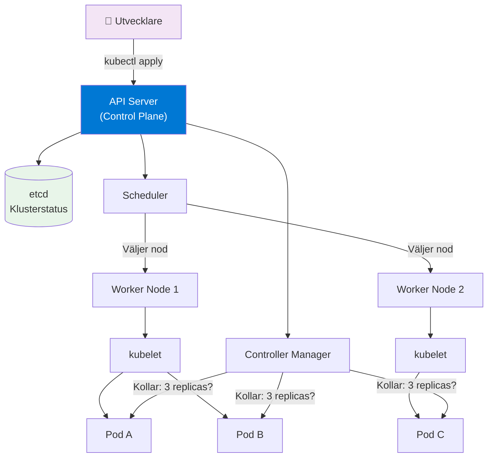

# 01 Kubernetes Intro — Programmeringstermer

> Nivå: Advanced Cloud (kurs-10) — du kan Docker, du kan Azure, nu tar vi nästa steg.

---

## Kubernetes · Kubernetes (K8s)

Kubernetes är en open source-plattform som automatiserar deployment, skalning och hantering av containerbaserade applikationer. Du berättar vad du vill ha — Kubernetes ser till att det händer och att det stannar så.

Tänk på det som en flygtrafikledare för dina containrar: du säger "jag vill ha tre instanser av min API-container uppe hela tiden", och Kubernetes håller koll, startar om det som kraschar och sprider last mellan noderna.

```bash
# Visa klusterstatus — det första du gör på en ny miljö
kubectl get nodes
kubectl get pods --all-namespaces
kubectl cluster-info
```

**Varför det spelar roll:** Utan Kubernetes hanterar du varje container manuellt — vem startar om en kraschad container klockan 3 på natten? Med Kubernetes: ingen. Det sker automatiskt. På stora system är detta skillnaden mellan drift som fungerar och drift som bränner ut teamet.

> 🖼️ **Bild:** Jämförelsetabell: "Container-hantering utan Kubernetes vs. med Kubernetes" — manuella SSH-kommandon till vänster, `kubectl apply` + self-healing till höger

---

## Cluster · Kluster

Ett Kubernetes-kluster är uppsättningen av servrar (noder) som Kubernetes kör på. Alltid minst en control plane-nod och ett antal worker-noder.

Tänk på det som ett datacenter i miniatyr — men istället för att du hanterar varje server för sig hanterar Kubernetes hela flottan som en enhet.

```bash
# Se alla noder i klustret och deras status
kubectl get nodes -o wide

# Typisk output:
# NAME          STATUS   ROLES           AGE   VERSION   INTERNAL-IP
# aks-node-1    Ready    <none>          5d    v1.28     10.0.0.4
# aks-node-2    Ready    <none>          5d    v1.28     10.0.0.5
# control-plane Ready    control-plane   5d    v1.28     10.0.0.3
```

**Vanliga misstag:** Att tänka att "klustret = en server". Det är alltid flera noder. I produktion vill du minst tre worker-noder för redundans — kör du bara en och den kraschar, är allt nere.

> 🖼️ **Bild:** Diagram med en control plane-nod och tre worker-noder, med pilar som visar att control plane skickar instruktioner till workers

---

## Pod · Pod

Pod är den minsta deploymentenheten i Kubernetes. Den innehåller en eller flera containrar som delar nätverk och lagring och alltid schemaläggs ihop på samma nod.

Tänk på det som ett litet hus: containrarna är rummen. De delar ytterdörren (nätverksgränssnittet) och källaren (volymen), men lever var sin självständig process.

```yaml
# En enkel pod-definition
apiVersion: v1
kind: Pod
metadata:
  name: min-api
spec:
  containers:
    - name: api
      image: myregistry.azurecr.io/min-api:1.0
      ports:
        - containerPort: 8080
```

**Kontext:** Du skapar sällan pods direkt — du skapar Deployments som hanterar pods åt dig. Om du skapar en pod manuellt och den kraschar, startar den inte om. En Deployment gör det.

**När har du flera containrar i en pod?** Sidecar-mönstret: loggagent, proxy, cert-injector. De ska leva och dö med huvudcontainern.

> 🖼️ **Bild:** Pod-diagram med en main-container och en sidecar-container, delad volym och delat nätverksgränssnitt markerat

---

## Deployment · Deployment

En Deployment är Kubernetes-resursen som säger "håll alltid N kopior av den här podden uppe". Den hanterar rolling updates, rollbacks och självläkning.

Tänk på det som ett SLA-avtal du skriver till Kubernetes: "Tre instanser. Alltid. Om en dör, starta en ny."

```yaml
apiVersion: apps/v1
kind: Deployment
metadata:
  name: min-api
spec:
  replicas: 3                      # tre pods parallellt
  selector:
    matchLabels:
      app: min-api
  template:
    metadata:
      labels:
        app: min-api
    spec:
      containers:
        - name: api
          image: myregistry.azurecr.io/min-api:2.0
          resources:
            requests:
              memory: "128Mi"
              cpu: "250m"
            limits:
              memory: "256Mi"
              cpu: "500m"
```

```bash
# Rulla ut en ny version
kubectl set image deployment/min-api api=myregistry.azurecr.io/min-api:2.1

# Se status på rolling update
kubectl rollout status deployment/min-api

# Ångra — gå tillbaka till föregående version
kubectl rollout undo deployment/min-api
```

**Beslutsramverk — Deployment vs. andra workload-typer:**

| Resurs | Använd när |
|---|---|
| Deployment | Stateless applikationer (API, webbserver) |
| StatefulSet | Stateful appar med stabil identitet (databaser, Kafka) |
| DaemonSet | En pod per nod (loggagent, monitoring) |
| Job | Engångsuppgifter (databas-migration) |
| CronJob | Schemalagda uppgifter |

---

## Service · Tjänst

En Service är en stabil nätverksabstraktion framför en grupp pods. Pods skapas och förstörs hela tiden — deras IP-adresser är flyktiga. En Service har alltid samma namn och IP inuti klustret.

Tänk på det som receptionisten på ett kontor: det spelar ingen roll vilka anställda som jobbar idag — du ringer alltid receptionen och hon kopplar dig rätt.

```yaml
apiVersion: v1
kind: Service
metadata:
  name: min-api-service
spec:
  selector:
    app: min-api          # alla pods med denna label
  ports:
    - port: 80
      targetPort: 8080
  type: ClusterIP         # bara nåbar inifrån klustret
```

**Service-typer och när du väljer vilken:**

| Typ | Nåbar från | Typiskt användningsfall |
|---|---|---|
| ClusterIP | Bara inuti klustret | Interna mikrotjänster |
| NodePort | Via nodens IP + port | Labb/dev, ej produktion |
| LoadBalancer | Internet via Azure LB | Publika slutpunkter |

> 🖼️ **Bild:** Flödesdiagram: extern trafik → LoadBalancer Service → väljer bland pods baserat på selector

---

## Namespace · Namnrymd

Namespace delar upp ett Kubernetes-kluster i logiska grupper. Samma fysiska kluster kan ha separata namespaces för dev, staging och prod.

Tänk på det som kontorsplansindelning: HR, ekonomi och teknik sitter i samma byggnad men på separata våningar med egna regler för vem som får komma in.

```bash
# Skapa och arbeta med namespaces
kubectl create namespace produktion
kubectl create namespace staging

# Deploya till specifikt namespace
kubectl apply -f deployment.yaml -n produktion

# Se allt i ett namespace
kubectl get all -n produktion
```

**Viktigt:** Resource quotas och Network Policies kan sättas per namespace. Det är här du gör att staging-pods inte kan prata med prod-databaser.

```yaml
# Sätt resursgräns på ett helt namespace
apiVersion: v1
kind: ResourceQuota
metadata:
  name: staging-quota
  namespace: staging
spec:
  hard:
    requests.cpu: "4"
    requests.memory: "8Gi"
    pods: "20"
```

---

## kubectl · kubectl

kubectl är kommandoradsverktyget du använder för att kommunicera med Kubernetes API. Det är ditt viktigaste verktyg — lär dig det ordentligt.

Tänk på det som fjärrkontrollen till hela klustret: allt du vill göra mot Kubernetes, gör du via kubectl.

```bash
# De kommandon du kommer använda varje dag
kubectl get pods                          # lista pods i current namespace
kubectl get pods -n produktion            # annat namespace
kubectl describe pod min-api-abc123       # detaljerad info om en pod
kubectl logs min-api-abc123               # loggar från en pod
kubectl logs min-api-abc123 -f            # följ loggar live
kubectl exec -it min-api-abc123 -- bash   # SSH:a in i en pod
kubectl apply -f manifest.yaml            # skapa/uppdatera resurser
kubectl delete -f manifest.yaml           # ta bort resurser
kubectl get events --sort-by=.lastTimestamp  # vad har hänt i klustret?
```

**Bra att veta:** kubectl pratar med API-servern via en kubeconfig-fil (`~/.kube/config`). Den innehåller certifikat och context-info för alla kluster du är ansluten till.

```bash
# Byt kluster/context
kubectl config get-contexts
kubectl config use-context mitt-aks-kluster
```

---

## Node · Nod

En nod är en server (virtuell eller fysisk) som är en del av klustret. Worker-noder kör poddar. Varje nod kör kubelet (agenten som pratar med control plane) och en container runtime (containerd).

Tänk på det som anställda på ett lager: control plane är lagerchefen, noderna är lagerpersonalen som faktiskt lyfter lådorna (kör containrarna).

```bash
# Inspektera en nod
kubectl describe node aks-node-1

# Cordon — hindra nya pods från att schemaläggas på noden
kubectl cordon aks-node-1

# Drain — flytta bort alla pods (för maintenance)
kubectl drain aks-node-1 --ignore-daemonsets --delete-emptydir-data

# Uncordon — noden är redo igen
kubectl uncordon aks-node-1
```

**I AKS (Azure Kubernetes Service):** Noder är Azure VM:ar. Du väljer nodstorlek (Standard_D4s_v3 osv.) och Kubernetes hanterar dem. Node pools låter dig ha olika VM-typer i samma kluster — t.ex. CPU-optimerade noder för beräkningstjänster.

---

## Control Plane · Kontrollplan

Control Plane är Kubernetes hjärna. Den fattar alla beslut: var ska pods köras? Vad händer när en pod dör? Vad är klustrets aktuella tillstånd?

Tänk på det som ett flygledartorn: det flyger inte själv, men det styr allt som flyger.

**Komponenterna i Control Plane:**

| Komponent | Roll |
|---|---|
| API Server | Enda ingångspunkten till Kubernetes — tar emot alla kubectl-kommandon |
| Scheduler | Bestämmer vilken nod en ny pod ska köras på |
| Controller Manager | Kollar hela tiden: stämmer faktisk state med önskad state? |
| etcd | Lagrar hela klustrets tillstånd (se nedan) |

```bash
# Kolla att control plane-komponenterna är uppe (managed k8s)
kubectl get componentstatuses

# Se kontrollplanets pods (i AKS är de dolda, du ser dem ej direkt)
kubectl get pods -n kube-system
```

**I AKS:** Microsoft hanterar control plane åt dig. Du betalar inte för control plane-noderna — du betalar bara för worker-noderna. Det är en av de stora fördelarna med managed Kubernetes.

> 🖼️ **Bild:** Arkitekturdiagram med Control Plane (API Server, Scheduler, Controller Manager, etcd) och Worker Nodes med kubelet och containerd markerade

---

## etcd · etcd

etcd är en distribuerad nyckel-värde-databas som lagrar hela Kubernetes-klustrets tillstånd. Alla resurser — pods, deployments, secrets, allt — lever i etcd.

Tänk på det som hjärnans minnescenter: om det försvinner, glömmer Kubernetes allting. Klustret existerar fortfarande fysiskt, men ingen vet längre vad som ska köras var.

```bash
# Du pratar sällan direkt med etcd, men i AKS tar Microsoft backup åt dig.
# I self-managed k8s: backup är KRITISK och ditt ansvar.

# Kontrollera etcd-hälsa (kräver direkt tillgång, ej AKS)
etcdctl endpoint health \
  --endpoints=https://127.0.0.1:2379 \
  --cacert=/etc/kubernetes/pki/etcd/ca.crt \
  --cert=/etc/kubernetes/pki/etcd/server.crt \
  --key=/etc/kubernetes/pki/etcd/server.key
```

**Varför det spelar roll:** etcd är klustrets enda source of truth. Om etcd tappar data och du inte har backup kan du inte återskapa klustret — du vet inte vad som kördes. I AKS: Microsoft hanterar etcd och backup. I self-managed: sätt upp etcd-backup till Azure Blob Storage som ett CronJob.

**Fel du inte vill göra:** Kör etcd på hårddisk (HDD) istället för SSD. etcd är extremt latens-känsligt — långsam disk = hela klustret saktar ner.

---


