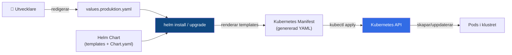

# 02 YAML och Helm — Programmeringstermer

> Nivå: Advanced Cloud (kurs-10) — konfiguration som kod, pakethantering som ett proffs.

---

## YAML · YAML (YAML Ain't Markup Language)

YAML är ett format för att skriva konfigurationsfiler som är läsbara för människor. I Kubernetes är allt YAML: pods, deployments, services, ingress — allt. Indenteras med mellanslag, aldrig tabbar.

Tänk på det som ett recept skrivet på svenska — alla vet hur man läser det, men reglerna för stavning är strikta. Byt ut ett mellanslag mot en tabb och receptet fungerar inte längre.

```yaml
# Giltigt YAML — notera: 2 mellanslag, inte tabbar
apiVersion: apps/v1
kind: Deployment
metadata:
  name: min-api
  namespace: produktion
  labels:
    app: min-api
    version: "2.0"
spec:
  replicas: 3
  selector:
    matchLabels:
      app: min-api
  template:
    metadata:
      labels:
        app: min-api
    spec:
      containers:
        - name: api
          image: myregistry.azurecr.io/min-api:2.0
          env:
            - name: DB_HOST
              valueFrom:
                secretKeyRef:
                  name: db-secret
                  key: host
```

**De vanligaste YAML-misstagen i Kubernetes:**

| Misstag | Symptom |
|---|---|
| Tabb istället för mellanslag | `yaml: line X: found character that cannot start any token` |
| Fel indentering | `error: error parsing <file>: strict mode disallows` |
| Sträng som ser ut som siffra | `123` tolkas som int — använd `"123"` för sträng |
| Boolesk förvirring | `yes/no/on/off` är booleans — använd `"yes"` om du menar strängen |

> 🖼️ **Bild:** Sideby-side: korrekt YAML vs. YAML med tab-indentering, med felmeddelandet Kubernetes returnerar markerat

---

## Kubernetes Manifest · Kubernetes-manifest

Ett Kubernetes-manifest är en YAML-fil som beskriver en Kubernetes-resurs. Strukturen är alltid densamma: `apiVersion`, `kind`, `metadata`, `spec`.

Tänk på det som ett blankettformulär: fälten är alltid på samma ställe, du fyller bara i ditt specifika innehåll.

```yaml
# Alla Kubernetes-manifest har denna grundstruktur
apiVersion: apps/v1    # Vilken API-grupp och version
kind: Deployment       # Vilken typ av resurs
metadata:
  name: min-tjänst     # Unikt namn i namespacet
  namespace: prod      # Vilket namespace
  labels: {}           # Godtyckliga nyckel-värde-par för sökning
  annotations: {}      # Metadata för verktyg (ej för selectorer)
spec: {}               # Resursberoende — detta varierar per kind
```

```bash
# Validera ett manifest utan att applicera det
kubectl apply -f manifest.yaml --dry-run=client

# Se vad som faktiskt skapas
kubectl apply -f manifest.yaml --dry-run=server

# Applicera hela en katalog
kubectl apply -f ./k8s/
```

**Deklarativt vs. imperativt:**

```bash
# Imperativt (undvik i produktion)
kubectl create deployment min-api --image=myregistry.azurecr.io/min-api:1.0

# Deklarativt (rätt väg)
kubectl apply -f deployment.yaml
# → Kubernetes jämför med klustrets nuvarande state och patchar skillnaden
```

---

## Declarative Config · Deklarativ konfiguration

Kubernetes är deklarativt: du beskriver önskat tillstånd, Kubernetes ser till att det stämmer. Du säger inte "starta tre pods" — du säger "tre pods ska alltid vara igång".

Tänk på det som att sätta en termostat: du säger 21 grader, termostaten fixar det. Du ger inte instruktioner om när värmaren ska slå på eller av.

```bash
# Imperativt tänk (vad du INTE ska göra):
kubectl scale deployment min-api --replicas=5  # ändra live i klustret

# Deklarativt tänk (rätt):
# Ändra replicas: 5 i deployment.yaml och sedan:
kubectl apply -f deployment.yaml
# Nu är Git och klustret i sync
```

**Varför deklarativ config är kritisk i produktion:**

Om du gör imperativa ändringar live i klustret och din deployment.yaml inte speglar det, är nästa gång någon kör `kubectl apply -f deployment.yaml` din ändrings död. Deklarativ konfiguration + Git = reproducerbar infrastruktur.

> 🖼️ **Bild:** Meme — "When you scale deployment imperatively and someone applies the old YAML" med förvirrad hund

---

## Helm · Helm

Helm är pakethanteraren för Kubernetes — tänk npm eller apt, fast för K8s-applikationer. Du installerar, uppgraderar och avinstallerar Kubernetes-applikationer som paket.

Tänk på det som IKEA: du beställer ett Kallax-paket (chartet), du väljer antal hyllplan och färg (values.yaml), och Helm levererar de exakta skruvarna, hyllorna och instruktionerna (de genererade manifest-filerna) för just din konfiguration.

```bash
# Arbeta med Helm — de kommandon du använder varje dag
helm repo add bitnami https://charts.bitnami.com/bitnami
helm repo update

# Installera en applikation (t.ex. NGINX Ingress Controller)
helm install nginx-ingress ingress-nginx/ingress-nginx \
  --namespace ingress-nginx \
  --create-namespace

# Se alla installerade releases
helm list --all-namespaces

# Uppgradera
helm upgrade nginx-ingress ingress-nginx/ingress-nginx --namespace ingress-nginx

# Avinstallera (tar bort alla K8s-resurser chartet skapade)
helm uninstall nginx-ingress --namespace ingress-nginx
```

**Helm vs. rå YAML — när ska du välja vad?**

| Situation | Välj |
|---|---|
| Din egna enkla app, ett kluster | Rå YAML |
| Tredjepartsverktyg (ingress, monitoring, cert-manager) | Helm |
| Din app, flera miljöer med olika konfiguration | Helm |
| Behöver versionering och rollbacks av deploymenten | Helm |

---

## Chart · Chart

Ett Helm-chart är paketet — ett katalogträd med templates, en values-fil och metadata. Chartet är det generiska; din values.yaml gör det specifikt för din miljö.

```bash
# Skapa ett eget chart
helm create min-app

# Strukturen du får:
# min-app/
# ├── Chart.yaml          # Metadata om chartet
# ├── values.yaml         # Standardvärden
# ├── charts/             # Beroenden (sub-charts)
# └── templates/          # Go templates som genererar YAML
#     ├── deployment.yaml
#     ├── service.yaml
#     ├── ingress.yaml
#     └── _helpers.tpl    # Återanvändbara template-funktioner
```

```yaml
# Chart.yaml — chartets identitetskort
apiVersion: v2
name: min-app
description: Min API-applikation
type: application
version: 0.1.0          # Chart-version (inte app-version)
appVersion: "2.0.0"     # App-versionen chartet deployar
```

> 🖼️ **Bild:** Katalogträd för ett Helm-chart med pilar som visar hur values.yaml flödar in i templates och genererar slutliga Kubernetes-manifest

---

## values.yaml · Konfigurationsvärden

`values.yaml` är chartets konfigurationsfil med standardvärden. Template-filerna refererar till dessa värden med Go-template-syntax. Du kan överskriva dem per miljö utan att ändra templates.

Tänk på det som inställningsfilen för ett spel: du ändrar volym och svårighetsgrad i settings-menyn, inte i spelkoden.

```yaml
# values.yaml — standardvärden
replicaCount: 2

image:
  repository: myregistry.azurecr.io/min-api
  tag: "latest"
  pullPolicy: IfNotPresent

service:
  type: ClusterIP
  port: 80

ingress:
  enabled: false

resources:
  requests:
    memory: "128Mi"
    cpu: "250m"
  limits:
    memory: "256Mi"
    cpu: "500m"
```

```bash
# Överskriva värden vid installation (utan att ändra values.yaml)
helm install min-app ./min-app \
  --set replicaCount=5 \
  --set image.tag=2.1.0

# Bättre: använd en separat values-fil per miljö
helm install min-app ./min-app -f values.produktion.yaml
```

```yaml
# values.produktion.yaml — override för produktion
replicaCount: 5
image:
  tag: "2.1.0"
ingress:
  enabled: true
```

---

## Template · Helm-mall

Helm-templates är YAML-filer med Go template-syntax. De kombinerar din values.yaml med template-logik för att generera riktiga Kubernetes-manifest.

```yaml
# templates/deployment.yaml
apiVersion: apps/v1
kind: Deployment
metadata:
  name: {{ .Release.Name }}-{{ .Chart.Name }}
  labels:
    {{- include "min-app.labels" . | nindent 4 }}
spec:
  replicas: {{ .Values.replicaCount }}
  template:
    spec:
      containers:
        - name: {{ .Chart.Name }}
          image: "{{ .Values.image.repository }}:{{ .Values.image.tag }}"
          {{- if .Values.ingress.enabled }}
          # Villkorlig logik — renderas bara om ingress är aktiverat
          {{- end }}
```

```bash
# Rendera templates utan att installera — ovärderligt för debugging
helm template min-release ./min-app -f values.produktion.yaml

# Linta chartet för vanliga fel
helm lint ./min-app
```

**Vanliga template-misstag:** Glömma `nindent` vid inbäddade templates ger ogiltig YAML-indentering. Kör alltid `helm template` och `helm lint` i CI-pipeline.

---

## Release · Release

En Helm-release är en specifik installation av ett chart i klustret. Chartet är mallen, releasen är instansen. Du kan ha flera releases av samma chart i olika namespaces.

```bash
# Installera samma chart som två separata releases
helm install api-v1 ./min-app -n version1
helm install api-v2 ./min-app -n version2 --set image.tag=2.0

# Visa release-historik (varje uppgradering = ny revision)
helm history min-app -n produktion

# Output:
# REVISION  STATUS     CHART          DESCRIPTION
# 1         superseded min-app-0.1.0  Install complete
# 2         superseded min-app-0.1.0  Upgrade complete
# 3         deployed   min-app-0.2.0  Upgrade complete
```

---

## Rollback · Rollback (Helm)

`helm rollback` återgår till en tidigare revision av en release. Det är den snabbaste vägen tillbaka när en uppgradering gick fel.

Tänk på det som Ctrl+Z fast för hela din Kubernetes-deployment.

```bash
# Se historiken
helm history min-app -n produktion

# Rulla tillbaka till revision 2
helm rollback min-app 2 -n produktion

# Rulla tillbaka till föregående revision
helm rollback min-app 0 -n produktion  # 0 = föregående

# Verifiera att rollbacken lyckades
helm status min-app -n produktion
kubectl rollout status deployment/min-app -n produktion
```

**Helm rollback vs. kubectl rollout undo:**

| Kommando | Rullar tillbaka |
|---|---|
| `helm rollback` | Hela chartet (deployment + service + ingress + allt) |
| `kubectl rollout undo` | Bara Deployment-resursen |

Välj `helm rollback` när du använder Helm — det återställer hela applikationsstacken, inte bara containern.

---

## Repository · Helm-repository

Ett Helm-repository är en plats där charts lagras och distribueras. Artifact Hub är det publika indexet; för privata charts använder du Azure Container Registry (ACR) eller GitHub Pages.

```bash
# Hantera repositories
helm repo add bitnami https://charts.bitnami.com/bitnami
helm repo add ingress-nginx https://kubernetes.github.io/ingress-nginx
helm repo update        # hämta senaste chart-listor

# Sök efter charts
helm search repo nginx
helm search hub prometheus    # sök på Artifact Hub

# Azure Container Registry som Helm-repo
az acr helm push --name mittregistry min-app-0.1.0.tgz
helm repo add mittregistry \
  https://mittregistry.azurecr.io/helm/v1/repo \
  --username $ACR_USER --password $ACR_PASSWORD
```

**I produktion:** Lagra dina egna charts i ACR. Det ger versionering, åtkomstkontroll via Azure RBAC och integreras med AKS utan extra konfiguration.

---


