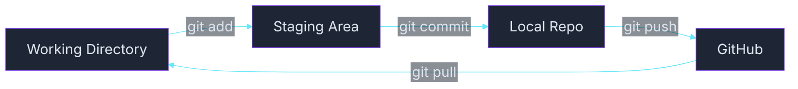
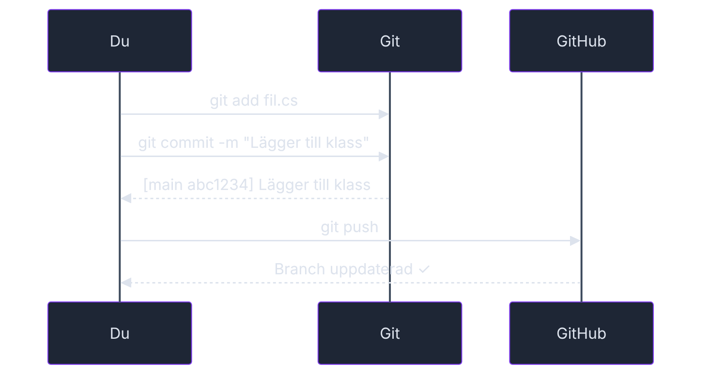

<!-- _class: title -->

# Git — Versionshantering

### Din tidsmaskin för kod

_Kurs 01 · Vecka 1 · Nion Education_

---

## Rubriker och text

Det här är en **H2-rubrik** med lila färg.

### H3 ser ut så här — i cyan

Vanlig brödtext ser ut så här. Korta stycken håller det luftigt. En mening kan vara kort.

En annan mening kan vara lite längre och resonera mer, bygga upp något — som det här. Variation är nyckeln.

> 💬 _"Det här är hur jag brukar lösa det. Har du en annan approach som funkar lika bra? Kör på den."_

---

## Listor och betoning

Tre saker du **måste** kunna om Git:

- `git add` — väljer vad som ska med i nästa commit
- `git commit` — sparar en snapshot med ett meddelande
- `git push` — skickar upp till GitHub

Och tre saker som **inte** gör dig till en dålig programmerare:

1. Att glömma `git add` innan `git commit`
2. Att skriva ett oprecist commit-meddelande
3. Att googla git-kommandon varje gång

_Det gör alla. Även seniora devs._

---

## Kodblock — C#

```csharp
// Beräkna ålder baserat på födelseår
int currentYear = 2026;
int birthYear = 1990;
int age = currentYear - birthYear;

Console.WriteLine($"Du är {age} år gammal.");
Console.WriteLine($"Nästa år fyller du {age + 1}.");
```

Inlinekod ser ut så här: `Console.WriteLine()` — med cyan färg.

🟢 Grundläggande · 🟡 Mellannivå · 🔴 Utmaning

---

## Mermaid — flödesdiagram



<!-- mermaid: diagrams/tema_demo_marp_1.mmd -->

Tre zoner att hålla reda på — Working Directory, Staging Area och repot.

---

## Mermaid — sekvensdiagram



<!-- mermaid: diagrams/tema_demo_marp_2.mmd -->

---

## Tabell

| Kommando            | Vad det gör                   |
| ------------------- | ----------------------------- |
| `git init`          | Skapar ett nytt repo i mappen |
| `git clone <url>`   | Kopierar ett befintligt repo  |
| `git status`        | Visar vad som ändrats         |
| `git log --oneline` | Visar historiken, kompakt     |
| `git diff`          | Visar exakt vad som ändrats   |

---

## Blandad slide — kod + förklaring

Staging area är Git:s hemliga vapen.

Tänk på det som en **inköpskorg** innan kassan. Du väljer ut precis vilka ändringar som ska följa med i nästa commit — och lämnar resten kvar tills vidare.

```csharp
// Klassisk nybörjarfälla:
// Ändrar tre filer, committar allt på en gång
// Commit-meddelandet: "grejer"

// Bättre:
// git add Program.cs
// git commit -m "fix: rätta null-check i Main"
// git add BankAccount.cs
// git commit -m "feat: lägga till Withdraw-metod"
```

_Atomiska commits — en sak per commit — gör historiken läsbar._

---

<!-- _class: title -->

# Dags att kavla upp ärmarna!

### Övningar finns i `exercises/`

🟢 `ovning_01_git_setup.md` — installera och konfigurera Git  
🟢 `ovning_02_forsta_repot.md` — skapa och pusha ditt första repo

_Fråga om du fastnar. Ni klarar det här._
