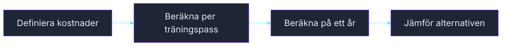

# Övning — Träna eller gymkort?

> 🗺️ **Rita ett flödesschema innan du kodar.** Skissa upp programflödet på papper — vilka steg tas? Vilka beslut fattas? Rita klart, lägg ner pennan, öppna sedan VS Code.

Nyårslöfte: träna mer. Men gymkortet kostar pengar — är det värt det jämfört med att träna hemma?

---

## Flödesschema



<!-- mermaid: diagrams/traning_eller_gymkort_1.mmd -->

## Kodning

---

## Steg 1: Gymkortet

```csharp
int gymKortPerMånad = 399;
int månader = 12;
int träningspassPerVecka = 3;
int veckorPerÅr = 52;
```

Beräkna:
- Total gymkostnad på ett år
- Antal träningspass på ett år
- Kostnad per träningspass

### Förväntad output
```plaintext
Gym årsavgift:          ### kr
Träningspass på ett år: ###
Kostnad per pass:       ### kr
```

<details><summary>Tips — kostnad per pass</summary>

```csharp
int passTotalt = träningspassPerVecka * veckorPerÅr;
int kostnadPerPass = gymKostnadÅr / passTotalt;
```

</details>

---

## Steg 2: Hemmaträning

Du köper en yogamatta (499 kr), ett hoppsnöre (149 kr) och tre kettlebells (1 499 kr). Det är hela investeringen — inga löpande kostnader.

```csharp
int matta = 499;
int hoppsnöre = 149;
int kettlebells = 1499;
```

Beräkna total investering och kostnad per pass (samma antal pass som ovan).

### Förväntad output
```plaintext
Hemmaträning totalinvestering: ### kr
Kostnad per pass:              ### kr
```

---

## Steg 3: Jämförelsen

Räkna ut:
- Vad kostar gymmet mer (eller mindre) än hemmaträning på ett år?
- Om du tränar i tre år — hur förändras siffrorna? (gymkortet löper på, hemmaträningen kostar inget mer)

### Förväntad output
```plaintext
Gym kostar ### kr mer per år än hemmaträning.
Efter 3 år har gymmet kostat ### kr mer totalt.
```

<details><summary>Lösningsförslag</summary>

```csharp
int gymKortPerMånad = 399;
int månader = 12;
int träningspassPerVecka = 3;
int veckorPerÅr = 52;

int gymKostnadÅr = gymKortPerMånad * månader;
int passTotalt = träningspassPerVecka * veckorPerÅr;
int gymKostnadPerPass = gymKostnadÅr / passTotalt;

int matta = 499;
int hoppsnöre = 149;
int kettlebells = 1499;
int hemmaTotalt = matta + hoppsnöre + kettlebells;
int hemmaKostnadPerPass = hemmaTotalt / passTotalt;

int skillnadPerÅr = gymKostnadÅr - hemmaTotalt;
int skillnad3År = (gymKostnadÅr * 3) - hemmaTotalt;

Console.WriteLine($"Gym årsavgift:          {gymKostnadÅr} kr");
Console.WriteLine($"Träningspass på ett år: {passTotalt}");
Console.WriteLine($"Kostnad per pass:       {gymKostnadPerPass} kr");
Console.WriteLine();
Console.WriteLine($"Hemmaträning totalinvestering: {hemmaTotalt} kr");
Console.WriteLine($"Kostnad per pass:              {hemmaKostnadPerPass} kr");
Console.WriteLine();
Console.WriteLine($"Gym kostar {skillnadPerÅr} kr mer per år än hemmaträning.");
Console.WriteLine($"Efter 3 år har gymmet kostat {skillnad3År} kr mer totalt.");
```

</details>

## Fundera

Gymkortet ger tillgång till utrustning, duschar och socialt sällskap. Hemmaträning är billigare men kräver disciplin. Hur skulle du väga in dessa faktorer i en beräkning?

(Inget rätt svar — tänk högt med en kompis.)
